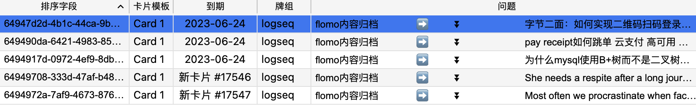

- TODO 今天整理一下[[富途面试题]] #富途
  :LOGBOOK:
  CLOCK: [2023-06-24 Sat 11:53:07]--[2023-06-24 Sat 11:53:08] =>  00:00:01
  CLOCK: [2023-06-24 Sat 11:53:09]--[2023-06-24 Sat 11:53:15] =>  00:00:06
  CLOCK: [2023-06-24 Sat 11:53:17]--[2023-06-24 Sat 11:53:19] =>  00:00:02
  CLOCK: [2023-06-24 Sat 11:53:21]--[2023-06-24 Sat 11:53:21] =>  00:00:00
  CLOCK: [2023-06-24 Sat 11:53:22]--[2023-06-24 Sat 11:53:29] =>  00:00:07
  CLOCK: [2023-06-24 Sat 11:53:37]--[2023-06-24 Sat 11:53:38] =>  00:00:01
  CLOCK: [2023-06-24 Sat 11:53:40]--[2023-06-24 Sat 11:53:41] =>  00:00:01
  CLOCK: [2023-06-24 Sat 11:53:41]--[2023-06-24 Sat 11:53:49] =>  00:00:08
  CLOCK: [2023-06-24 Sat 11:53:50]--[2023-06-24 Sat 11:53:56] =>  00:00:06
  CLOCK: [2023-06-24 Sat 11:54:31]--[2023-06-24 Sat 11:54:31] =>  00:00:00
  CLOCK: [2023-06-24 Sat 11:54:32]--[2023-06-24 Sat 11:54:32] =>  00:00:00
  CLOCK: [2023-06-24 Sat 11:54:33]--[2023-06-24 Sat 11:54:35] =>  00:00:02
  CLOCK: [2023-06-24 Sat 11:55:08]--[2023-06-24 Sat 11:55:18] =>  00:00:10
  :END:
- TODO 然后做两道 [[leetcode]] TOP100
  :LOGBOOK:
  CLOCK: [2023-06-24 Sat 11:54:37]--[2023-06-24 Sat 11:54:37] =>  00:00:00
  :END:
- TODO 看一下[[原子习惯]]
-
- 把logseq里面page用于对某一主题的沉淀，是[[永久笔记]]，完成版的page应该是notion上公开的一篇主题文章 #笔记原则
  id:: 64966930-658b-4439-95b2-1b1d23bdcc10
  但是page也不一定就是主题或者标签，他有可能是一段话的提炼，这样在[[页面图谱]]上就能很好的展示出有完整内涵的idea。
-
- 记录一下当前使用的[[logseq插件]]
	- Heatmap v2.4.3
	- Logseq Anki Sync v4.6.6，🌟🌟🌟🌟🌟强推
	  可惜的是同步到anki的时候是cloze的模式，没有明显的标题，浏览的时候不方便。显示问题列还勉强可以看。
	  {:height 129, :width 749}
	- Tabs v1.19.1，多标签，还行。其实shift+left click在侧边栏打开的功能也够了。
	- Bullet Threading v1.1.4，主要是样式好看，编辑的时候防迷路。
	- Awesome Links v1.15.16，美观，能够一眼看出是外链。
	-