- {:height 457, :width 254} #人民民主专政 #政治课 #twitter #幽默
-
- redis的AOF是什么 #小林coding #card
  id:: 6497e658-ed3e-4153-981e-d66e8db13e07
  collapsed:: true
  :LOGBOOK:
  CLOCK: [2023-06-25 Sun 18:16:10]--[2023-06-25 Sun 18:29:11] =>  00:13:01
  :END:
	- [[AOF]]和 [[RDB]]是 [[redis]] 保证本地持久化技术
	- AOF是**Append Only File**，默认不开启
	- Redis 是先执行写操作命令后，才将该命令记录到 AOF 日志里的。
		- **不是WAL类型的日志，所以有可能丢失数据。**
		- **AOF写操作由主进程执行，有可能阻塞下一个命令。**
	- AOF日志刷盘策略
		- 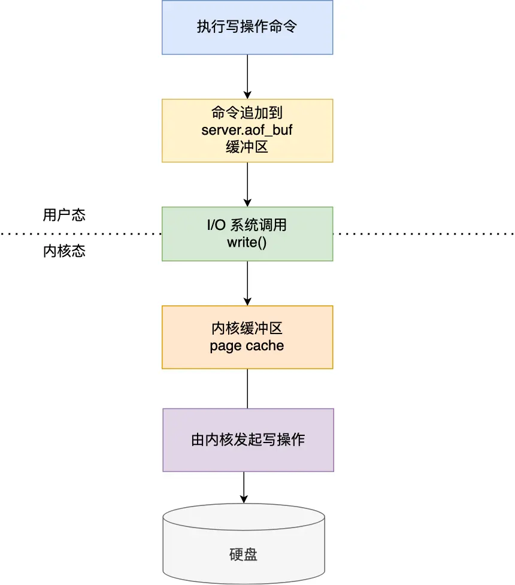{:height 508, :width 352}
		- 针对系统调用`write()`后的刷盘操作，在 `redis.conf` 配置文件中的 `appendfsync` 配置项可以有以下 3 种参数可填，实际是控制fsync()函数的调用时机：
			- **Always**，这个单词的意思是「总是」，所以它的意思是每次写操作命令执行完后，同步将 AOF 日志数据写回硬盘；
			- **Everysec**，这个单词的意思是「每秒」，所以它的意思是每次写操作命令执行完后，先将命令写入到 AOF 文件的内核缓冲区，然后每隔一秒将缓冲区里的内容写回到硬盘；
			- **No**，意味着不由 Redis 控制写回硬盘的时机，转交给操作系统控制写回的时机，也就是每次写操作命令执行完后，先将命令写入到 AOF 文件的内核缓冲区，再由操作系统决定何时将缓冲区内容写回硬盘。
	- [[AOF 重写机制]]可以节省AOF文件空间，重写 AOF 过程是由后台 **子进程（⚠️不是子线程）** [[bgrewriteaof]] 来完成的
- [[redis主从复制]]机制 #小林coding #card
  card-last-score:: 5
  card-repeats:: 1
  card-next-schedule:: 2023-06-29T08:10:34.836Z
  card-last-interval:: 4
  id:: 6497e684-4e76-4b3d-a000-1a55ccb0bc67
  card-ease-factor:: 2.6
  card-last-reviewed:: 2023-06-25T08:10:34.836Z
  collapsed:: true
  :LOGBOOK:
  CLOCK: [2023-06-25 Sun 15:43:57]--[2023-06-25 Sun 17:18:09] =>  01:34:12
  CLOCK: [2023-06-25 Sun 17:20:21]
  :END:
	- redis主从模式设计为读写分离，主可读可写，从只读。从服务器也可以有自己的从服务器，分担主服务器在主从同步过程中的压力。但是主节点挂了 ，从节点是无法自动升级为主节点的，这个过程需要人工处理，在此期间 Redis 无法对外提供写操作。如果需要故障自动切换，就使用哨兵机制。
	  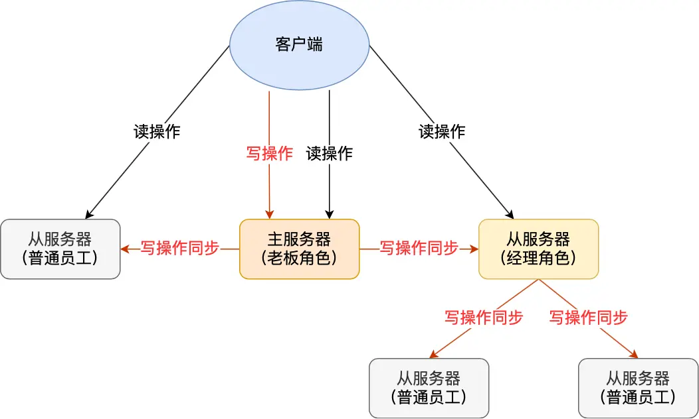{:height 242, :width 393}
	- 建立主从关系服务器：在从服务器上执行`replicaof`（Redis 5.0 之前使用 `slaveof`）：
	  logseq.order-list-type:: number
	  ```
	  # 从服务器 执行这条命令
	  replicaof <主服务器的 IP 地址> <主服务器的 Redis 端口号>
	  ```
	- 第一次同步，分为三个阶段：
	  logseq.order-list-type:: number
		- 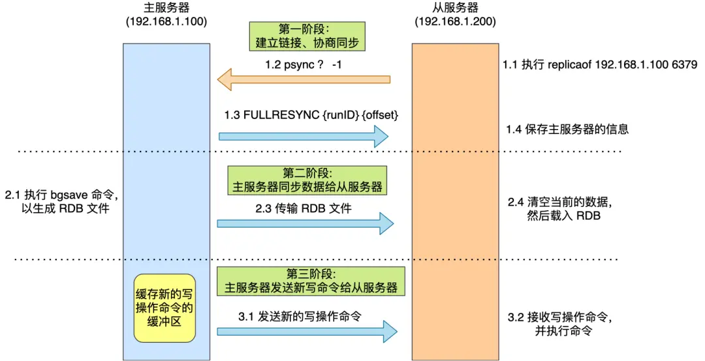{:height 258, :width 567}
		- [[psync]]命令包含两个参数，分别是 主服务器的**runID**和**复制进度 offset**
		  logseq.order-list-type:: number
		  card-last-score:: 5
		  card-repeats:: 1
		  card-next-schedule:: 2023-06-29T08:10:16.647Z
		  card-last-interval:: 4
		  id:: 6497f629-c140-4e37-a5b6-42be8f948259
		  card-ease-factor:: 2.6
		  card-last-reviewed:: 2023-06-25T08:10:16.648Z
		- 接着，主服务器会执行[[bgsave]] 命令来**异步**生成 RDB 文件，然后把文件发送给从服务器。
		  logseq.order-list-type:: number
		- 从主服务器开始生成RDB文件到从服务器载入RDB文件完成期间的写操作记录到了**replication buffer 缓冲区里**
		  logseq.order-list-type:: number
	- 增量同步
	  logseq.order-list-type:: number
		- 主从服务器在完成第一次同步后，就会基于长连接进行命令传播。
		- 从 Redis 2.8 开始，网络断开又恢复后，从主从服务器会采用**增量复制**的方式继续同步。2.8之前是重新全量同步。
		- 网络恢复时，仍然通过psync runID offset命令，只不过从服务器里明确知道参数。
		- 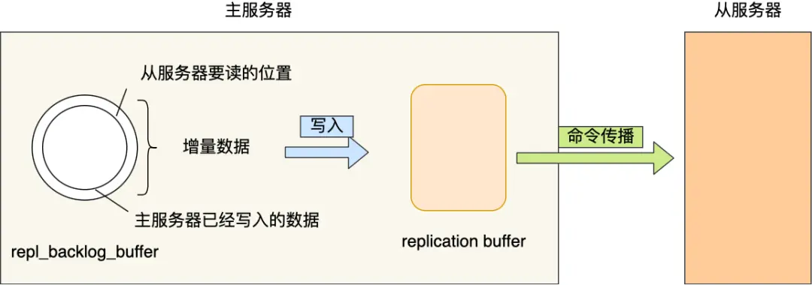{:height 178, :width 455}
		- 环形缓冲区repl_backlog_buffer默认是1m大小，如果主服务器在网络断开后写记录将环形缓冲区写满发生覆盖情况时，从服务器的offset为出现在repl_backlog_buffer里，将导致**全量同步**。
		- psync里的offset是历史上写入数据的总offset，不是repl_backlog_buffer内的offset。
		- replication buffer 是在全量复制阶段和增量复制阶段都会出现，**主节点会给每个新连接的从节点，分配一个 replication buffer**；
- [[linux的内存管理机制]] #小林coding
  collapsed:: true
  :LOGBOOK:
  CLOCK: [2023-06-25 Sun 19:29:26]--[2023-06-25 Sun 21:16:21] =>  01:46:55
  :END:
	- 虚拟地址vs物理地址
		- 虚拟地址的用途：由操作系统为每个进程分配独立的一套虚拟地址，把进程所使用的地址「隔离」开来，对进程透明。
		  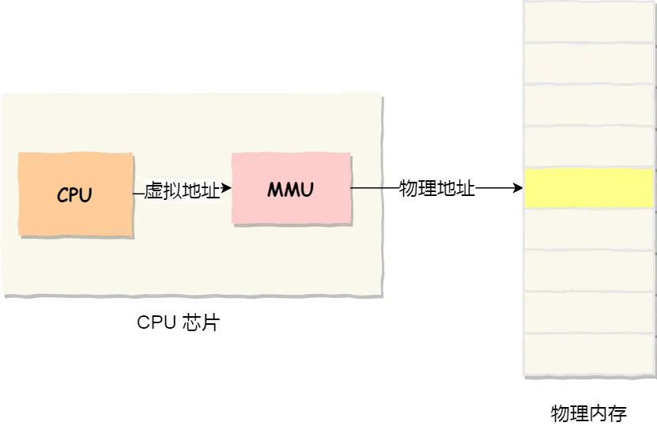{:height 292, :width 429}
		- 虚拟地址到物理地址的映射方式：[[内存分段]]和[[内存分页]] #card
		  id:: 649827dd-7600-4f6f-92ca-38bdee919546
			- 内存分段：分段的好处就是能产生连续的内存空间，但是会出现「**外部内存碎片**和**内存交换的空间太大（效率低）**」的问题。
			- 内存分页：因为内存分页机制分配内存的最小单位是一页，即使程序不足一页大小，我们最少只能分配一个页，「内存分页机制会有**内部内存碎片**」的现象。但是一次性写入磁盘的也只有少数的一个页或者几个页，不会花太多时间，**内存交换的效率就相对比较高**。
		- 虚拟内存[[多级页表]] #card
		  id:: 6498257a-8f72-4b25-8183-ae0b0d41e8ed
			- 32 位单级页表，在页大小 `4KiB` 的环境下，一个进程的页表需要装下 100 多万个「页表项」，并且每个页表项是占用 4 字节大小的，于是相当于每个页表需占用 4MB 大小的空间。
			- 32位二级页，一级页表覆盖到了全部虚拟地址空间，二级页表在需要时创建。一级页面占用1024*4字节=4`KiB`
			  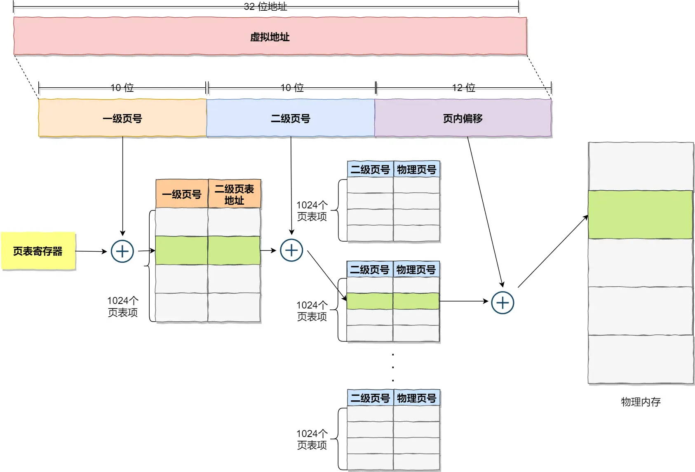{:height 266, :width 433}
			- 64位四级页表：
				- 全局页目录项 PGD（*Page Global Directory*）
				- 上层页目录项 PUD（*Page Upper Directory*）
				- 中间页目录项 PMD（*Page Middle Directory*）
				- 页表项 PTE（*Page Table Entry*）
				  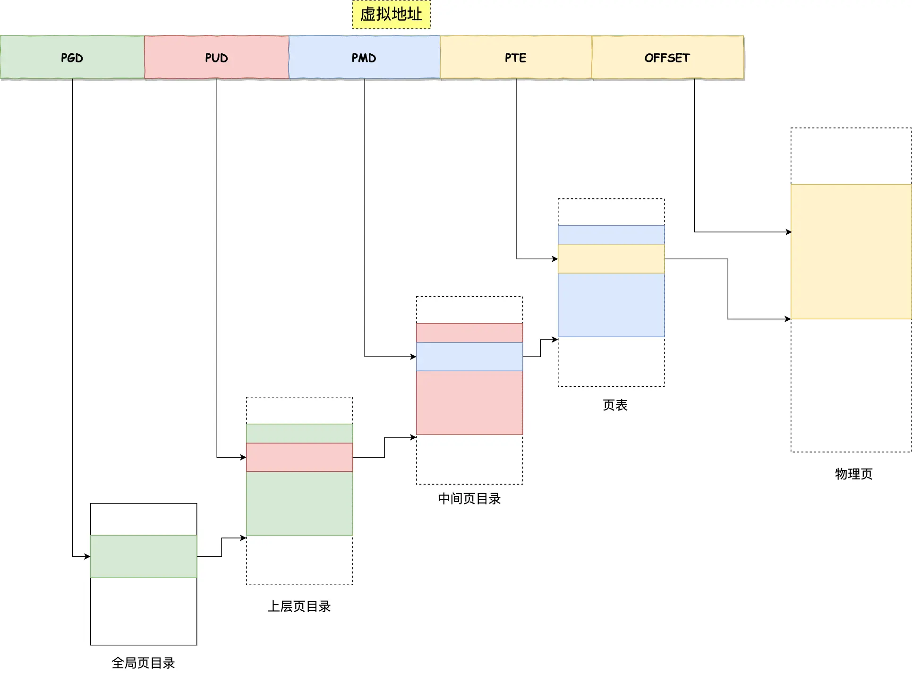{:height 356, :width 488}
		- [[TLB]]：*Translation Lookaside Buffer*，加速页表转换的缓存
			- 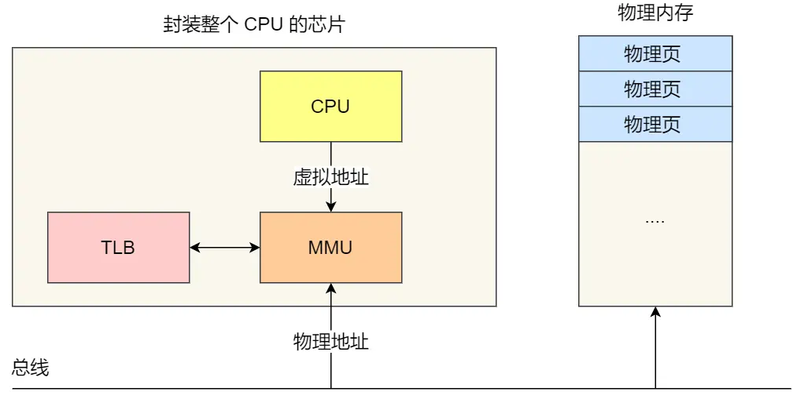{:height 270, :width 515}
			- 有了 TLB 后，那么 CPU 在寻址时，会先查 TLB，如果没找到，才会继续查常规的页表。
	- Linux 的[[虚拟地址]]空间是如何分布的？#card
	  id:: 649833be-4e46-4c4f-a156-d9342f11ade4
		- 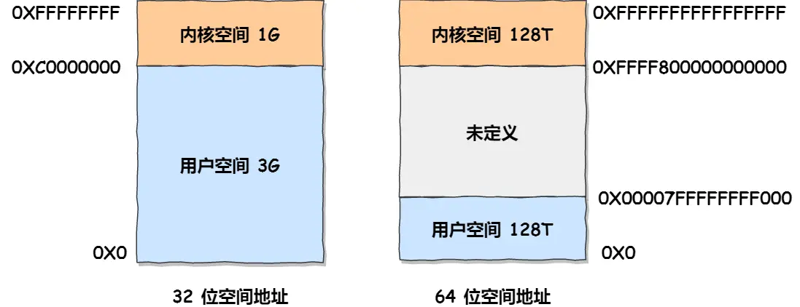{:height 186, :width 445}
		- **每个虚拟内存中的内核地址，其实关联的都是相同的物理内存**。这样，进程切换到内核态后，就可以很方便地访问内核空间内存。
		  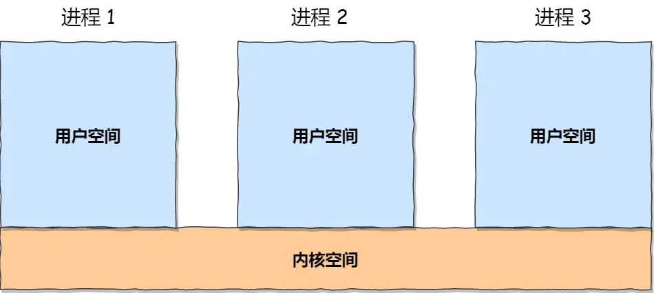{:height 231, :width 442}
		- 以64位linux系统为例
			- 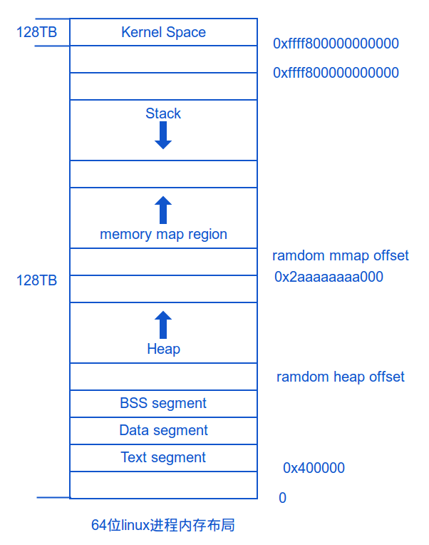{:height 402, :width 310}
			- 代码段(text)，包括二进制可执行代码；
			- 数据段(data)，包括**已初始化**的**静态常量和全局变量**；
			- BSS(block starting symbol) 段，包括**未初始化**的**静态变量和全局变量**；
			- **堆段**(heap)，包括动态分配的内存，从低地址开始向上增长；`malloc()`
			- **文件映射段**(memory map region)，包括动态库、共享内存等，从低地址开始向上增长（64位linux如此，32位相反，[跟硬件和内核版本有关](http://lishiwen4.github.io/linux/linux-process-memory-location)）；`mmap()`
			- 栈段(stack)，包括局部变量和函数调用的上下文等。栈的大小是固定的，一般是 `8 MB`。当然系统也提供了参数，以便我们自定义大小；栈和 mmap 映射区域并不是从一个固定地址开始，并且每次的值都不一样，这是程序在启动时随机改变这些值的设置，使得使用缓冲区溢出进行攻击更加困难；
			- 代码段下面还有一段空白区域是「保留区」，之所以要有保留区这是因为在大多数的系统里，我们认为比较小数值的地址不是一个合法地址，例如，我们通常在 C 的代码里会将无效的指针赋值为 NULL。因此，这里会出现一段不可访问的内存保留区，防止程序因为出现 bug，导致读或写了一些小内存地址的数据，而使得程序跑飞。
			- 在这 7 个内存段中，堆和文件映射段的内存是动态分配的。比如说，使用 C 标准库的  或者 ，就可以分别在堆和文件映射段动态分配内存。
		-
- 怎么判断[[redis]]某个节点是否正常工作？#card
  id:: 64980701-54a4-4965-b0f6-a952651a5965
  card-last-interval:: 4
  card-repeats:: 1
  card-ease-factor:: 2.6
  card-next-schedule:: 2023-06-29T10:05:09.054Z
  card-last-reviewed:: 2023-06-25T10:05:09.054Z
  card-last-score:: 5
  collapsed:: true
	- [[Redis Cluster]]：Redis 判断节点是否正常工作，基本都是通过互相的 ping-pong 心态检测机制，如果有一半以上的节点去 ping 一个节点的时候没有 pong 回应，集群就会认为这个节点挂掉了，会断开与这个节点的连接。
	- [[Redis主从复制]]：主从节点发送的心态间隔是**不一样**的，而且作用也有一点区别：
		- Redis 主节点默认每隔 10 秒对从节点发送 ping 命令，判断从节点的存活性和连接状态，可通过参数repl-ping-slave-period控制发送频率。
		- Redis 从节点每隔 1 秒发送`replconf ack {offset}` 命令，给主节点上报自身当前的复制偏移量，目的是为了：
			- 实时监测主从节点网络状态；
			- 上报自身复制偏移量， 检查复制数据是否丢失， 如果从节点数据丢失， 再从主节点的复制缓冲区中拉取丢失数据。
- > ((649498e0-44a7-4c60-b6ab-720553a69432)) 
  
  不一定要有思维导图，记录带有自身思考的笔记是最重要的，形式倒不太重要。因为类比和关联，会随着时间积累和review次数逐渐成型。 #笔记原则
- 如果服务器挂掉了，客户端如何保证写数据[[高可用]]
  collapsed:: true
	- 写本地
	- 写mq
- 如何准备项目经历 #面试 #项目经验 #富途猎头vivi #富途
  collapsed:: true
	- 如何做到高效有条理的描述?
		- STAR原则
			- Situation:背景来龙去脉
			  Target:目标如何拆解
			  Action:采取哪些行动
			  Result:结果与反思
		- 推荐
			- 总结一下，自己在项目中解决了什么难题，这个难题是怎么解决的，解决之后为项目带来了什么价值
			- 提炼项目的亮点，运用的关键技术是什么
		- 尽量避免
			- 想到哪说到哪，恨不得所有能回忆起来的事情都讲给面试官
			- 别人做的事情(你参与的很少或者不太熟悉) ——可以不说
			- 自己不理解、没掌握的技术知识 (领域》——选择不说
			- 前后没有逻辑关系，让人听的云里雾里
		- 对项目的业务逻辑和技术架构有充分准备
			- 可以事先准备项目的架构图
			- 业务/技术方案选型、决策逻辑
			- 涉及的技术充分掌握
			- 疑难杂症的案例