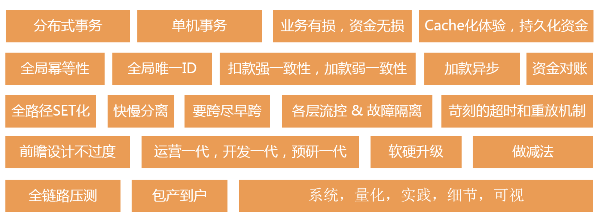

- 对权利或者事业的追求热度，要看付出回报比。每个人的机遇不同，初始能力不同，导致所处的运势不同，付出回报比自然不同。有的人很幸运有贵人相助，努力的表现就大概率有回报，有的人还没施展就被就被定性为能力不行，想翻身就要谨小慎微抓机会，拼命干活感动自己是浪费时间。所以就会看到有的人越努力越幸运，有的人消极应付，但是一直按自己的道路发展（离职考公，跳槽）。没有对错，也没有永远的好和永远的坏。但是大家的价值观应该是一致的：时间用在刀刃上，对得起自己的努力。 #根据投入回报比进行相匹配的努力  #好钢用在刀刃上
- 直面困难，今天整理[[云支付]]关键点：**支付高可用**、多维度查询。#项目经验 #TODO
	- [云支付.xmind](../assets/云支付_1688035456335_0.xmind)
	-
- 先有[[卡片盒笔记]]积累，然后最终呈现和做计划的时候，再整理输出成[[xmind]] #知识管理
- [自我总结.xmind](../assets/自我总结_1688035097666_0.xmind) #工作 #项目经验 #TODO
- [分布式一致性.xmind](../assets/分布式一致性_1688035215130_0.xmind) #分布式 #TODO
- 把之前的xmind版[[scott young的学习方法]]笔记整理到这里
- [分布式一致性.xmind](../assets/分布式一致性_1688036383003_0.xmind)里面的知识杂且互相关联，适合从[[xmind]]重新整理到 [[logseq]] #分布式事务 #知识管理
- 再认真读一下[[An explanation of the difference between Isolation levels vs. Consistency levels]] #TODO
- [[思维导图，树形结构化组织是强项，但是不适合组织网状结构]]
- [[OLAP系统资料整理]]
- 审计的项目总结 [答辩准备.xmind](../assets/答辩准备_1688040298792_0.xmind) #项目经验 #工作 #TODO
- 云支付数据 https://www.notion.so/fdf81fc13d104aaba8cfb23f77fec885?pvs=4 #TODO #项目经验
-  https://www.notion.so/2005-2018-9b38067d74f14886ad63e4d05d410dc6?pvs=4 #支付系统 #云支付 #财付通
-