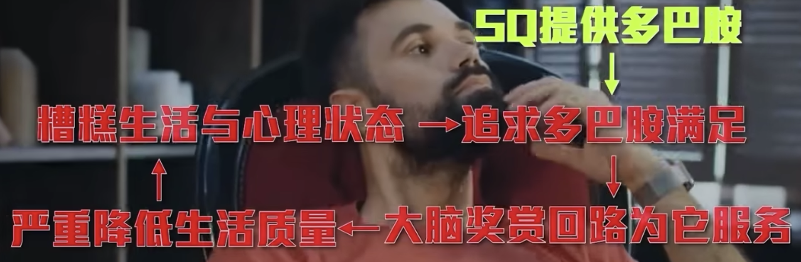

- [[世界只有一种货币，那就是多巴胺]] #多巴胺
	- 【【脑科学】多巴胺贫困是懒惰真相,动力抑郁与脑内货币有深刻联系,看我如何败光它们-哔哩哔哩】 https://b23.tv/HqdSRRU
	- 可能造成[[多巴胺缺乏]]的情况：
		- 货币超发（过量激发多半胺），比如吸毒
		- 过度抑制，惊吓自己，恐惧压迫，过度压力 #缰核
		- 熬夜，晚间10点到凌晨4点接触人造光 #缰核 #失望回路
- 多巴胺是奖赏回路的首席神经递质，[[多巴胺主导的欲望通路和奖赏回路交织在一起]]
  id:: 64ce60f9-d7c3-49a3-87c5-6ee87a6dc114
	- 【【脑科学】戒色原理,情色成瘾堪比毒品改造大脑,错误戒断观让人陷入焦虑强迫抑郁-哔哩哔哩】【视频标记点 06:50】 https://b23.tv/zM0y915
	- 长期暴露在强烈刺激物下的人，容易对其他事物失去兴趣，造成大脑萎缩 #多巴胺 #上瘾
	  长时间观看色情内容->形成难以控制的冲动(欲望回路)->[[肾上腺素]]上升->大量的血液流向身体->大脑部分区域供血减少->关停大部分能量营养供给
		- 欲望回路+奖赏回路强化：血液和能量集中在成瘾物形成的强神经元通路
		- 大脑皮质（理性中枢）萎缩：缺乏神经连接和血液营养连接
			- 萎缩最严重的就是[[前额叶]]，导致控制力减弱。
			- [[前额叶]]是人类脑的核心之核心，掌管人类的逻辑思维，运算推理，控制行为，以及平复情绪，管理欲望，意志冲动等。
		- 用进废退：萎缩的大脑无法集中注意力，意志脆弱，做事不坚持，缺乏计划性等；容易追求易获得的，强化过的内容。
	- 
	- 多巴胺在首次满足后，下次就会需要更多更新更大的刺激，从而换得当初多巴胺的兴奋感
	- 与真人感情会产生[[血清素]]，[[催产素]]，[[内源性大麻素]]
	- 如何改善
		- 截流：回避诱发内容
		- 开源：拓展兴趣，建立新的奖励回路
		- 保苦中不强戒：找到合适的时机和环境
		- 养好前额叶：充足睡眠，有氧运动
			- 💡[[冥想有修复前额叶的功能]]
		- 建立真实的关系。
	- 阶段恢复周期
	  id:: 64ce6aed-1634-4008-8acf-e614b0d88991
		- 初步复原，一般90天
		- 完全复原，大脑皮质与神经元重新建立新的连接，一般一至两年
- [[redis]]没有用[[LSM Tree]]，因为LSM Tree一般应用于持久化存储，相比 [[B+树]]，为写性能优化，读性能稍差
- [[《支付平台架构_业务_规划_设计与实现》]]