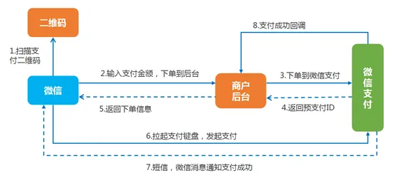
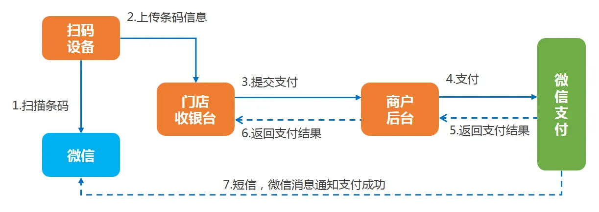
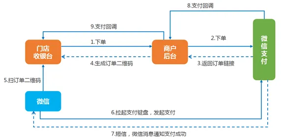

- [【90%的人备考思路搞反了-哔哩哔哩】 ](https://b23.tv/xe41a0g) [[完美主义]]害死人。改变错的思维方式，[[原子习惯]]里有说培养好的系统比获取短期目标更重要。过度畏惧考试，练习量不够。 #学习技巧 #应试学习法
- 通过最近一个月使用[[anki]]，发现新的知识和一点是能够在重复中发现。重复过程中，看待问题可能会有新的视角。这说明重复不仅能帮助我们建立长期记忆，还能帮助记忆生根发芽。#记忆力 #艾宾浩斯 #学习技巧
- [[云支付的关键实现细节]] #card #云支付
  id:: 64a4d548-6d5b-4bad-933c-24479920b939
	- pay_receipt的100库10表 [ref](((64a52b03-cab0-4776-bd6d-885e9c8577d6)))
	- 一码付、扫码付、刷卡付的调用图
		- 一码付（公众号支付）
		   {:height 258, :width 553}
		- [[刷卡支付]]
		  
		- 扫码支付（动态二维码）
		  {:height 302, :width 572}{:height 310, :width 595}
-
-
-
-