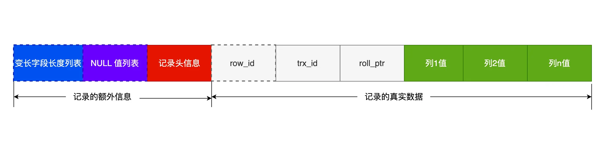

- 《如果我抑郁了，请这样陪伴我》这篇公众号图做的挺好。倾听是最好的帮助，鼓励讲出来，不要拿比人去比较，不要去评价。 #抑郁症 #陪伴
- 昨天李玟因为[[抑郁症]]自杀了，今早稍微被刷了屏，但是热度没有那么高。可能就是被时代即将遗忘的人。早上还去youtube搜了一下萧亚轩，状态好像也不怎么样。同门师姐妹，都是天赋异禀，可惜巅峰太短。
- 有什么优化索引的方法？ from #小林coding #数据库优化 #索引优化 [src](https://xiaolincoding.com/mysql/index/index_interview.html#%E6%9C%89%E4%BB%80%E4%B9%88%E4%BC%98%E5%8C%96%E7%B4%A2%E5%BC%95%E7%9A%84%E6%96%B9%E6%B3%95) #card
  id:: 64a69e93-028b-4103-aaad-83b99692af3b
	- [[覆盖索引]]优化：指 SQL 中 query 的所有字段，在索引 B+Tree 的叶子节点上都能找得到的那些索引，从二级索引中查询得到记录，而不需要通过聚簇索引查询获得，可以避免回表的操作。
	  id:: 64a69eb3-15b2-4d40-866d-bd1b069d358d
	- 防止索引失效：比如like；计算、函数、类型转换；联合索引要能正确使用需要遵循最左匹配原则；or条件含有非索引列
	- 前缀索引优化：减小索引字段大小
	- 主键索引最好是自增的：新记录在页内顺序写，提高写性能
	- 索引列最好设置为 NOT NULL：导致优化器在做索引选择的时候更加复杂，更加难以优化，因为可为 NULL 的列会使索引、索引统计和值比较都更复杂，比如进行索引统计时，count 会省略值为NULL 的行；NULL虽然没有意义，行内null值至少占用1个字节空间
	  {:height 188, :width 749}
- B+ 树与 B 树差异 [src](https://xiaolincoding.com/mysql/index/why_index_chose_bpuls_tree.html#%E4%BB%80%E4%B9%88%E6%98%AF-b-%E6%A0%91-2) #card #innodb索引
  id:: 64a6a6ba-4a05-4d1b-a5ce-9b04c9729460
	- 叶子节点（最底部的节点）才会存放实际数据（索引+记录），非叶子节点只会存放索引；
	- 所有索引都会在叶子节点出现，叶子节点之间构成一个有序链表；
	- 非叶子节点的索引也会同时存在在子节点中，并且是在子节点中所有索引的最大（或最小）。
	- 非叶子节点中有多少个子节点，就有多少个索引；