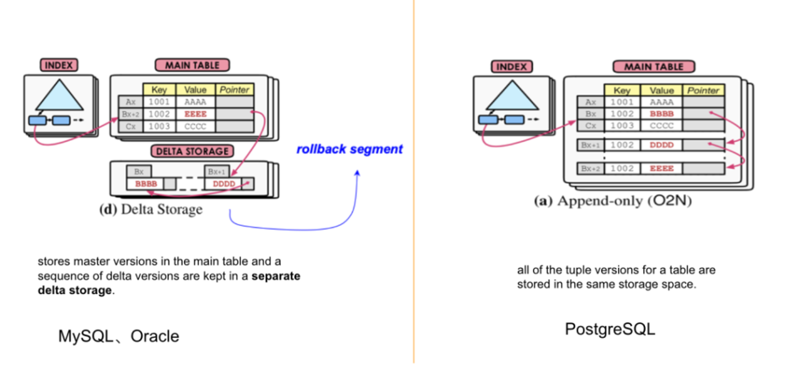

- 睡眠时间短，会导致快速眼动睡眠被压缩，会影响睾酮分泌。而睾酮会影响自信，骨密度，红细胞数等。如果只睡4 5个小时，快速眼动睡眠会被压缩得非常短。【提高身体素质｜医学博士兔叭咯的科普是对是错??？运动学博士的专业解析-哔哩哔哩】【视频标记点 04:46】 https://b23.tv/bMlE0wP #睡眠 #深度睡眠 和 #快速眼动睡眠 都非常重要
   {:height 528, :width 243}
- 今天整理一下这一周的[[短期目标]]
- [[alpine]]的镜像也是可以安装软件包的，比如安装bash
  ```
  RUN apk update && apk upgrade \
      && apk add --no-cache bash bash-doc bash-completion \
      && rm -rf /var/cache/apk/*
  ```
- 什么是索引下推 #mysql #索引优化 #card
  id:: 64ab8ef3-65d4-494e-be3d-59d1bfc61c73
	- > 准确来说，应该叫做**索引条件下推**（Index Condition Pushdown，**ICP**），就是过滤的动作由下层的存储引擎层通过使用索引来完成，而不需要上推到Server层进行处理。ICP是在MySQL5.6之后完善的功能。
	  > ```
	  SELECT * FROM user_innodb WHERE name = "蝉沐风" AND phone LIKE "%6606";
	  ```
	  > `EXPLAIN`查看一下执行计划，此时的执行计划是`Using index condition`
	  >  
	   [src](https://zhuanlan.zhihu.com/p/481750465)
	  
	   [[索引下推]]跟[[覆盖索引]]类似，都是尽量利用（联合）索引，避免回表。
- 今晚睡前就安心的看《原子习惯》，明天早上就开始6点起床，开始执行[[短期目标]]的计划
- 将软件源镜像迁移到#csighub
	- ```bash
	  modules=(lego-idg_idt-171557 lego-inverted_index_diff-171554 lego-idg-idr-search-171545 lego-subscriber-171534 lego-panamav2-171533 lego-commodity_bf-171518 lego-search_ad_retrieval-171512 lego-mixer-tdd-171509 lego-test_1103-171506 lego-idg-idr-idm-171498 lego-retrievalx-adx-171491 lego-idg-feature-extracter-test-171473 lego-idg-scoring-171472 lego-idg-index-171470 lego-idg-idr-scoring-171469 lego-idg-idr-retrieval-171468 lego-idg-idr-171467 lego-idg-retrieval-171465 lego-idg-retrieval-test-171464 lego-pctr_mock_zhiyan-171462 lego-display-mixer-171452 lego-pacing_server-171441 lego-scoring-ad_server-171440 lego-index-scoring-test-171433 lego-index-retrieval-test-171432 lego-mixer-ranking-171430 lego-rta-171424 lego-adx2-171423 lego-index_adset-171418)
	  
	  for i in ${modules[@]};do
	  	docker tag alpine:3.13.5 csighub.tencentyun.com/ams_ad/${i}:alpine;
	  	docker push csighub.tencentyun.com/ams_ad/${i}:alpine;
	  	curl -X PATCH --location "http://csighub.woa.com/api/repositories/ams_ad/${i}?fields=is_public"  -H "X-Session-Key: NZ23JX4MQWCVODJXSCJHD4TTLI" -H "Content-Type: application/json;charset=UTF-8"     -d "{\"is_public\":true}"
	  done
	  ```
	- 删除仓库是
	  ```bash
	  curl -X DELETE --location "http://csighub.woa.com/api/repositories/ams_ad/${i}"  -H "X-Session-Key: NZ23JX4MQWCVODJXSCJHD4TTLI" -H "Content-Type: application/json;charset=UTF-8" -d "{}"
	  ```
- 如何对map的value进行排序 #富途面试题
	- ```Go
	  package main
	   
	  import (
	      "fmt"
	      "sort"
	  )
	   
	  func main() {
	      basket := map[string]int{"orange": 5, "apple": 7,
	                               "mango": 3, "strawberry": 9}
	   
	      keys := make([]string, 0, len(basket))
	   
	      for key := range basket {
	          keys = append(keys, key)
	      }
	      sort.SliceStable(keys, func(i, j int) bool{
	          return basket[keys[i]] < basket[keys[j]]
	      })
	   
	      for _, k := range keys{
	          fmt.Println(k, basket[k])
	      }
	  }
	  ```
- 先有事务的概念，然后再补上事务之间可见性的问题 #终于把分布式事务讲明白了 #card
  id:: 64abcde3-2332-4713-85f5-5893125bf1e9
	- Jim Gray于1981年VLDB描述了事务的原子性A、一致性C和持久性D，在此基础上，Haerder和Reuter在1983年中提出了**事务的[[隔离性]]**并提出术语“ACID”，自此，事务的ACID四个性质成为业内标准术语。
	  id:: 64abcdeb-737d-49fb-a377-c13876652d89
- MySQL同样采用[[MVCC]]，事务恢复的时候为什么需要[[undo log]]？ #终于把分布式事务讲明白了 #card
  id:: 64abce98-6057-4864-9903-d2fa14c15ff9
	- 这是因为版本的存储方式（[[Version Storage]]）不同。
	  1. Greenplum和PostgreSQL上，Greenplum和PostgreSQL有redo log，没有undo Log，任何对tuple的修改都在主表上创建一个新的tuple进行修改，再通过一个指针指向新的tuple。在heap表的存储空间里，已经有元组的旧值，不需要额外通过undo log记录旧值。
	  2. MySQL和Oracle的Version Storage的实现是另一种机制：Delta Storage。把的差异变化记录到Delta Storage里，形成一个链，这种差异的存储被称为[[rollback segment]]，即[[回滚段]]。
	  {:height 274, :width 655}
	  💡Mysql在主表之外记录历史差异；PG在主表上添加新版本，较旧的版本指向较新版本。pg的查询会比mysql慢吗？
	- 如果对Version Storage感兴趣，可以去阅读论文 《Yingjun Wu, An Empirical Evaluation of In-Memory Multi-Version Concurrency Control, VLDB 2017》
- WAL是否适合新硬件特点：高速非易失性随机写 #WAL #终于把分布式事务讲明白了
	- 比如说CMU在VLDB2016 提出了在NVRAM基础上实现的数据库恢复的协议——Write-Behind Logging #TODO
- 原子性和持久化流程： #innodb的原子性实现 #innodb的持久化实现 #card
  id:: 64abd463-6f13-4b9f-9d1a-a23492330ad0
	- 用[[undo log]]实现[[原子性]]和[[持久化]]的事务的简化过程：
	- 假设有A、B两个数据，值分别为1,2。
	- A. 事务开始
	  B. 记录A=1到undo log中
	  C. 修改A=3
	  D. 记录B=2到undo log中
	  E. 修改B=4
	  F. 将undo log写到磁盘 -------undo log持久化
	  G. 将数据写到磁盘 -------数据持久化
	  H. 事务提交 -------提交事务
	- 之所以能同时保证原子性和持久化，是因为以下特点：
	  更新数据前记录undo log。为了保证持久性，必须将数据在事务提交前写到磁盘，只要事务成功提交，数据必然已经持久化到磁盘。
	  undo log必须先于数据持久化到磁盘。如果在G,H之间发生系统崩溃，undo log是完整的，可以用来回滚。
	  如果在A - F之间发生系统崩溃，因为数据没有持久化到磁盘，所以磁盘上的数据还是保持在事务开始前的状态。
	  缺陷：每个事务提交前将数据和undo log写入磁盘，这样会导致大量的磁盘IO，因此性能较差。 如果能够将数据缓存一段时间，就能减少IO提高性能，但是这样就会失去事务的持久性。
- [[隔离性]]：[[MVCC]]解决隔离读问题，2PL/OCC解决写冲突的问题 #innodb的隔离性实现 #card
  id:: 64af9a9d-afac-4bc9-82a0-2818b15c47ff
  而分布式数据库的ACID实现可以参考[[终于把分布式事务讲明白了]]
- `traceroute {ip}`查看网络路由路径 #网络工具
- undo日志属于逻辑日志，redo是物理日志 #card #《MySQL技术内幕》
  id:: 64abfef7-f1ab-4f02-82eb-5b86fe837c34
	- 逻辑日志：记录一个操作过程。undo记录数据修改被修改前的值。binlog也是逻辑日志，可以简单理解为记录的就是sql语句。
	- 物理日志：因为​​mysql​​数据最终是保存在数据页中的，物理日志记录的就是数据页变更。