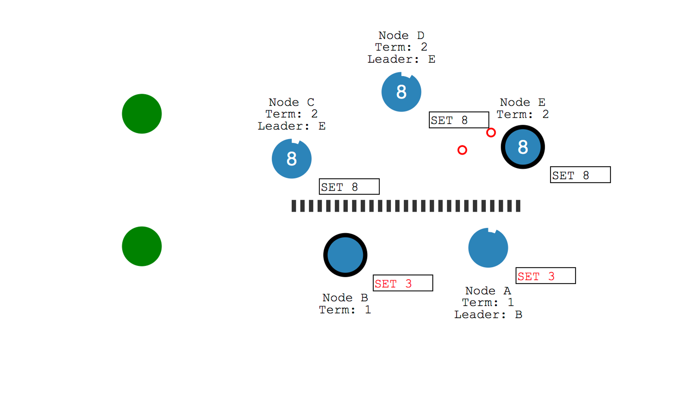
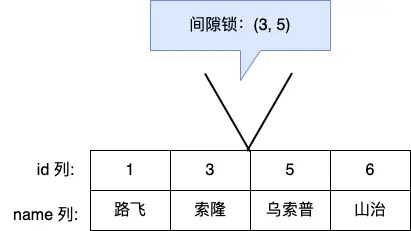

- [[《x86的分页机制和Linux实现》]]
- 页表如何存储 #card
  id:: 64ae1b90-b13d-4c44-a045-a6716c1f43ba
	- 进程未执行时，[[页表]]的始址和页表长度放在[[进程控制块]]（PCB，代码对应struct task_struct​）中，当进程被调度时，操作系统内核会把它们放到[[页表寄存器]]中。[进程控制块和进程创建](https://blog.51cto.com/u_15457669/5391295) 
	  {{embed ((64ae1814-d6fc-4713-9a2f-92ea47d5f2f9))}}
- [[redis]]如何存储上亿级别的用户状态？#card
  id:: 64ae1a2c-6bf7-4ea7-a585-c769365324a3
	- set
		- ```
		  SADD key member1 [member2]
		  SCARD key
		  ```
	- [[HyperLogLog]]
		- ```
		  PFADD mykey element [element ...]
		  PFCOUNT mykey
		  ```
	- [[bitmap]]
		- 获取某一天id为88000的用户是否活跃 `getbit 2020-01-01 88000`
		- 统计某一天的所有的活跃用户数 `bitcount 2019-01-01`
		- 求出2019-01-01到2019-01-05这段时间内的活跃用户数 `bitop or result 2019-01-01 2019-01-02 2019-01-03 2019-01-04 2019-01-05`
	-
- [[kafka]][[延时队列]]的[[时间轮]]具体实现  #card
  id:: 64ae20db-22a2-44c6-84e0-222b80345bfd
	- [src](https://www.notion.so/REDIS-36ba312f0255461e8eed8cff39070ba4?pvs=4)
	- 用环形队列做成时间片，环形队列的每个格子里维护一个链表。每个时刻有一个当前指针指向环形队列某个格子，定时器每超时一次，就把当前指针指向下环形队列的下一个格子。然后处理这个格子保存的链表里的任务。如果只是这样维护，如果要做到秒级的粒度，时间长度最长一天，那么这个环形队列就会非常大。因此，有人又有人改进了一下，当存在任务进入队列时，就用时间长度除以环形队列的长度，记为圈数。这样每次遍历到该元素时，将圈数减一，如果减一后为0就执行改任务，否者不执行。
	  
	  kafka的延时消息的内部实现就是采用时间片轮询的方式来实现的。
	  
	  对于时间跨度非常大的场景，如果使用这种方法会导致链表上的元素非常多，遍历链表的开销也不小，甚至在一个时间片内遍历不完。因此，又有了进一步的改进，将时间片分为不同粒度的。比如，粒度为小时的时间轮，粒度为分钟的时间轮，粒度为秒钟的时间轮。小时里的时间轮达到触发的条件后会放到分钟的时间轮里，分钟的时间轮到达触发的条件后会放到秒的时间轮里。
	  
	  该方案时间片存放在内存，因此轮询起来效率非常高，也可以根据不同的粒度调整时间片，因此也非常灵活。但是该方案需要自己实现持久化与高可用，以及对储存的管理，如果没有现成的轮子开发耗时会比较长。
- 使用[[redis]]的[[zset]] 实现[[延时队列]] #card
  id:: 64ae21db-9a11-4e19-b3fb-491fc1fa4f06
	- [src](https://www.notion.so/REDIS-36ba312f0255461e8eed8cff39070ba4?pvs=4)
	- Redis实现延时任务，是通过其数据结构ZSET来实现的。ZSET会储存一个score和一个value，可以将value按照score进行排序，而SET是无序的。value存储最小时间戳。
- [[redis]] [[大Key]] 对持久化有什么影响？
	- [小林coding](https://xiaolincoding.com/redis/storage/bigkey_aof_rdb.html)
	- [[AOF]]文件的写入为主线程操作，如果刷盘策略(fsync)为Always或者Everysec [ref](((6498139d-3ecb-4c48-ae39-5fbf29c7d762)))，有可能耗时太久阻塞主线程
		- {{embed ((649812a5-5a3f-4157-aa99-8ef4f582aa09))}}
	- > AOF 重写机制和 RDB 快照（bgsave 命令）的过程，都会分别通过 `fork()` 函数创建一个子进程来处理任务。会有两个阶段会导致阻塞父进程（主线程）：
	  创建子进程的途中，由于要复制父进程的页表等数据结构，阻塞的时间跟页表的大小有关，页表越大，阻塞的时间也越长；
	  创建完子进程后，如果父进程修改了共享数据中的大 Key，就会发生写时复制，这期间会拷贝物理内存，由于大 Key 占用的物理内存会很大，那么在复制物理内存这一过程，就会比较耗时，所以有可能会阻塞父进程。
- [[redis]]如何避免[[大key]] #card
  id:: 64ae2ce8-6c23-46cd-a3f0-5ee9633e97e0
	- [src](https://xiaolincoding.com/redis/storage/bigkey_aof_rdb.html#%E6%80%BB%E7%BB%93) #小林coding
	- 最好在设计阶段，就把大 key 拆分成一个一个小 key。或者，定时检查 Redis 是否存在大 key ，如果该大 key 是可以删除的，不要使用 DEL 命令删除，因为该命令删除过程会阻塞主线程，而是用 unlink 命令（Redis 4.0+）删除大 key，因为该命令的删除过程是异步的，不会阻塞主线程。
- [[redis]]如何查找[[大key]] #card #小林coding
  id:: 64ae2d42-8a7d-4bc5-9c12-36a5a80c39f7
	- bigkeys
		- ```
		  redis-cli -h 127.0.0.1 -p6379 -a "password" -- bigkeys
		  ```
		- 这个方法只能返回每种类型中最大的那个 bigkey，无法得到大小排在前 N 位的 bigkey；
		  对于集合类型来说，这个方法只统计集合元素个数的多少，而不是实际占用的内存量。
	- scan
		- 除了string类型意外，计算集合类型不够直接
	- [[RdbTools]]
		- 使用 RdbTools 第三方开源工具，可以用来解析 Redis 快照（RDB）文件，找到其中的大 key。
		- 将大于 10 kb 的  key  输出到一个表格文件。
		  ```
		  rdb dump.rdb -c memory --bytes 10240 -f redis.csv
		  ```
- fflush和fsync的区别 #linux #card
  id:: 64ae3425-890f-4247-8ae1-cd8905653258
	- C标准库的I/O缓冲区-----[[fflush]]-----〉内核缓冲区-----[[fsync]]-----〉磁盘缓冲区
- 什么[[redis集群]]的最大槽数是[[16384]]个？#card
  id:: 64ae3405-6d91-4575-b721-4dbe6f85362b
	- The reason is: [src](https://github.com/redis/redis/issues/2576#issuecomment-101257195)
		- Normal heartbeat packets carry the full configuration of a node, that can be replaced in an idempotent way with the old in order to update an old config. This means they contain the slots configuration for a node, in raw form, that uses 2k of space with 16k slots, but would use a prohibitive 8k of space using 65k slots. **减少网络传输心跳的slot配置信息量，从8k降到2k，降低网络传输。**
			- 💡16384 = 2^14的值域，就需要2^14位的bitmap，即2^14/8 = 2^11 = 2k
		- At the same time it is unlikely that Redis Cluster would scale to more than 1000 mater nodes because of other design tradeoffs. **集群最大也就1000个节点，slots数太大没有意义**
		- So 16k was in the right range to ensure enough slots per master with a max of 1000 maters, but a small enough number to propagate the slot configuration as a raw bitmap easily. Note that in small clusters the bitmap would be hard to compress because when N is small the bitmap would have slots/N bits set that is a large percentage of bits set. **小一点的slots数/节点数比例，会使各节点上的bitmap压缩效果更好，降低网络传输**
	- 补充：[src](https://github.com/redis/redis/issues/2576#issuecomment-798880470)
		- 1、消息大小考虑：尽管crc16能得到65535个值，但redis选择16384个slot，是因为16384的消息只占用了2k，而65535则需要8k。
		  2、集群规模设计考虑：集群设计最多支持1000个分片，16384是相对比较好的选择，**需要保证在最大集群规模下，slot均匀分布场景下，每个分片平均分到的slot不至于太小。**
		- 需要注意2个问题：
		  1、为什么要传全量的slot状态？
		  因为分布式场景，基于状态的设计更合理，状态的传播具有幂等性
		  2、为什么不考虑压缩？
		  集群规模较小的场景下，每个分片负责大量的slot，很难压缩。
- [[云支付为什么使用分布式锁]]，以及实现细节 #card #云支付 #分布式锁
  id:: 64ae4487-46f7-40f0-8ae0-86a71379b853
	- 云支付中控模块，多个进程是对等的，会出现多个进程锁一个单的情况，所以需要分布式锁
	- [[zookeeper]]，[[etcd]]或者[[redis]]的分布式锁是基于网络的，可能因为网络问题或者中间件本身出现锁不可用，但是订单存储仍可用的情况，但是最终对外体现为不可用；而云支付使用的cdb分布式锁与订单数据存储在同一个系统，保障锁可用性与单据可用性保持一致。
	- mysql是有提供`GET_LOCK(str,timeout)`函数，但是这个锁是基于连接session的（不能自定义锁标识，而且session断了，锁也就断了），而中控是多进程公用mysql连接池的方式，有可能出现锁被其他进程意外获取的情况。并且不支持租约，如果进程卡死，可能出现死锁。
	- 基于erro_code CDB_lock(lock_id, user_id, action, lease, timeout)
		- USER_ID代替网络连接/session标记一个使用者，使得分布式锁变成无状态的
		- action字段，可以区分锁类型：共享锁，排他锁，释放锁
- [[raft如果脑裂，如何处理]] #card
  id:: 64ae51f1-a7ed-4e03-bdcc-3aba1b99e682
	- http://thesecretlivesofdata.com/raft/
	  https://here2say.com/44/
	  
	  1. 必须多数投票选中的才会成为新leader
	  2. 假如旧leader在少数分区，旧leader的提案不会被多数接受，无法提交
	  3. 脑裂恢复后，新leader的term会大于旧leader，旧leader的uncommitted提案（下图里的SET 3）回滚，追随复制新leader的日志
	  
	   
	  
	  > Raft一共分为三种角色，leader，follower，candidate，字如其名
	  > 选举倒计时timeout通常是 150ms ~ 300ms 直接的某个随机值
	  > 集群启动时，没有leader，而是全部初始化为 follower
	  > 多个leader出现的时候，对比他们的term即任期（上面的步长），新者为leader
	  > 数据的流向只能从 Leader 节点向 Follower 节点转移
	  >  数据在大多数节点提交后才commit
	  
	  ❓ 选主的时候除了投票数，会比较term大小吗？#TODO
	  [https://qeesung.github.io/2020/04/14/Raft-算法之领导人选举.html](https://qeesung.github.io/2020/04/14/Raft-%E7%AE%97%E6%B3%95%E4%B9%8B%E9%A2%86%E5%AF%BC%E4%BA%BA%E9%80%89%E4%B8%BE.html)
	  
	  **节点收到请求投票的RPC该如何处理？**
	  
	  1. 判断当前的`Term`的和请求投票参数中的`Term`：
	      如果当前的`Term` > 请求投票参数中的`Term`，那么拒绝投票（设置`voteGranted`为`false`），并返回当前的`Term`
	      否则就更新当前`Term`为请求投票参数中的`Term`， 并将自身状态切换成`Follower`
	  2. 检测当前节点的投票状态：
	      如果当前的节点没有给任何其他节点投过票，或者是已经投过票给当前节点，那么继续检测日志的匹配状态（步骤3）
	      否则，那么拒绝投票（设置`voteGranted`为`false`）， 因为一个节点在一个任期内不能同时投票给多个节点
	  3. 检测候选人的日志是否至少比当前节点的日志新，通过比较候选人的`lastLogIndex`和`lastLogTerm`和当前节点的日志，确保新选举出来的`Leader`不会丢失已经提交的日志：
	      如果日志匹配，即当前的任期和候选人的任期相同，且候选人的日志长度比当前的日志长度 **或者** 候选人的任期比比当前节点的任期高，那么就为候选人投票（设置`votedGranted`为`true`），并成为`Follower`
	      否则，那么就拒绝投票（设置`voteGranted`为`false`）
- 数据库经典三大异象 #card
  id:: 64ae7cc8-6b0d-4547-a09c-e4b7284b9e1c
	- 脏读
	  当一个事务允许读取另外一个事务修改但未提交的数据时，就可能发生脏读（dirty reads）。
	- 不可重复读
	  在一次事务中，当**一行数据**获取两遍得到不同的结果表示发生了不可重复读（non-repeatable reads）.
	- 幻影读
	  在事务执行过程中，当两个完全相同的查询语句执行得到不同的**结果集**。这种现象称为“幻影读（phantom read）”
	  （A *phantom read* occurs when a transaction retrieves a set of rows twice and new rows are inserted into or removed from that set by another transaction that is committed in between. [en](https://en.wikipedia.org/wiki/Isolation_(database_systems)#Phantom_reads)）
- 面试就要约到下午4点左右，晚上7点一半刚吃过饭，又困又累 #面试经验
- [[innodb的可重复读是否完全解决了幻读]] #card #小林coding
  id:: 64aea203-41b9-4cf3-a7c0-72dffb0784b3
	- [src](https://www.xiaolincoding.com/mysql/transaction/phantom.html)
	- MVCC解决了快照读幻读
	- 间隙锁解决了当前读幻读
	- 但是没有解决当前读于快照读交叉使用的场景
		- A select(空)                  update(1)                  select(1)
		- B                      insert
	- 疑问：  
	  select where id>2的时候，能不能插入2？目前猜测，间隙锁加在了(1,3)上 #TODO