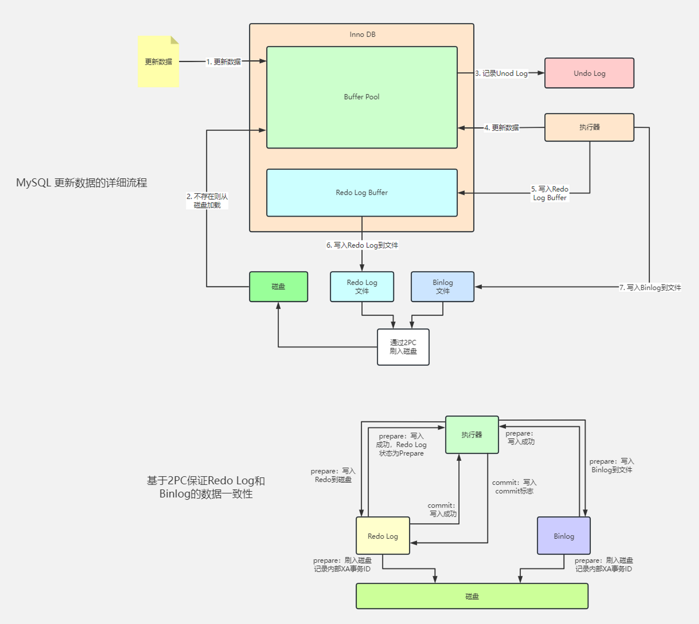

- [[微信支付审计项目里对账待冲销的处理技巧]]应该是技术上的亮点 #微信支付 #审计 #项目经验 #card
  id:: 64aecf64-dbd8-468d-9418-344d7afaeafd
	- 每个对账周期，都记录下来对应的待冲销集，历史记录完备
		- 数据冗余，历史账期重跑需要追跑到最新账期
	- 所有对账周期共用一个冲销集，可以只重跑有问题的历史账期和当前最新账期
		- 每个账期执行对账的时候，首先从冲销集里剔除原属于这个账期的数据，用来支持重跑的场景
		- 必须保证同一时刻只有一个账期在运行，如果任务调度器异常导致多账期并发重跑，可能出现数据错乱，需要从数据错乱账期开始全量重跑。
			- 任务调度器串行执行保障有时会出错，可能导致两个账期互相覆盖（insert overwrite）唯一的待冲销集数据
			- 虽然曾经尝试通过引入另一个表用来记录执行记录，实现全局锁的效果，但是仍然出现过因为任务执行异常，出现过锁丢失锁异常的情况。最终观察任务调度器串行执行保障成功率跟加锁成功率可能大体相当。后面就放弃了全局锁的方案。
		- 独立冲销集+独立冲销集副本，独立冲销集错乱的时候，从独立冲销集副本恢复冲销集，然后重新执行重跑
		- 数据重新入库的话，可能在相邻两个账期有重复数据，这个时候需要顺便向后多重跑几个账期，保障后面的账期数据通过前后账期去重过滤，以免重复参与对账。
- [[RDB 快照是怎么实现的？]]#小林coding #card #RDB #AOF
  id:: 64af989b-f741-40bd-9038-0a85440223d6
	- Redis 是内存数据库，但是它为数据的持久化提供了两个技术。
	- 分别是「 AOF 日志和 RDB 快照」。
	- 这两种技术都会用各用一个日志文件来记录信息，但是记录的内容是不同的。
	- **RDB快照就是记录某一个瞬间的全量内存数据**，记录的是实际数据，而 AOF 文件记录的是命令操作的日志，而不是实际的数据。
	  id:: 64af989c-dc74-4bc2-82d5-aec7547a7cd1
		- 因此在 Redis 恢复数据时， RDB 恢复数据的效率会比 AOF 高些，因为直接将 RDB 文件读入内存就可以，不需要像 AOF 那样还需要额外执行操作命令的步骤才能恢复数据。
		- redis支持RDB和AOF混合模式，先RDB内容记录到AOF，然后再继续追加命令操作到AOF
- [[innodb更新数据的详细流程]] #2PC #[[redo log]] #binlog
	- 
- [[redis哪些数据结构可以支持ttl]]
	- hash和set里面的key不支持，只有「TOP KEY」才行。 [[unlink]]也是一样。
	- 可以用zset存子key的时间(score)，通过`ZREMRANGEBYSCORE key min max`自己做淘汰
- [[常见的DDoS攻击类型]] #card #DDos
  id:: 64afbb95-4d6d-4b67-a21e-7f93109b83ad
	- | DDoS攻击分类 | 攻击子类 | 描述 |
	  | --- | --- | --- |
	  | 畸形报文 | 畸形报文主要包括Frag Flood、Smurf、Stream Flood、Land Flood、IP畸形报文、TCP畸形报文、UDP畸形报文等。 | 畸形报文攻击指通过向目标系统发送有缺陷的IP报文，使得目标系统在处理这样的报文时出现崩溃，从而达到拒绝服务的攻击目的。 |
	  | 传输层DDoS攻击 | 传输层DDoS攻击主要包括Syn Flood、Ack Flood、UDP Flood、ICMP Flood、RstFlood等。 | 以Syn Flood攻击为例，它利用了TCP协议的三次握手机制，当服务端接收到一个Syn请求时，服务端必须使用一个监听队列将该连接保存一定时间。因此，通过向服务端不停发送Syn请求，但不响应Syn+Ack报文，从而消耗服务端的资源。当监听队列被占满时，服务端将无法响应正常用户的请求，达到拒绝服务攻击的目的。 |
	  | DNS DDoS攻击 | DNS DDoS攻击主要包括DNS Request Flood、DNS Response Flood、虚假源+真实源DNS Query Flood、权威服务器攻击和Local服务器攻击等。 | 以DNS Query Flood攻击为例，其本质上执行的是真实的Query请求，属于正常业务行为。但如果多台傀儡机同时发起海量的域名查询请求，服务端无法响应正常的Query请求，从而导致拒绝服务。 |
	  | 连接型DDoS攻击 | 连接型DDoS攻击主要是指TCP慢速连接攻击、连接耗尽攻击、Loic、Hoic、Slowloris、 Pyloris、Xoic等慢速攻击。 | 以Slowloris攻击为例，其攻击目标是Web服务器的并发上限。当Web服务器的连接并发数达到上限后，Web服务即无法接收新的请求。Web服务接收到新的HTTP请求时，建立新的连接来处理请求，并在处理完成后关闭这个连接。如果该连接一直处于连接状态，收到新的HTTP请求时则需要建立新的连接进行处理。而当所有连接都处于连接状态时，Web将无法处理任何新的请求。 Slowloris攻击利用HTTP协议的特性来达到攻击目的。HTTP请求以\r\n\r\n标识Headers的结束，如果Web服务端只收到\r\n，则认为HTTP Headers部分没有结束，将保留该连接并等待后续的请求内容。 |
	  | Web应用层DDoS攻击 | Web应用层攻击主要是指HTTP Get Flood、HTTP Post Flood、CC等攻击。 | 通常应用层攻击完全模拟用户请求，类似于各种搜索引擎和爬虫一样，这些攻击行为和正常的业务并没有严格的边界，难以辨别。 Web服务中一些资源消耗较大的事务和页面。例如，Web应用中的分页和分表，如果控制页面的参数过大，频繁的翻页将会占用较多的Web服务资源。尤其在高并发频繁调用的情况下，类似这样的事务就成了早期CC攻击的目标。由于现在的攻击大都是混合型的，因此模拟用户行为的频繁操作都可以被认为是CC攻击。例如，各种刷票软件对网站的访问，从某种程度上来说就是CC攻击。CC攻击瞄准的是Web应用的后端业务，除了导致拒绝服务外，还会直接影响Web应用的功能和性能，包括Web响应时间、数据库服务、磁盘读写等。 |