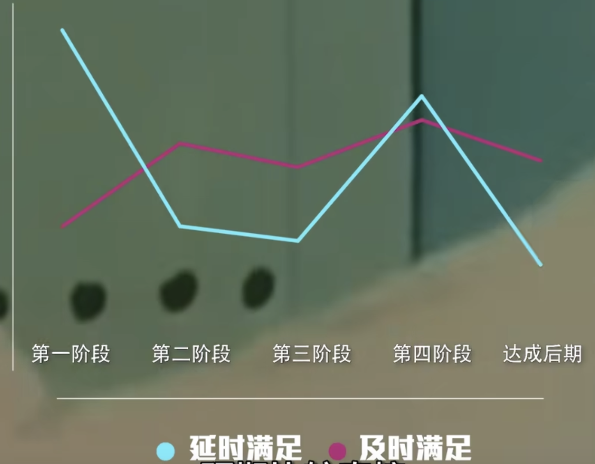

- [[《成瘾和多巴胺（D2）受体水平（2006）》]]
- [[《运动训练对行为治疗期间甲基苯丙胺使用者纹状体多巴胺D2/D3受体的影响（2015）》]]
- [[yourbrainonporn.com]] 关于成瘾的研究进展
- 【脑科学】多巴胺治好我的懒惰无动力抑郁,视频含指导内容,呈现改善焦虑恐惧效果 [src](https://www.bilibili.com/video/BV1Hk4y157jC/)
	- 大脑贫困三大原因 #多巴胺缺乏
		- 恐惧抑郁消耗
		- 脑嗨提前消费
		- 上瘾致通货膨胀
	- 及时满足 vs 延时满足
		- 
		- 不要破釜成舟，背水一战，幻想成长心态
		- 小而美的奖励。适当的奖励与满足会强化努力的行为，进一步形成努力的习惯。
-