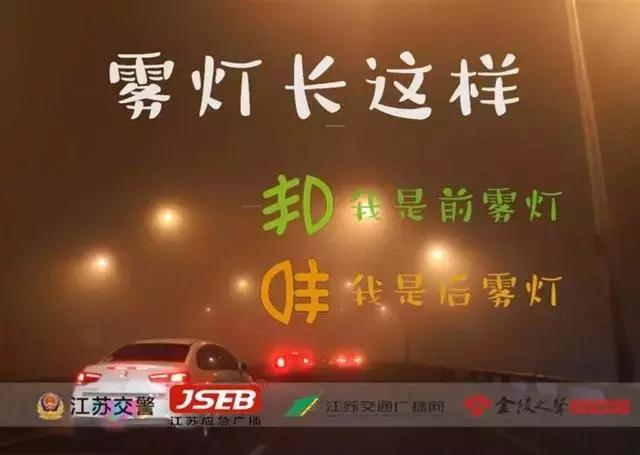
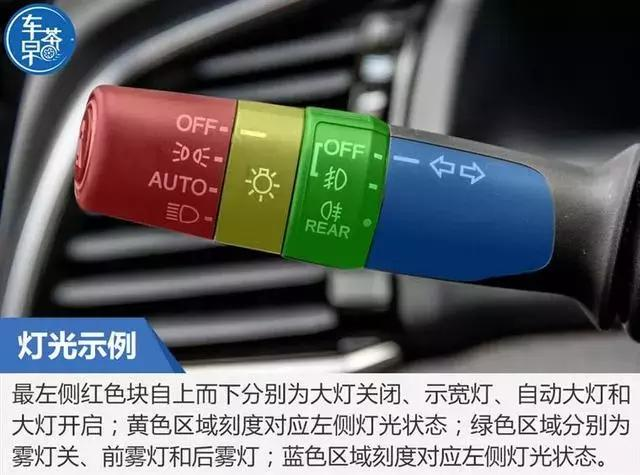
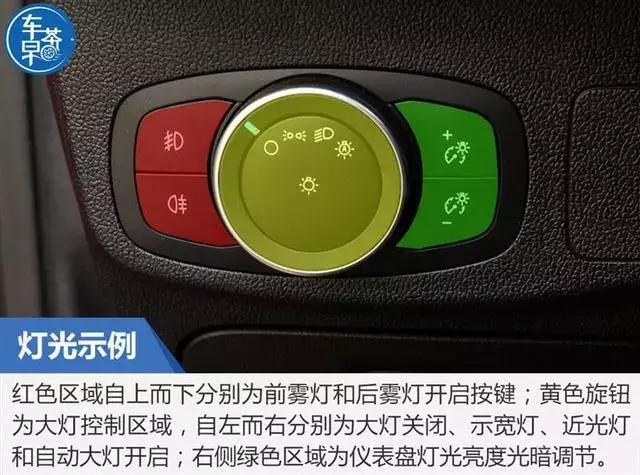
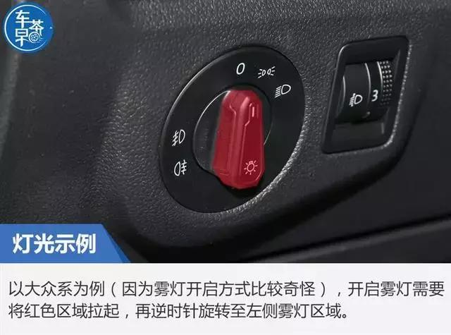

- [[python]]查看[[k8s]] pod
	- ```python
	  from kubernetes import client, config
	  
	  
	  def get_pod(kubeconfig):
	      config.load_kube_config(config_file=kubeconfig)
	      v1 = client.CoreV1Api()
	  
	      data = []
	  
	      # 获取所有命名空间
	      namespaces = ['lego-ams']
	      # 获取集群中所有容器的信息
	      for namespace in namespaces:
	          print(f"Namespace: {namespace}")
	          pods = v1.list_namespaced_pod(namespace)
	          for pod in pods.items:
	              workload_name = pod.metadata.labels.get("lego")
	              operator = pod.metadata.annotations.get("cmdb.io/operator")
	              pod_creation_time = pod.metadata.creation_timestamp.astimezone(
	                  pytz.timezone("Asia/Shanghai")).strftime("%Y-%m-%d %H:%M:%S")
	  
	              for container_status in pod.status.container_statuses:
	                  container_name = f"{workload_name}_{pod.metadata.name}_{container_status.name}"
	                  container_id = container_status.container_id.replace(
	                      'containerd://', '') if container_status.container_id else ''
	                  creation_time = container_status.state.running.started_at.astimezone(pytz.timezone(
	                      "Asia/Shanghai")).strftime("%Y-%m-%d %H:%M:%S") if container_status.state.running else pod_creation_time
	                  container = {
	                      "type": "containerd",    # 可不填，默认为docker
	                      "id": container_id,        # 容器ID（唯一识别的ID，如果没有，则必须保证name唯一）
	                      "name": container_name,      # 容器名
	                      "intranet_ip": pod.status.pod_ip,   # 容器内网ip，多个用;号分隔，没有可不填
	                      "host_ip": pod.status.host_ip,       # 宿主机内网ip
	                      "operator": operator,      # 容器负责人，多个用;号分隔，不包含中文名
	                      "pod_name": pod.metadata.name,      # pod名，没有可不填
	                      "workload_name": workload_name,  # workload名，没有可不填
	                      "remarks": "https://legox.woa.com",       # 备注，没有可不填
	                      "create_time": creation_time,   # 容器创建时间，类似 2019-02-26 15:00:00
	                  }
	                  data.append(container)
	      return data
	  ```
- ((64c25bbf-1682-4a43-878d-95c403011dfe))
- 如何开启[[雾灯]]和[[大灯]][src](https://auto.ifeng.com/c/7oZ3lvDzW0j) #card
  id:: 64dcabee-a9ac-410d-976e-8dd91557999a
	- 
	- 
	- 远光灯的使用一般通过往前拨或者往内拨：往前拨，一直开启远光灯；往内拨一下，远近光灯闪烁。
	  在远光灯使用的时候，如果遇到回车时一定要关闭远光灯，等待会车结束后再开启远光灯，这样是为了避免你的远光灯晃到对方驾驶员的视线造成意外，这也是文明开车的标准。
	- 
	- 大部分车型都需要先开启示宽灯或大灯才能开启雾灯。而采用旋钮式雾灯开启方式的车型，都会先开启前雾灯、再旋转则开启后雾灯，而且旋钮会回弹至前雾灯开启刻度，此时不要惊慌，看仪表盘雾灯指示灯状态即可。
	- 
	- 
	- 为什么开启后雾灯？因为红色的后雾灯穿透浓雾水汽的能力比刹车灯更强，略优于双闪灯，而且双闪灯一般用于特殊情况下，不能长期打开，其次双闪灯会对后车司机造成“精神干扰”。一般来说，如果能看到前方车辆的尾灯，就不需要开启后雾灯。开启后雾灯时，应注意不要对后方车辆造成干扰或误导。
- 如何提升记忆力 #[[Andrew Huberman]]
	- {{video https://www.youtube.com/watch?v=Lf5jOBEGGVw}}
	- 学习之后，想办法提高肾上腺素水平
	- {{youtube-timestamp 124}} 至少每三天休息一下，重置多巴胺和能量水平
	- 每天适当的短休
-
-