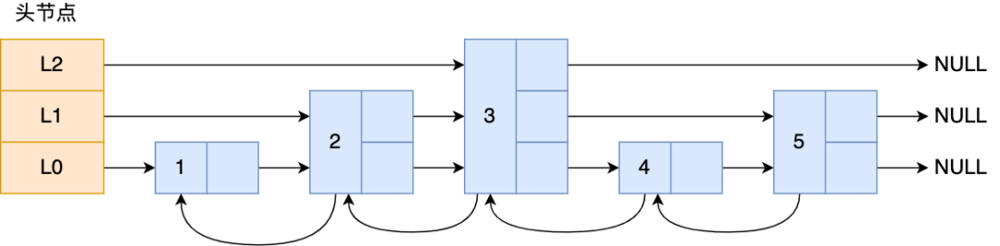

- 使用 [[go]] 实现[[反向代理]]
	- ```go
	  	tUrl := fmt.Sprintf("http://%s:%d", instance.PodIP, port)
	  	target, _ := url.Parse(tUrl)
	  	proxy := &httputil.ReverseProxy{
	  		Director: func(req *http.Request) {
	  			req.Host = target.Host
	  			req.URL.Scheme = "http"
	  			req.URL.Host = target.Host
	  			req.URL.Path = path
	  		},
	  	}
	  	proxy.ServeHTTP(ctx.ResponseWriter(), ctx.Request())
	  ```
- [[redis]]的[[跳表]]是怎么设置层高的 #card [src](https://mp.weixin.qq.com/s/HX79LlKDmk68fpnp5p1T2g)
	- **跳表是在链表基础上改进过来的，实现了一种「多层」的有序链表**。
	- 
	- 跳表在创建节点时候，会生成范围为[0-1]的一个随机数，如果这个随机数小于 0.25（相当于概率 25%），那么层数就增加 1 层，然后继续生成下一个随机数，直到随机数的结果大于 0.25 结束，最终确定该节点的层数。
		- ❓背后的原理是什么
- [[redis]]的[[哈希表]]是怎么[[扩容]]的 #card [src](https://mp.weixin.qq.com/s/HX79LlKDmk68fpnp5p1T2g)
	- 为了避免 rehash 在数据迁移过程中，因拷贝数据的耗时，影响 Redis 性能的情况，所以 Redis 采用了**渐进式 rehash**，也就是将数据的迁移的工作不再是一次性迁移完成，而是分多次迁移。
	- 渐进式 rehash 步骤如下：
		- 给「哈希表 2」 分配空间；
		- **在 rehash 进行期间，每次哈希表元素进行新增、删除、查找或者更新操作时，Redis 除了会执行对应的操作之外，还会顺序将「哈希表 1 」中索引位置上的所有 key-value 迁移到「哈希表 2」 上**；
		- 随着处理客户端发起的哈希表操作请求数量越多，最终在某个时间点会把「哈希表 1 」的所有 key-value 迁移到「哈希表 2」，从而完成 rehash 操作。
		- 这样就巧妙地把一次性大量数据迁移工作的开销，分摊到了多次处理请求的过程中，避免了一次性 rehash 的耗时操作。
	- 在进行渐进式 rehash 的过程中，会有两个哈希表，所以在渐进式 rehash 进行期间，哈希表元素的删除、查找、更新等操作都会在这两个哈希表进行。
	- 哈希表扩容的时候，有读请求怎么查？
		- 查找一个 key 的值的话，先会在「哈希表 1」 里面进行查找，如果没找到，就会继续到哈希表 2 里面进行找到。
- [[redis]]的[[大key]]如何解决？#card [src](https://mp.weixin.qq.com/s/HX79LlKDmk68fpnp5p1T2g)
  id:: 64dcc3db-97d9-4509-8ef1-bb783a8ac4c2
	- **对大Key进行拆分**。例如将含有数万成员的一个HASH Key拆分为多个HASH Key，并确保每个Key的成员数量在合理范围。在Redis集群架构中，拆分大Key能对数据分片间的内存平衡起到显著作用。
	- **对大Key进行清理**。将不适用Redis能力的数据存至其它存储，并在Redis中删除此类数据。注意，要使用异步删除。
	- **监控Redis的内存水位**。可以通过监控系统设置合理的Redis内存报警阈值进行提醒，例如Redis内存使用率超过70%、Redis的内存在1小时内增长率超过20%等。
	- **对过期数据进行定期清**。堆积大量过期数据会造成大Key的产生，例如在HASH数据类型中以增量的形式不断写入大量数据而忽略了数据的时效性。可以通过定时任务的方式对失效数据进行清理。
- [[redis]]什么是[[热key]]？如何解决热key问题？#card [src](https://mp.weixin.qq.com/s/HX79LlKDmk68fpnp5p1T2g)
	- 通常以其接收到的Key被请求频率来判定，例如：
		- QPS集中在特定的Key：Redis实例的总QPS（每秒查询率）为10,000，而其中一个Key的每秒访问量达到了7,000。
		- 带宽使用率集中在特定的Key：对一个拥有**上千**个成员且总大小为1 MB的HASH Key每秒发送大量的**HGETALL**操作请求。
		- CPU使用时间占比集中在特定的Key：对一个拥有**数万**个成员的Key（ZSET类型）每秒发送大量的**ZRANGE**操作请求。
	- 如何解决热key问题？
		- 在Redis集群架构中对热Key进行复制。在Redis集群架构中，由于热Key的迁移粒度问题，无法将请求分散至其他数据分片，导致单个数据分片的压力无法下降。此时，可以将对应热Key进行复制并迁移至其他数据分片，例如将热Key foo复制出3个内容完全一样的Key并名为foo2、foo3、foo4，将这三个Key迁移到其他数据分片来解决单个数据分片的热Key压力。
		- 使用读写分离架构。如果热Key的产生来自于读请求，您可以将实例改造成读写分离架构来降低每个数据分片的读请求压力，甚至可以不断地增加从节点。但是读写分离架构在增加业务代码复杂度的同时，也会增加Redis集群架构复杂度。不仅要为多个从节点提供转发层（如Proxy，LVS等）来实现负载均衡，还要考虑从节点数量显著增加后带来故障率增加的问题。Redis集群架构变更会为监控、运维、故障处理带来了更大的挑战。
- [[进程和线程的区别]] [src](https://mp.weixin.qq.com/s/HX79LlKDmk68fpnp5p1T2g) #card
	- 独立性：[[进程]]是**系统资源分配**的最小单位，[[线程]]是**处理器调度**的最小单位。每个进程有自己独立的地址空间和系统资源，而线程则共享所属进程的资源。
	- 开销：由于进程有自己独立的地址空间，所以进程间的切换需要更大的开销。**线程间切换只需要保存和设置少量寄存器内容，开销小。**
		- ((64dcc8f0-b721-4ff7-942e-aba3d17234e7))
	- 数据共享：同一进程内的线程共享进程的资源，如内存、文件描述符等，所以线程间的数据共享和通信更容易。进程间需要通过进程间通信机制来实现数据共享或通信。
- 分配给[[进程]]的资源有哪些？ [src](https://mp.weixin.qq.com/s/HX79LlKDmk68fpnp5p1T2g) #card
	- 虚拟内存、文件描述符、信号等等
- 进程切换和线程切换的区别？ [src](https://mp.weixin.qq.com/s/HX79LlKDmk68fpnp5p1T2g) #card
  id:: 64dcc8f0-b721-4ff7-942e-aba3d17234e7
	- 进程切换：进程切换涉及到更多的内容，包括整个进程的地址空间、全局变量、文件描述符等。因此，进程切换的开销通常比线程切换大。
	- 线程切换：线程切换只涉及到线程的堆栈、寄存器和程序计数器等，不涉及进程级别的资源，因此线程切换的开销较小。
- 线程死锁的条件？[src](https://mp.weixin.qq.com/s/HX79LlKDmk68fpnp5p1T2g) #card
	- 死锁问题的产生是由两个或者以上线程并行执行的时候，争夺资源而互相等待造成的。
	- 死锁只有同时满足互斥、持有并等待、不可剥夺、环路等待这四个条件的时候才会发生。
	- 所以要避免死锁问题，就是要破坏其中一个条件即可，最常用的方法就是使用资源有序分配法来破坏环路等待条件。