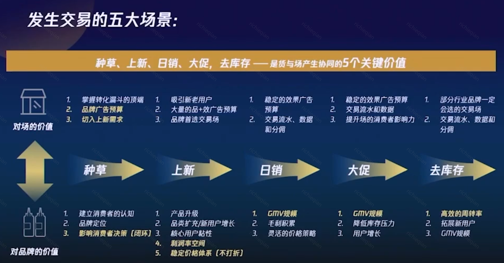
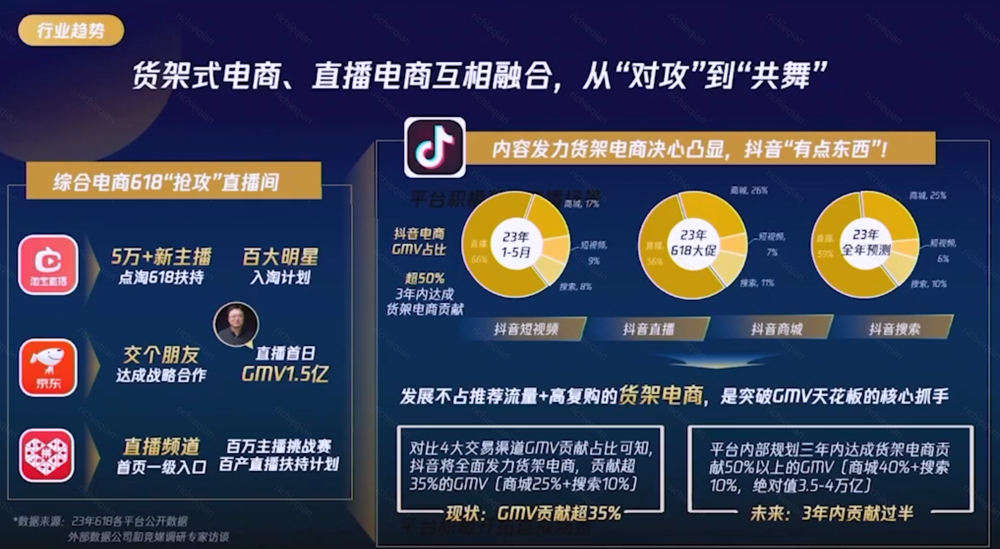
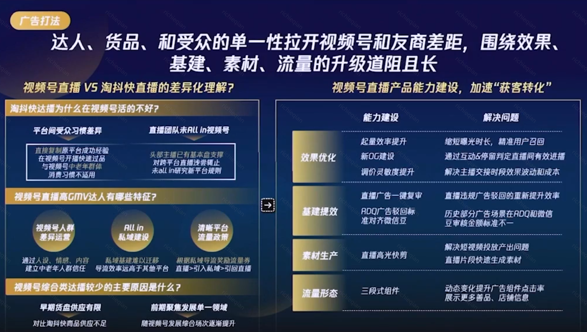
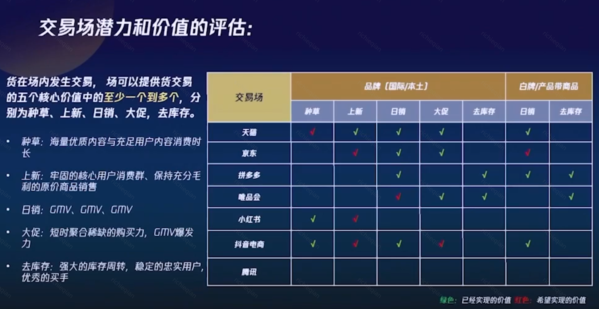
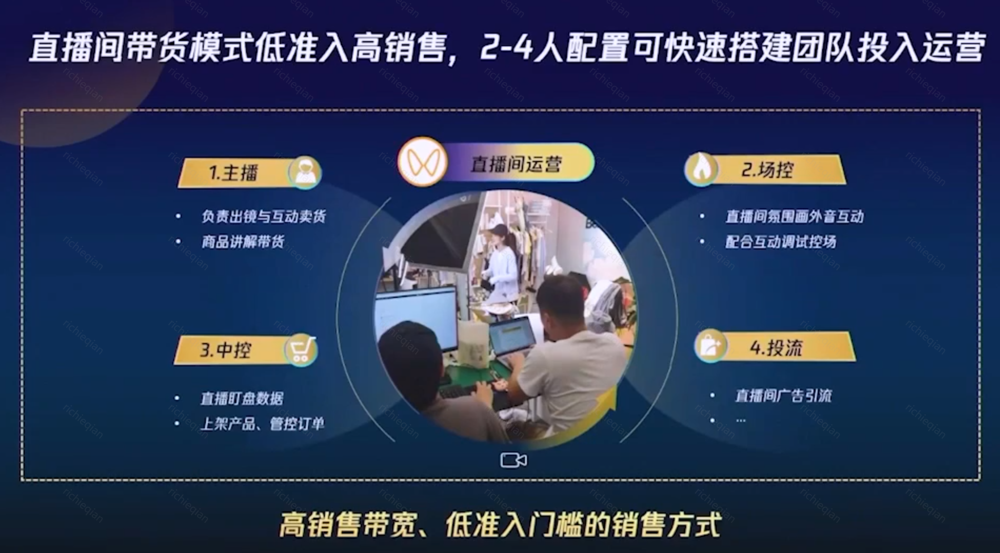
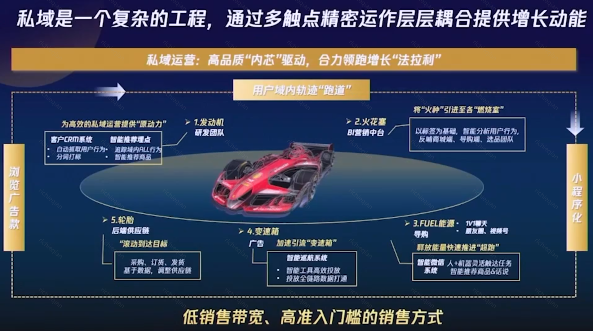

- 加息就买美债，降息就买股指
- 《交易的实践—电商零售的过去、现在和未来》 anthonyyao(姚远)-AMS行业销售运营一部/电商零售中心总监 [src](https://portal.learn.woa.com/training/netcourse/play?course_id=21582&scheme_type=netcourse) #广告业务
  collapsed:: true
	- 
	- 
	- 
	- 
	- 
	- 
	- 
	- 
-