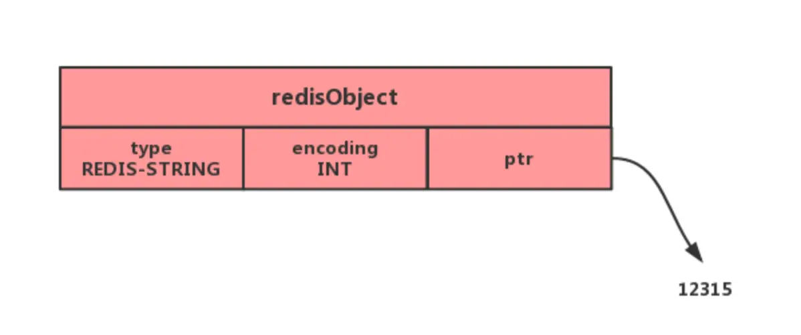
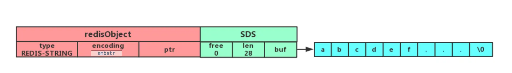
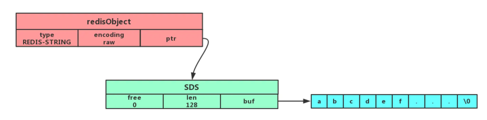

- 加息就买美债，降息就买股指
- [[redis]]的string类型，底层是int和SDS（Simple Dynamic String）#card #redis基础数据类型
  id:: 64e5c9f8-a5b2-42f2-95e3-68106ff9e8a8
	- int {:height 147, :width 508}
	- embstr 
	- raw 
	- embstr 编码和 raw 编码的边界在 redis 不同版本中是不一样的：
		- redis 2.+ 是 32 字节
		- redis 3.0-4.0 是 39 字节
		- redis 5.0 是 44 字节
	- 如果字符串的长度增加需要重新分配内存时，整个redisObject和sds都需要重新分配空间，所以**embstr编码的字符串对象实际上是只读的**，redis没有为embstr编码的字符串对象编写任何相应的修改程序。当我们对embstr编码的字符串对象执行任何修改命令（例如append）时，程序会先将对象的编码从embstr转换成raw，然后再执行修改命令。
- [[redis]]的list类型，**在 Redis 3.2 版本之前**是双向链表和**ziplist**，**在 Redis 3.2 版本之后**是**quicklist** #card #redis基础数据类型
	-
- 《交易的实践—电商零售的过去、现在和未来》 anthonyyao(姚远)-AMS行业销售运营一部/电商零售中心总监 [src](https://portal.learn.woa.com/training/netcourse/play?course_id=21582&scheme_type=netcourse) #广告业务
  collapsed:: true
	- 
	- 
	- 
	- 
	- 
	- 
	- 
	- 

