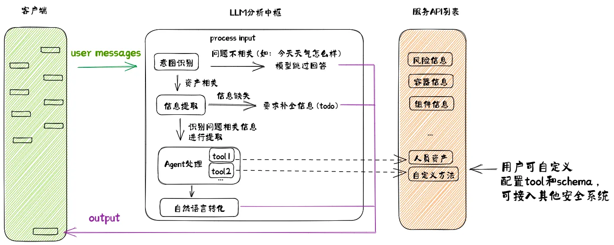

- 基于混元的人机协同作战模式初探（by 大模型安全小学生） [src](https://km.woa.com/articles/show/588630) > notion
	- 大模型信息提取发送给agent来条用外部系统获取相应数据 #LLM
	- 
- [[mosn]]与[[service mesh]]的关系 [Istio 的另一个 Sidecar 代理](https://istio.io/latest/zh/blog/2020/mosn-proxy/)
	- 在 Service Mesh 领域，使用 Istio 作为控制平面已成为主流。由于 Istio 的数据面默认是基于 Envoy 构建的，因此它使用了 Envoy 的数据平面 API（统称为 [[xDS]] API）。这些 API 已与 Envoy 分开并进行了标准化，因此，通过在 MOSN 中实现它们，我们就可以使用 MOSN 替代 Envoy。
	- Istio 的第三方数据平面集成可以通过以下三个步骤实现：
		- 实现 xDS 协议，对齐数据面相关服务治理能力;
		- 使用 Istio 的脚本并设置相关 `SIDECAR` 等参数构建 `proxyv2` 镜像;
		- 通过 istioctl 工具并设置 proxy 相关配置指定具体的数据面;
- 机器学习入门路径 [seancxzhao](https://km.woa.com/q/view/312107) #机器学习
	- 常规入门路径：CS229 + CS231n + CS224n，如果对强化学习的部分感兴趣，再加一个CS294-112
	- 大多数书不值得看，因为行业发展速度太快，很多写到书里的东西都已经过时了，而课程每年都会更新
	- 新手友好的入门路径：李宏毅机器学习系列 [http://speech.ee.ntu.edu.tw/~tlkagk/courses_ML20.html](http://speech.ee.ntu.edu.tw/~tlkagk/courses_ML20.html)
	- 只想玩一些炫酷的模型不想看任何数学公式：请直奔 [https://huggingface.co/](https://huggingface.co/)
	- 我只对GPT感兴趣，其他都不care：[https://github.com/karpathy/nanoGPT](https://github.com/karpathy/nanoGPT)
	- 硬核入门路径：Pattern Recognition and Machine Learning [https://www.microsoft.com/en-us/research/uploads/prod/2006/01/Bishop-Pattern-Recognition-and-Machine-Learning-2006.pdf](https://www.microsoft.com/en-us/research/uploads/prod/2006/01/Bishop-Pattern-Recognition-and-Machine-Learning-2006.pdf%C2%A0)
	- 不推荐的入门方式：花书，西瓜书，所有名字里面带tensorflow的书或者教程