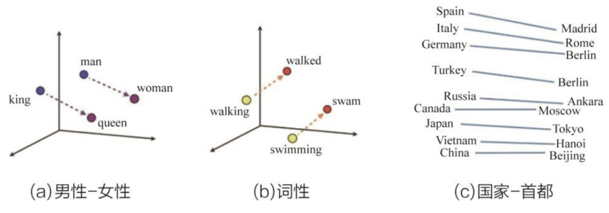

- 评价[[LoRa]]之于[[LLM]] [src](https://zhuanlan.zhihu.com/p/610031713)
	- [臣小白](https://www.zhihu.com/people/0857cb7a3066617b19bc4a730a0a81cf)：感觉就像一个人颜值不高，想去做整容手术又没钱，只能通过化妆来改变自己!
	- [印本源](https://www.zhihu.com/people/030d3966bfee6cb7a25467b3093bd38b)：就是说，Lora是基于transformer的ai模型的debug桩
	  尽管它本身也是一个基于transformer的模型!
	- [Wrep](https://www.zhihu.com/people/747dd8c8371c5d5414d47d18e1011679)：其实不是嵌入新的层，而是在原有的层上冻结预训练参数，只加上一个低秩的参数进行更新
- [[embedding]]概念 #《深度学习推荐系统(王喆)》 4.1  #深度学习 #card
  id:: 65433c65-7e03-4bb8-a425-1e8ec919d335
	- 形式上讲，Embedding就是用一个**低维稠密**的向量“表示”一个对象(object)，这里所说的对象可以是一个词、一个商品，也可以是一部电影，等等。其中“表示”这个词的含义需要进一步解释。笔者的理解是“表示”意味着Embedding向量能够表达相应对象的某些特征，同时向量之间的距离反映了对象之间的相似性。
		- 💡在有限集合内（低维），对所有个体（稠密），进行向量编码。向量对应个体特征，向量距离对应特征相似性。
	- 比如下面的词向量图（非word2vec）
		- 
		- 在词向量空间内，甚至在完全不知道一个词的向量的情况下，仅靠语义关系（距离向量）加词向量运算就可以推断出这个词的词向量。
		- Embedding就是这样从另外一个空间表达物品（个体向量），同时揭示物品之间的潜在关系（距离向量）的，某种意义上讲，Embedding方法甚至具备了本体论哲学层面上的意义。
- 为什么说[[Embedding]] 技术对于[[深度学习]]如此重要，甚至可以说是深度学习的“基础核心操作”呢？原因主要有以下三个 #《深度学习推荐系统(王喆)》 4.1 #card #深度学习
  id:: 65433c65-bd7e-4de6-8ae3-887ebbb1789f
  card-last-interval:: 4
  card-repeats:: 1
  card-ease-factor:: 2.6
  card-next-schedule:: 2025-03-26T19:39:02.130Z
  card-last-reviewed:: 2025-03-22T19:39:02.130Z
  card-last-score:: 5
	- 1. 可以将高维稀疏特征向量转为低维稠密特征向量
	- 2. [[Embedding]]本身可解释性/表达能力强（相比MF矩阵分解）
	- 3. [[Embedding]]可以直接进行相似度计算，应用于推荐系统的召回（初筛）层。
- 在[[Word2vec]]（谷歌13年提出）的研究中提出的**模型结构**、**目标函数**、**负采样方法**及**负采样中的目标函数**，在后续的研究中被重复使用并被屡次优化。掌握Word2vec中的每一个细节成了研究[[Embedding]]的基础  #《深度学习推荐系统(王喆)》 4.1  #TODO
	- [[极大似然估计]]
	- [[Skip-Gram]]