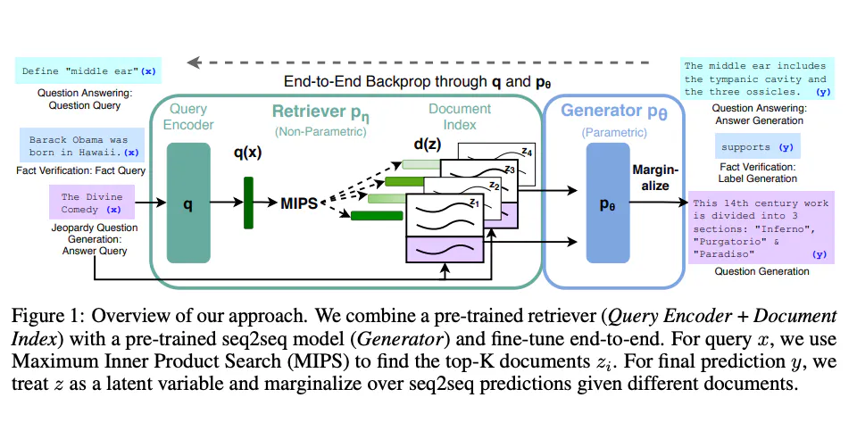
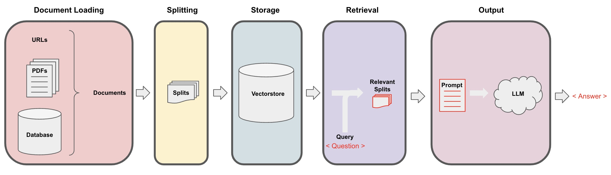

- Retrieval Augmented Generation ([[RAG]]) https://www.promptingguide.ai/techniques/rag #LLM
	- > For more complex and knowledge-intensive tasks, it's possible to build a language model-based system that accesses external knowledge sources to complete tasks. This enables more factual consistency, improves reliability of the generated responses, and helps to mitigate the problem of "hallucination".
		- hallucination 幻觉
	- > Meta AI researchers introduced a method called [Retrieval Augmented Generation (RAG)(opens in a new tab)](https://ai.facebook.com/blog/retrieval-augmented-generation-streamlining-the-creation-of-intelligent-natural-language-processing-models/) to address such knowledge-intensive tasks. RAG combines an information retrieval component with a text generator model. RAG can be fine-tuned and its internal knowledge can be modified in an efficient manner and without needing retraining of the entire model.
	- Lewis et al., (2021) proposed a general-purpose fine-tuning recipe for RAG.  [src](https://arxiv.org/pdf/2005.11401.pdf) 
	- > More recently, these retriever-based approaches have become more popular and are combined with popular LLMs like ChatGPT to improve capabilities and factual consistency.
	- > You can find a [simple example of how to use retrievers and LLMs for question answering with sources(opens in a new tab)](https://python.langchain.com/docs/use_cases/question_answering/how_to/vector_db_qa) from the LangChain documentation. #TODO 
	-
	-