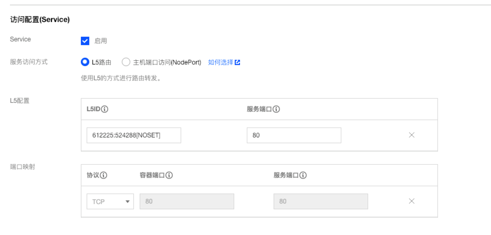
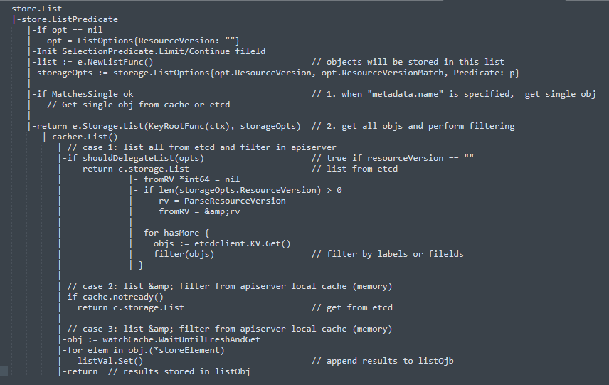

- IEG专家[[晋级答辩]]ppt https://km.woa.com/group/29321/knowledge/6939
- 非流量拦截的数据面扩展 [src](https://km.woa.com/articles/show/415173) #[[service mesh]] #istio
	- 新加入服务网格的SDK应用Pod, 以k8s service注册到k8s, 并被istio pilot 获得, istio pilot 不需要任何修改, 保持和社区同步.
	- Agent: 其功能类似CL5架构中的Agent, 不过此Agent 连接的服务中心是服务网格中的pilot, Agent 获取istio xDS 信息并进行解析, 转换为对应应用所需的服务实例地址, 提供CL5 Agent类似的名字服务和负载均衡服务.
	- SDK: 类似L5 SDK, SDK负责访问agent, 获取服务发现信息
	- 应用通过SDK发起服务访问, 在本应用中流量不会被拦截. 标准的istio数据面实例和扩展的istio数据面实例可以互通.
	- 对比[CL5架构](((655c4b53-9114-4e82-8e0a-c6d79350d25f))), CL5 agent 也需要去获取服务发现信息, 只是不是标准的xDS, 其他实现基本一致, 只是将CL5中的中央L5Server 替换成istio的标准控制面.
	- 该实现可以给用户带来的价值, 在于提供2种方式接入服务网格:
		- 对于性能要求不高、使用http/grpc协议的客户场景, 可以按照istio原生方式接入, 获得istio全部的服务治理能力.
		- 对于不能接受sidecar性能、或者对udp协议/私有协议有要求的客户场景、亦或是已经熟悉CL5的内部业务, 可以考虑使用「扩展数据面」接入方式, 获得istio的大部分服务治理能力.
- TKE为应用提供自动L5路由管理服务 [src](https://km.woa.com/group/25898/articles/show/368152) #[[service mesh]]
  id:: 655c4b53-9114-4e82-8e0a-c6d79350d25f
	- 提交部署后，L5-Controller会ListWatch Kubernetes Service&EndPoints对象，并注册add/delete/update Event Handler。
	- Endpoints Controller会根据Pod的健康状态，动态更新Endpoints对象，比如当有个Pod健康检查失败后，会从Endpoints中剔除对应Subset，触发L5-Controller的deleteEndpoints Event Handler去更新本地Cache，并调用L5 Server的接口将该Endpoints从L5 Server中剔除，从而完成流量的摘除。
	- 
- [【Tkex-TEG容器平台】大规模集群稳定性之LIST性能优化](https://km.woa.com/articles/show/549438) #notion #k8s #etcd
  id:: 655c56c7-a0e4-4129-9b33-94eb3965a61d
	- 代码调用逻辑可以通过这种形式展示 
	- 比如一个5000节点规模的集群，10w Pod数量，单个查询ETCD全量Pod的请求大约需要返回40-50MB的数据，最后通过APIServer解析后返回给客户端的可能也就十几KB或者几十KB。如果并发数量稍微多一些，那么ETCD就会扛不住，这时候整个K8S集群所有的增删改查请求都会收到影响，甚至拖垮Master组件。所以最好的方法是ETCD前面又一层缓存，客户端大部分的List请求都应该被APIServer拦住，从它的本地缓存读取数据返回。
	- APIServer也确实有自己的缓存，但是它仅仅对于使用Informer的请求有效，也就是说必须客户端请求的时候，不带分页且resourceVersion!=""才可以。翻译一下这句话就是，客户端想使用APIServer的缓存，必须指定获取的版本号，如果不带版本号那么就默认透传ETCD。
	- 我们很多的请求还有客户端的写法都是没有指定版本号，都是需要获取当前集群最新的数据，所以类似kubectl list这样的请求都直接透传到了ETCD，一旦集群规模突破4000+规模，稍微几个List请求可能就会拖慢etcd。为了解决这个问题，我们在APIServer层面自研了一层缓存，彻底解决了社区原生的缓存被击穿问题，后面我们会详细介绍实现方案。
	- 当前APIServer提供的缓存不能保证是etcd最新的值，想要使用APIServer的缓存，必须指定`resourceVersion`，APIServer会保证返回一个不老与指定版本的值。大部分使用client-go框架的controller，第一次进行`List And Watch`的时候，会默认将`resourceVersion=0`，这样虽然也会进入APIServer的缓存，但是0代表只需要返回当前内存缓存中最新的版本即可，这个版本不一定是etcd内最新的，还需要客户端自己通过Watch的方式逐步等APIServer推送更新的版本，这个在很多场景是无法接受的。比如`kubectl list`就需要获取当前集群最新的值，controller代码中需要根据某个label查询对应的Deployment或者Pod也需要返回当前最新的值，所以当前社区版缓存不能满足这个需求。
- Nginx Mirror 流量复制 #网络工具 灵感来自[src](((655c56c7-a0e4-4129-9b33-94eb3965a61d)))文章