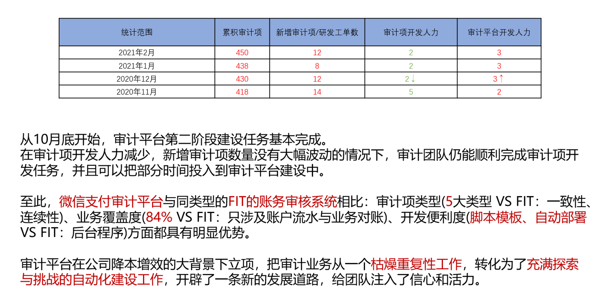

- 同侪（chai二声）压力 #card
  id:: 655de954-78b0-4b72-bce3-534ea720bd70
- [[StatefulSet]]的podManagementPlicy设置为Parallel后，更新仍然是逐个滚动的 [src](https://kuboard.cn/learning/k8s-intermediate/workload/wl-statefulset/scaling.html#pod-%E7%AE%A1%E7%90%86%E7%AD%96%E7%95%A5)
- 微信支付审计的运营数据 #支付审计
	- 平台管理450个审计项视图，3915个审计项任务
	- 
	- 