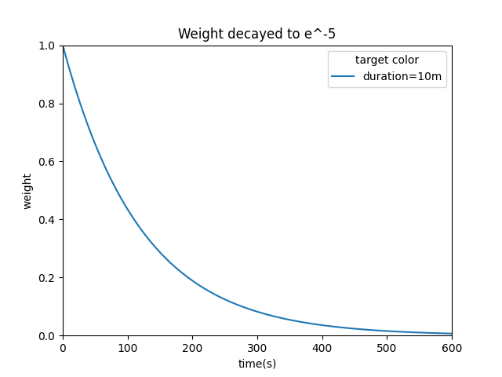
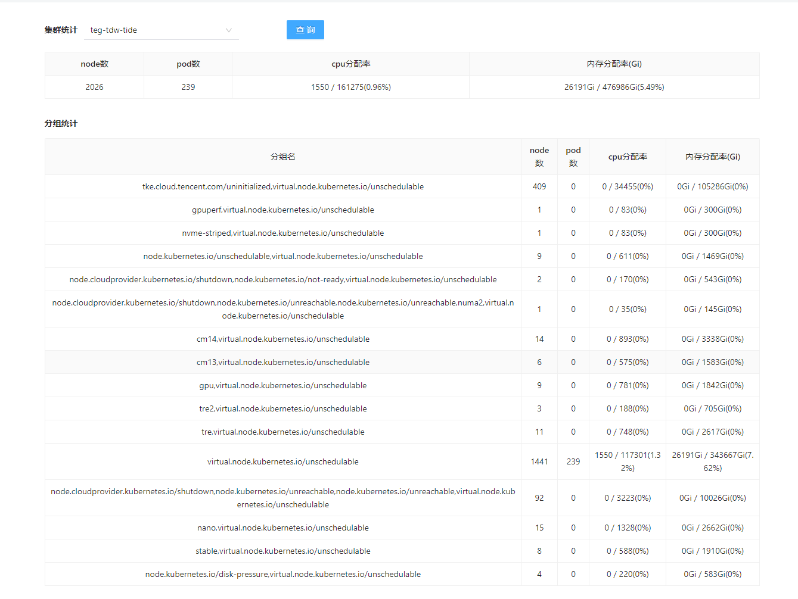

- 今晚为什么没有早睡？恐怕还是因为没有把计划的书和文章看完。然后就又打起了nba2kol2。可能是期望打得顺了，之后能有精力再看会书？不过这条路行不通，打游戏会快速透支精力，打得顺，就会想要更高的奖赏，而看书肯定给不了，打得不好，情绪低落，动力迅速耗尽，更不会看书。所以晚上就做一些不会让多巴胺高低起伏的事，比如冥想，阅读，听歌。所以晚上做完工作之后，尽快切入冥想模式，让多巴胺水平缓慢回落。另外还有一个重要原因，就是最近几天早起，但并没有睡太早，导致精力不足，早上没有主动跟幼儿园陪跑的家长打招呼，临走也没有跟老师说再见，该坐班车却脑袋空空地下了地铁，这说明自我意识已经非常薄弱了，那就更不可能及时意识到自己进入了内耗恶性循环，及时从游戏和熬夜中刹车。只有再睡一觉，重新让精力稍微恢复一下才行了。那明天几天先学习一下huberman的冥想方法。奥对了，今天早餐吃得多一些，中午只吃了一盘青菜，晚上只吃了两个茶叶蛋，突然的食量变化，应该也对意志力造成了负面影响。下午又喝了咖啡，对精力也有所透支。 #生活原则
- 内部感知和外部感知的冥想练习 #[[Andrew Huberman]] #NSDR #冥想
	- 【总算有个视频解决了我冥想坚持不下去的问题｜HubermanLab学习系列8-哔哩哔哩】 https://b23.tv/paClZ5B
- 不要轻易尝试冒险行为，谋定而后动。小孩成长过程中尽量避免过度挫折。越挫不会越勇，只会胆小自卑。#成长 #原生家庭
	- {{video https://www.bilibili.com/video/BV1bC4y1m7MQ/}}
- [[思维导图]]，或者[[xmind]]不适合做最初的信息收集整理，[[logseq]]这种松耦合（基于tag）的反倒更适合。因为前期信息的收集，位置是分散的，时间是零碎的，强行统一到一个xmind文件里，会带了一些操作上的不便（长期打开xmind文件、手机编辑xmind），这些不便可能会消解收集信息的动力。xmind作为一种集中式，金字塔式的信息管理方法，更适合最后基于树形结构，进行知识间层级和逻辑关系的验证与整合，便于成文和对外展示。 #PKM
- [[mosn]]使用PeakEWMA（Peak Exponentially Weighted Moving Average）峰值指数权重滑动平均计算响应时间指标 [src](https://mosn.io/blog/posts/mosn-loadbalancer-peakewma/)
	- 
	- 它以相对较高的权重考虑了最近响应时间的影响，因此更具有针对性和时效性。加权的程度以常数 𝛼 决定， 𝛼 数值介于 0 至 1，它用来控制数据加权影响力衰退的速率。
	- 
	- 作为一种统计学指标，EWMA的计算过程不需要大量的采样点以及时间窗口的设定，有效地避免了计算资源的浪费，更适合在mosn这样的边车代理中使用。
	- 由于响应时间是历史指标，当服务器出现性能问题导致长时间未返回时，负载均衡算法会错误地认为这台服务器仍是最优的，而不断地向其发送请求而导致长尾延迟增高。我们使用活跃连接数作为实时变化的指标对响应时间进行加权，表示等待所有活跃的连接都返回所需要的最大时间。
- 潮汐集群峰值pod数 #LEGO
	- 