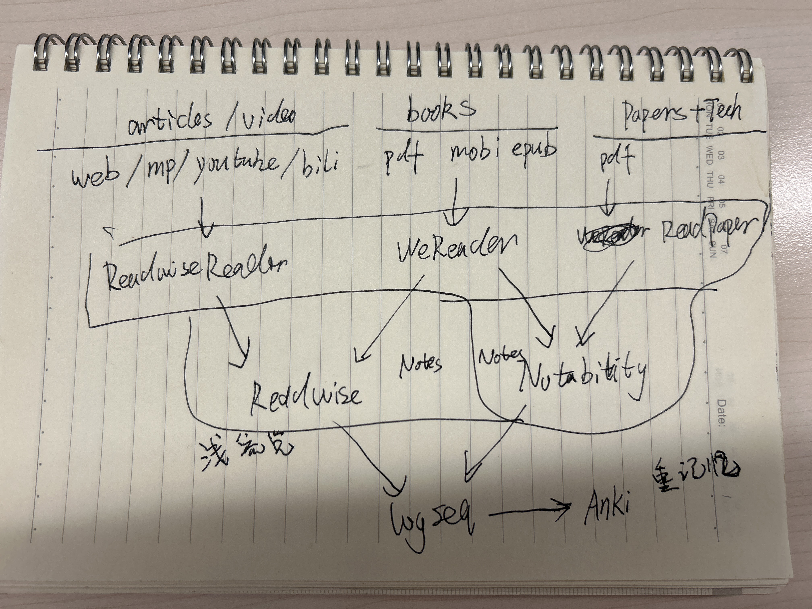

- 回顾最近一次面试比较成功的经历，就是在面试前3个小时临时抱佛脚，对前一次面试的主要内容在网上寻求解决方案，这样短时间内就掌握了问题解决脉络，也能主动说出在这个问题领域的思考，表达自己对这个领域的兴趣度。
- [[PKM]]系统新思考：如图，主要变化就是由ReadwiseReader取代了pocket和notion的作用，并且由Readwise自动导出笔记到logseq
	- 
- 今天要重新梳理一下深度学习的项目
- logseq的github同步有风险。刚刚就出现了在mac上的logseq文件内容丢失的问题： [[flomo内容归档]]这个文件的内容看起来是另一个文件的。这还是在mac上用 [[Logseq Anki Sync]]的时候发现删掉了一些闪卡的时候才发现的。