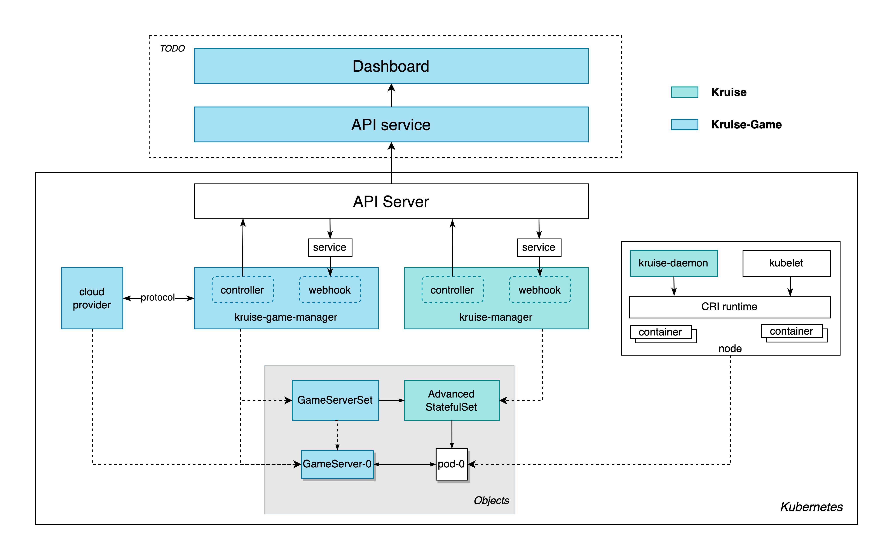

- #OKG源码解读 GameServer代码脉络
	- 核心源码`kruise-game/pkg/controllers/gameserver/gameserver_controller.go`
		- Add->add( newReconciler ) 注册新的协调器GameServerReconciler到ControllerRuntimeManager里
		- add( newReconciler ) 会在注册GameServerReconciler之前开启一个对GameServer事件的监听和一个pod事件的监听。其中GameServer事件的监听handler是ControllerRuntime默认的`EnqueueRequestForObject`，用于生成GameServer的workqueue request。Pod事件的监听用于筛选出GameServer相关的pod变化，并转换为GameServer的workqueue(是个延迟队列) request。
		- 所以不管是GameServer本身的变化还是相关Pod的变化，都会发送workqueue request到GameServer的Reconciler。Reconciler具体会按顺序：
		  1. 获取pod信息
		  2. 获取GameServer信息
		  3. 根据pod和GameServer的信息差别，双向同步信息`SyncGsToPod`、`SyncPodToGs`，核心同步逻辑在`kruise-game/pkg/controllers/gameserver/gameserver_manager.go`
- #OKG源码解读 GameServerSet代码脉络
	- 核心源码`kruise-game/pkg/controllers/gameserverset/gameserverset_controller.go`
		- 跟GameServer一样的套路，Add->add注册协调器
		- add会开启三个监听：GameServerSet、pod、workload（实际上只有AdvancedStatefulSet）。这三种对象的任何变动，都会发送GameServerSet类型的协调请求。workload的handler是ControllerRuntimee提供的`EnqueueRequestForOwner`。
- #OKG源码解读 GameServerSet(AdvancedStatefulSet)承载的是热更新和扩缩容配置，GameServer承载的是每个pod的更新/删除优先级，webhook承载的是网络配置 {:height 239, :width 367}
- #OKG源码解读 测试代码同样值得一读：单元测试里对fake client的使用；e2e端到端测试的framework实现。