- cft商户账户体系演进与技术实现（资金3.0） [src](https://km.woa.com/base/attachments/attachment_view/228513) #微信支付 #card
  id:: 6583e5cc-a978-42cc-8ebc-af058a9e8743
	- 个人账户：一个人一个账户，这个被叫做是C账户，是现金账户，个人可以完全支配。
	  商户账户:：商户账户因为需要结算等，所以一个商户有两个账户，一个B账户(中介账户，理解为待结算账户)，一个C账户(现金账户)。当用户支付时，实际支付到了商户的B账户，这个账户里面的资金商户不能自由支配，待平台结算后(扣除手续费等)，资金被转移到C账户，这个账户商户是可以自由支配的，比如可以提现到商户自己的银行卡。
	  银行账户：第三方支付公司为各个银行设置的账户，这个账户是一个总账账户，记录与银行之间的资金变动，一般不记录余额，而只是记录流水，方便跟各个银行进行对账
	- 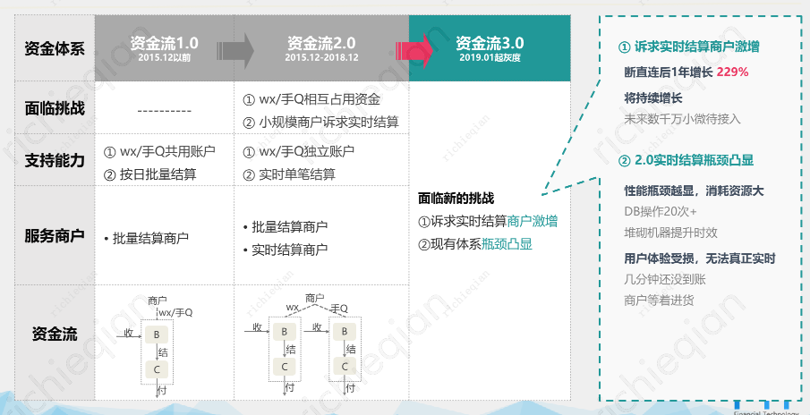
	- 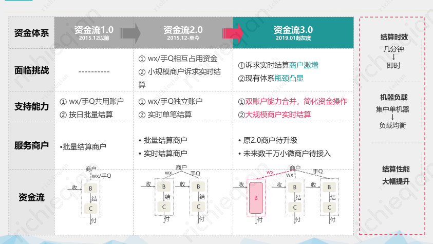
	- 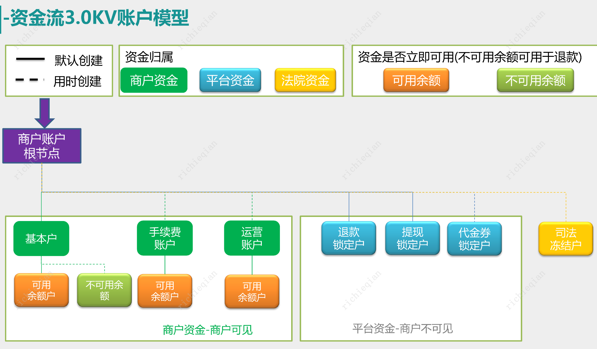
	- 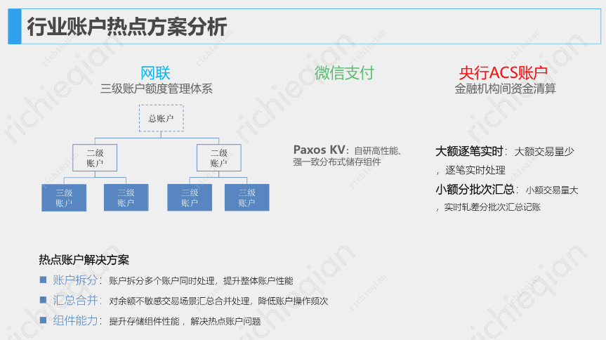
	- 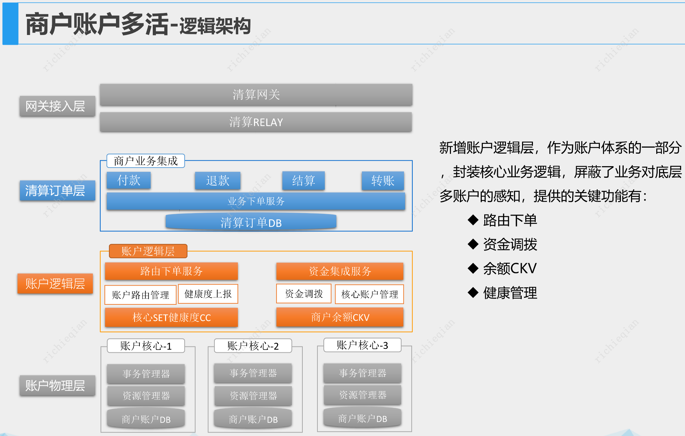
	- 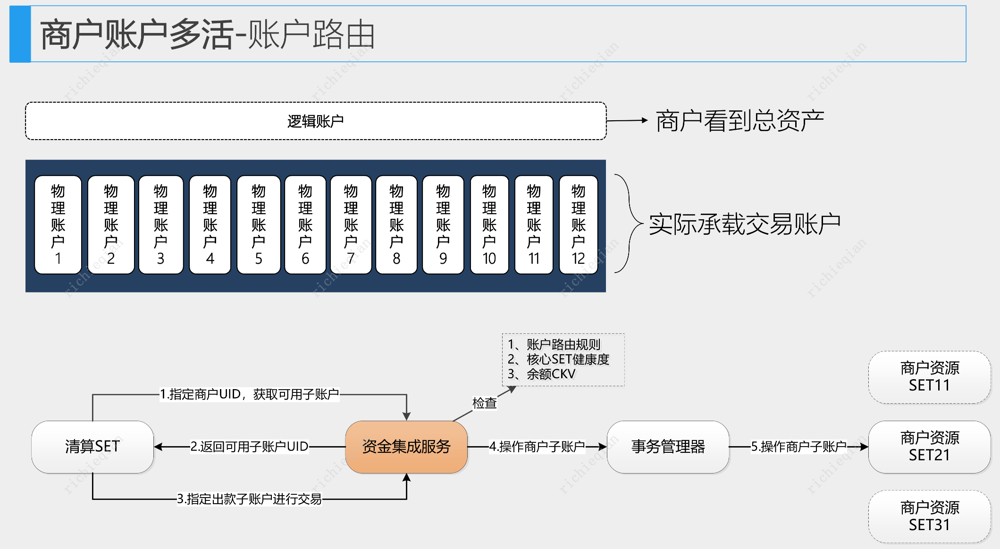
	- 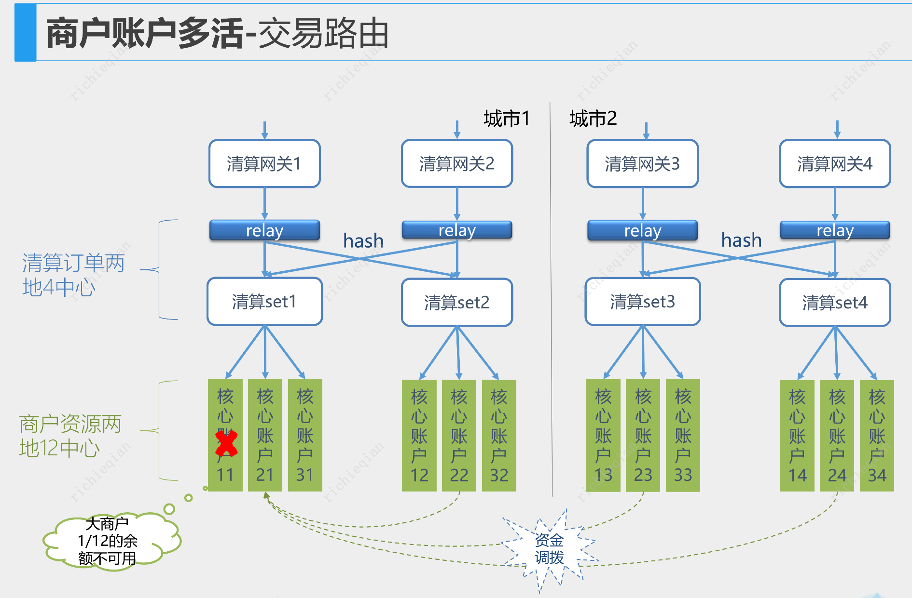
	- 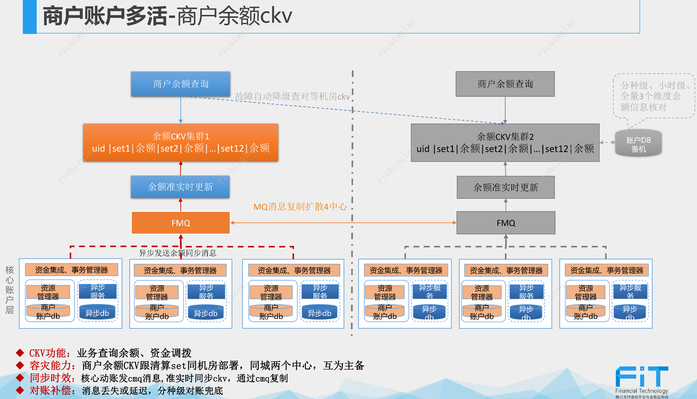
	- 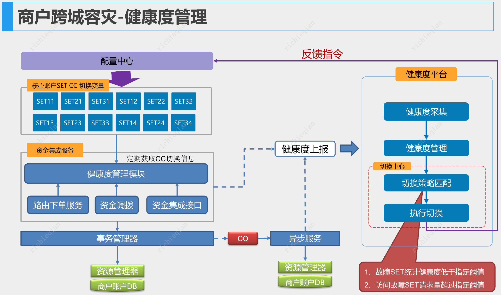
	- 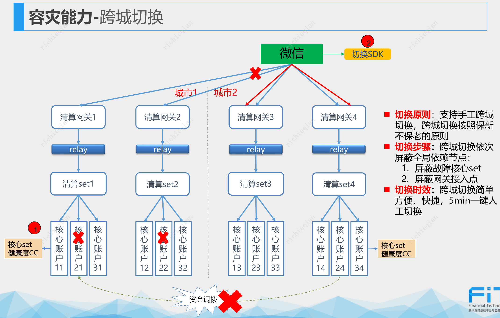
	- 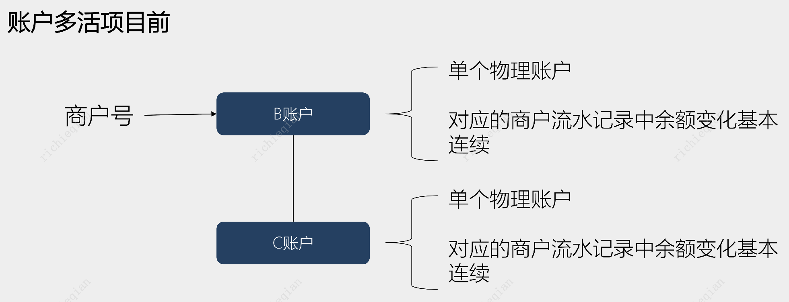
	- 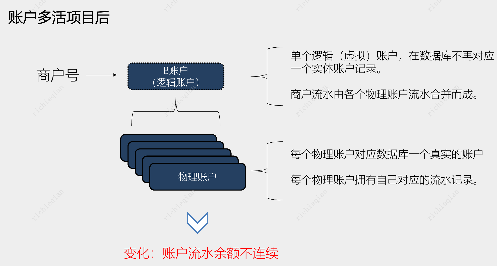
	- 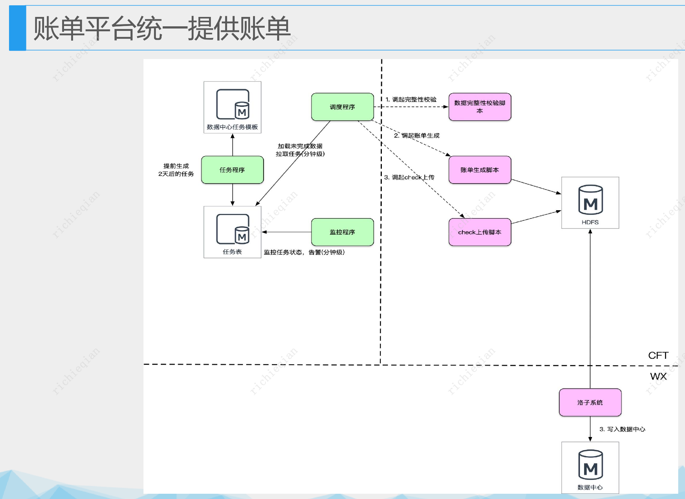
	- 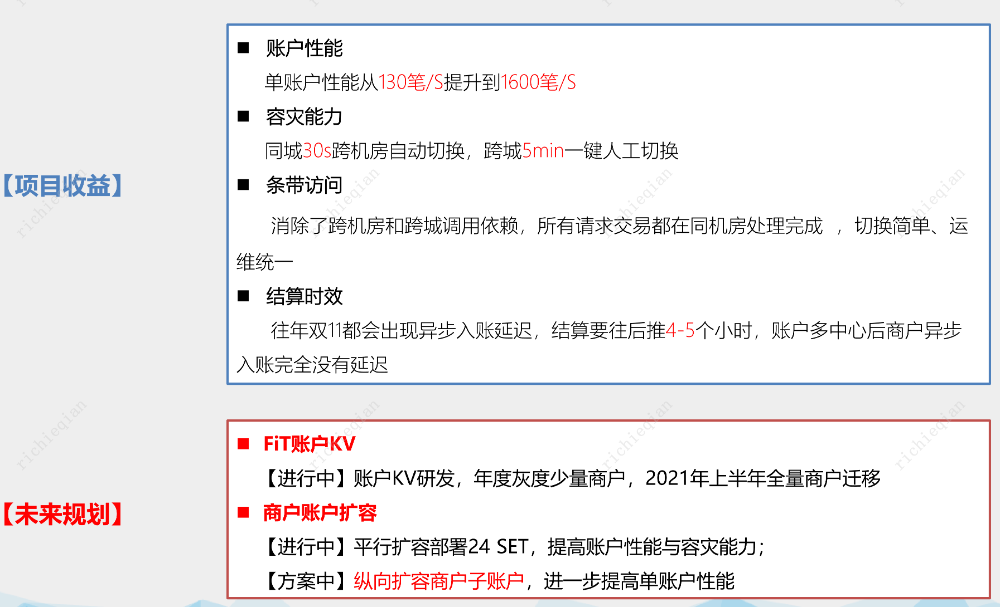
	-
- 「极客时间技术好课 」 Linux性能优化实战 [src](https://portal.learn.woa.com/training/mooc/projectDetail?mooc_course_id=A9BWP7o7) 制作问题排查思路思维导图 #TODO
- 「极客时间技术好课 」 性能工程高手课 [src](https://portal.learn.woa.com/training/mooc/projectDetail?scheme_type=mooc&mooc_course_id=T2Cx4wRq&from=SpecialArea&area_id=107) 制作问题排查思路思维导图 #TODO