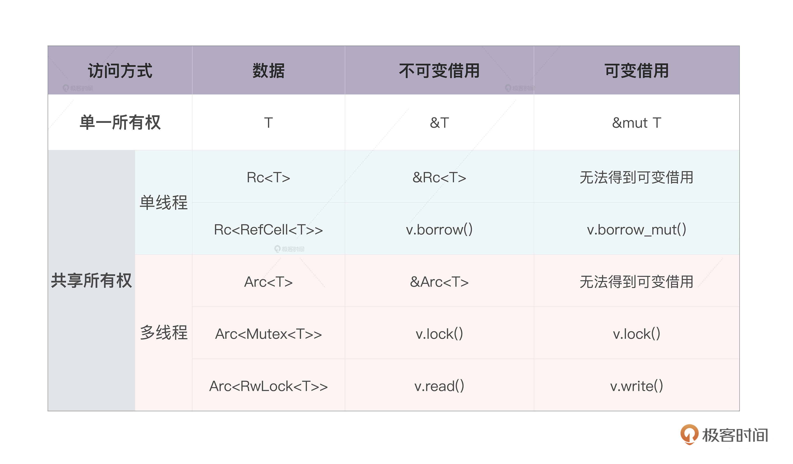

- [[rust]]中，box是唯一只读指针，rc是计数只读指针，refcell是唯一可变指针，rc<refcell>是计数可变指针。需要线程安全，Arc（atomic rc）对应rc， Mutex/RwLock对应refcell，Rc<RefCell<T>>要被替换为Arc<Mutex<T>>或者Arc<RwLock<T>> #card [src](https://learn.lianglianglee.com/%e4%b8%93%e6%a0%8f/%e9%99%88%e5%a4%a9%20%c2%b7%20Rust%20%e7%bc%96%e7%a8%8b%e7%ac%ac%e4%b8%80%e8%af%be/09%20%e6%89%80%e6%9c%89%e6%9d%83%ef%bc%9a%e4%b8%80%e4%b8%aa%e5%80%bc%e5%8f%af%e4%bb%a5%e6%9c%89%e5%a4%9a%e4%b8%aa%e6%89%80%e6%9c%89%e8%80%85%e4%b9%88%ef%bc%9f.md)
	- 
	- ```rust
	  use std::sync::Arc;
	  
	  fn main() {
	      let arr = Arc::new(vec![1]);
	      {
	          // 拷贝指针，覆盖外部变量名
	          let arr = Arc::clone(&arr);
	          // 把指针转移到新线程
	          std::thread::spawn(move || {
	              println!("{:?}", arr);
	          })
	          // 这个时候内部arr已经被moving掉
	      }
	      .join();
	      // 外部arr还在
	      println!("{:?}", arr);
	  }
	  ```
-
-