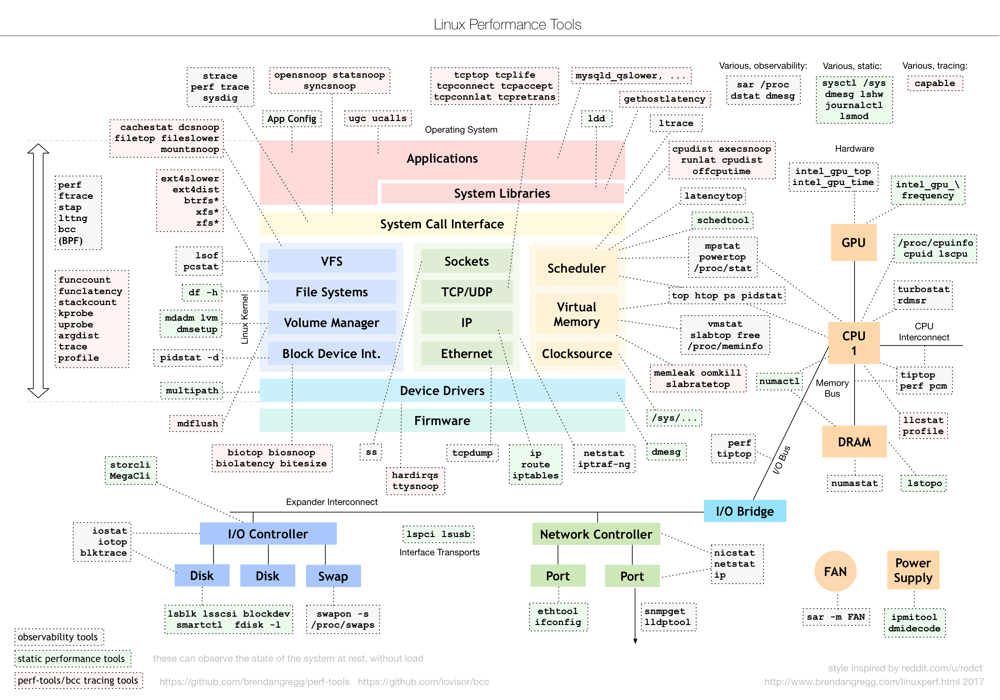
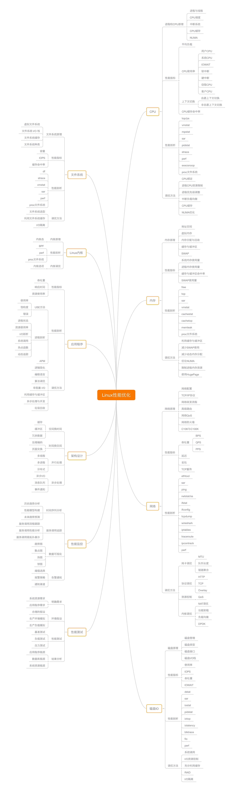

- linux性能工具图谱 #常用工具 #linux
	- 
- linux性能优化思维导图 [[《Linux性能优化实战》]]
	- 
- 有大量浮点数的大数据集，**不要存储成 CSV 格式**。特别是我们获取到的 Embedding 数据，是很多浮点数，存储成 CSV 格式会把本来只需要 4 个字节的浮点数，都用字符串的形式存储下来，会浪费好几倍的空间，写入的速度也很慢。我在这里**采用了 parquet 这个序列化的格式**，整个存储的过程只需要 1 分钟。 [src](https://sdc.qq.com/s/TZELHU?scheme_type=mooc&mooc_course_id=lUyD8VyD&task_id=82308&from=mooc) #机器学习