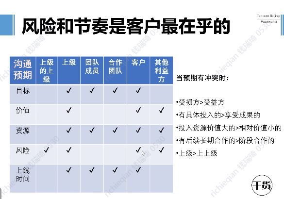
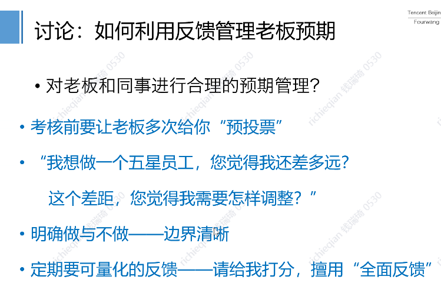
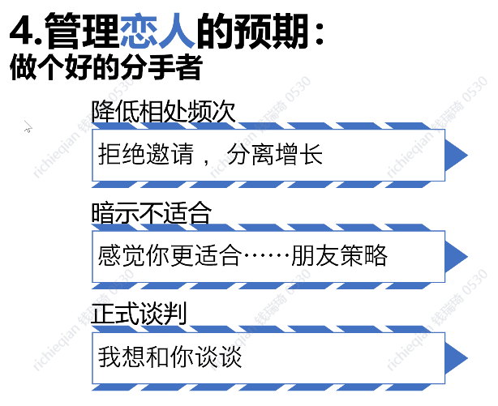

- bash提示优化 #linux #bash #常用工具
	- ```bash
	  function parse_git_dirty {
	    [[ $(git status --porcelain 2> /dev/null) ]] && echo "*"
	  }
	  function parse_git_branch {
	    git branch --no-color 2> /dev/null | sed -e '/^[^*]/d' -e "s/* \(.*\)/ (\1$(parse_git_dirty))/"
	  }
	  
	  export PS1="\n\t \u \[\033[32m\]\w\[\033[33m\]\$(parse_git_branch)\[\033[00m\]\n $ "
	  
	  [[ -s /root/.autojump/etc/profile.d/autojump.sh ]] && source /root/.autojump/etc/profile.d/autojump.sh
	  ```
- 预期管理 fourwang 王馨 #软实力 [预期管理-2021-fourwang(王馨)_Q-Learning (woa.com)](https://learn.woa.com/training/netcourse/play?course_id=17748)
	- 以夸奖作为暗示，利用暗示的力量
	- 常见的套路
		- 中国人喜欢先听坏消息，外国人喜欢先听好消息。
		- 生女儿要富养：见多识广，多看世界。父母榜样的力量。
		- 好的说差点，差的说好点，原因要透明，刺激先铺垫。
	- 
	- 
		- 7月考核，至少要在5月问，“预投票”，我是歌手演唱中间添加预投票
	- 
	- 
	- 
	- {:height 644, :width 895}