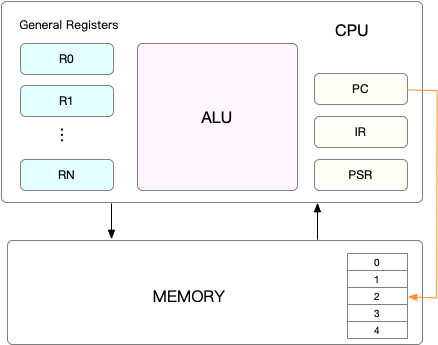

- 01｜技术概览：eBPF的发展历程及工作原理 (geekbang.org) [src](https://time.geekbang.org/column/article/479384) #《eBPF核心技术与实战》
	- BPF 程序可以利用 BPF 映射（map）进行存储，而用户程序通常也需要通过 BPF 映射同运行在内核中的 BPF 程序进行交互。如下图（图片来自ebpf.io）所示，在性能观测中，BPF 程序收集内核运行状态存储在映射中，用户程序再从映射中读出这些状态。 
	- 最常见的  eBPF 限制：
	  1. eBPF 程序必须被验证器校验通过后才能执行，且不能包含无法到达的指令；
	  2. eBPF 程序不能随意调用内核函数，只能调用在 API 中定义的辅助函数；
	  3. eBPF 程序栈空间最多只有 512 字节，想要更大的存储，就必须要借助映射存储；
	  4. 在内核 5.2 之前，eBPF 字节码最多只支持 4096 条指令，而 5.2 内核把这个限制提高到了 100 万条；5. 由于内核的快速变化，在不同版本内核中运行时，需要访问内核数据结构的 eBPF 程序很可能需要调整源码，并重新编译。想要稳定运行 eBPF 程序，内核版本至少需要 4.9 或者更新。而在开发和学习 eBPF 时，为了体验最新的 eBPF 特性，我推荐使用更新的 5.x 内核。
	-
- 03 | 基础篇：经常说的 CPU 上下文切换是什么意思？（上）[src](https://portal.learn.woa.com/training/mooc/taskDetail?mooc_course_id=A9BWP7o7&task_id=81429) #《Linux性能优化实战》
	- 在每个任务运行前，CPU 都需要知道任务从哪里加载、又从哪里开始运行，也就是说，需要系统事先帮它设置好 **CPU 寄存器和程序计数器**（Program Counter，PC）。
	- CPU 寄存器，是 CPU 内置的容量小、但速度极快的内存。而程序计数器，则是用来存储 CPU 正在执行的指令位置、或者即将执行的下一条指令位置。它们都是 CPU 在运行任何任务前，必须的依赖环境，因此也被叫做 **CPU 上下文**。 
	  
		- 💡 简单来说，CPU上下文就是指CPU寄存器（当前数据）和程序计数器（当前指令）#card
		  id:: 65a10612-692d-4610-8763-63a21f650ced
	- 这些**保存下来的上下文，会存储在系统内核中**，并在任务重新调度执行时再次加载进来。这样就能保证任务原来的状态不受影响，让任务看起来还是连续运行。
	- 根据任务的不同，CPU 的上下文切换就可以分为几个不同的场景，也就是**进程上下文切换**、**线程上下文切换**以及**中断上下文切换**。
	- 进程既可以在用户空间运行，又可以在内核空间中运行。进程在用户空间运行时，被称为进程的用户态，而陷入内核空间的时候，被称为进程的内核态。
		- 从用户态到内核态的转变，需要通过**系统调用**来完成。 #card
		  id:: 65a4fb3f-e3b9-45da-8cc3-986c06f6cdb1
			- **系统调用过程通常称为特权模式切换**。
			- 一次系统调用的过程，其实是发生了两次 **CPU 上下文切换**（用户态->内核态->用户态）。
			- 系统调用过程中，并不会涉及到虚拟内存等进程用户态的资源，也不会切换进程。
			- 💡总结起来：系统调用**不会发生进程上下文切换**，但是**会发生CPU的上下文切换**
				- 进程上下文切换，是指从一个进程切换到另一个进程运行。
				- 而系统调用过程中一直是同一个进程在运行。
	- 进程的上下文不仅包括了虚拟内存、栈、全局变量等用户空间的资源，还包括了内核堆栈、寄存器等内核空间的状态 #card
	  id:: 65a4fca1-9e89-437a-a6bd-b16f6c015882
	- 进程在什么时候才会被调度到 CPU 上运行 #card
	  id:: 65a10691-9cc4-4e45-a164-7f14f7c0e930
		- 其一，为了保证所有进程可以得到公平调度，CPU 时间被划分为一段段的时间片，这些时间片再被轮流分配给各个进程。这样，当某个进程的时间片耗尽了，就会被系统挂起，切换到其它正在等待 CPU 的进程运行。
		- 其二，进程在系统资源不足（比如内存不足）时，要等到资源满足后才可以运行，这个时候进程也会被挂起，并由系统调度其他进程运行。
		- 其三，当进程通过睡眠函数  sleep 这样的方法将自己主动挂起时，自然也会重新调度。
		- 其四，当有优先级更高的进程运行时，为了保证高优先级进程的运行，当前进程会被挂起，由高优先级进程来运行。
		- 最后一个，发生硬件中断时，CPU 上的进程会被中断挂起，转而执行内核中的中断服务程序。
	- 线程与进程最大的区别在于，**线程是调度的基本单位，而进程则是资源拥有的基本单位**。说白了，所谓内核中的任务调度，实际上的调度对象是线程；而进程只是给线程提供了虚拟内存、全局变量等资源。 #card
	  id:: 65a4fb63-66ca-4f38-86ab-21509bbc78b0
		- 当进程只有一个线程时，可以认为进程就等于线程。
		- 当进程拥有多个线程时，这些线程会共享相同的虚拟内存和全局变量等资源。这些资源在上下文切换时是不需要修改的。
		- 另外，线程也有自己的私有数据，比如栈和寄存器等，这些在上下文切换时也是需要保存的。
		- 线程的上下文切换其实就可以分为两种情况：
			- 第一种， 前后两个线程属于不同进程。此时，因为资源不共享，所以切换过程就跟进程上下文切换是一样。
			- 第二种，前后两个线程属于同一个进程。此时，因为虚拟内存是共享的，所以在切换时，虚拟内存这些资源就保持不动，只需要切换线程的私有数据、寄存器等不共享的数据。
			- 到这里你应该也发现了，虽然同为上下文切换，但同进程内的线程切换，要比多进程间的切换消耗更少的资源，而这，也正是多线程代替多进程的一个优势。
-
-