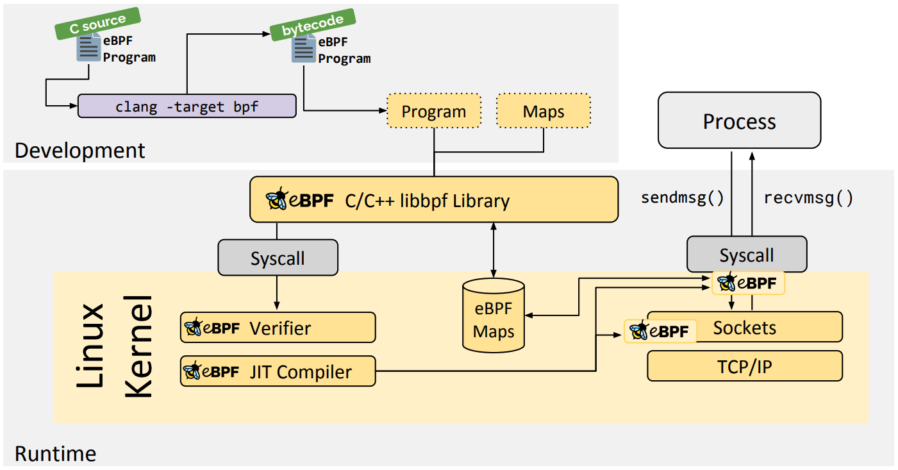

- 01｜技术概览：eBPF的发展历程及工作原理 (geekbang.org) [src](https://time.geekbang.org/column/article/479384) #《eBPF核心技术与实战》
	- BPF 程序可以利用 BPF 映射（map）进行存储，而用户程序通常也需要通过 BPF 映射同运行在内核中的 BPF 程序进行交互。如下图（图片来自ebpf.io）所示，在性能观测中，BPF 程序收集内核运行状态存储在映射中，用户程序再从映射中读出这些状态。 
	- 最常见的  eBPF 限制：
	  1. eBPF 程序必须被验证器校验通过后才能执行，且不能包含无法到达的指令；
	  2. eBPF 程序不能随意调用内核函数，只能调用在 API 中定义的辅助函数；
	  3. eBPF 程序栈空间最多只有 512 字节，想要更大的存储，就必须要借助映射存储；
	  4. 在内核 5.2 之前，eBPF 字节码最多只支持 4096 条指令，而 5.2 内核把这个限制提高到了 100 万条；5. 由于内核的快速变化，在不同版本内核中运行时，需要访问内核数据结构的 eBPF 程序很可能需要调整源码，并重新编译。想要稳定运行 eBPF 程序，内核版本至少需要 4.9 或者更新。而在开发和学习 eBPF 时，为了体验最新的 eBPF 特性，我推荐使用更新的 5.x 内核。
	-
- 03 | 基础篇：经常说的 CPU 上下文切换是什么意思？（上）[src](https://portal.learn.woa.com/training/mooc/taskDetail?mooc_course_id=A9BWP7o7&task_id=81429)
- 在每个任务运行前，CPU 都需要知道任务从哪里加载、又从哪里开始运行，也就是说，需要系统事先帮它设置好 **CPU 寄存器和程序计数器**（Program Counter，PC）。