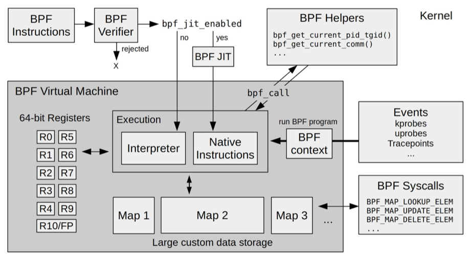

- 在公司调试[[ebpf]]最好从tlinux3开始，内核5.4以上
- 04 | 运行原理：eBPF是一个新的虚拟机吗？ [src](https://time.geekbang.org/column/article/481889) #《eBPF核心技术与实战》
	- 
	- R0 寄存器用于存储函数调用和 eBPF 程序的返回值，这意味着函数调用最多只能有一个返回值；
	  **R1-R5 寄存器用于函数调用的参数**，因此函数调用的参数最多不能超过 5 个；
	  R10 则是一个只读寄存器，用于从栈中读取数据。
	- 查看执行中的ebpf程序：89 是这个 eBPF 程序的编号，kprobe 是程序的类型，而 hello_world 是程序的名字
		- ```bash
		  # sudo bpftool prog list
		  89: kprobe  name hello_world  tag 38dd440716c4900f  gpl
		        loaded_at 2021-11-27T13:20:45+0000  uid 0
		        xlated 104B  jited 70B  memlock 4096B
		        btf_id 131
		        pids python3(152027)
		  ```
	- 导出eBPF 程序的指令
		- ```bash
		  bpftool prog dump xlated id 89
		  ```
	- 查看程序的系统调用
		- ```bash
		  strace -v -f ./hello.py
		  ```
	- 查看程序的ebpf调用
		- ```bash
		  # -ebpf表示只跟踪bpf系统调用sudo strace -v -f -ebpf ./h# -ebpf表示只跟踪bpf系统调用
		  sudo strace -v -f -ebpf ./hello.pyello.py
		  ```