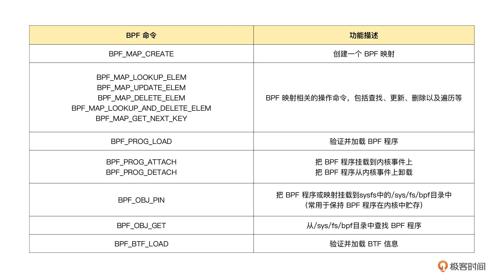
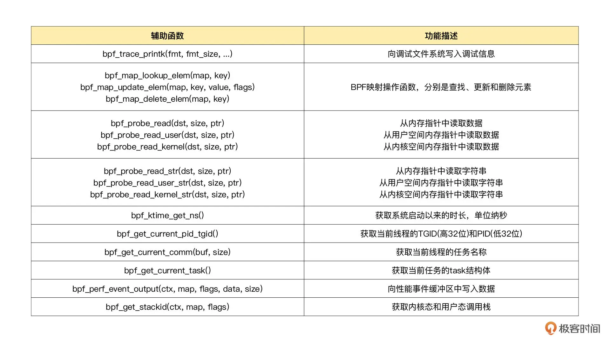
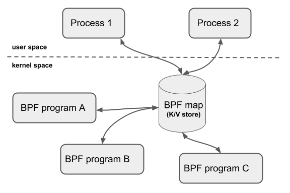
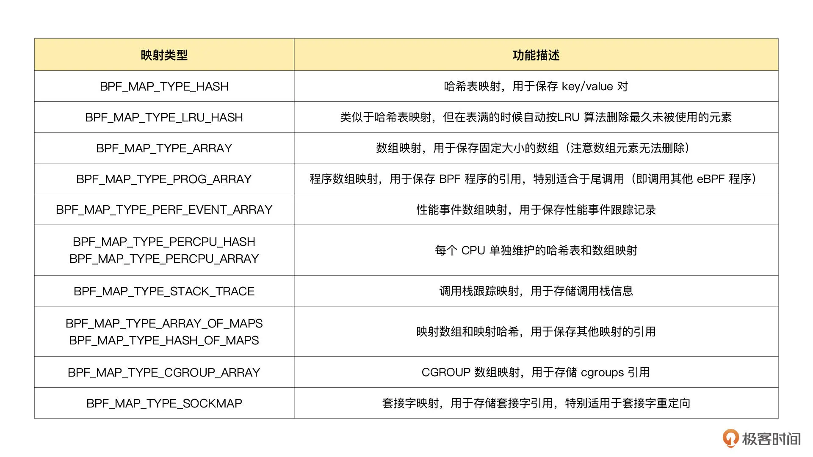
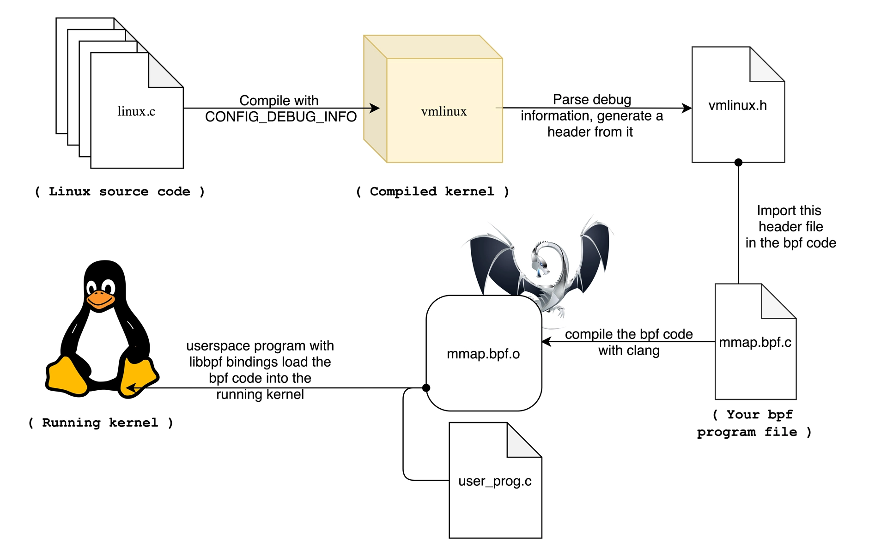

- 05 | 编程接口：eBPF程序是怎么跟内核进行交互的？ [src](https://time.geekbang.org/column/article/482459) #《eBPF核心技术与实战》
	- bpf系统调用支持的cmd
		- man bpf可以查看bpf系统调用函数定义
			- ```c
			  #include <linux/bpf.h>
			  
			  int bpf(int cmd, union bpf_attr *attr, unsigned int size);
			  ```
		- 支持列表 [bpf.h - include/uapi/linux/bpf.h - Linux source code (v5.13) - Bootlin](https://elixir.bootlin.com/linux/v5.13/source/include/uapi/linux/bpf.h#L828)
		- 常用命令 {:height 494, :width 864}
	- 可直接调用内核函数
		- 从内核 5.13 版本开始，除了辅助函数，部分内核函数（如  tcp_slow_start()、tcp_reno_ssthresh()  等）也可以被 BPF 程序直接调用了，具体你可以查看[Calling kernel functions from BPF [LWN.net]](https://lwn.net/Articles/856005/)
	- 辅助函数
		- 并不是所有的[[辅助函数]]都可以在 eBPF 程序中随意使用，不同类型的 eBPF 程序所支持的辅助函数是不同的。比如，对于 Hello World 示例这类内核探针（kprobe）类型的 eBPF 程序，你可以在命令行中执行 `bpftool feature probe` ，来查询当前系统支持的辅助函数列表。对于这些辅助函数的详细定义，你可以在命令行中执行 `man bpf-helpers`，或者参考内核头文件 [include/uapi/linux/bpf.h](https://elixir.bootlin.com/linux/v5.13/source/include/uapi/linux/bpf.h#L1463) ，来查看它们的详细定义和使用说明。
		- 常用辅助函数 
	- BPF 映射
		- BPF 映射用于提供大块的键值存储，这些存储可被用户空间程序访问，进而获取 eBPF 程序的运行状态。eBPF 程序最多可以访问 64 个不同的 BPF 映射，并且不同的 eBPF 程序也可以通过相同的 BPF 映射来共享它们的状态。 
			- 💡BPF程序刻意共享BPF映射，这给不通BPF程序之间通信提供了基础
		- BPF 辅助函数中并没有 BPF 映射的创建函数，BPF 映射只能通过用户态程序的系统调用来创建。比如，你可以通过下面的示例代码来创建一个 BPF 映射，并返回映射的文件描述符
			- ```c
			  int bpf_create_map(enum bpf_map_type map_type,
			         unsigned int key_size,
			         unsigned int value_size, unsigned int max_entries)
			  {
			    union bpf_attr attr = {
			      .map_type = map_type,
			      .key_size = key_size,
			      .value_size = value_size,
			      .max_entries = max_entries
			    };
			    return bpf(BPF_MAP_CREATE, &attr, sizeof(attr));
			  }
			  ```
			- 💡实质上就是通过bpf cmd (BPF_MAP_CREATE) 来创建的
		- 内核头文件 [include/uapi/linux/bpf.h](https://elixir.bootlin.com/linux/v5.13/source/include/uapi/linux/bpf.h#L867) 中的 bpf_map_type 定义了所有支持的映射类型，你可以使用如下的 bpftool 命令，来查询当前系统支持哪些映射类型 `bpftool feature probe | grep map_type`
			- {:height 321, :width 556}
		- BCC提供了宏方便创建映射
			- ```c
			  // 使用默认参数 key_type=u64, leaf_type=u64, size=10240
			  BPF_HASH(stats);
			  
			  // 使用自定义key类型，保持默认 leaf_type=u64, size=10240
			  struct key_t {
			    char c[80];
			  };
			  BPF_HASH(counts, struct key_t);
			  
			  // 自定义所有参数
			  BPF_HASH(cpu_time, uint64_t, uint64_t, 4096);
			  ```
	- **BPF 系统调用中并没有删除映射的命令，这是因为 BPF 映射会在用户态程序关闭文件描述符的时候自动删除（即close(fd) ）**。 如果你想在程序退出后还保留映射，就需要调用 BPF_OBJ_PIN 命令，将映射挂载到 /sys/fs/bpf 中。
	- 调试 BPF 映射相关的问题时，你还可以通过 bpftool 来查看或操作映射的具体内容 #card
	  id:: 65af7669-92d4-48a5-8ab0-76008b03dceb
		- ```bash
		  //创建一个哈希表映射，并挂载到/sys/fs/bpf/stats_map(Key和Value的大小都是2字节)
		  bpftool map create /sys/fs/bpf/stats_map type hash key 2 value 2 entries 8 name stats_map
		  
		  //查询系统中的所有映射
		  bpftool map
		  //示例输出
		  //340: hash  name stats_map  flags 0x0
		  //        key 2B  value 2B  max_entries 8  memlock 4096B
		  
		  //向哈希表映射中插入数据
		  bpftool map update name stats_map key 0xc1 0xc2 value 0xa1 0xa2
		  
		  //查询哈希表映射中的所有数据
		   
		  bpftool map dump name stats_map
		  //示例输出
		  //key: c1 c2  value: a1 a2
		  //Found 1 element
		  
		  //删除哈希表映射
		  rm /sys/fs/bpf/stats_map
		  ```
	- BTF（BPF类型格式） #card
	  id:: 65af7669-1e7e-4a19-a408-3baf141a88f9
		- 在安装 BCC 工具的时候，你可能就注意到了，内核头文件 linux-headers-$(uname -r) 也是必须要安装的一个依赖项。这是因为 BCC 在编译 eBPF 程序时，需要从内核头文件中找到相应的内核数据结构定义。这样，你在调用 bpf_probe_read 时，才能从内存地址中提取到正确的数据类型。
		- 编译时依赖内核头文件也会带来很多问题。主要有这三个方面：
			- 首先，在开发 eBPF 程序时，为了获得内核数据结构的定义，就需要引入一大堆的内核头文件；
			- 其次，**内核头文件的路径和数据结构定义在不同内核版本中很可能不同。因此，你在升级内核版本时，就会遇到找不到头文件和数据结构定义错误的问题**；
			- 最后，**在很多生产环境的机器中，出于安全考虑，并不允许安装内核头文件，这时就无法得到内核数据结构的定义**。在程序中重定义数据结构虽然可以暂时解决这个问题，但也很容易把使用着错误数据结构的 eBPF 程序带入新版本内核中运行。
		- BPF 类型格式（BPF Type Format, BTF）的诞生正是为了解决这些问题。从内核 5.2 开始，只要开启了 CONFIG_DEBUG_INFO_BTF，在编译内核时，内核数据结构的定义就会自动内嵌在内核二进制文件 vmlinux 中。并且，你还可以借助下面的命令，把这些数据结构的定义导出到一个头文件中（通常命名为 vmlinux.h）：`bpftool btf dump file /sys/kernel/btf/vmlinux format c > vmlinux.h`
		- 有了内核数据结构的定义，你在开发 eBPF 程序时只需要引入一个 vmlinux.h 即可，不用再引入一大堆的内核头文件了。 
		- 借助 BTF、bpftool 等工具，我们也可以更好地了解 BPF 程序的内部信息，这也会让调试变得更加方便。比如，在查看 BPF 映射的内容时，你可以直接看到结构化的数据，而不只是十六进制数值：
			- ```bash
			  # bpftool map dump id 386
			  [
			    {
			        "key": 0,
			        "value": {
			            "eth0": {
			                "value": 0,
			                "ifindex": 0,
			                "mac": []
			            }
			        }
			    }
			  ]
			  ```
		- eBPF 的一次编译到处执行（Compile Once Run Everywhere，简称 CO-RE）项目借助了 BTF 提供的调试信息，再通过下面的两个步骤，使得 eBPF 程序可以适配不同版本的内核：
			- 第一，通过对 BPF 代码中的访问偏移量进行重写，解决了不同内核版本中数据结构偏移量不同的问题；
			- 第二，在 libbpf 中预定义不同内核版本中的数据结构的修改，解决了不同内核中数据结构不兼容的问题。
			- BTF 和一次编译到处执行带来了很多的好处，但你也需要注意这一点：它们都要求比较新的内核版本（>=5.2），并且需要非常新的发行版（如 Ubuntu 20.10+、RHEL 8.2+ 等）才会默认打开内核配置 CONFIG_DEBUG_INFO_BTF。对于旧版本的内核，虽然它们不会再去内置 BTF 的支持，但开源社区正在尝试通过 BTFHub 等方法，为它们提供 BTF 调试信息。
	- 留言
		- 1、bpf 系统调用一定程度上参考了 perf_event_open 设计，bpf_attr、perf_event_attr 均包含了大量 union，用于适配不同的 cmd 或者性能监控事件类型。因此，bpf、perf_event_open 接口看似简单，其实是大杂烩。
			- bpf(int cmd, union bpf_attr *attr, ...) 
			  perf_event_open(struct perf_event_attr *attr, ...)
		- 2、bpftool 命令设计风格重度参考了 iproute2 软件包中的 ip 命令，用法基本上一致。
			- Usage: bpftool [OPTIONS] OBJECT { COMMAND | help }
			  Usage: ip [ OPTIONS ] OBJECT { COMMAND | help }
		- 无论内核开发还是工具开发，都可以看到设计思路借鉴的影子。工作之余不妨多些学习与思考，也许就可以把大师们比较好的设计思路随手用于手头的任务之中。
	-
- 公司内网python环境安装
	- 安装[conda-forge/miniforge: A conda-forge distribution. (github.com)](https://github.com/conda-forge/miniforge)
		- win版的安装完记得重启电脑/注销账户
	- 安装spyder `mamba install spyder`
	- mamba创建python环境 [Mamba User Guide — documentation](https://mamba.readthedocs.io/en/latest/user_guide/mamba.html)
		- ```python
		  mamba init bash #支持bash
		  mamba create --name python3.10 python=3.10 #完美替代conda
		  mamba activate python3.10
		  mamba deactivate
		  ```
-