- 腾讯一面：32 位 4GB 系统，访问 2GB 数据，虚拟内存会发生什么？[src](https://mp.weixin.qq.com/s/IfLCzKsqTx_xUQkC4DB9KA)  #面试经验
	- http常见响应码有哪些？#http #网络 #card
	  id:: 65afc6ef-520c-4b20-a939-b356a5fcf2f0
		- 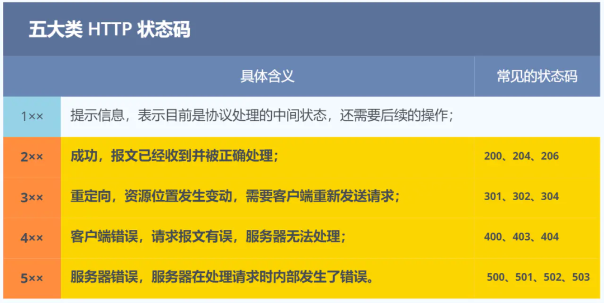
		- 其中常见的具体状态码有：
			- 200：请求成功；
			- 301：永久重定向；
			- 302：临时重定向；
			- 404：无法找到此页面；
			- 405：请求的方法类型不支持；
			- 500：服务器内部出错。
	- 虚拟地址怎么找到对应的内容的？
		- 操作系统内存管理方式主要两种，不同的管理方式，寻址的实现是不同的：
			- 内存分段：将进程的虚拟地址空间划分为多个不同大小的段，每个段对应一个逻辑单位，如代码段、数据段、堆段和栈段。每个段的大小可以根据需要进行调整，使得不同段可以按需分配和释放内存。虚拟内存分段的优点是可以更好地管理不同类型的数据，但是由于段的大小不一致，容易产生外部碎片。
			- 内存分页：将进程的虚拟地址空间划分为固定大小的页，同时将物理内存也划分为相同大小的页框。通过页表将虚拟地址映射到物理地址，并且可以按需加载和释放页。虚拟内存分页的优点是可以更好地利用物理内存空间，但是可能会产生内部碎片。
		- 分段的寻址方式 #card #内存分段
		  id:: 65afcb19-b50a-4e78-9a08-bf9a802006db
			- 分段机制下的虚拟地址由两部分组成，段选择因子和段内偏移量。 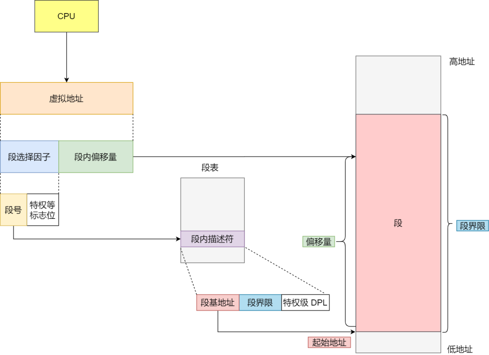
			- 段选择子就保存在段寄存器里面。段选择子里面最重要的是段号，用作段表的索引。段表里面保存的是这个段的基地址、段的界限和特权等级等。
			- 虚拟地址中的段内偏移量应该位于 0 和段界限之间，如果段内偏移量是合法的，就将段基地址加上段内偏移量得到物理内存地址。
			- 在上面，知道了虚拟地址是通过段表与物理地址进行映射的，分段机制会把程序的虚拟地址分成 4 个段，每个段在段表中有一个项，在这一项找到段的基地址，再加上偏移量，于是就能找到物理内存中的地址，如下图：
			  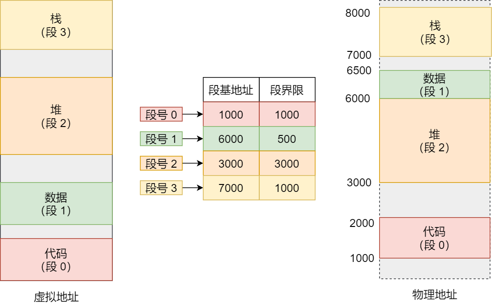
			  如果要访问段 3 中偏移量 500 的虚拟地址，我们可以计算出物理地址为，段 3 基地址 7000 + 偏移量 500 = 7500。
			- 分段的办法很好，解决了程序本身不需要关心具体的物理内存地址的问题，但它也有一些不足之处：
				- 第一个就是内存碎片的问题。
				- 第二个就是内存交换的效率低的问题。
		- 分页的寻址方式 #card #内存分页
		  id:: 65afc8ae-d38c-407f-80d2-fc7dd670dfef
			- 虚拟地址与物理地址之间通过页表来映射，如下图： 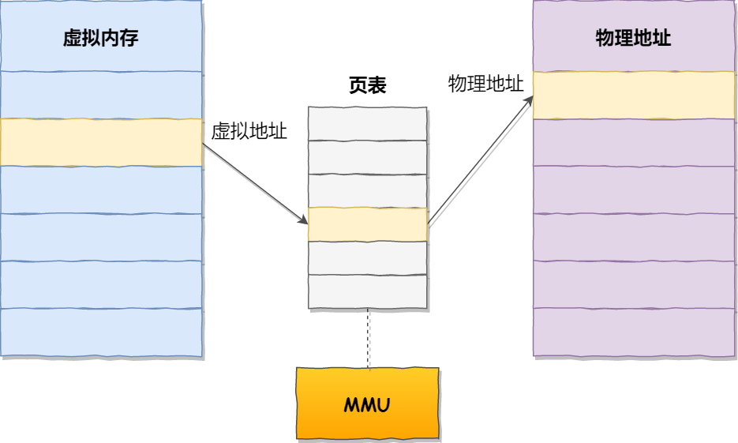
			- 页表是存储在内存里的，内存管理单元 （[[MMU]]）就做将虚拟内存地址转换成物理地址的工作。而当进程访问的虚拟地址在页表中查不到时，系统会产生一个缺页异常，进入系统内核空间分配物理内存、更新进程页表，最后再返回用户空间，恢复进程的运行。
				- 💡[[TLB]]( Translation Look- aside buffer)专门用于缓存内存中的页表项,一般在MMU单元内部。
				  id:: 65afca08-b4b2-4d0b-818c-68d8e11c6370
			- 在分页机制下，虚拟地址分为两部分，页号和页内偏移。页号作为页表的索引，页表包含物理页每页所在物理内存的基地址，这个基地址与页内偏移的组合就形成了物理内存地址，见下图。 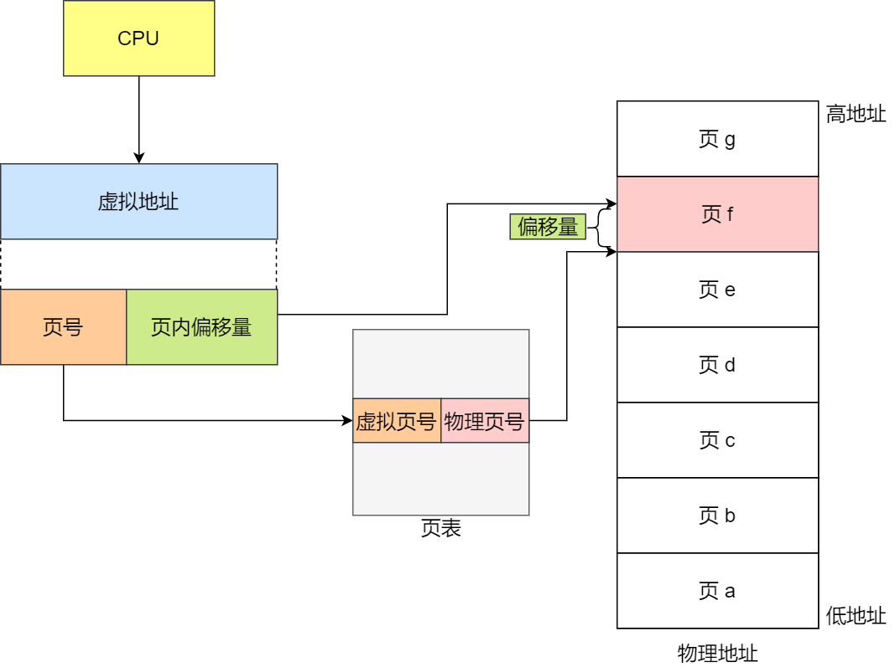
			- 总结一下，对于一个内存地址转换，其实就是这样三个步骤：
				- 把虚拟内存地址，切分成页号和偏移量；
				- 根据页号，从页表里面，查询对应的物理页号；
				- 直接拿物理页号，加上前面的偏移量，就得到了物理内存地址。
				- 下面举个例子，虚拟内存中的页通过页表映射为了物理内存中的页，如下图： 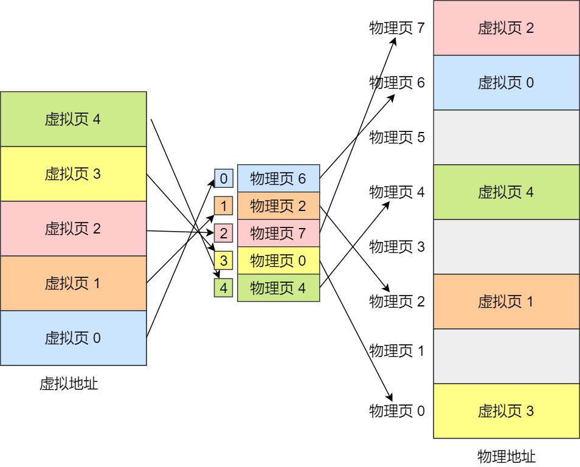{:height 586, :width 718}
	- 32位 4G 执行2G的东西，[[虚拟内存]]会有什么变化呢？ #card #linux内存管理机制
	  id:: 65afcdb0-9f03-4295-9e15-e0f3ba185b60
		- 应用程序通过 malloc 函数申请内存的时候，实际上申请的是虚拟内存，此时并不会分配物理内存。
			- 当应用程序读写了这块虚拟内存，CPU 就会去访问这个虚拟内存， 这时会发现这个虚拟内存没有映射到物理内存， CPU 就会产生**缺页中断**，进程会从用户态切换到内核态，并将缺页中断交给内核的 Page Fault Handler （缺页中断函数）处理。
			- 缺页中断处理函数会看是否有空闲的物理内存：
				- 如果有，就直接分配物理内存，并建立虚拟内存与物理内存之间的映射关系。
				- 如果没有空闲的物理内存，那么内核就会开始进行回收内存的工作，比如会进行 swap 机制。
	- 什么是 Swap 机制？
		- 当系统的物理内存不够用，或者使用存在压力的时候，会开始触发内存回收行为，把不常访问的内存先写到磁盘中，然后释放这些内存，给其他更需要的进程使用。再次访问这些内存时，重新从磁盘读入内存就可以了。
		- 这种，将内存数据换出磁盘，又从磁盘中恢复数据到内存的过程，就是 Swap 机制负责的。
		- Swap 就是把一块磁盘空间或者本地文件，当成内存来使用，它包含换出和换入两个过程：
			- **换出（Swap Out）** ，是把进程暂时不用的内存数据存储到磁盘中，并释放这些数据占用的内存；
			- **换入（Swap In）**，是在进程再次访问这些内存的时候，把它们从磁盘读到内存中来；
			- Swap 换入换出的过程如下图： 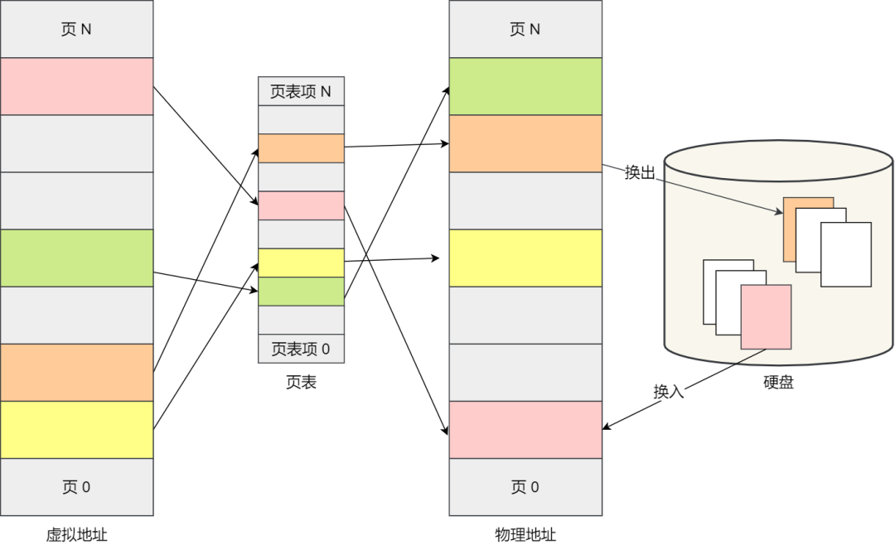
	- 内核态和用户态的区别是什么？ #card #内核态
	  id:: 65afd00e-716a-4a91-8a09-345ee60d76d9
		- 内核态和用户态是操作系统中的两种不同的执行模式。
		- 内核态是操作系统运行在特权级别最高的模式下的状态，它具有对系统资源的完全控制权。在内核态下，操作系统可以执行特权指令，访问所有的内存和设备，以及执行关键的系统操作。内核态下运行的代码通常是操作系统内核或驱动程序。
		- 用户态是应用程序运行的一种模式，它运行在较低的特权级别下。在用户态下，应用程序只能访问有限的系统资源，不能直接执行特权指令或访问内核级别的数据。用户态下运行的代码通常是应用程序或用户进程。
		- 内核态和用户态的区别在于权限和资源访问的限制
			- 内核态具有更高的权限和更广泛的资源访问能力
			- 而用户态受到限制，只能访问有限的资源
			- 操作系统通过将关键的操作和资源保护在内核态下来确保系统的安全性和稳定性。
			- 用户程序通过系统调用的方式向操作系统请求服务或资源，并在用户态下执行，以提供更高的隔离性和安全性。
	- HTTP/2 相比 HTTP/1.1 性能上的改进 #card #http #网络
	  id:: 65afd440-cb6a-4a87-84a9-d180fa803518
		- 头部压缩
		- 二进制格式
		- 并发传输
		- 服务器主动推送资源
		-
		- 1. 头部压缩
			- HTTP/2 会压缩头（Header）如果你同时发出多个请求，他们的头是一样的或是相似的，那么，协议会帮你消除重复的部分。
			- 这就是所谓的 HPACK 算法：在客户端和服务器同时维护一张头信息表，所有字段都会存入这个表，生成一个索引号，以后就不发送同样字段了，只发送索引号，这样就提高速度了。
		- 2. 二进制格式
			- HTTP/2 不再像 HTTP/1.1 里的纯文本形式的报文，而是全面采用了二进制格式，头信息和数据体都是二进制，并且统称为帧（frame）：头信息帧（Headers Frame）和数据帧（Data Frame）。 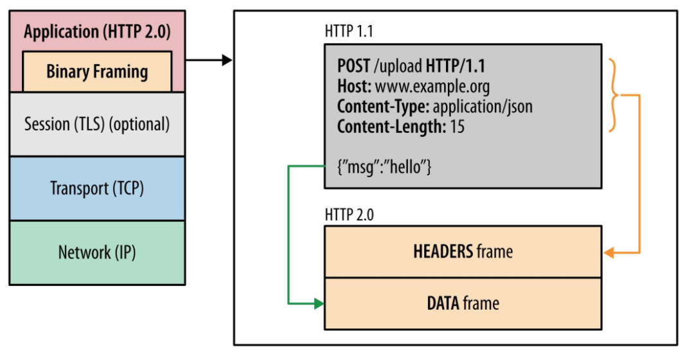
			- 这样虽然对人不友好，但是对计算机非常友好，因为计算机只懂二进制，那么收到报文后，无需再将明文的报文转成二进制，而是直接解析二进制报文，这增加了数据传输的效率。
		- 3. 并发传输
			- 我们都知道 HTTP/1.1 的实现是基于请求-响应模型的。同一个连接中，HTTP 完成一个事务（请求与响应），才能处理下一个事务，也就是说在发出请求等待响应的过程中，是没办法做其他事情的，如果响应迟迟不来，那么后续的请求是无法发送的，也造成了队头阻塞的问题。
			- 而 HTTP/2 就很牛逼了，引出了 Stream 概念，多个 Stream 复用在一条 TCP 连接。 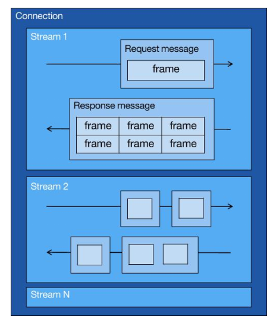
			- 从上图可以看到，1 个 TCP 连接包含多个 Stream，Stream 里可以包含 1 个或多个 Message，Message 对应 HTTP/1 中的请求或响应，由 HTTP 头部和包体构成。Message 里包含一条或者多个 Frame，Frame 是 HTTP/2 最小单位，以二进制压缩格式存放 HTTP/1 中的内容（头部和包体）。
			- 针对不同的 HTTP 请求用独一无二的 Stream ID 来区分，接收端可以通过 Stream ID 有序组装成 HTTP 消息，不同 Stream 的帧是可以乱序发送的，因此可以并发不同的 Stream ，也就是 HTTP/2 可以并行交错地发送请求和响应。
			- 比如下图，服务端并行交错地发送了两个响应：Stream 1 和 Stream 3，这两个 Stream 都是跑在一个 TCP 连接上，客户端收到后，会根据相同的 Stream ID 有序组装成 HTTP 消息。 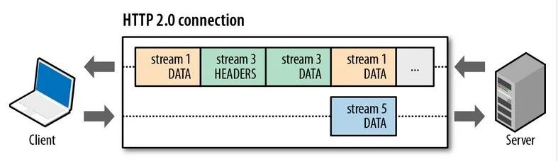
		- 4、服务器推送
			- HTTP/2 还在一定程度上改善了传统的「请求 - 应答」工作模式，服务端不再是被动地响应，可以主动向客户端发送消息。
			- 客户端和服务器双方都可以建立 Stream， Stream ID 也是有区别的，客户端建立的 Stream 必须是奇数号，而服务器建立的 Stream 必须是偶数号。
			- 比如下图，Stream 1 是客户端向服务端请求的资源，属于客户端建立的 Stream，所以该 Stream 的 ID 是奇数（数字 1）；Stream 2 和 4 都是服务端主动向客户端推送的资源，属于服务端建立的 Stream，所以这两个 Stream 的 ID 是偶数（数字 2 和 4）。 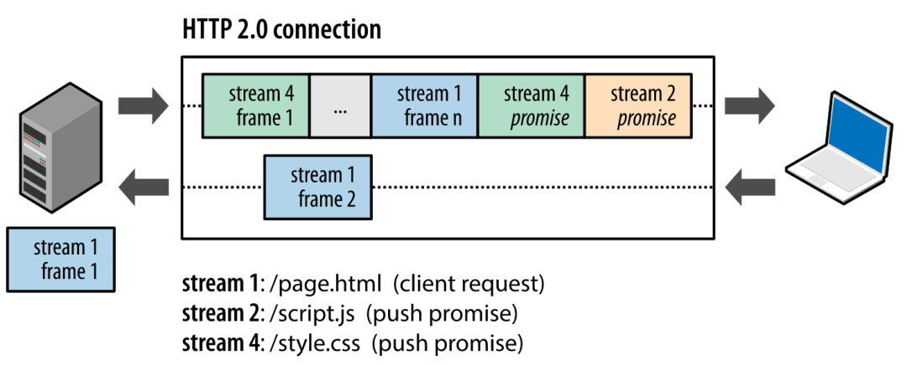
			- 再比如，客户端通过 HTTP/1.1 请求从服务器那获取到了 HTML 文件，而 HTML 可能还需要依赖 CSS 来渲染页面，这时客户端还要再发起获取 CSS 文件的请求，需要两次消息往返，如下图左边部分： 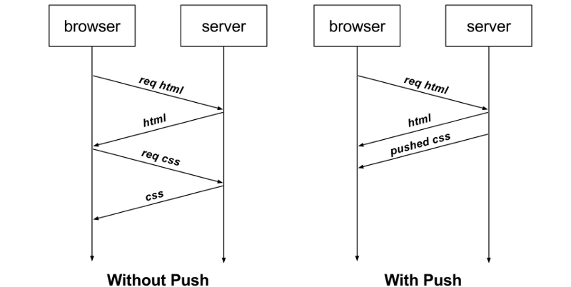 如上图右边部分，在 HTTP/2 中，客户端在访问 HTML 时，服务器可以直接主动推送 CSS 文件，减少了消息传递的次数。
	- [[tcp拥塞控制]] #TCP #网络 #linux #card
	  id:: 65afd59d-676c-473f-9279-575cd52dda33
		- **在网络出现拥堵时，如果继续发送大量数据包，可能会导致数据包时延、丢失等，这时 TCP 就会重传数据，但是一重传就会导致网络的负担更重，于是会导致更大的延迟以及更多的丢包，这个情况就会进入恶性循环被不断地放大....**
		  
		  所以，TCP 不能忽略网络上发生的事，它被设计成一个无私的协议，当网络发送拥塞时，TCP 会自我牺牲，降低发送的数据量。
		  
		  于是，就有了**拥塞控制**，控制的目的就是**避免「发送方」的数据填满整个网络。**
		  
		  为了在「发送方」调节所要发送数据的量，定义了一个叫做「**[[拥塞窗口]]**」的概念。
		- 拥塞控制主要是四个算法：
			- 慢启动
			- 拥塞避免
			- 拥塞发生
			- 快速恢复
		- 慢启动
			- TCP 在刚建立连接完成后，首先是有个慢启动的过程，这个慢启动的意思就是一点一点的提高发送数据包的数量，如果一上来就发大量的数据，这不是给网络添堵吗？
			- 慢启动的算法记住一个规则就行：**当发送方每收到一个 ACK，拥塞窗口 cwnd 的大小就会加 1。**
			- 这里假定[[拥塞窗口]] `cwnd` 和[[发送窗口]] `swnd` 相等，下面举个栗子：
				- 连接建立完成后，一开始初始化 `cwnd = 1`，表示可以传一个 `MSS` 大小的数据。
				- 当收到一个 ACK 确认应答后，cwnd 增加 1，于是一次能够发送 2 个
				- 当收到 2 个的 ACK 确认应答后， cwnd 增加 2，于是就可以比之前多发2 个，所以这一次能够发送 4 个
				- 当这 4 个的 ACK 确认到来的时候，每个确认 cwnd 增加 1， 4 个确认 cwnd 增加 4，于是就可以比之前多发 4 个，所以这一次能够发送 8 个。
				  
				  慢启动算法的变化过程如下图： 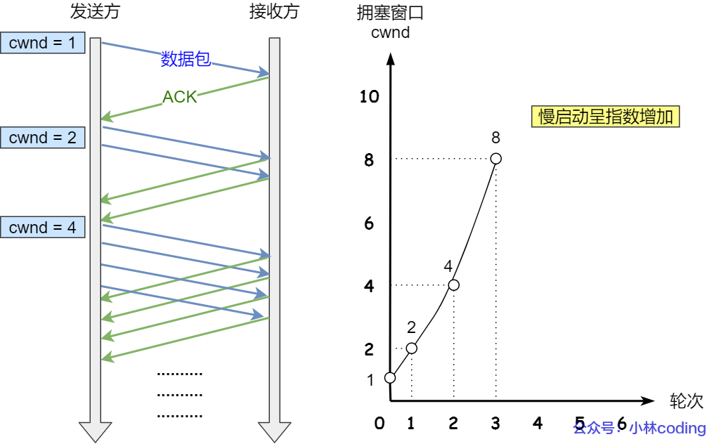 可以看出慢启动算法，发包的个数是**指数性的增长**。
			- 那慢启动涨到什么时候是个头呢？
				- 有一个叫慢启动门限 `ssthresh` （slow start threshold）状态变量。
				- 当 `cwnd` < `ssthresh` 时，使用慢启动算法。
				- 当 `cwnd` >= `ssthresh` 时，就会使用「拥塞避免算法」。
		- 拥塞避免
			- 当拥塞窗口 `cwnd` 「超过」慢启动门限 `ssthresh` 就会进入拥塞避免算法。
				- 一般来说 `ssthresh` 的大小是 `65535` 字节。
			- 那么进入拥塞避免算法后，它的规则是：**每当收到一个 ACK 时，cwnd 增加 1/cwnd。**
			- 接上前面的慢启动的栗子，现假定 `ssthresh` 为 `8`：
				- 当 8 个 ACK 应答确认到来时，每个确认增加 1/8，8 个 ACK 确认 cwnd 一共增加 1，于是这一次能够发送 9 个 `MSS` 大小的数据，变成了**线性增长。**
			- 拥塞避免算法的变化过程如下图： 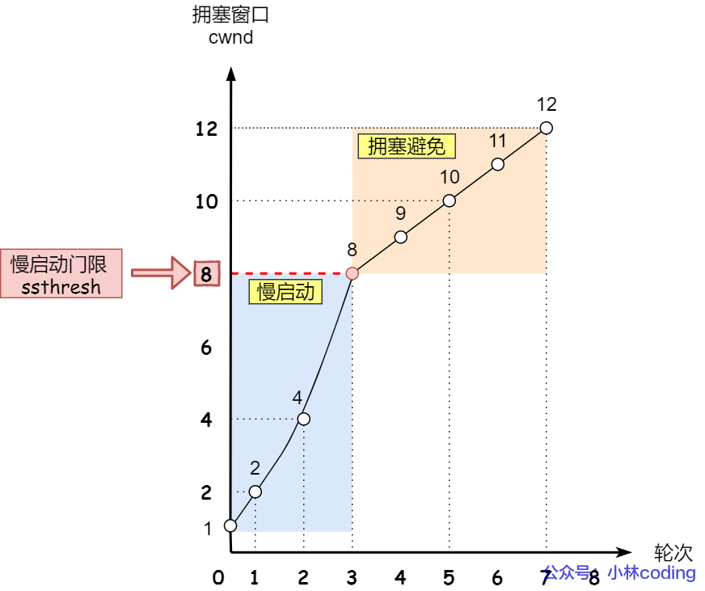
				- 所以，我们可以发现，拥塞避免算法就是将原本慢启动算法的指数增长变成了线性增长，还是增长阶段，但是增长速度缓慢了一些。
				- 就这么一直增长着后，网络就会慢慢进入了拥塞的状况了，于是就会出现丢包现象，这时就需要对丢失的数据包进行重传。
				- 当触发了重传机制，也就进入了「拥塞发生算法」。
		- 拥塞发生
			- 当网络出现拥塞，也就是会发生数据包重传，重传机制主要有两种：
				- 超时重传
				- 快速重传
			- 当发生了「超时重传」，则就会使用拥塞发生算法。这个时候，ssthresh 和 cwnd 的值会发生变化：
				- `ssthresh` 设为 `cwnd/2`，
				- `cwnd` 重置为 `1` （是恢复为 cwnd 初始化值，我这里假定 cwnd 初始化值 1）
			- 拥塞发生算法的变化如下图： 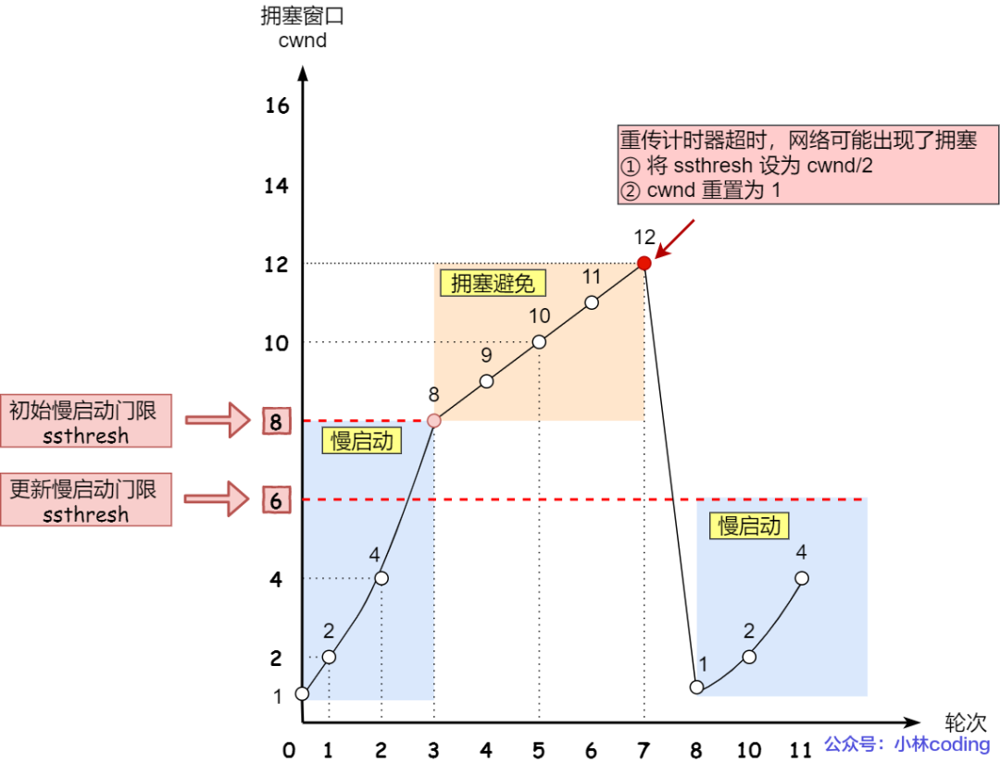
				- 接着，就重新开始慢启动，慢启动是会突然减少数据流的。这真是一旦「超时重传」，马上回到解放前。但是这种方式太激进了，反应也很强烈，会造成网络卡顿。
				- 还有更好的方式，前面我们讲过「快速重传算法」。**当接收方发现丢了一个中间包的时候，发送三次前一个包的 ACK，于是发送端就会快速地重传，不必等待超时再重传。**
				- TCP 认为这种情况不严重，因为大部分没丢，只丢了一小部分，则 `ssthresh` 和 `cwnd` 变化如下：
					- `cwnd = cwnd/2` ，也就是设置为原来的一半;
					- `ssthresh = cwnd`;
					- 进入快速恢复算法
		- 快速恢复
			- 快速重传和快速恢复算法一般同时使用，快速恢复算法是认为，你还能收到 3 个重复 ACK 说明网络也不那么糟糕，所以没有必要像 `RTO` 超时那么强烈。
			- 正如前面所说，进入快速恢复之前，`cwnd` 和 `ssthresh` 已被更新了：
				- `cwnd = cwnd/2` ，也就是设置为原来的一半;
				- `ssthresh = cwnd`;
			- 然后，进入快速恢复算法如下：
				- 拥塞窗口 `cwnd = ssthresh + 3` （ 3 的意思是确认有 3 个数据包被收到了）；
				- 重传丢失的数据包；
				- 如果再收到重复的 ACK，那么 cwnd 增加 1；
				- 如果收到新数据的 ACK 后，把 cwnd 设置为第一步中的 ssthresh 的值，原因是该 ACK 确认了新的数据，说明从 duplicated ACK 时的数据都已收到，该恢复过程已经结束，可以回到恢复之前的状态了，也即再次进入拥塞避免状态；
			- 快速恢复算法的变化过程如下图： 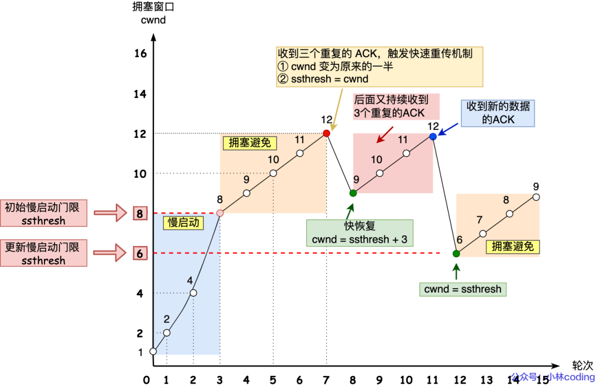
				- 也就是没有像「超时重传」一夜回到解放前，而是还在比较高的值，后续呈线性增长。
	- 哪些会影响[[TCP窗口]](💡或者说 TCP发送窗口`swnd`)大小？ #TCP #网络 #linux
	  id:: 68efd73c-46d7-46a9-a53b-a126fffd140b
		- TCP窗口大小受到多个因素的影响，包括以下几个方面：
			- 接收方窗口`rwnd`大小：接收方的窗口大小决定了发送方可以发送的数据量。如果接收方窗口较小，发送方需要等待确认后才能继续发送数据，从而限制了发送速率。
			- 带宽和延迟：网络的带宽和延迟会对TCP窗口大小产生影响。较高的带宽和较低的延迟通常可以支持较大的窗口大小，从而实现更高的数据传输速率。
			- 拥塞控制：TCP的拥塞控制机制会根据网络拥塞程度调整窗口大小。当网络出现拥塞时，TCP会减小窗口大小以降低发送速率，从而避免拥塞的进一步恶化。
			- 路由器和网络设备：路由器和其他网络设备的缓冲区大小也会对TCP窗口大小产生影响。如果缓冲区较小，可能导致数据包丢失或延迟增加，从而限制了窗口大小。
			- 操作系统和应用程序：操作系统和应用程序也可以对TCP窗口大小进行配置和调整。通过调整操作系统的参数或应用程序的设置，可以影响TCP窗口大小的默认值和动态调整的行为。
- 什么是[[拥塞窗口]]？和[[发送窗口]]有什么关系呢？ #小林coding [src](https://xiaolincoding.com/network/3_tcp/tcp_feature.html#%E6%8B%A5%E5%A1%9E%E6%8E%A7%E5%88%B6) #TCP
  id:: 65afde70-e392-4d3f-bad1-c6f627c43217
	- [[TCP窗口]]的定义
	  id:: 65afe0a5-ffc9-4d76-b0b2-6fd574ebc28a
		- 我们都知道 TCP 是每发送一个数据，都要进行一次确认应答。当上一个数据包收到了应答了， 再发送下一个。这个模式就有点像我和你面对面聊天，你一句我一句。但这种方式的缺点是效率比较低的。所以，这样的传输方式有一个缺点：数据包的**往返时间越长，通信的效率就越低**。
		- 为解决这个问题，TCP 引入了**窗口**这个概念。即使在往返时间较长的情况下，它也不会降低网络通信的效率。那么有了窗口，就可以指定窗口大小，窗口大小就是指**无需等待确认应答，而可以继续发送数据的最大值**。
			- 💡TCP窗口的核心是窗口大小，窗口大小的定义明显是针对发送方的。可以将 TCP窗口大小等价于TCP发送窗口大小`swnd`
		- 窗口的实现实际上是操作系统开辟的一个缓存空间，发送方主机在等到确认应答返回之前，必须在缓冲区中保留已发送的数据。如果按期收到确认应答，此时数据就可以从缓存区清除。
		- TCP 头里有一个字段叫 `Window`，也就是窗口大小。**这个字段是接收端告诉发送端自己还有多少缓冲区可以接收数据。于是发送端就可以根据这个接收端的处理能力来发送数据，而不会导致接收端处理不过来。**
		- 所以，通常窗口的大小是由接收方的窗口大小来决定的。发送方发送的数据大小不能超过接收方的窗口大小，否则接收方就无法正常接收到数据。
	- **拥塞窗口 cwnd**是发送方维护的一个的状态变量，它会根据**网络的拥塞程度动态变化的**。
	- 我们在前面提到过发送窗口 `swnd` 和接收窗口 `rwnd` 是约等于的关系，那么由于加入了拥塞窗口的概念后，此时发送窗口的值是swnd = min(cwnd, rwnd)，也就是拥塞窗口和接收窗口中的最小值。