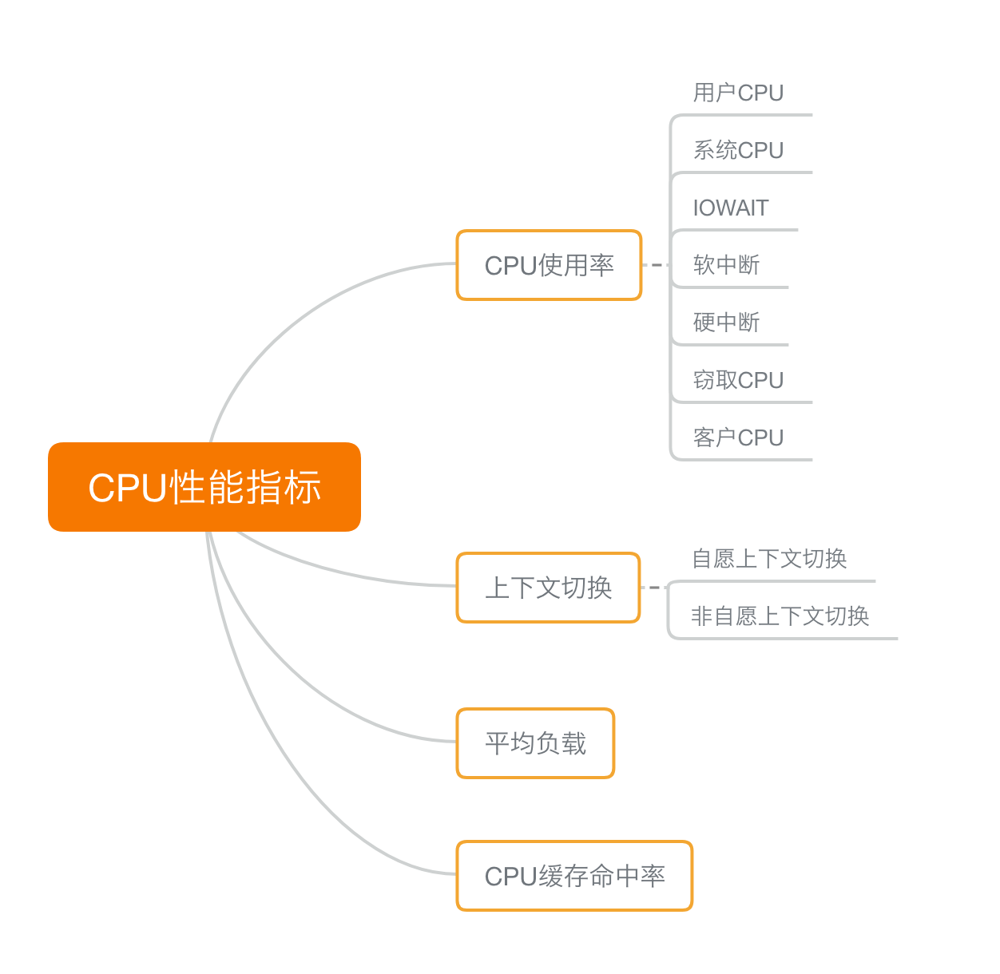
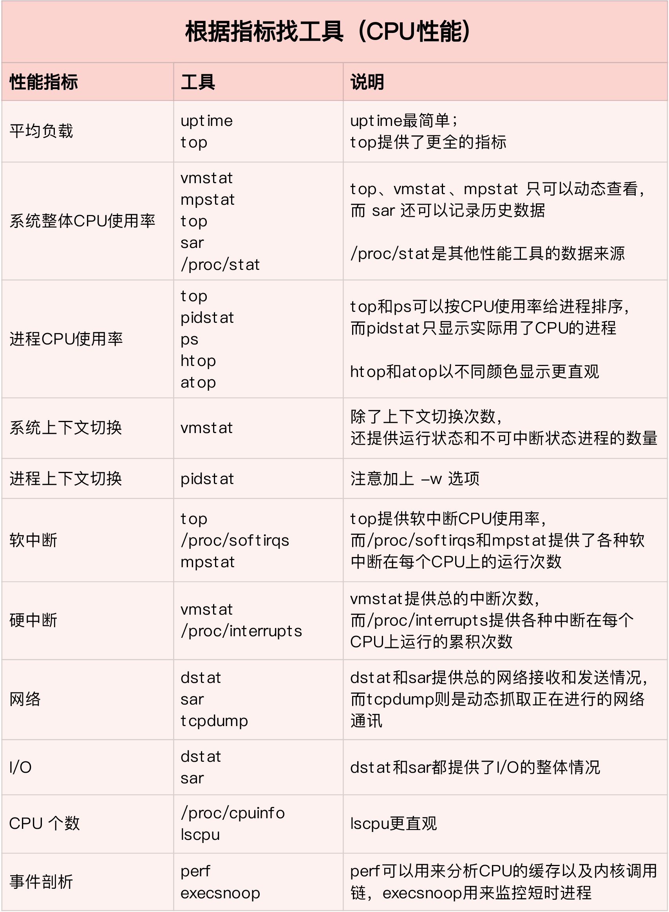
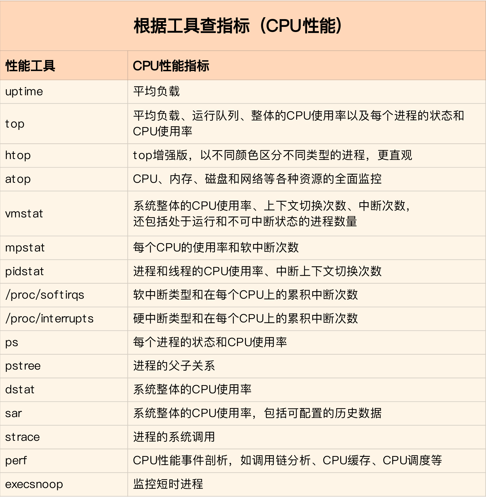
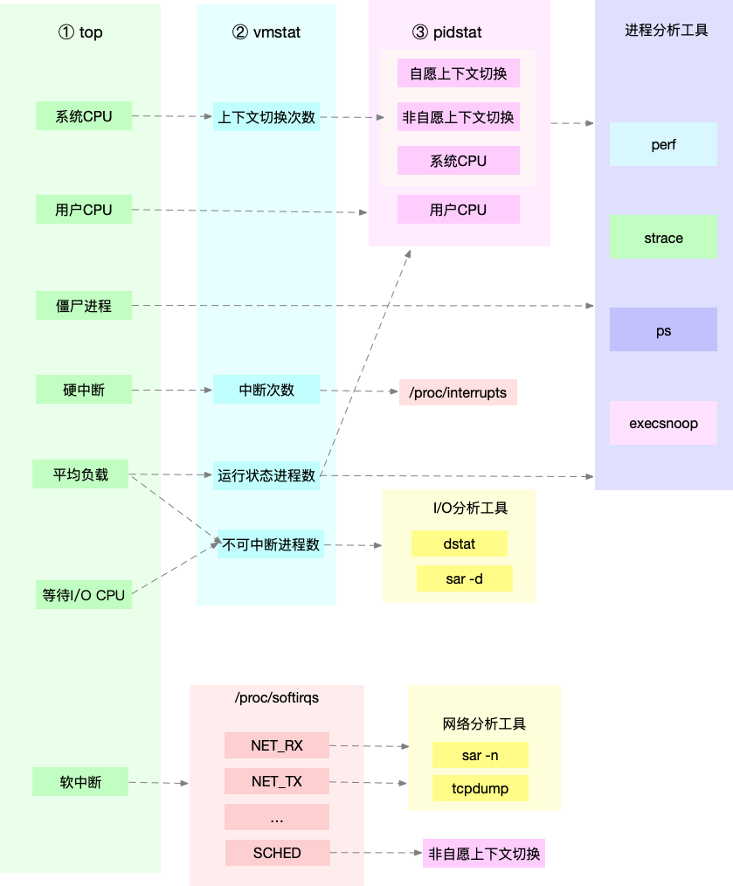

- 08 | 案例篇：系统中出现大量不可中断进程和僵尸进程怎么办？（下）[src](https://portal.learn.woa.com/training/mooc/taskDetail?mooc_course_id=A9BWP7o7&task_id=81434) #《Linux性能优化实战》 》
	- [[pidstat]] 加上 -d 参数，输出 I/O 使用情况
		- ```bash
		  # -d 展示 I/O 统计数据，-p 指定进程号，间隔 1 秒输出 3 组数据
		  $ pidstat -d -p 4344 1 3
		  06:38:50      UID       PID   kB_rd/s   kB_wr/s kB_ccwr/s iodelay  Command
		  06:38:51        0      4344      0.00      0.00      0.00       0  app
		  06:38:52        0      4344      0.00      0.00      0.00       0  app
		  06:38:53        0      4344      0.00      0.00      0.00       0  app
		  
		  ```
	- [[iowait]]问题定位
		- [[top]]和[[dstat]]发现系统iowait过高->[[top]]找到[D状态](((6579609a-a063-450a-aba7-03991f4f5abd)))进程->找到[[pidstat]]发现io繁忙->[[strace]]找到系统调用/[[perf]] record找到进程展开调用关系找到系统调用
	- [[僵尸进程]]问题定位
		- 僵尸进程是因为父进程没有回收子进程的资源而出现的，那么，要解决掉它们，就要找出父进程，然后在父进程里解决
		- [[pstree]]命令
			- ```bash
			  # -a 表示输出命令行选项
			  # p表PID
			  # s表示指定进程的父进程
			  $ pstree -aps 3084
			  systemd,1
			    └─dockerd,15006 -H fd://
			        └─docker-containe,15024 --config /var/run/docker/containerd/containerd.toml
			            └─docker-containe,3991 -namespace moby -workdir...
			                └─app,4009
			                    └─(app,3084)
			  
			  ```
		- 查看父进程的代码，看看子进程结束的处理是否正确，比如有没有调用 wait() 或 waitpid() ，抑或是，有没有注册 SIGCHLD 信号的处理函数
			- ```c
			  int status = 0;
			    for (;;) { // 死循环
			      for (int i = 0; i < 2; i++) {
			        if(fork()== 0) {
			          sub_process();
			        }
			      }
			      sleep(5);
			    }
			  
			    while(wait(&status)>0); // wait没有被执行到
			  
			  ```
- 09 | 基础篇：怎么理解Linux软中断？ [src](https://portal.learn.woa.com/training/mooc/taskDetail?mooc_course_id=A9BWP7o7&task_id=81435) #《Linux性能优化实战》
	- 中断其实是一种异步的事件处理机制，可以提高系统的并发处理能力。
	  由于中断处理程序会打断其他进程的运行，所以，**为了减少对正常进程运行调度的影响，中断处理程序就需要尽可能快地运行**。
	  特别是，**中断处理程序在响应中断时，还会临时关闭中断**。这就会导致上一次中断处理完成之前，其他中断都不能响应，也就是说中断有可能会丢失。
	- Linux 将中断处理过程分成了两个阶段，也就是**上半部和下半部**：
		- 【硬中断】**上半部用来快速处理中断**，它在中断禁止模式下运行，主要处理跟硬件紧密相关的或时间敏感的工作。
			- 上半部会打断 CPU 正在执行的任务，然后立即执行中断处理程序
		- 【属于软中断】**下半部用来延迟处理上半部未完成的工作，通常以内核线程的方式运行**。
			- 下半部以内核线程的方式执行，并且每个 CPU 都对应一个软中断内核线程，名字为 “ksoftirqd/CPU 编号”，比如说， 0 号 CPU 对应的软中断内核线程的名字就是 ksoftirqd/0
		- 软中断不只包括了刚刚所讲的硬件设备中断处理程序的下半部，一些内核自定义的事件也属于软中断，比如内核调度和 RCU 锁（Read-Copy Update 的缩写，RCU 是 Linux 内核中最常用的锁之一）等
	- /proc/softirqs 提供了软中断的运行情况；查看各种类型软中断在不同 CPU 上的累积运行次数。
	- /proc/interrupts 提供了硬中断的运行情况。
- 10 | 案例篇：系统的软中断CPU使用率升高，我该怎么办？ [src](https://portal.learn.woa.com/training/mooc/taskDetail?mooc_course_id=A9BWP7o7&task_id=81436) #《Linux性能优化实战》
	- 网络问题定位[[常用工具]]
		- [[sar]] 是一个系统活动报告工具，既可以实时查看系统的当前活动，又可以配置保存和报告历史统计数据。
			- 可以用来查看系统的网络收发情况，还有一个好处是，不仅可以观察网络收发的吞吐量（BPS，每秒收发的字节数），还可以观察网络收发的 PPS，即每秒收发的网络帧数。
			- ```bash
			  # -n DEV 表示显示网络收发的报告，间隔1秒输出一组数据
			  $ sar -n DEV 1
			  15:03:46        IFACE   rxpck/s   txpck/s    rxkB/s    txkB/s   rxcmp/s   txcmp/s  rxmcst/s   %ifutil
			  15:03:47         eth0  12607.00   6304.00    664.86    358.11      0.00      0.00      0.00      0.01
			  15:03:47      docker0   6302.00  12604.00    270.79    664.66      0.00      0.00      0.00      0.00
			  15:03:47           lo      0.00      0.00      0.00      0.00      0.00      0.00      0.00      0.00
			  15:03:47    veth9f6bbcd   6302.00  12604.00    356.95    664.66      0.00      0.00      0.00      0.05
			  
			  ```
		- [[hping3]] 是一个可以构造 TCP/IP 协议数据包的工具，可以对系统进行安全审计、防火墙测试等。
			- 运行 hping3 命令，来模拟 Nginx 的客户端请求(SYN FLOOD 攻击)
				- ```bash
				  # -S参数表示设置TCP协议的SYN（同步序列号），-p表示目的端口为80
				  # -i u100表示每隔100微秒发送一个网络帧
				  # 注：如果你在实践过程中现象不明显，可以尝试把100调小，比如调成10甚至1
				  $ hping3 -S -p 80 -i u100 192.168.0.30
				  ```
		- [[tcpdump]] 是一个常用的网络抓包工具，常用来分析各种网络问题。
			- 通过 -i eth0 选项指定网卡 eth0，并通过 tcp port 80 选项指定 TCP 协议的 80 端口
				- ```bash
				  # -i eth0 只抓取eth0网卡，-n不解析协议名和主机名
				  # tcp port 80表示只抓取tcp协议并且端口号为80的网络帧
				  $ tcpdump -i eth0 -n tcp port 80
				  15:11:32.678966 IP 192.168.0.2.18238 > 192.168.0.30.80: Flags [S], seq 458303614, win 512, length 0
				  ...
				  ```
				- Flags [S] 表示这是一个 SYN 包
	- [[SYN FLOOD]]攻击->shell都很慢，但是cpu负载很低、cpu使用率很低但是都用在了软中断(si)上->软中断有点可疑->`watch -d cat /proc/softirqs`监控软中断变化->[[sar]] 发现接收的 PPS 比较大，而接收的 BPS 却很小->[[tcpdump]]找到发送SYN的ip
- 11 | 套路篇：如何迅速分析出系统CPU的瓶颈在哪里？[src](https://portal.learn.woa.com/training/mooc/taskDetail?mooc_course_id=A9BWP7o7&task_id=81437) #《Linux性能优化实战》
	- CPU 性能指标 #card
		- 
	- CPU性能问题定位[[常用工具]] #card
		- #dstat #vmstat #mpstat #pidstat #sar #execsnoop #perf #top #uptime #tcpdump #pstree
		  
		  
	- 分析 CPU 的性能瓶颈套路 #card
		- 为了**缩小排查范围，我通常会先运行几个支持指标较多的工具，如 [[top]]、[[vmstat]] 和 [[pidstat]]**
		- 
	- 系统优化CPU 的运行 #card
		- 优化方向
			- 一方面要充分利用 CPU 缓存的本地性，加速缓存访问
			- 另一方面，就是要控制进程的 CPU 使用情况，减少进程间的相互影响
		- **CPU 绑定**：把进程绑定到一个或者多个 CPU 上，可以提高 CPU 缓存的命中率，减少跨 CPU 调度带来的上下文切换问题。
		- **CPU 独占**：跟 CPU 绑定类似，进一步将 CPU 分组，并通过 CPU 亲和性机制为其分配进程。这样，这些 CPU 就由指定的进程独占，换句话说，不允许其他进程再来使用这些 CPU。
		- **优先级调整**：使用 nice 调整进程的优先级，正值调低优先级，负值调高优先级。优先级的数值含义前面我们提到过，忘了的话及时复习一下。在这里，适当降低非核心应用的优先级，增高核心应用的优先级，可以确保核心应用得到优先处理。
		- **为进程设置资源限制**：使用 Linux cgroups  来设置进程的 CPU 使用上限，可以防止由于某个应用自身的问题，而耗尽系统资源。
		- **NUMA（Non-Uniform Memory Access）优化**：支持 NUMA 的处理器会被划分为多个 node，每个 node 都有自己的本地内存空间。NUMA 优化，其实就是让 CPU 尽可能只访问本地内存。
		- **中断负载均衡**：无论是软中断还是硬中断，它们的中断处理程序都可能会耗费大量的 CPU。开启 irqbalance 服务或者配置 smp_affinity，就可以把中断处理过程自动负载均衡到多个 CPU 上。
		-
		-
-
-
-
-
-