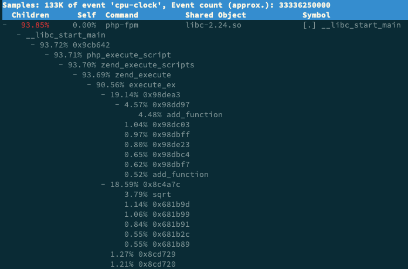

- 08 | 案例篇：系统中出现大量不可中断进程和僵尸进程怎么办？（下）[src](https://portal.learn.woa.com/training/mooc/taskDetail?mooc_course_id=A9BWP7o7&task_id=81434) #《Linux性能优化实战》 》
	- [[pidstat]] 加上 -d 参数，输出 I/O 使用情况
		- ```bash
		  # -d 展示 I/O 统计数据，-p 指定进程号，间隔 1 秒输出 3 组数据
		  $ pidstat -d -p 4344 1 3
		  06:38:50      UID       PID   kB_rd/s   kB_wr/s kB_ccwr/s iodelay  Command
		  06:38:51        0      4344      0.00      0.00      0.00       0  app
		  06:38:52        0      4344      0.00      0.00      0.00       0  app
		  06:38:53        0      4344      0.00      0.00      0.00       0  app
		  ```
	- [[iowait]]问题定位 #card
	  id:: 65b9c535-8ab4-42a7-89f3-b60958ba373d
		- [[top]]和[[dstat]]发现系统iowait过高->[[top]]找到[D状态](((6579609a-a063-450a-aba7-03991f4f5abd)))进程->找到[[pidstat]]发现io繁忙->[[strace]]找到系统调用/[[perf]] record找到进程展开调用关系找到系统调用
	- [[僵尸进程]]问题定位
		- 僵尸进程是因为父进程没有回收子进程的资源而出现的，那么，要解决掉它们，就要找出父进程，然后在父进程里解决
		- [[pstree]]命令
			- ```bash
			  # -a 表示输出命令行选项
			  # p表PID
			  # s表示指定进程的父进程
			  $ pstree -aps 3084
			  systemd,1
			    └─dockerd,15006 -H fd://
			        └─docker-containe,15024 --config /var/run/docker/containerd/containerd.toml
			            └─docker-containe,3991 -namespace moby -workdir...
			                └─app,4009
			                    └─(app,3084)
			  
			  ```
		- 查看父进程的代码，看看子进程结束的处理是否正确，比如有没有调用 wait() 或 waitpid() ，抑或是，有没有注册 SIGCHLD 信号的处理函数
			- ```c
			  int status = 0;
			    for (;;) { // 死循环
			      for (int i = 0; i < 2; i++) {
			        if(fork()== 0) {
			          sub_process();
			        }
			      }
			      sleep(5);
			    }
			  
			    while(wait(&status)>0); // wait没有被执行到
			  
			  ```
- 09 | 基础篇：怎么理解Linux软中断？ [src](https://portal.learn.woa.com/training/mooc/taskDetail?mooc_course_id=A9BWP7o7&task_id=81435) #《Linux性能优化实战》
	- 中断其实是一种异步的事件处理机制，可以提高系统的并发处理能力。
	  由于中断处理程序会打断其他进程的运行，所以，**为了减少对正常进程运行调度的影响，中断处理程序就需要尽可能快地运行**。
	  特别是，**中断处理程序在响应中断时，还会临时关闭中断**。这就会导致上一次中断处理完成之前，其他中断都不能响应，也就是说中断有可能会丢失。
	- Linux 将中断处理过程分成了两个阶段，也就是**上半部和下半部**：
		- 【硬中断】**上半部用来快速处理中断**，它在中断禁止模式下运行，主要处理跟硬件紧密相关的或时间敏感的工作。
			- 上半部会打断 CPU 正在执行的任务，然后立即执行中断处理程序
		- 【属于软中断】**下半部用来延迟处理上半部未完成的工作，通常以内核线程的方式运行**。
			- 下半部以内核线程的方式执行，并且每个 CPU 都对应一个软中断内核线程，名字为 “ksoftirqd/CPU 编号”，比如说， 0 号 CPU 对应的软中断内核线程的名字就是 ksoftirqd/0
		- 软中断不只包括了刚刚所讲的硬件设备中断处理程序的下半部，一些内核自定义的事件也属于软中断，比如内核调度和 RCU 锁（Read-Copy Update 的缩写，RCU 是 Linux 内核中最常用的锁之一）等
	- /proc/softirqs 提供了软中断的运行情况；查看各种类型软中断在不同 CPU 上的累积运行次数。
	- /proc/interrupts 提供了硬中断的运行情况。
- 10 | 案例篇：系统的软中断CPU使用率升高，我该怎么办？ [src](https://portal.learn.woa.com/training/mooc/taskDetail?mooc_course_id=A9BWP7o7&task_id=81436) #《Linux性能优化实战》
	- 网络问题定位[[常用工具]]
		- [[sar]] 是一个系统活动报告工具，既可以实时查看系统的当前活动，又可以配置保存和报告历史统计数据。
			- 可以用来查看系统的网络收发情况，还有一个好处是，不仅可以观察网络收发的吞吐量（BPS，每秒收发的字节数），还可以观察网络收发的 PPS，即每秒收发的网络帧数。
			- ```bash
			  # -n DEV 表示显示网络收发的报告，间隔1秒输出一组数据
			  $ sar -n DEV 1
			  15:03:46        IFACE   rxpck/s   txpck/s    rxkB/s    txkB/s   rxcmp/s   txcmp/s  rxmcst/s   %ifutil
			  15:03:47         eth0  12607.00   6304.00    664.86    358.11      0.00      0.00      0.00      0.01
			  15:03:47      docker0   6302.00  12604.00    270.79    664.66      0.00      0.00      0.00      0.00
			  15:03:47           lo      0.00      0.00      0.00      0.00      0.00      0.00      0.00      0.00
			  15:03:47    veth9f6bbcd   6302.00  12604.00    356.95    664.66      0.00      0.00      0.00      0.05
			  
			  ```
		- [[hping3]] 是一个可以构造 TCP/IP 协议数据包的工具，可以对系统进行安全审计、防火墙测试等。
			- 运行 hping3 命令，来模拟 Nginx 的客户端请求(SYN FLOOD 攻击)
				- ```bash
				  # -S参数表示设置TCP协议的SYN（同步序列号），-p表示目的端口为80
				  # -i u100表示每隔100微秒发送一个网络帧
				  # 注：如果你在实践过程中现象不明显，可以尝试把100调小，比如调成10甚至1
				  $ hping3 -S -p 80 -i u100 192.168.0.30
				  ```
		- [[tcpdump]] 是一个常用的网络抓包工具，常用来分析各种网络问题。
			- 通过 -i eth0 选项指定网卡 eth0，并通过 tcp port 80 选项指定 TCP 协议的 80 端口
				- ```bash
				  # -i eth0 只抓取eth0网卡，-n不解析协议名和主机名
				  # tcp port 80表示只抓取tcp协议并且端口号为80的网络帧
				  $ tcpdump -i eth0 -n tcp port 80
				  15:11:32.678966 IP 192.168.0.2.18238 > 192.168.0.30.80: Flags [S], seq 458303614, win 512, length 0
				  ...
				  ```
				- Flags [S] 表示这是一个 SYN 包
	- [[SYN FLOOD]]攻击->shell都很慢，但是cpu负载很低、cpu使用率很低但是都用在了软中断(si)上->软中断有点可疑->`watch -d cat /proc/softirqs`监控软中断变化->[[sar]] 发现接收的 PPS 比较大，而接收的 BPS 却很小->[[tcpdump]]找到发送SYN的ip
- 11 | 套路篇：如何迅速分析出系统CPU的瓶颈在哪里？[src](https://portal.learn.woa.com/training/mooc/taskDetail?mooc_course_id=A9BWP7o7&task_id=81437) #《Linux性能优化实战》
	- CPU 性能指标 #card
	  id:: 65b9c535-4414-47c7-afcb-dbc49f70bdbd
		- 
	- CPU性能问题定位[[常用工具]] #card
	  id:: 65b9c535-f5fe-4ce8-87a2-0a9071dbb162
		- #dstat #vmstat #mpstat #pidstat #sar #execsnoop #perf #top #uptime #tcpdump #pstree
		  
		  
	- 分析 CPU 的性能瓶颈套路 #card
	  id:: 65b9c535-16eb-4140-83a9-63bf530b1a07
		- 为了**缩小排查范围，我通常会先运行几个支持指标较多的工具，如 [[top]]、[[vmstat]] 和 [[pidstat]]**
		- 
	- 系统优化CPU 的运行 #card
	  id:: 65b9c535-f2e4-4536-aef7-027996f02c3f
		- 优化方向
			- 一方面要充分利用 CPU 缓存的本地性，加速缓存访问
			- 另一方面，就是要控制进程的 CPU 使用情况，减少进程间的相互影响
		- **CPU 绑定**：把进程绑定到一个或者多个 CPU 上，可以提高 CPU 缓存的命中率，减少跨 CPU 调度带来的上下文切换问题。
		- **CPU 独占**：跟 CPU 绑定类似，进一步将 CPU 分组，并通过 CPU 亲和性机制为其分配进程。这样，这些 CPU 就由指定的进程独占，换句话说，不允许其他进程再来使用这些 CPU。
		- **优先级调整**：使用 nice 调整进程的优先级，正值调低优先级，负值调高优先级。优先级的数值含义前面我们提到过，忘了的话及时复习一下。在这里，适当降低非核心应用的优先级，增高核心应用的优先级，可以确保核心应用得到优先处理。
		- **为进程设置资源限制**：使用 Linux cgroups  来设置进程的 CPU 使用上限，可以防止由于某个应用自身的问题，而耗尽系统资源。
		- **NUMA（Non-Uniform Memory Access）优化**：支持 NUMA 的处理器会被划分为多个 node，每个 node 都有自己的本地内存空间。NUMA 优化，其实就是让 CPU 尽可能只访问本地内存。
		- **中断负载均衡**：无论是软中断还是硬中断，它们的中断处理程序都可能会耗费大量的 CPU。开启 irqbalance 服务或者配置 smp_affinity，就可以把中断处理过程自动负载均衡到多个 CPU 上。
		-
		-
- 13 | 答疑（一）：无法模拟出 RES 中断的问题，怎么办？[src](https://portal.learn.woa.com/training/mooc/taskDetail?mooc_course_id=A9BWP7o7&task_id=81439) #《Linux性能优化实战》
	- [[pidstat ]]输出里有一个 %wait 指标，代表进程等待 CPU 的时间百分比，这是 [[systat ]]11.5.5 版本才引入的新指标，旧版本没有这一项。而 CentOS 软件库里的 sysstat 版本刚好比这个低，所以没有这项指标。可以从**proc 文件系统**里查看。
	- 使用 stress 无法模拟 iowait 升高，但是却看到了 sys 升高。这是因为案例中 的 stress -i 参数，它表示通过系统调用 sync() 来模拟 I/O 的问题，但这种方法实际上并不可靠。
		- 因为 sync() 的本意是刷新内存缓冲区的数据到磁盘中，以确保同步。如果缓冲区内本来就没多少数据，那读写到磁盘中的数据也就不多，也就没法产生 I/O 压力。这一点，在使用 SSD 磁盘的环境中尤为明显，很可能你的 iowait 总是 0，却单纯因为大量的系统调用，导致了系统 CPU 使用率 sys 升高。
		- 这种情况，推荐使用 [[stress-ng]] 来代替 [[stress]]
		  ```bash
		  # -i的含义还是调用sync，而—hdd则表示读写临时文件
		  $ stress-ng -i 1 --hdd 1 --timeout 600
		  ```
	- 有些同学会拿 [[pidstat]] 中的 %wait 跟 [[top]] 中的 iowait% （缩写为 wa）对比，其实这是没有意义的，因为它们是完全不相关的两个指标。 #card
	  id:: 65b9c535-15b4-466a-9e7e-3ad0b1292c7a
		- pidstat 中， %wait 表示进程等待 CPU 的时间百分比。等待 CPU 的进程已经在 CPU 的就绪队列中，处于运行状态。
		- top 中 ，iowait% 则表示等待 I/O 的 CPU 时间百分比。等待 I/O 的进程则处于不可中断状态。
	- 性能工具（如 vmstat）输出中，第一行数据跟其他行差别巨大
		- **在碰到直观上解释不了的现象时，要第一时间去查命令手册**。
		- man vmstat 命令：第一行数据是系统启动以来的平均值，其他行才是你在运行 vmstat 命令时，设置的间隔时间的平均值。另外，进程和内存的报告内容都是即时数值。
- 14 | 答疑（二）：如何用perf工具分析Java程序？  [src](https://portal.learn.woa.com/training/mooc/taskDetail?mooc_course_id=A9BWP7o7&task_id=81440) #《Linux性能优化实战》
	- 在 CentOS 系统中，使用 [[perf]] 工具看不到函数名，只能看到一些 16 进制格式的函数地址。
		- perf 界面最下面的那一行，就会发现一个警告信息：
		  ```
		  Failed to open /opt/bitnami/php/lib/php/extensions/opcache.so, continuing without symbols
		  ```
		- 这说明，perf 找不到待分析进程依赖的库。当然，实际上这个案例中有很多依赖库都找不到，只不过，perf 工具本身只在最后一行显示警告信息，所以你只能看到这一条警告。
		- 这个问题，其实也是在分析 Docker 容器应用时，我们经常碰到的一个问题，因为容器应用依赖的库都在镜像里面。
		- **解决方法**
			- **第一个方法，在容器外面构建相同路径的依赖库**。
				- 这种方法从原理上可行，但是我并不推荐，一方面是因为找出这些依赖库比较麻烦，更重要的是，构建这些路径，会污染容器主机的环境。
			- **第二个方法，在容器内部运行 perf**。
				- 不过，这需要容器运行在特权模式下，但实际的应用程序往往只以普通容器的方式运行。所以，容器内部一般没有权限执行 perf 分析。
				  比方说，如果你在普通容器内部运行 perf record ，你将会看到下面这个错误提示：
				  ```
				  $ perf_4.9 record -a -gperf_event_open(..., PERF_FLAG_FD_CLOEXEC) failed with unexpected error 1 (Operation not permitted)perf_event_open(..., 0) failed unexpectedly with error 1 (Operation not permitted)
				  ```
				  当然，其实你还可以通过配置 /proc/sys/kernel/perf_event_paranoid （比如改成 -1），来允许非特权用户执行 perf 事件分析。
				  不过还是那句话，为了安全起见，这种方法也不推荐。
			- **第三个方法，指定符号路径为容器文件系统的路径**。
				- 比如对于第 05 讲的应用，你可以执行下面这个命令：
				  ```
				  $ mkdir /tmp/foo
				  $ PID=$(docker inspect --format {{.State.Pid}} phpfpm)
				  $ bindfs /proc/$PID/root /tmp/foo
				  $ perf report --symfs /tmp/foo
				  
				  # 使用完成后不要忘记解除绑定
				  $ umount /tmp/foo/
				  ```
				  不过这里要注意，bindfs 这个工具需要你额外安装。bindfs 的基本功能是实现目录绑定（类似于 mount --bind），这里需要你安装的是 1.13.10 版本（这也是它的最新发布版）。
				  
				  如果你安装的是旧版本，你可以到 [GitHub](https://github.com/mpartel/bindfs)上面下载源码，然后编译安装。
			- **第四个方法，在容器外面把分析纪录保存下来，再去容器里查看结果**。
				- 这样，库和符号的路径也就都对了。
				  比如，你可以这么做。先运行 perf record -g -p < pid>，执行一会儿（比如 15 秒）后，按 Ctrl+C 停止。
				  然后，把生成的 perf.data 文件，拷贝到容器里面来分析：
				  ```
				  $ docker cp perf.data phpfpm:/tmp 
				  $ docker exec -i -t phpfpm bash
				  ```
				  接下来，在容器的 bash 中继续运行下面的命令，安装 perf 并使用 perf report 查看报告：
				  ```
				  $ cd /tmp/ 
				  $ apt-get update && apt-get install -y linux-tools linux-perf procps
				  $ perf_4.9 report
				  ```
				- 不过，这里也有两点需要你注意。
				  首先是 perf 工具的版本问题。在最后一步中，我们运行的工具是容器内部安装的版本 perf_4.9，而不是普通的 perf 命令。这是因为， perf 命令实际上是一个软连接，会跟内核的版本进行匹配，但镜像里安装的 perf 版本跟虚拟机的内核版本有可能并不一致。
				  另外，php-fpm 镜像是基于 Debian 系统的，所以安装 perf 工具的命令，跟 Ubuntu 也并不完全一样。比如， Ubuntu 上的安装方法是下面这样：
				  ```
				  $ apt-get install -y linux-tools-common linux-tools-generic linux-tools-$(uname -r)）
				  ```
				  而在 php-fpm 容器里，你应该执行下面的命令来安装 perf：
				  ```
				  $ apt-get install -y linux-perf
				  ```
				  当你按照前面这几种方法操作后，你就可以在容器内部看到 sqrt 的堆栈：
				  
			- 事实上，抛开我们的案例来说，即使是在非容器化的应用中，你也可能会碰到这个问题。假如你的应用程序在编译时，使用 strip 删除了 ELF 二进制文件的符号表，那么你同样也只能看到函数的地址。
			  现在的磁盘空间，其实已经足够大了。保留这些符号，虽然会导致编译后的文件变大，但对整个磁盘空间来说已经不是什么大问题。所以为了调试的方便，建议你还是把它们保留着。
	- 如何用 [[perf]] 工具分析 Java 程序
		- 像是 Java 这种通过 JVM 来运行的应用程序，运行堆栈用的都是 JVM 内置的函数和堆栈管理。所以，从系统层面你只能看到 JVM 的函数堆栈，而不能直接得到 Java 应用程序的堆栈。
		- perf_events 实际上已经支持了 JIT，但还需要一个 /tmp/perf-PID.map 文件，来进行符号翻译。当然，开源项目 [perf-map-agent](https://github.com/jvm-profiling-tools/perf-map-agent)可以帮你生成这个符号表。
		- 此外，为了生成全部调用栈，你还需要开启 JDK 的选项 -XX:+PreserveFramePointer。因为这里涉及到大量的 Java 知识，我就不再详细展开了。如果你的应用刚好基于 Java ，那么你可以参考 Netflix 的技术博客 [Java in Flames](https://medium.com/netflix-techblog/java-in-flames-e763b3d32166) ，来查看详细的使用步骤。
	- 为什么 [[perf]] 的报告中，很多符号都不显示调用栈
		- 执行 man perf-report 命令，找到 -g 参数的说明
		- 堆栈显示不全，相关的参数当然就是最小阈值 threshold。通过手册中对 threshold 的说明，我们知道，当一个事件发生比例高于这个阈值时，它的调用栈才会显示出来。
		- threshold 的默认值为 0.5%，也就是说，事件比例超过 0.5% 时，调用栈才能被显示。再观察我们案例应用 app 的事件比例，只有 0.34%，低于 0.5%，所以看不到 app 的调用栈就很正常了。
		- 这种情况下，你只需要给 perf report 设置一个小于 0.34% 的阈值，就可以显示我们想看到的调用图了。比如执行下面的命令：
		  ```bash
		  $ perf report -g graph,0.3
		  ```
	- [[perf]] report 界面中，你也一定注意到了， swapper 高达 99% 的比例。直觉来说，我们应该直接观察它才对，为什么没那么做呢？
		- 其实，当你清楚了 swapper 的原理后，就很容易理解我们为什么可以忽略它了。
		- 看到 swapper，你可能首先想到的是 SWAP 分区。实际上， swapper 跟 SWAP 没有任何关系，它只在系统初始化时创建 init 进程，之后，它就成了一个最低优先级的空闲任务。也就是说，当 CPU 上没有其他任务运行时，就会执行 swapper 。所以，你可以称它为“空闲任务”。
		- 回到我们的问题，在 perf report 的界面中，展开它的调用栈，你会看到， swapper 时钟事件都耗费在了 do_idle 上，也就是在执行空闲任务。
		- 因为**在多任务系统中，次数多的事件，不一定就是性能瓶颈**。所以，只观察到一个大数值，并不能说明什么问题。具体有没有瓶颈，还需要你观测多个方面的多个指标，来交叉验证。这也是我在套路篇中不断强调的一点。
	- [[perf]] 这种动态追踪工具，会给系统带来一定的性能损失。
	- [[vmstat]]、[[pidstat]] 这些直接读取 proc 文件系统来获取指标的工具，不会带来性能损失。