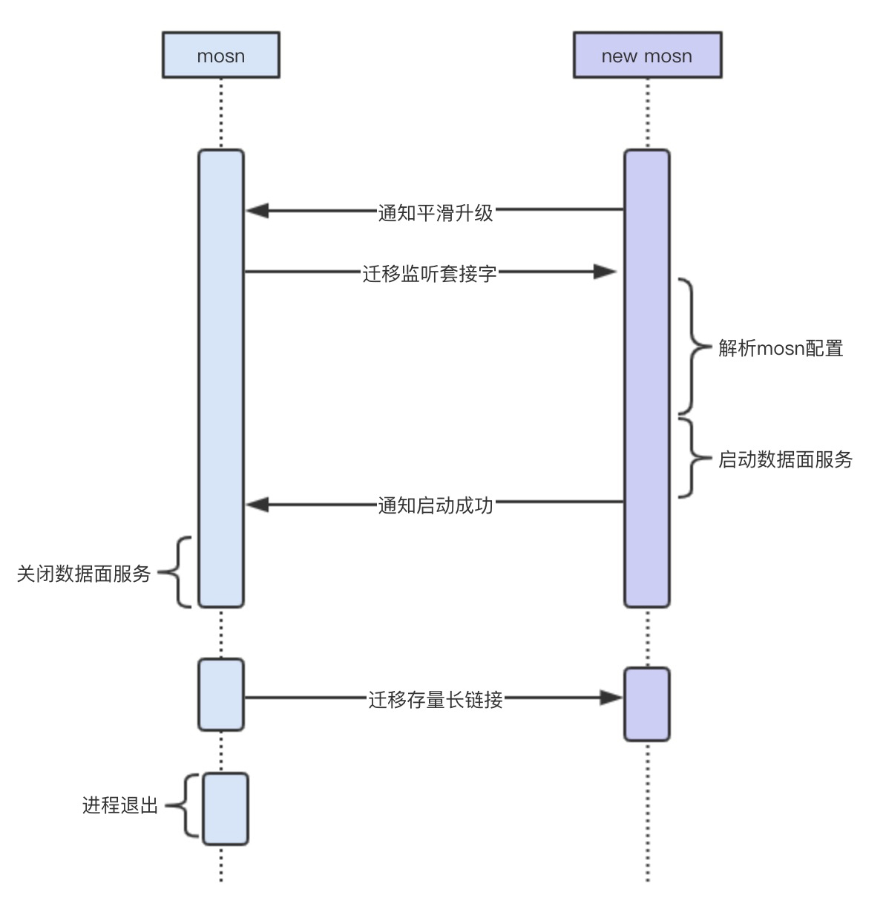

- [[mosn]] [[平滑升级]]原理解析 [src](https://mosn.io/docs/products/structure/smooth-upgrade/)
	- [[envoy]]不支持平滑升级
		- 为什么 Nginx 和 Envoy 不需要具备 MOSN 这样的连接无损迁移方案，主要还是跟业务场景相关，Nginx 和 Envoy 主要支持的是 HTTP1 和 HTTP2 协议，HTTP1使用 connection: Close，HTTP2 使用 Goaway Frame 都可以让 Client 端主动断链接，然后新建链接到新的 New process，但是针对 Dubbo、SOFA PRC 等常见的多路复用协议，它们是没有控制帧，Old process 的链接如果断了就会影响请求的。
	- 
- 网络流量[[常用工具]]：[[iftop]]
	- ```bash
	  # 只查看8087的流量
	  iftop -nNP -f 'port 8087'
	  ```