- 06 | 事件触发：各类eBPF程序的触发机制及其应用场景 [src](https://time.geekbang.org/column/article/483364) #《eBPF核心技术与实战》
	- eBPF 程序类型决定了一个 eBPF 程序可以挂载的事件类型和事件参数，这也就意味着，内核中不同事件会触发不同类型的 eBPF 程序
	- 根据内核头文件 include/uapi/linux/bpf.h 中 bpf_prog_type 的定义，Linux 内核 v5.13 已经支持 30 种不同类型的 eBPF 程序（注意， BPF_PROG_TYPE_UNSPEC表示未定义）
		- ```c
		  enum bpf_prog_type {
		    BPF_PROG_TYPE_UNSPEC, /* Reserve 0 as invalid program type */
		    BPF_PROG_TYPE_SOCKET_FILTER,
		    BPF_PROG_TYPE_KPROBE,
		    BPF_PROG_TYPE_SCHED_CLS,
		    BPF_PROG_TYPE_SCHED_ACT,
		    BPF_PROG_TYPE_TRACEPOINT,
		    BPF_PROG_TYPE_XDP,
		    BPF_PROG_TYPE_PERF_EVENT,
		    BPF_PROG_TYPE_CGROUP_SKB,
		    BPF_PROG_TYPE_CGROUP_SOCK,
		    BPF_PROG_TYPE_LWT_IN,
		    BPF_PROG_TYPE_LWT_OUT,
		    BPF_PROG_TYPE_LWT_XMIT,
		    BPF_PROG_TYPE_SOCK_OPS,
		    BPF_PROG_TYPE_SK_SKB,
		    BPF_PROG_TYPE_CGROUP_DEVICE,
		    BPF_PROG_TYPE_SK_MSG,
		    BPF_PROG_TYPE_RAW_TRACEPOINT,
		    BPF_PROG_TYPE_CGROUP_SOCK_ADDR,
		    BPF_PROG_TYPE_LWT_SEG6LOCAL,
		    BPF_PROG_TYPE_LIRC_MODE2,
		    BPF_PROG_TYPE_SK_REUSEPORT,
		    BPF_PROG_TYPE_FLOW_DISSECTOR,
		    BPF_PROG_TYPE_CGROUP_SYSCTL,
		    BPF_PROG_TYPE_RAW_TRACEPOINT_WRITABLE,
		    BPF_PROG_TYPE_CGROUP_SOCKOPT,
		    BPF_PROG_TYPE_TRACING,
		    BPF_PROG_TYPE_STRUCT_OPS,
		    BPF_PROG_TYPE_EXT,
		    BPF_PROG_TYPE_LSM,
		    BPF_PROG_TYPE_SK_LOOKUP,
		  };
		  ```
		- 通过执行命令 `bpftool feature probe | grep program_type` 可以查询当前系统支持的程序类型 #bpftool
		- 这些程序类型大致可以划分为三类：
			- 第一类是跟踪，即从内核和程序的运行状态中提取跟踪信息，来了解当前系统正在发生什么。
			- 第二类是网络，即对网络数据包进行过滤和处理，以便了解和控制网络数据包的收发过程。
			- 第三类是除跟踪和网络之外的其他类型，包括安全控制、BPF 扩展等等。
	- 并不是所有的辅助函数都可以在 eBPF 程序中随意使用，不同类型的 eBPF 程序所支持的辅助函数是不同的 #card
	  id:: 65ce4676-dfe8-4a72-a98d-29bdcf0ab230
	- 1. 跟踪类eBPF程序
		- 跟踪类 eBPF 程序主要用于从系统中提取跟踪信息，进而为监控、排错、性能优化等提供数据支撑。
		- 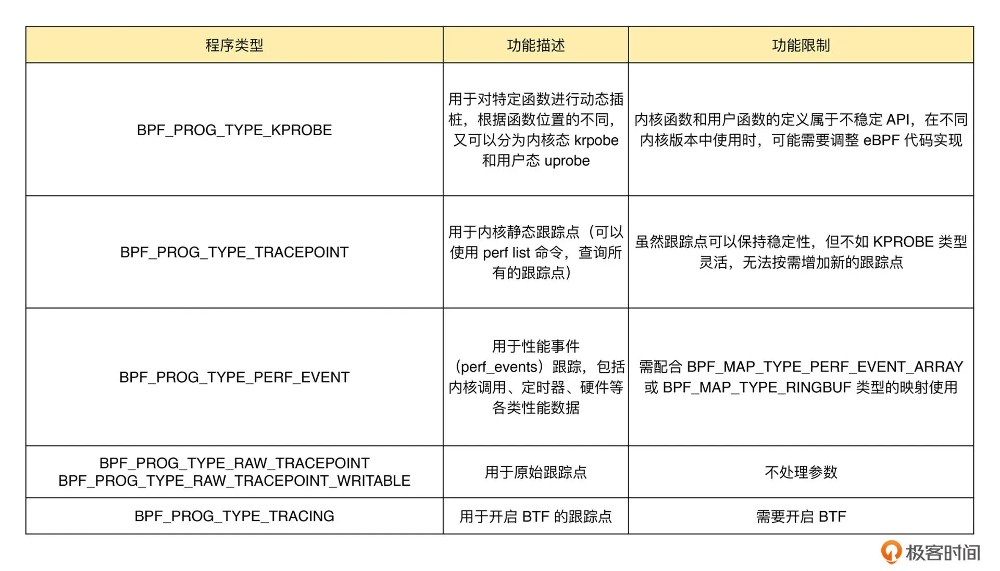
		  KPROBE、TRACEPOINT 以及 PERF_EVENT 都是最常用的 eBPF 程序类型，大量应用于监控跟踪、性能优化以及调试排错等场景中。我们前几讲中提到的 BCC工具集，其中包含的绝大部分工具也都属于这个类型。
	- collapsed:: true
	  2. 网络类 eBPF 程序
		- 网络类 eBPF 程序主要用于对网络数据包进行过滤和处理，进而实现网络的观测、过滤、流量控制以及性能优化等各种丰富的功能。
		- [[XDP]]（eXpress Data Path，高速数据路径）程序
		  collapsed:: true
			- BPF_PROG_TYPE_XDP，它在**网络驱动程序**刚刚收到数据包时触发执行。由于无需通过繁杂的内核网络协议栈，XDP 程序可用来实现高性能的网络处理方案，常用于 DDoS 防御、防火墙、4 层负载均衡等场景。
			- 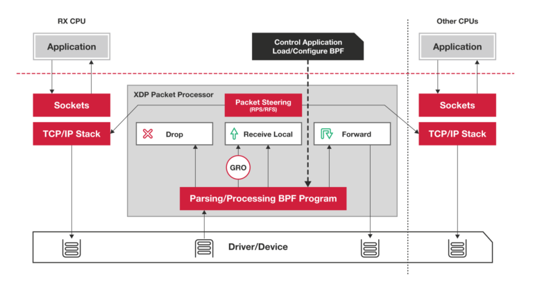
			- 根据网卡和网卡驱动是否原生支持 XDP 程序，XDP 运行模式可以分为下面这三种：
				- 通用模式。它不需要网卡和网卡驱动的支持，XDP 程序像常规的网络协议栈一样运行在内核中，性能相对较差，一般用于测试；
				- 原生模式。它需要网卡驱动程序的支持，XDP 程序在网卡驱动程序的早期路径运行；
				- 卸载模式。它需要网卡固件支持 XDP 卸载，XDP 程序直接运行在网卡上，而不再需要消耗主机的 CPU 资源，具有最好的性能。
			- 无论哪种模式，XDP 程序在处理过网络包之后，都需要根据 eBPF 程序执行结果，决定数据包的去处。这些执行结果对应以下 5 种 XDP 程序结果码： 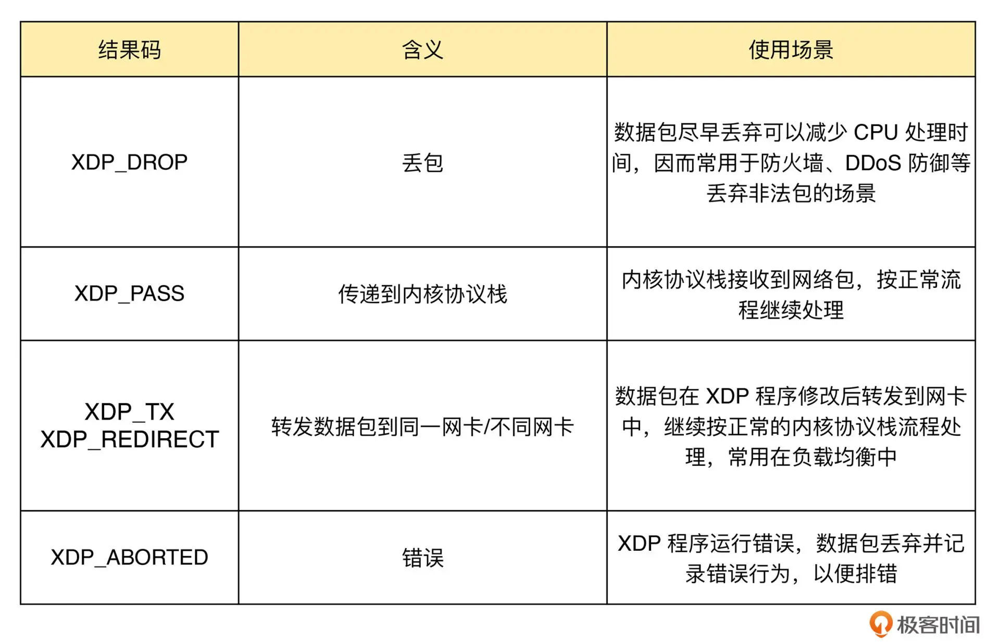
			- 通常来说，XDP 程序通过 ip link 命令加载到具体的网卡上，加载格式为：
			  ```bash
			  # eth1 为网卡名
			  # xdpgeneric 设置运行模式为通用模式
			  # xdp-example.o 为编译后的 XDP 字节码
			  sudo ip link set dev eth1 xdpgeneric object xdp-example.o
			  ```
			  而卸载 XDP 程序也是通过 ip link 命令，具体参数如下：
			  ```bash
			  sudo ip link set veth1 xdpgeneric off
			  ```
			  BCC也提供了库函数支持加载和卸载：
			  ```c
			  from bcc import BPF
			  
			  # 编译XDP程序
			  b = BPF(src_file="xdp-example.c")
			  fn = b.load_func("xdp-example", BPF.XDP)
			  
			  # 加载XDP程序到eth0网卡
			  device = "eth0"
			  b.attach_xdp(device, fn, 0)
			  
			  # 其他处理逻辑
			  ...
			  
			  # 卸载XDP程序
			  b.remove_xdp(device)
			  ```
		- [[TC]]（Traffic Control，流量控制）程序
		  id:: 663ae7dc-873a-413f-b1d9-ddacbb84cdfe
		  collapsed:: true
			- 类型定义为 BPF_PROG_TYPE_SCHED_CLS 和 BPF_PROG_TYPE_SCHED_ACT，分别作为 Linux 流量控制 的分类器和执行器。Linux 流量控制通过网卡队列、排队规则、分类器、过滤器以及执行器等，实现了对网络流量的整形调度和带宽控制。
				- 得益于内核 v4.4 引入的 [direct-action](https://docs.cilium.io/en/v1.8/bpf/#tc-traffic-control) 模式，TC 程序可以直接在一个程序内完成**分类**和**执行**的动作，而无需再调用其他的 TC 排队规则和分类器
			- 下图（图片来自 linux-ip.net）展示了  HTB（Hierarchical Token Bucket，层级令牌桶）流量控制的工作原理： 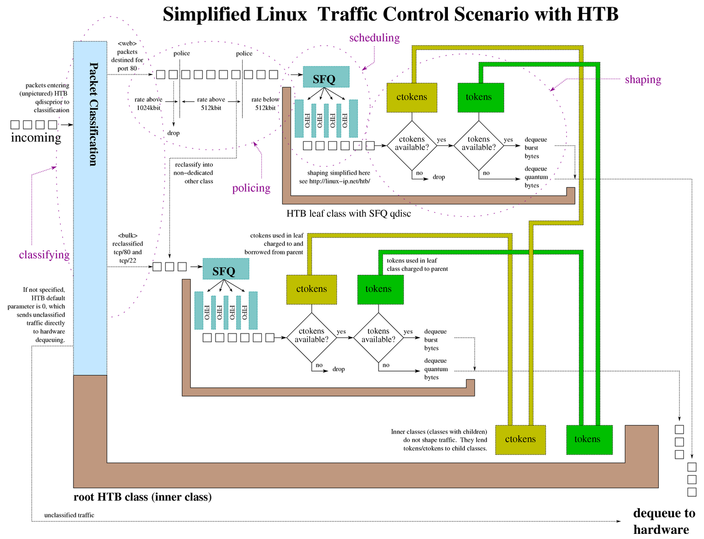
			- 同 XDP 程序相比，TC 程序可以**直接获取内核解析后的网络报文数据结构sk_buff**（XDP 则是 xdp_buff），**并且可在网卡的接收和发送两个方向上执行（XDP 则只能用于接收）**。 #card
			  id:: 65ce4676-819e-40bf-92bd-17bf63d4fa0b
			  card-last-interval:: -1
			  card-repeats:: 1
			  card-ease-factor:: 2.5
			  card-next-schedule:: 2025-03-23T16:00:00.000Z
			  card-last-reviewed:: 2025-03-22T19:49:32.853Z
			  card-last-score:: 1
			- 下面我们来具体看看  TC 程序的执行位置：
				- 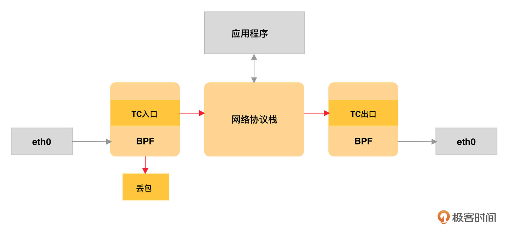
				- 对于接收的网络包，TC 程序在网卡接收（GRO）之后、协议栈处理（包括 IP 层处理和 iptables 等）之前执行；
				- 对于发送的网络包，TC 程序在协议栈处理（包括 IP 层处理和 iptables 等）之后、数据包发送到网卡队列（GSO）之前执行。
			- 由于 **TC 运行在内核协议栈**中，不需要网卡驱动程序做任何改动，因而可以挂载到任意类型的网卡设备（包括容器等使用的虚拟网卡）上。同 XDP 程序一样，TC eBPF 程序也可以通过 Linux 命令行工具来加载到网卡上，不过相应的工具要换成 tc。你可以通过下面的命令，分别加载接收和发送方向的 eBPF 程序：
			  ```BASH
			  # 创建 clsact 类型的排队规则
			  sudo tc qdisc add dev eth0 clsact
			  
			  # 加载接收方向的 eBPF 程序
			  sudo tc filter add dev eth0 ingress bpf da obj tc-example.o sec ingress
			  
			  # 加载发送方向的 eBPF 程序
			  sudo tc filter add dev eth0 egress bpf da obj tc-example.o sec egress
			  ```
		- 套接字程序
		  collapsed:: true
			- 套接字程序用于过滤、观测或重定向套接字网络包，具体的种类也比较丰富。根据类型的不同，套接字 eBPF 程序可以挂载到套接字（socket）、控制组（cgroup ）以及网络命名空间（netns）等各个位置。可以根据具体的应用场景，选择一个或组合多个类型的 eBPF 程序，去控制套接字的网络包收发过程。
			- 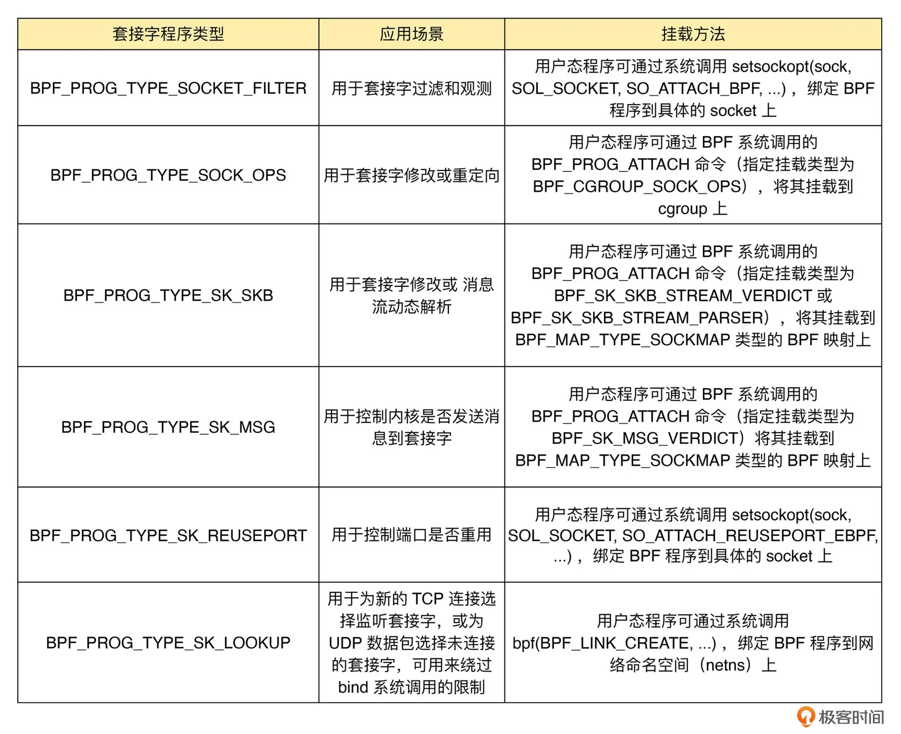
		- cgroup 程序
		  collapsed:: true
			- cgroup 程序用于对 cgroup 内所有进程的**网络过滤、套接字选项以及转发等**进行动态控制，它最典型的应用场景是对容器中运行的多个进程进行**网络控制**。
			- 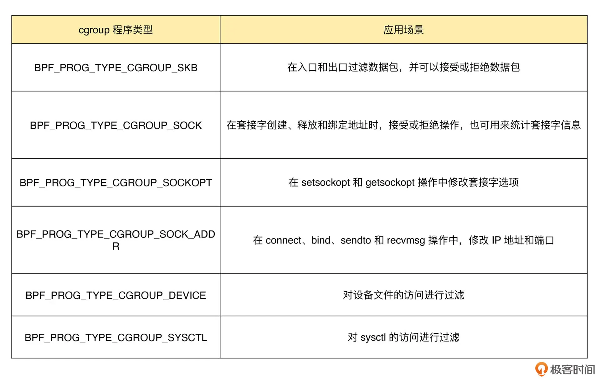
		- 这几类网络 eBPF 程序是在不同的事件触发时执行的，因此，在实际应用中我们通常可以把多个类型的 eBPF 程序结合起来，一起使用，来实现复杂的网络控制功能。比如，最流行的 Kubernetes 网络方案 [[Cilium]] 就大量使用了 XDP、TC 和套接字 eBPF 程序，如下图（图片来自 Cilium [官方文档](https://docs.cilium.io/en/v1.11/concepts/ebpf/lifeofapacket/)，图中黄色部分即为 Cilium eBPF 程序）所示： 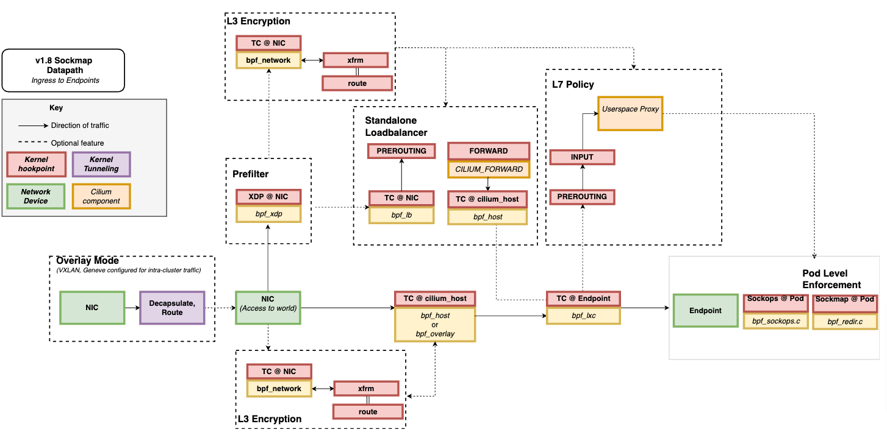
	- collapsed:: true
	  3. 其他类 eBPF 程序
		- 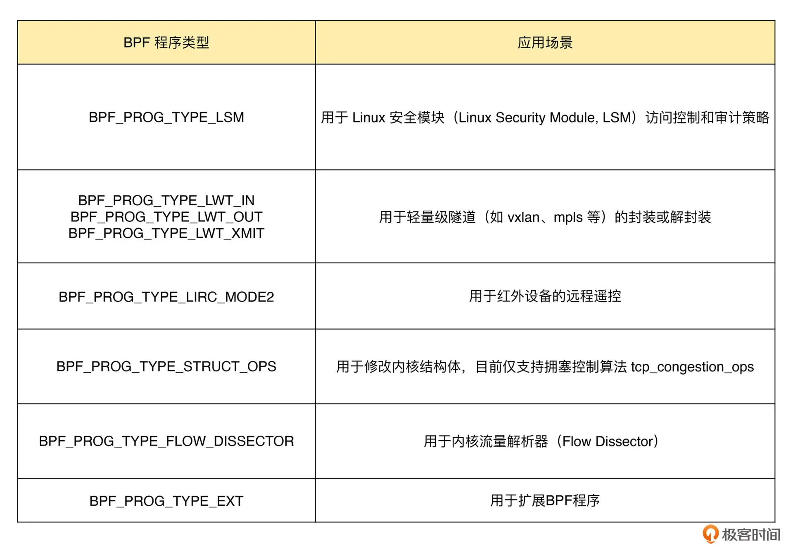
- 07 | 内核跟踪（上）：如何查询内核中的跟踪点？ [src](https://time.geekbang.org/column/article/484207) #《eBPF核心技术与实战》
	- KPROBE
		- 为了方便调试，内核把所有函数以及非栈变量的地址都抽取到了  `/proc/kallsyms`  中，这样调试器就可以根据地址找出对应的函数和变量名称。
		- 对内核插桩类的 eBPF 程序来说，它们要挂载的内核函数就可以从  `/proc/kallsyms`  这个文件中查到。
		- 这些符号表不仅包含了内核函数，还包含了非栈数据变量。而且，并不是所有的内核函数都是可跟踪的，只有显式导出的内核函数才可以被 eBPF 进行动态跟踪。因而，通常我们并不直接从内核符号表查询可跟踪点
	- [[TRACEPOINT]]
		- 为了方便内核开发者获取所需的跟踪点信息，内核调试文件系统还向用户空间提供了内核调试所需的基本信息，如内核符号列表、跟踪点、函数跟踪（ftrace）状态以及参数格式等。你可以在终端中执行  `sudo ls /sys/kernel/debug`  来查询内核调试文件系统的具体信息。比如，执行下面的命令，就可以查询  execve  系统调用的参数格式： #debugfs 
		  ```bash
		  sudo cat /sys/kernel/debug/tracing/events/syscalls/sys_enter_execve/format
		  ```
		- 如果你碰到了  /sys/kernel/debug  目录不存在的错误，说明你的系统没有自动挂载调试文件系统。只需要执行下面的 mount 命令就可以挂载它：
		  ```bash
		  sudo mount -t debugfs debugfs /sys/kernel/debug
		  ```
		- 注意，eBPF 程序的执行也依赖于调试文件系统。如果你的系统没有自动挂载它，那么我推荐你把它加入到系统开机启动脚本里面，这样机器重启后 eBPF 程序也可以正常运行。
		- 有了调试文件系统，你就可以从  `/sys/kernel/debug/tracing`  中找到所有内核预定义的跟踪点，进而可以在需要时把 eBPF 程序挂载到对应的跟踪点。
	- PERF_EVENT
		- 性能事件又该如何查询呢？你可以使用 Linux 性能工具  perf  来查询性能事件的列表。如下面的命令所示，你可以不带参数查询所有的性能事件，也可以加入可选的事件类型参数进行过滤：
		  ```bash
		  sudo perf list [hw|sw|cache|tracepoint|pmu|sdt|metric|metricgroup]
		  ```
	- 利用 [[bpftrace]] 查询跟踪点 #性能优化 #常用工具
		- bpftrace 在 eBPF 和 BCC 之上构建了一个简化的跟踪语言，通过简单的几行脚本，就可以实现复杂的跟踪功能
		  id:: 65bba67d-25aa-4f37-b0f8-23e949ef0c17
		- bpftrace 会把你开发的脚本借助 BCC 编译加载到内核中执行，再通过 BPF 映射获取执行的结果： 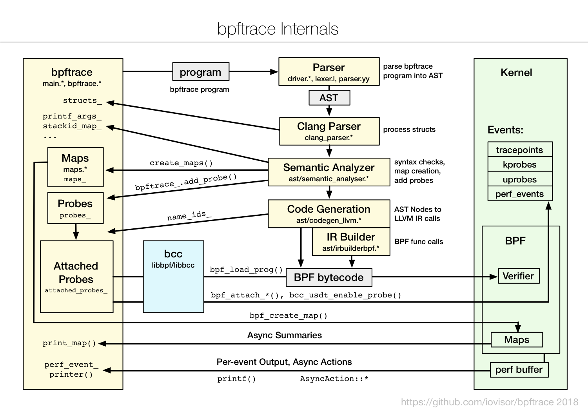
		- **在编写简单的 eBPF 程序，特别是编写的 eBPF 程序用于临时的调试和排错时，你可以考虑直接使用 bpftrace ，而不需要用 C 或 Python 去开发一个复杂的程序。**
		  id:: 65bba6f8-f690-4fa1-8d2a-c2d97a6bf7d3
		- id:: 65bba70b-6ee1-4ff6-b8c7-241fb291c7ac
		  ```bash
		  # 查询所有内核插桩和跟踪点
		  sudo bpftrace -l
		  
		  # 使用通配符查询所有的系统调用跟踪点
		  sudo bpftrace -l 'tracepoint:syscalls:*'
		  
		  # 使用通配符查询所有名字包含"execve"的跟踪点
		  sudo bpftrace -l '*execve*'
		  ```
		- 跟踪点和内核函数的区别 #card
		  id:: 65ce4676-2587-4cfc-9bd6-c48d4777f91d
			- 跟踪点(💡用于跟踪点[[tracepoint]] )，你还可以加上  -v  参数查询函数的入口参数或返回值。
			- 内核函数(💡用于内核插桩[[kprobe]])属于不稳定的 API，在 bpftrace 中只能通过  arg0、arg1  这样的参数来访问，具体的参数格式还需要参考内核源代码。
			- {{embed ((65bbac04-a729-4f3b-8700-a6aa39f865f7))}}
		- 比如，下面就是一个查询系统调用  execve  入口参数（对应系统调用sys_enter_execve）和返回值（对应系统调用sys_exit_execve）的示例：
		  ```bash
		  # 查询execve入口参数格式
		  $ sudo bpftrace -lv tracepoint:syscalls:sys_enter_execve
		  tracepoint:syscalls:sys_enter_execve
		      int __syscall_nr
		      const char * filename
		      const char *const * argv
		      const char *const * envp
		  
		  # 查询execve返回值格式
		  $ sudo bpftrace -lv tracepoint:syscalls:sys_exit_execve
		  tracepoint:syscalls:sys_exit_execve
		      int __syscall_nr
		      long ret
		  ```
	- 你既可以通过内核调试信息和 perf 来查询内核函数、跟踪点以及性能事件的列表，也可以使用 bpftrace 工具来查询。在这两种方法中，我更推荐使用更简单的 [[bpftrace]] 进行查询。这是因为，我们通常只需要在开发环境查询这些列表，以便去准备 eBPF 程序的挂载点。也就是说，虽然 bpftrace 依赖 BCC 和 LLVM 开发工具，但开发环境本来就需要这些库和开发工具。综合来看，用 bpftrace 工具来查询的方法显然更简单快捷。
	- 如何利用内核跟踪点排查短时进程问题？ #性能优化
		- 可能原因：
		  第一，应用程序里面直接调用其他二进制程序，并且这些程序的运行时间很短，通过  top  工具不容易发现；
		  第二，应用程序自身在不停地崩溃重启中，且重启间隔较短，启动过程中资源的初始化导致了高 CPU 使用率。
		- 利用 eBPF 的事件触发机制，跟踪内核每次新创建的进程->一个新进程通常需要调用  fork()  和  execve()  这两个标准函数 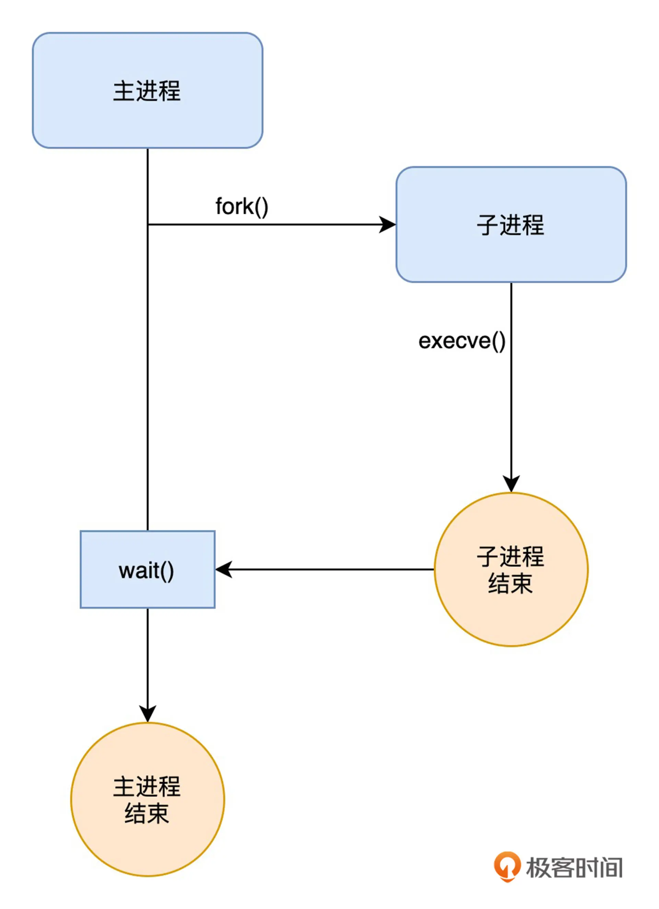
		-
		- 查询所有包含  execve  关键字的跟踪点：
		  ```bash
		  sudo bpftrace -l '*execve*'
		  ```
		  得到如下输出
		  ```bash
		  kprobe:__ia32_compat_sys_execve
		  kprobe:__ia32_compat_sys_execveat
		  kprobe:__ia32_sys_execve
		  kprobe:__ia32_sys_execveat
		  kprobe:__x32_compat_sys_execve
		  kprobe:__x32_compat_sys_execveat
		  kprobe:__x64_sys_execve
		  kprobe:__x64_sys_execveat
		  kprobe:audit_log_execve_info
		  kprobe:bprm_execve
		  kprobe:do_execveat_common.isra.0
		  kprobe:kernel_execve
		  tracepoint:syscalls:sys_enter_execve
		  tracepoint:syscalls:sys_enter_execveat
		  tracepoint:syscalls:sys_exit_execve
		  tracepoint:syscalls:sys_exit_execveat
		  ```
			- 这些函数可以分为内核插桩（[[kprobe]]）和跟踪点（[[tracepoint]]）两类
			  id:: 65bbac04-a729-4f3b-8700-a6aa39f865f7
				- 内核插桩属于不稳定接口，而跟踪点则是稳定接口。
				  id:: 65bba9dd-2d43-4a7d-9ad1-08acb1a9f6b3
				- 在内核插桩和跟踪点两者都可用的情况下，应该选择更稳定的跟踪点，以保证 eBPF 程序的可移植性（即在不同版本的内核中都可以正常执行）。
			- 只有跟踪点的列表还不够，因为我们还想知道具体启动的进程名称、命令行选项以及返回值，而这些也都可以通过 bpftrace 来查询。在命令行中执行下面的命令，即可查询：
			  ```bash
			  # 查询sys_enter_execve入口参数
			  $ sudo bpftrace -lv tracepoint:syscalls:sys_enter_execve
			  tracepoint:syscalls:sys_enter_execve
			      int __syscall_nr
			      const char * filename
			      const char *const * argv
			      const char *const * envp
			  
			  # 查询sys_exit_execve返回值
			  $ sudo bpftrace -lv tracepoint:syscalls:sys_exit_execve
			  tracepoint:syscalls:sys_exit_execve
			      int __syscall_nr
			      long ret
			  
			  # 查询sys_enter_execveat入口参数
			  $ sudo bpftrace -lv tracepoint:syscalls:sys_enter_execveat
			  tracepoint:syscalls:sys_enter_execveat
			      int __syscall_nr
			      int fd
			      const char * filename
			      const char *const * argv
			      const char *const * envp
			      int flags
			  
			  # 查询sys_exit_execveat返回值
			  $ sudo bpftrace -lv tracepoint:syscalls:sys_exit_execveat
			  tracepoint:syscalls:sys_exit_execveat
			      int __syscall_nr
			      long ret
			  ```
	- [[bpftrace]]、[[BCC]] 和 [[libbpf]] 对比 #常用工具 #eBPF
		- bpftrace 通常用在快速排查和定位系统上，它支持用单行脚本的方式来快速开发并执行一个 eBPF 程序。不过，bpftrace 的功能有限，不支持特别复杂的 eBPF 程序，也依赖于 BCC 和 LLVM 动态编译执行。
		- BCC 通常用在开发复杂的 eBPF 程序中，其内置的各种小工具也是目前应用最为广泛的 eBPF 小程序。不过，BCC 也不是完美的，它依赖于 LLVM 和内核头文件才可以动态编译和加载 eBPF 程序。
		- libbpf 是从内核中抽离出来的标准库，用它开发的 eBPF 程序可以直接分发执行，这样就不需要每台机器都安装 LLVM 和内核头文件了。不过，它要求内核开启 BTF 特性，需要非常新的发行版才会默认开启（如 RHEL 8.2+ 和 Ubuntu 20.10+ 等）。
	- [[bpftrace]]跟踪进程创建
		- 由于  execve()  和  execveat()  这两个系统调用的入口参数文件名  filename  和命令行选项  argv ，以及返回值  ret  的定义都是一样的，因而我们可以把这两个跟踪点放到一起来处理。
		  ```bash
		  sudo bpftrace -e 'tracepoint:syscalls:sys_enter_execve,tracepoint:syscalls:sys_enter_execveat { printf("%-6d %-8s %s: ", pid, comm, str(args->filename)); join(args->argv);}'
		  ```
		- bpftrace -e  表示直接从后面的字符串参数中读入 bpftrace 程序（除此之外，它还支持从文件中读入 bpftrace 程序）；
		- tracepoint:syscalls:sys_enter_execve,tracepoint:syscalls:sys_enter_execveat  表示用逗号分隔的多个跟踪点，其后的中括号表示跟踪点的处理函数；printf()  表示向终端中打印字符串，其用法类似于 C 语言中的  printf()  函数；
		- pid  和  comm  是 bpftrace 内置的变量，分别表示进程 PID 和进程名称（你可以在其官方文档中找到其他的内置变量）；
		- join(args->argv)  表示把字符串数组格式的参数用空格拼接起来，再打印到终端中。对于跟踪点来说，你可以使用  args->参数名  的方式直接读取参数（比如这里的  args->argv  就是读取系统调用中的  argv  参数）。
		- 更多用法参考 [官方文档](https://github.com/bpftrace/bpftrace/blob/master/docs/tutorial_one_liners_chinese.md)
	-