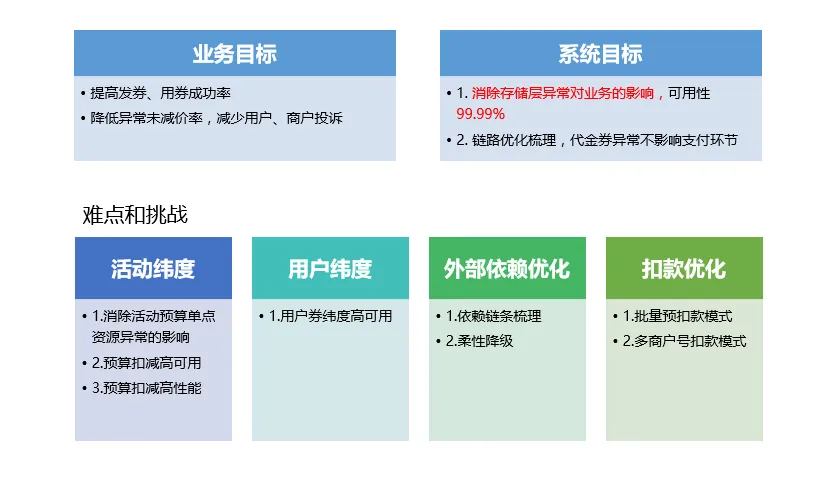
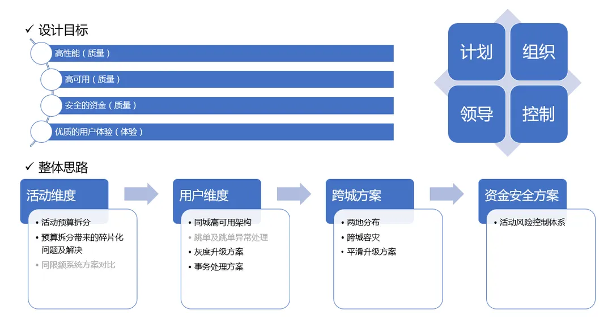
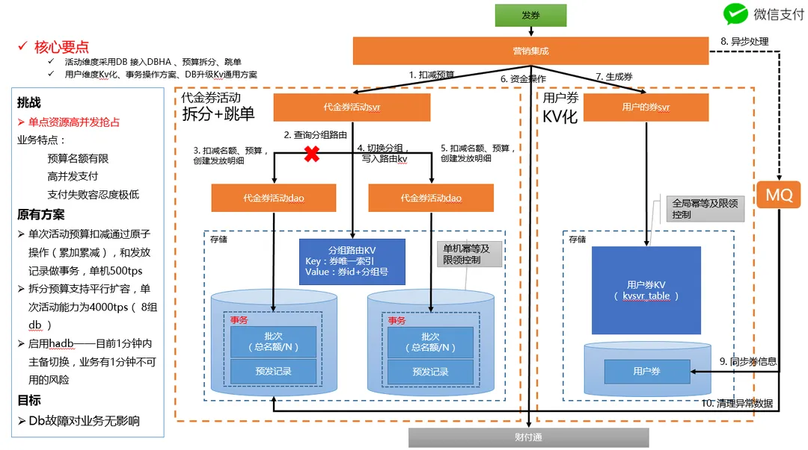
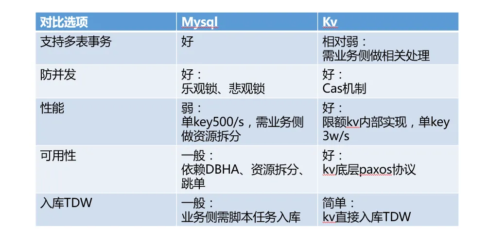
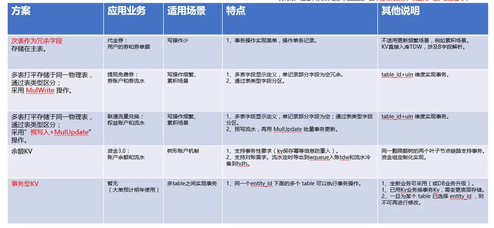
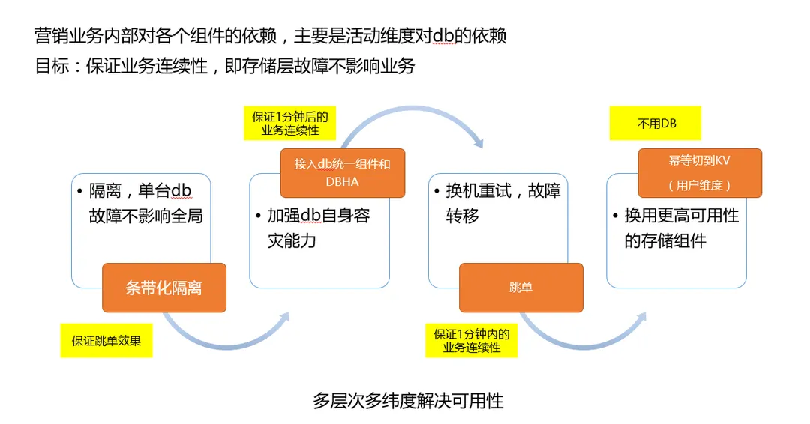
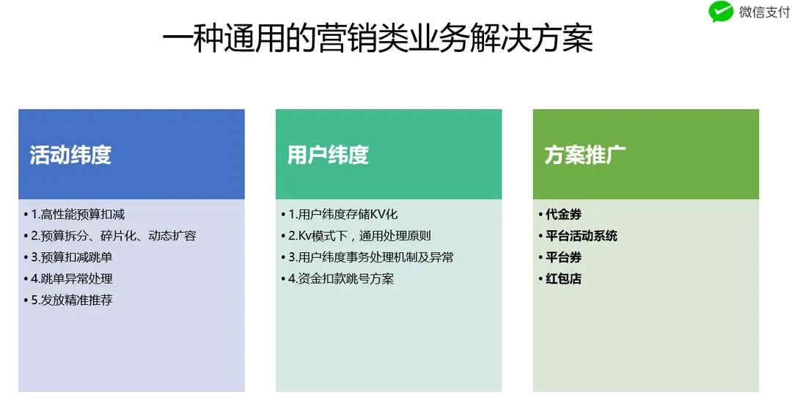

- [支付优惠券系统性能可用性保障浅谈](https://km.woa.com/articles/show/597465) #技术文章拆解 #km #支付系统 #微信支付
	- 文章结构
		- 背景
			- 先说问题优化的意义 【从产品角度说】
			- 问题复杂度 【方案的引子】
			- 业务信息流 【业务知识】
			- 业务领域模型 【业务知识】
		- 解决思路
			- 设计目标 【跟意义呼应】
			- 难点和挑战 【相比背景介绍更细致，更多数据，最好有业界对比】 
			- 整体解决思路 【方案大纲，跟设计目标和挑战都要呼应】 
			- 具体方案【对应整体思路的各个子项】
				- **同城高可用解决方案**
				  collapsed:: true
					- 核心要点：
						- 活动维度采用DB 接入DBHA 、预算拆分、[[跳单]]。
						- 用户维度Kv化、事务操作方案、DB升级Kv通用方案。
					- 整体系统架构图：
					   
					- 该方案的要点：
						- 活动维度采用DB进行预算控制，通过预算拆分实现发放的高性能
						- 在单组DB异常情况下，通过跳过异常分组，实现高可用
						- DB接入DBHA，分钟级实现自动切换
						- 用户维度采用Kv进行存储，自身通过Paxos实现高可用
				- **用户维度Kv模式下如何实现事务**
					- 
					- 营销侧Kv替代DB面临的突出问题：
						- 并发控制。（解决方案：可以采用KV提供的[[CAS]]机制实现）
						- 多表操作的原子性。关于多表操作的原子性，总结选型KV实现事务能力的多种方案，汇总如下：  #事务性kv 
			- 总结项目演进历史以及成果数据  
- [[CAS]]的[[ABA问题]]
	- CAS操作是一种原子操作，用于在多线程环境下实现无锁数据结构。它的基本原理是比较内存中的某个值是否与预期相等，如果相等，则将其替换为新值；否则，不做任何操作。
	  id:: 65d2d2e0-daa4-4acd-862e-361ca2fc7dd4
	- ABA问题是指在CAS操作过程中，一个变量的值从A变为B，然后又变回A。这种情况下，CAS操作可能会误判为变量值没有发生变化，从而导致错误的结果。具体来说，假设有两个线程T1和T2，它们都试图使用CAS操作更新同一个变量。线程T1读取变量的值为A，然后被挂起。线程T2将变量的值从A改为B，然后又改回A。此时，线程T1恢复执行，发现变量的值仍然为A，于是执行CAS操作，将变量值更改为新值。然而，这个新值可能是基于变量值为B的情况下计算出来的，因此结果可能是错误的。
	- 为了解决ABA问题，可以使用版本号或者时间戳等方法为变量增加一个标签，以此来区分不同的修改操作。这样，在执行CAS操作时，除了检查变量的值是否相等，还需要检查标签是否相等。这种方法在Java中的实现是AtomicStampedReference类，它可以同时存储一个值和一个标签，并提供原子性的更新操作。