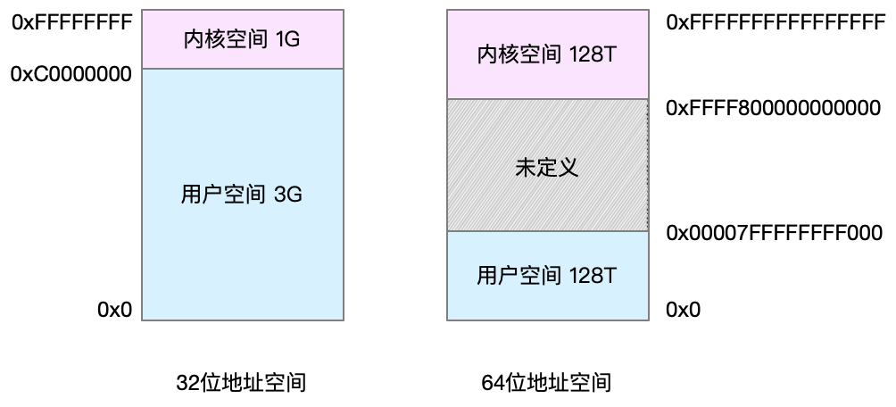
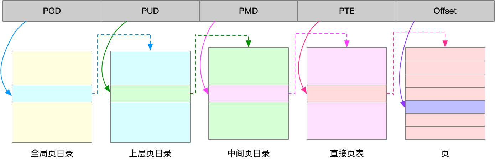
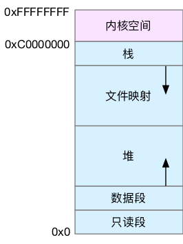

- 15 | 基础篇：Linux内存是怎么工作的？[src](https://portal.learn.woa.com/training/mooc/taskDetail?mooc_course_id=A9BWP7o7&task_id=81442) #《Linux性能优化实战》
  id:: 65d57168-860a-4617-967c-35a7c808c7f3
	- 
	- 进程在用户态时，只能访问用户空间内存；只有进入内核态后，才可以访问内核空间内存。虽然每个进程的地址空间都包含了内核空间，但这些内核空间，其实关联的都是相同的物理内存。这样，进程切换到内核态后，就可以很方便地访问内核空间内存。
		- 💡所有进程对应的内核空间映射的物理内存是一致的
	- [[TLB]] 其实就是 MMU 中页表的高速缓存。由于进程的虚拟地址空间是独立的，而 TLB 的访问速度又比 MMU 快得多，所以，通过减少进程的上下文切换，减少 TLB 的刷新次数，就可以提高 TLB 缓存的使用率，进而提高 CPU 的内存访问性能。
	- **通常**页的大小只有 4 KB ，导致的另一个问题就是，整个页表会变得非常大。比方说，仅 32 位系统就需要 100 多万个页表项（4GB/4KB），才可以实现整个地址空间的映射。为了解决页表项过多的问题，Linux 提供了两种机制，也就是多级页表和大页（HugePage）
		- Linux 用的正是[[四级页表]]来管理内存页，如下图所示，虚拟地址被分为 5 个部分，前 4 个表项用于选择页，而最后一个索引表示页内偏移。   
			- 也可以参考这个 ((65606b22-12f0-4fb8-81fe-ed48c2bf743f))
		- 再看大页，顾名思义，就是比普通页更大的内存块，常见的大小有 2MB 和 1GB。大页通常用在使用大量内存的进程上，比如 Oracle、DPDK 等。
	- [[虚拟内存空间分布]]
		- 以 32 位系统为例
		  
			- 用户空间内存，从低到高分别是五种不同的内存段。
				- 只读段，包括代码和常量等。
				- 数据段，包括全局变量等。
				- 堆，包括动态分配的内存，从低地址开始向上增长。
				- 文件映射段，包括动态库、共享内存等，从高地址开始向下增长。
					- 💡增长方向与64位相反： [1](((65606b22-2a31-4334-ab8d-d15c9aa825f0))) 和 [2](((65d6e8ba-a93c-4350-b544-65412e56d57a)))
					- 💡stack和mmap布局在linux 32位下也因为版本不同而不同：[1](((65d6edd7-a822-4e48-a211-810d4c22f7fe)))
				- 栈，包括局部变量和函数调用的上下文等。栈的大小是固定的，一般是 8 MB。
		- 内存分配与回收
			- malloc() 是 C 标准库提供的内存分配函数，对应到系统调用上，有两种实现方式，即 brk() 和 mmap()。
			- 对小块内存（小于 128K），C 标准库使用 brk() 来分配，也就是通过移动堆顶的位置来分配内存。这些内存释放后并不会立刻归还系统，而是被缓存起来，这样就可以重复使用。
				- brk() 方式的缓存，可以减少缺页异常的发生，提高内存访问效率。不过，由于这些内存没有归还系统，在内存工作繁忙时，频繁的内存分配和释放会造成内存碎片。
			- 而大块内存（大于 128K），则直接使用内存映射 mmap() 来分配，也就是在文件映射段找一块空闲内存分配出去。
				- mmap() 方式分配的内存，会在释放时直接归还系统，所以每次 mmap 都会发生缺页异常。在内存工作繁忙时，频繁的内存分配会导致大量的缺页异常，使内核的管理负担增大。这也是 malloc 只对大块内存使用 mmap  的原因。
			- **当brk和mmap这两种调用发生后，其实并没有真正分配内存。这些内存，都只在首次访问时才分配，也就是通过缺页异常进入内核中，再由内核来分配内存。**
			- Linux 使用伙伴系统来管理内存分配。前面我们提到过，这些内存在 MMU 中以页为单位进行管理，伙伴系统也一样，以页为单位来管理内存，并且会通过相邻页的合并，减少内存碎片化（比如 brk 方式造成的内存碎片）。
				- 在用户空间，malloc 通过 brk() 分配的内存，在释放时并不立即归还系统，而是缓存起来重复利用。在内核空间，Linux 则通过 slab 分配器来管理小内存。你可以把 slab 看成构建在伙伴系统上的一个缓存，主要作用就是分配并释放内核中的小对象。
			- 系统也不会任由某个进程用完所有内存。在发现内存紧张时，系统就会通过一系列机制来回收内存，比如下面这三种方式：
				- 回收缓存，比如使用 LRU（Least Recently Used）算法，回收最近使用最少的内存页面；
				- 回收不常访问的内存，把不常用的内存通过交换分区直接写到磁盘中；（SWAP）
				- id:: 65d6f36e-2e78-4e53-8648-46834faec12c
				  
				  杀死进程，内存紧张时系统还会通过 OOM（Out of Memory），直接杀掉占用大量内存的进程。
					- [[OOM]]（Out of Memory），其实是内核的一种保护机制。它监控进程的内存使用情况，并且使用 oom_score 为每个进程的内存使用情况进行评分：
					  id:: 65d6f3b8-9972-4aae-80ec-34ac951b9b29
						- 一个进程消耗的内存越大，oom_score 就越大；
						- 一个进程运行占用的 CPU 越多，oom_score 就越小。
					- 为了实际工作的需要，管理员可以通过 /proc 文件系统，手动设置进程的 oom_adj ，从而调整进程的 oom_score。
					- oom_adj 的范围是 [-17, 15]，数值越大，表示进程越容易被 OOM 杀死；数值越小，表示进程越不容易被 OOM 杀死，其中 -17 表示禁止 OOM。
					- 比如用下面的命令，你就可以把 sshd 进程的 oom_adj 调小为 -16，这样， sshd 进程就不容易被 OOM 杀死。
					  ```
					  echo -16 > /proc/$(pidof sshd)/oom_adj
					  ```
	-
-
-