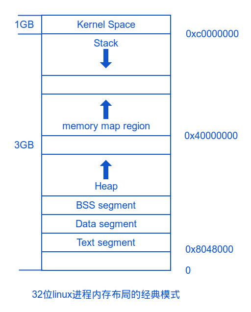
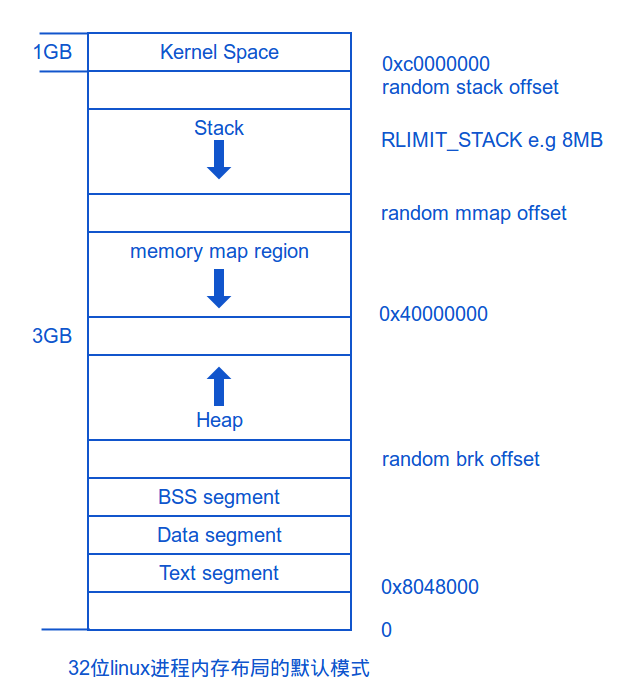
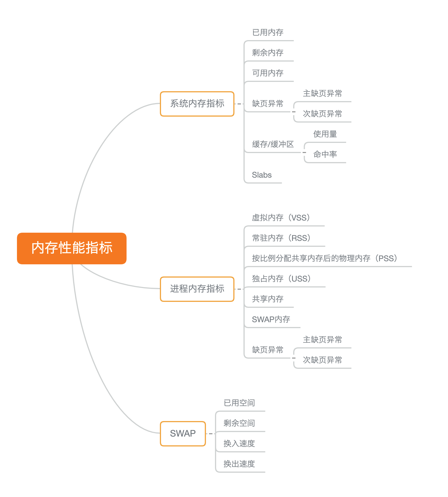
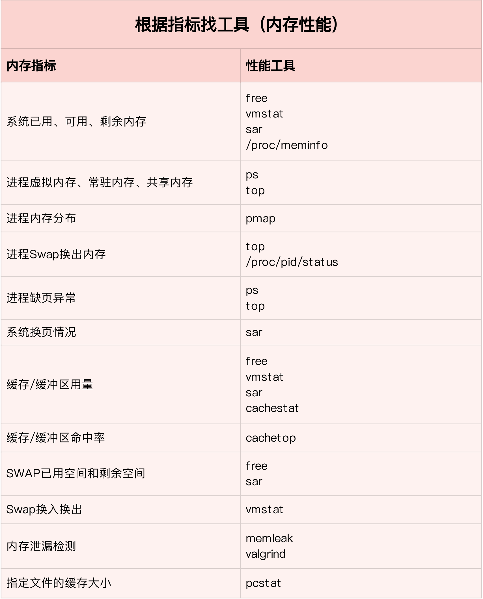
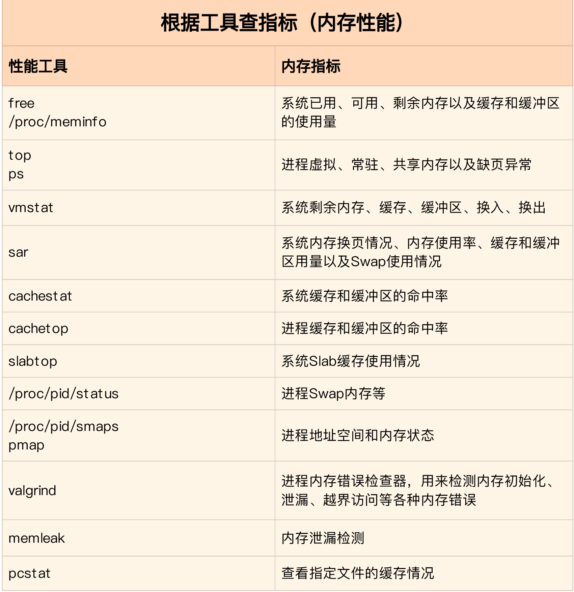
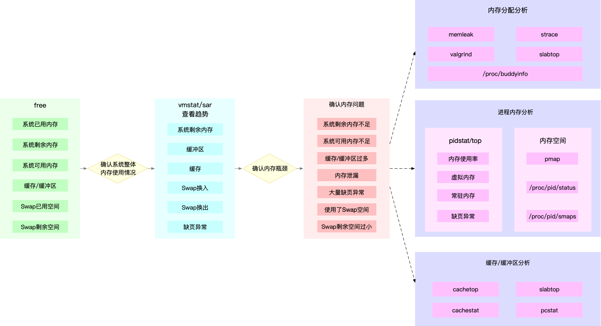

- 需要成为总结的那个人，而不是总结的消费者。AI总结并不客观。思考速度决定了阅读速度。[别再被误导了!你真的不需要一年读100本书! (youtube.com)](https://www.youtube.com/watch?v=0CGTrSHADh4&t=401s)
- LINUX进程的内存布局  [src](https://lishiwen4.github.io/linux/linux-process-memory-location) #虚拟内存空间分布
	- 32位linux下进程内存空间布局
	  id:: 65d6edd7-a822-4e48-a211-810d4c22f7fe
		- 经典布局 
		- 默认布局(内核 2.6.7 以后才引入)
		   
			- 栈和 mmap 映射区域并不是从一个固定地址开始，并且每次的值都不一样，这是程序在启动时随机改变这些值的设置，使得使用缓冲区溢出进行攻击更加困难。当然也可以让程序的栈和 mmap 映射区域从一个固定位置开始，只需要设置全局变量 randomize_v a_space 值为 0 ，这个变量默认值为 1 。
			- 用户可以通过如下的任一方式来停用进程地址随机化
			  
			  ```
			  $ echo 0 >  /proc/sys/kernel/randomize_va_space
			  $ sudo sysctl -w kernel.randomize_va_space=0
			  ```
			  
			  该属性有3个取值：
			  0 ： 表示关闭内存地址随机化
			  1 ： 表示将mmap的基址，stack和vdso地址随机化
			  2 ： 表示在1的基础上， heap地址随机化
	- 64位linux下进程内存空间布局
	  id:: 65d6e8ba-a93c-4350-b544-65412e56d57a
		- 
		- 64位系统的寻址空间比较大，所以仍然沿用了32位的经典布局，但是加上了随机的mmap起始地址，以防止溢出攻击
		- 目前大部分的操作系统和应用程序并不需要16EB( 264 )如此巨大的地址空间, 实现64位长的地址只会增加系统的复杂度和地址转换的成本, 带不来任何好处. 所以目前的x86-64架构CPU都遵循AMD的Canonical form, 即只有虚拟地址的最低48位才会在地址转换时被使用, 且任何虚拟地址的48位至63位必须与47位一致(sign extension). 也就是说, 总的虚拟地址空间为256TB
	- 查看进程的内存空间布局
		- ```
		  $ cat /proc/xxxx/maps
		  ```
		- ```
		  # 更详细
		  $ cat /proc/xxxx/smaps
		  ```
- 16 | 基础篇：怎么理解内存中的Buffer和Cache？
   [src](https://portal.learn.woa.com/training/mooc/taskDetail?mooc_course_id=A9BWP7o7&task_id=81443) #《Linux性能优化实战》
	- 从字面上来说，Buffer 是缓冲区，而 Cache 是缓存，两者都是数据在内存中的临时存储
	- `man free`
		- Buffers 是内核缓冲区用到的内存，对应的是  `/proc/meminfo` 中的 Buffers 值。
		- Cache是内核页缓存和 [[Slab]] 用到的内存，对应的是  `/proc/meminfo` 中的 Cached 与 SReclaimable 之和。 #linux的cache
		  id:: 65d6f582-c53a-4bb8-8f92-1de977a13610
	- `man proc`
		- ```
		  Buffers %lu
		    Relatively temporary storage for raw disk blocks that shouldn't get tremendously large (20MB or so).
		  - Cached %lu
		   In-memory cache for files read from the disk (the page cache).  Doesn't include SwapCached.
		  ...
		  SReclaimable %lu (since Linux 2.6.19)
		    Part of Slab, that might be reclaimed, such as caches.
		    
		  SUnreclaim %lu (since Linux 2.6.19)
		    Part of Slab, that cannot be reclaimed on memory pressure.
		  ```
		- Buffers 是对原始磁盘块的临时存储，也就是用来**缓存磁盘的数据**，通常不会特别大（20MB 左右）。这样，内核就可以把分散的写集中起来，统一优化磁盘的写入，比如可以把多次小的写合并成单次大的写等等。
		- Cached 是从磁盘读取文件的页缓存，也就是用来**缓存从文件读取的数据**。这样，下次访问这些文件数据时，就可以直接从内存中快速获取，而不需要再次访问缓慢的磁盘。 #linux的cache
		- 实际上**Buffer 是对磁盘数据的缓存，而 Cache 是文件数据的缓存，它们既会用在读请求中，也会用在写请求中**。
			- Buffer 既可以用作“将要写入磁盘数据的缓存”，也可以用作“从磁盘读取数据的缓存”。
			- Cache 既可以用作“从文件读取数据的页缓存”，也可以用作“写文件的页缓存”。
		- SReclaimable 是 Slab 的一部分。Slab 包括两部分，其中的可回收部分，用 SReclaimable 记录；而不可回收部分，用 SUnreclaim 记录。 #linux的cache
	- 清理系统缓存 #常用工具
	  ```
	  # 清理文件页、目录项、Inodes等各种缓存
	  $ echo 3 > /proc/sys/vm/drop_caches
	  ```
	- 终端执行 dd 命令，通过读取随机设备  #常用工具
		- 写入文件
		  ```
		  # 生成一个 500MB 大小的文件
		  $ dd if=/dev/urandom of=/tmp/file bs=1M count=500
		  ```
		- 写入磁盘
		  ```
		  # 向磁盘分区/dev/sdb1写入2G数据
		  $ dd if=/dev/urandom of=/dev/sdb1 bs=1M count=2048
		  ```
- 17 | 案例篇：如何利用系统缓存优化程序的运行效率？ [src](https://portal.learn.woa.com/training/mooc/taskDetail?mooc_course_id=A9BWP7o7&task_id=81444) #《Linux性能优化实战》
	- cachestat 和 cachetop  ，它们正是查看系统缓存命中情况的工具。 来自 [[BCC]] #常用工具
		- cachestat 提供了整个操作系统缓存的读写命中情况。
		- cachetop 提供了每个进程的缓存命中情况。
		- ```
		  $ cachestat 1 3
		     TOTAL   MISSES     HITS  DIRTIES   BUFFERS_MB  CACHED_MB
		         2        0        2        1           17        279
		         2        0        2        1           17        279
		         2        0        2        1           17        279
		  ```
		- TOTAL ，表示总的 I/O 次数；
		- MISSES ，表示缓存未命中的次数；
		- HITS ，表示缓存命中的次数；
		- DIRTIES， 表示新增到缓存中的脏页数；
		- BUFFERS_MB 表示 Buffers 的大小，以 MB 为单位；
		- CACHED_MB 表示 Cache 的大小，以 MB 为单位。
		- ```
		  # 每隔5秒刷新一次数据
		  $ cachetop 5
		  ```
	- pcstat：查看指定文件在内存中的缓存大小 #常用工具
		- 安装
		  ```
		  $ export GOPATH=~/go
		  $ export PATH=~/go/bin:$PATH
		  $ go get golang.org/x/sys/unix
		  $ go get github.com/tobert/pcstat/pcstat
		  ```
		- ```
		  $ pcstat /bin/ls
		  +---------+----------------+------------+-----------+---------+
		  | Name    | Size (bytes)   | Pages      | Cached    | Percent |
		  |---------+----------------+------------+-----------+---------|
		  | /bin/ls | 133792         | 33         | 0         | 000.000 |
		  +---------+----------------+------------+-----------+---------+
		  ```
	- 如果为系统调用设置直接 I/O 的标志，就可以绕过系统缓存。
	- [[pgrep]] 命令来查找案例进程的 PID 号，使用[[strace]]查看系统调用 #常用工具 #card
		- ```
		  # strace -p $(pgrep app)
		  strace: Process 4988 attached
		  restart_syscall(<\.\.\. resuming interrupted nanosleep \.\.\.>) = 0
		  openat(AT_FDCWD, "/dev/sdb1", O_RDONLY|O_DIRECT) = 4
		  mmap(NULL, 33558528, PROT_READ|PROT_WRITE, MAP_PRIVATE|MAP_ANONYMOUS, -1, 0) = 0x7f448d240000
		  read(4, "8vq\213\314\264u\373\4\336K\224\25@\371\1\252\2\262\252q\221\n0\30\225bD\252\266@J"\.\.\., 33554432) = 33554432
		  write(1, "Time used: 0.948897 s to read 33"\.\.\., 45) = 45
		  close(4)                                = 0
		  ```
- 18 | 案例篇：内存泄漏了，我该如何定位和处理？ [src](https://portal.learn.woa.com/training/mooc/taskDetail?mooc_course_id=A9BWP7o7&task_id=81445) #《Linux性能优化实战》
	- 系统最终可以通过 [[OOM]]（Out of Memory）机制杀死进程，但进程在 OOM 前，可能已经引发了一连串的反应，导致严重的性能问题。比如，其他需要内存的进程，可能无法分配新的内存；内存不足，又会触发系统的缓存回收以及 SWAP 机制，从而进一步导致 I/O 的性能问题等等。
	- [[memleak]]：检测[[内存泄漏]]的工具 #BCC #常用工具
		- memleak 可以跟踪系统或指定进程的内存分配、释放请求，然后定期输出一个未释放内存和相应调用栈的汇总情况（默认 5 秒）
		  id:: 65d70582-79b2-484a-88b4-5823c2a12057
		- */usr/share/bcc/tools/memleak*
		- ```
		  $ docker cp app:/app /app
		  $ /usr/share/bcc/tools/memleak -p $(pidof app) -a
		  Attaching to pid 12512, Ctrl+C to quit.
		  [03:00:41] Top 10 stacks with outstanding allocations:
		      addr = 7f8f70863220 size = 8192
		      addr = 7f8f70861210 size = 8192
		      addr = 7f8f7085b1e0 size = 8192
		      addr = 7f8f7085f200 size = 8192
		      addr = 7f8f7085d1f0 size = 8192
		      40960 bytes in 5 allocations from stack
		          fibonacci+0x1f [app]
		          child+0x4f [app]
		          start_thread+0xdb [libpthread-2.27.so]
		  ```
- 19 | 案例篇：为什么系统的Swap变高了（上） [src](https://portal.learn.woa.com/training/mooc/taskDetail?mooc_course_id=A9BWP7o7&task_id=81446) #《Linux性能优化实战》
	- 系统的内存资源紧张时，系统又会如何应对呢？
		- 内存回收
		- OOM 杀死进程
	- 内存回收，也就是系统释放掉可以回收的内存，比如我前面讲过的缓存cache和缓冲区buffer，就属于可回收内存。它们在内存管理中，通常被叫做**[[文件页]]（**File-backed Page）。 #linux的cache
	  id:: 65d7090b-95c2-4a35-97d0-0d1664d2cd61
		- 除了缓存和缓冲区，通过内存映射获取的文件映射页，也是一种常见的[[文件页]]。它也可以被释放掉，下次再访问的时候，从文件重新读取。
		  id:: 65d7095c-2447-4dea-b675-bc416caf92d4
	- 大部分文件页，都可以直接回收，以后有需要时，再从磁盘重新读取就可以了。而那些被应用程序修改过，并且暂时还没写入磁盘的数据（也就是脏页），就得先写入磁盘，然后才能进行内存释放。这些脏页，一般可以通过两种方式写入磁盘。
		- 可以在应用程序中，通过系统调用 fsync  ，把脏页同步到磁盘中；
		- 也可以交给系统，由内核线程 pdflush 负责这些脏页的刷新。
	- 除了文件页外，还有没有其他的内存可以回收呢？比如，应用程序动态分配的堆内存，也就是我们在内存管理中说到的**[[匿名页]]**（Anonymous Page），是不是也可以回收呢？
		- 我想，你肯定会说，它们很可能还要再次被访问啊，当然不能直接回收了。非常正确，这些内存自然不能直接释放。
		- 但是，如果这些内存在分配后很少被访问，似乎也是一种资源浪费。是不是可以把它们暂时先存在磁盘里，释放内存给其他更需要的进程？
		- 其实，这正是 Linux 的 Swap 机制。
	- 除了直接内存回收，还有一个专门的内核线程用来定期回收内存，也就是 **kswapd0**。为了衡量内存的使用情况，kswapd0 定义了三个内存阈值（watermark，也称为水位），分别是
		- 页最小阈值（pages_min）
		- 页低阈值（pages_low）
		- 页高阈值（pages_high）
		- {:height 241, :width 350}
		- 剩余内存小于**页最小阈值**，说明进程可用内存都耗尽了，只有内核才可以分配内存。
		- 剩余内存落在**页最小阈值**和**页低阈值**中间，说明内存压力比较大，剩余内存不多了。这时 kswapd0 会执行内存回收，直到剩余内存大于高阈值为止。
		- 页低阈值，其实可以通过内核选项 /proc/sys/vm/min_free_kbytes 来间接设置。min_free_kbytes 设置了页最小阈值，而其他两个阈值，都是根据页最小阈值计算生成的
		  ```
		  pages_low = pages_min*5/4
		  pages_high = pages_min*3/2
		  ```
	- NUMA 与 Swap
		- 内存阈值（页最小阈值、页低阈值和页高阈值），都可以通过内存域在 proc 文件系统中的接口 /proc/zoneinfo 来查看。
		  ```
		  $ cat /proc/zoneinfo
		  ...
		  Node 0, zone   Normal
		   pages free     227894
		         min      14896
		         low      18620
		         high     22344
		  ...
		       nr_free_pages 227894
		       nr_zone_inactive_anon 11082
		       nr_zone_active_anon 14024
		       nr_zone_inactive_file 539024
		       nr_zone_active_file 923986
		  ...
		  ```
		- 当然，某个 Node 内存不足时，系统可以从其他 Node 寻找空闲内存，也可以从本地内存中回收内存。具体选哪种模式，你可以通过 /proc/sys/vm/zone_reclaim_mode 来调整。它支持以下几个选项：
			- 默认的 0 ，也就是刚刚提到的模式，表示既可以从其他 Node 寻找空闲内存，也可以从本地回收内存。
			- 1、2、4 都表示只回收本地内存，2 表示可以回写脏数据回收内存，4 表示可以用 Swap 方式回收内存。
		- 到这里，我们就可以理解内存回收的机制了。这些回收的内存既包括了[[文件页]]，又包括了[[匿名页]]。
			- 对[[文件页]]的回收，当然就是直接回收缓存，或者把脏页写回磁盘后再回收。
			- 而对[[匿名页]]的回收，其实就是通过 Swap 机制，把它们写入磁盘后再释放内存。
		- 既然有两种不同的内存回收机制，那么在实际回收内存时，到底该先回收哪一种呢？
			- 其实，Linux 提供了一个  `/proc/sys/vm/swappiness` 选项，用来调整使用 Swap 的积极程度。
			- swappiness 的范围是 0-100，数值越大，越积极使用 Swap，也就是更倾向于回收[[匿名页]]；数值越小，越消极使用 Swap，也就是更倾向于回收文件页。
			- 虽然 swappiness 的范围是 0-100，不过要注意，这并不是内存的百分比，而是调整 Swap 积极程度的权重，即使你把它设置成 0，当[剩余内存 + 文件页小于页高阈值](https://www.kernel.org/doc/Documentation/sysctl/vm.txt)时，还是会发生 Swap。
- 20 | 案例篇：为什么系统的Swap变高了？（下） [src](https://portal.learn.woa.com/training/mooc/taskDetail?mooc_course_id=A9BWP7o7&task_id=81447) #《Linux性能优化实战》
	- Linux 本身支持两种类型的 Swap，即 Swap 分区和 Swap 文件
	- 以 Swap 文件为例，在第一个终端中运行下面的命令开启 Swap，我这里配置 Swap 文件的大小为 8GB
	  ```
	  # 创建Swap文件
	  $ fallocate -l 8G /mnt/swapfile
	  # 修改权限只有根用户可以访问
	  $ chmod 600 /mnt/swapfile
	  # 配置Swap文件
	  $ mkswap /mnt/swapfile
	  # 开启Swap
	  $ swapon /mnt/swapfile
	  ```
	- 运行 sar 命令，查看内存各个指标的变化情况 #常用工具
		- ```
		  # 间隔1秒输出一组数据
		  # -r表示显示内存使用情况，-S表示显示Swap使用情况
		  $ sar -r -S 1
		  04:39:56    kbmemfree   kbavail kbmemused  %memused kbbuffers  kbcached  kbcommit   %commit  kbactive   kbinact   kbdirty
		  04:39:57      6249676   6839824   1919632     23.50    740512     67316   1691736     10.22    815156    841868         4
		  
		  04:39:56    kbswpfree kbswpused  %swpused  kbswpcad   %swpcad
		  04:39:57      8388604         0      0.00         0      0.00
		  
		  04:39:57    kbmemfree   kbavail kbmemused  %memused kbbuffers  kbcached  kbcommit   %commit  kbactive   kbinact   kbdirty
		  04:39:58      6184472   6807064   1984836     24.30    772768     67380   1691736     10.22    847932    874224        20
		  
		  04:39:57    kbswpfree kbswpused  %swpused  kbswpcad   %swpcad
		  04:39:58      8388604         0      0.00         0      0.00
		  
		  …
		  
		  04:44:06    kbmemfree   kbavail kbmemused  %memused kbbuffers  kbcached  kbcommit   %commit  kbactive   kbinact   kbdirty
		  04:44:07       152780   6525716   8016528     98.13   6530440     51316   1691736     10.22    867124   6869332         0
		  
		  04:44:06    kbswpfree kbswpused  %swpused  kbswpcad   %swpcad
		  04:44:07      8384508      4096      0.05        52      1.27
		  ```
	- 观察 /proc/zoneinfo 中这几个指标的变化情况 #常用工具
		- ```
		  # -d 表示高亮变化的字段
		  # -A 表示仅显示Normal行以及之后的15行输出
		  $ watch -d grep -A 15 'Normal' /proc/zoneinfo
		  Node 0, zone   Normal
		    pages free     21328
		          min      14896
		          low      18620
		          high     22344
		          spanned  1835008
		          present  1835008
		          managed  1796710
		          protection: (0, 0, 0, 0, 0)
		        nr_free_pages 21328
		        nr_zone_inactive_anon 79776
		        nr_zone_active_anon 206854
		        nr_zone_inactive_file 918561
		        nr_zone_active_file 496695
		        nr_zone_unevictable 2251
		        nr_zone_write_pending 0
		  ```
	- 内存回收和缓存再次分配的循环往复
		- 当剩余内存小于页低阈值时，系统会回收一些缓存和匿名内存([[匿名页]])，使剩余内存增大。其中，缓存的回收导致 sar 中的缓冲区减小，而匿名内存([[匿名页]])的回收导致了 Swap 的使用增大。
		- 紧接着，由于 dd 还在继续，剩余内存又会重新分配给缓存，导致剩余内存减少，缓冲区增大。
	- 查看进程 Swap 换出的虚拟内存大小 #常用工具
		- ```
		  # 按VmSwap使用量对进程排序，输出进程名称、进程ID以及SWAP用量
		  $ for file in /proc/*/status ; do awk '/VmSwap|Name|^Pid/{printf $2 " " $3}END{ print ""}' $file; done | sort -k 3 -n -r | head
		  dockerd 2226 10728 kB
		  docker-containe 2251 8516 kB
		  snapd 936 4020 kB
		  networkd-dispat 911 836 kB
		  polkitd 1004 44 kB
		  ```
	- 关闭 Swap
	  ```
	  $ swapoff -a
	  ```
	  关闭 Swap 后再重新打开，也是一种常用的 Swap 空间清理方法
	  ```
	  $ swapoff -a && swapon -a
	  ```
	-
- 21 | 套路篇：如何“快准狠”找到系统内存的问题？[src](https://portal.learn.woa.com/training/mooc/taskDetail?mooc_course_id=A9BWP7o7&task_id=81448) #《Linux性能优化实战》
	- CACHE缓存，包括两部分，一部分是磁盘读取文件的页缓存，用来缓存从磁盘读取的数据，可以加快以后再次访问的速度。另一部分，则是 Slab 分配器中的可回收内存。#linux的cache
	- BUFFER缓冲区，是对原始磁盘块的临时存储，用来缓存将要写入磁盘的数据。这样，内核就可以把分散的写集中起来，统一优化磁盘写入。
	- 常驻内存是进程实际使用的物理内存，不过，它不包括 Swap 和共享内存。
	- 
	- 内存性能问题定位套路 #性能优化 #card
		- 
		- 
		- **为了迅速定位内存问题，我通常会先运行几个覆盖面比较大的性能工具，比如 free、top、vmstat、pidstat 等**。具体的分析思路主要有这几步：
			- 先用 free 和 top，查看系统整体的内存使用情况。
			- 再用 [[vmstat]] 和 [[pidstat]]，查看一段时间的趋势，从而判断出内存问题的类型。
			- 最后进行详细分析，比如内存分配分析、缓存 / 缓冲区分析、具体进程的内存使用分析等。
		- 
			- #pmap #cachetop #cachestat #slabtop #pcstat #memleak #strace