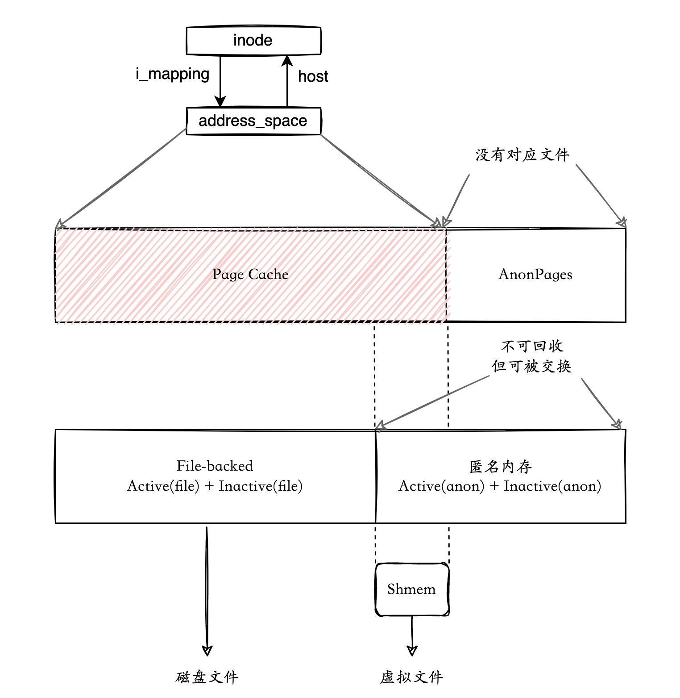
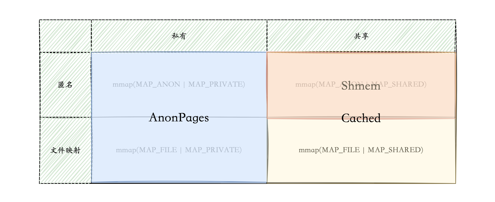
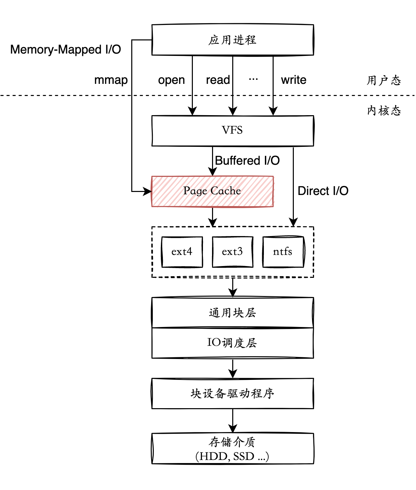
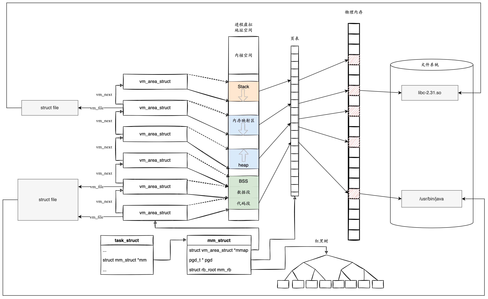

- 在 Linux 2.4 版本的内核之前，Page Cache 与 buffer cache 是完全分离的。但是，块设备大多是磁盘，磁盘上的数据又大多通过文件系统来组织，这种设计导致很多数据被缓存了两次，浪费内存。**所以在 2.4 版本内核之后，两块缓存近似融合在了一起：如果一个文件的页加载到了 Page Cache，那么同时 buffer cache 只需要维护块指向页的指针就可以了**。**只有那些没有文件表示的块，或者绕过了文件系统直接操作（如dd命令）的块，才会真正放到 buffer cache 里**。因此，我们现在提起 Page Cache，基本上都同时指 Page Cache 和 buffer cache 两者，本文之后也不再区分，直接统称为 Page Cache。 [深入理解Linux 的Page Cache - 阅读清单 - 腾讯云开发者社区-腾讯云 (tencent.com)](https://cloud.tencent.com/developer/inventory/24203/article/1867928) #linux的cache
  id:: 65d76fba-37c6-4d76-981b-3d18f1814c93
- [深入理解 Page Cache_Linux_swordholder_InfoQ写作社区](https://xie.infoq.cn/article/e0b32551131bcde22190d89e6) #linux的cache
	- {:height 767, :width 740}
	  id:: 65d8382b-fe01-46e0-8d6b-f5f41fd3be62
	- Page Cache = `/proc/meminfo`的Cached，是Mapped的超集
	  id:: 65d83a01-797e-4c56-915a-f3315a40f38f
	- 由于 **Shmem** 没有关联磁盘上的文件，因此它不属于 File-backed 内存，而是被记录在匿名内存（**Active(anon)** 或 **Inactive(anon)**）部分。但因为 **Shmem** 有自己的 [inode](https://xie.infoq.cn/link?target=https%3A%2F%2Felixir.bootlin.com%2Flinux%2Fv5.17%2Fsource%2Finclude%2Flinux%2Ffs.h%23L614) ，`inode->address_sapce` 维护的 Page Cache 页挂在 `address_space->i_pages` 指向的 [xarray](https://xie.infoq.cn/link?target=https%3A%2F%2Fwww.kernel.org%2Fdoc%2Fhtml%2Flatest%2Fcore-api%2Fxarray.html) 树上，因此 **Shmem** 部分的内存也应该算在 Page Cache 里。
	  id:: 65d83abe-f626-4253-8b4d-72a850666645
	- 
	- 私有映射都属于 **AnonPages**(💡不绝对，参考下面的私有文件映射)，共享映射都是 **Page cache**。前面讨论过，共享的匿名映射 **Shmem**，虽然没有关联真实的磁盘文件，但是关联了虚拟内存文件，所以也属于 **Page Cache**。
	- 私有文件映射
		- 进程通过 `mmap(MAP_FILE | MAP_PRIVATE)` 这种方式来申请的内存，比如进程将共享库（Shared libraries）和可执行文件的代码段（Text Segment）映射到自己的地址空间就是通过这种方式。
		- 私有文件映射的只读页是多进程间共享的，可写页是每个进程都有一个独立的副本，创建副本的时机仍然是写时复制。
		- 私有文件映射，如果文件是只读的话，这块内存属于 **Page Cache**。如果有进程写文件，因为这一段内存区域的属性是私有的，所以内核就会做一次写时复制，为写文件的进程单独地创建一份副本，这个副本就属于 **AnonPages** 了。
- 深入理解 Page Cache [src](https://cloud.tencent.com/developer/article/2363233) #linux的cache
	- **Page Cache** 是由内核管理的内存，位于 [VFS(Virtual File System)](https://cloud.tencent.com/developer/tools/blog-entry?target=https%3A%2F%2Fwww.kernel.org%2Fdoc%2Fhtml%2Flatest%2Ffilesystems%2Fvfs.html&source=article&objectId=2363233) 层和具体文件系统层（例如ext4，ext3）之间。应用进程使用 `read`/`write` 等文件操作，通过系统调用进入到 **VFS** 层，根据 **O_DIRECT** 标志，可以使用 **Page Cache** 作为文件内容的缓存，也可以跳过 **Page Cache** 不使用内核提供的缓存功能。
	- 另外，应用程序可以使用 [mmap](https://cloud.tencent.com/developer/tools/blog-entry?target=https%3A%2F%2Fman7.org%2Flinux%2Fman-pages%2Fman2%2Fmmap.2.html&source=article&objectId=2363233) ，将文件内容映射到进程的虚拟地址空间，可以像读写内存一样直接读写硬盘上的文件。进程的虚拟内存直接和 **Page Cache** 映射。
	- **Page Cache** 的产生有两种不同的方式：
	  id:: 65d83eb1-fd3a-4240-8c90-a430b136d89c
		- Buffered I/O
		- Memory-Mapped file
	- 这两种方式的不同之处在于，使用 `Buffered I/O`，要先将数据从 **Page Cache** 拷贝到用户缓冲区，应用才能从用户缓冲区读取数据。而对于 `Memory-Mapped file` 而言，则是直接将 **Page Cache** 页映射到进程虚拟地址空间，用户可以直接读写 **Page Cache** 中的内容。由于少了一次 copy，使用 `Memory-Mapped file` 要比 `Buffered I/O`  的效率高一些。
	- 
	- 进程在 Linux 内核由 task_struct 所描述。估计 task_struct 是你学习内核时第一个熟悉的数据结构，因为它实在太重要了。 task_struct描述了进程相关的所有信息，包括进程状态，运行时统计信息，进程亲缘关系，进度调度信息，信号处理，进程内存管理，进程打开的文件等等。我们这里关注的进程虚拟内存空间，是由 task_struct 中的 mm 字段指向的 mm_struct 所描述，它是一个进程内存的运行时摘要信息。 
- Linux：/proc/meminfo参数详细解释 [src](https://blog.csdn.net/whbing1471/article/details/105468139) #linux的cache
	- `/proc/meminfo`的Buffers，所占内存同时也在LRU list中，被统计在Active(file)或者Inactive(file)里
	  id:: 65d84955-f9d7-47df-a5a9-81efe60b92d7
	- 【Active(anon)+Inactive(anon)】 = 【AnonPages + Shmem】，但是这个等式在某些情况下也不一定成立，因为：如果shmem或anonymous pages被mlock的话，就不在Active(non)或Inactive(anon)里了，而是到了Unevictable里，以上等式就不平衡了
	  id:: 65d848e3-2a20-4dc8-8c54-129c8075b613