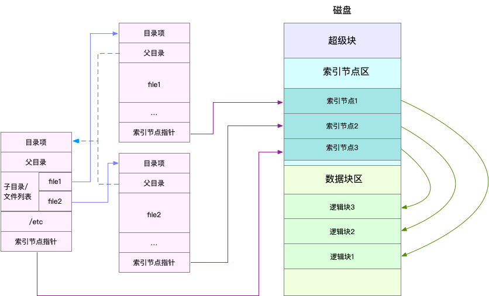
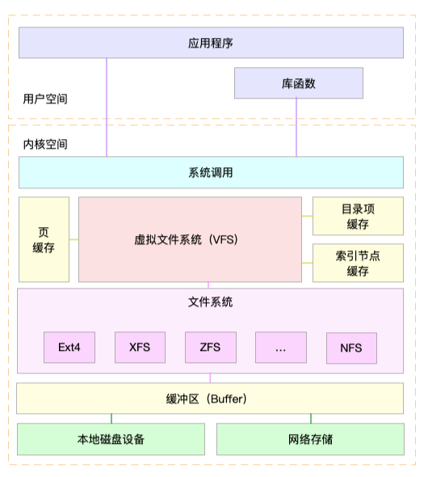
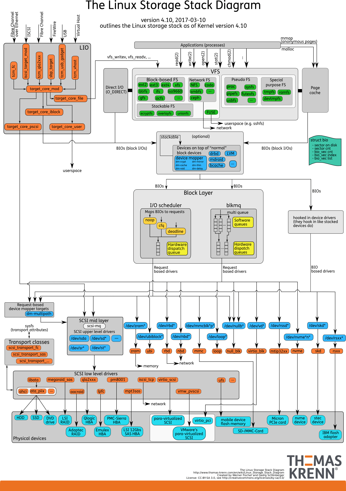
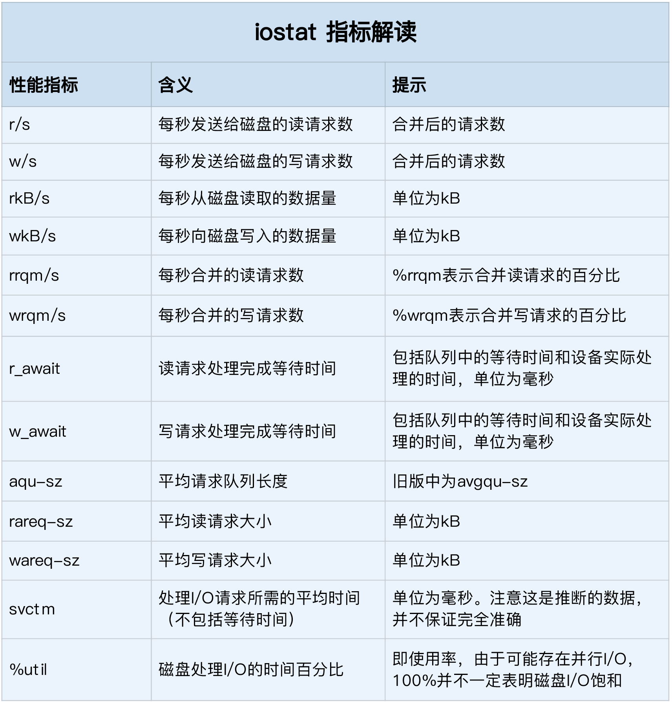

- 22 | 答疑（三）：文件系统与磁盘的区别是什么？ [src](https://portal.learn.woa.com/training/mooc/taskDetail?mooc_course_id=A9BWP7o7&task_id=81449) #《Linux性能优化实战》
	- [[PSS]]： 查 proc 文件系统的[文档](https://www.kernel.org/doc/Documentation/filesystems/proc.txt)：
	  id:: 65dbf9a1-d126-4ea5-a52e-f6e86f05ae45
		- > The “proportional set size” (PSS) of a process is the count of pages it has in memory, where each page is divided by the number of processes sharing [it. So](http://it.%20so/) if a process has 1000 pages all to itself, and 1000 shared with one other process, its PSS will be 1500.
		- 每个进程的 [[PSS]] ，是指把共享内存平分到各个进程后，再加上进程本身的非共享内存大小的和。而[[RSS]]会把共享内存完全算入每一个进程内，累加RSS会导致共享内存大小被重复计算。
		- ```bash
		  # 使用grep查找Pss指标后，再用awk计算累加值
		  $ grep Pss /proc/[1-9]*/smaps | awk '{total+=$2}; END {printf "%d kB\n", total }'
		  391266 kB
		  ```
	- CentOS 中安装 bcc-tools 的步骤 #BCC
		- 升级内核
		  ```bash
		  # 升级系统
		  yum update -y
		  
		  # 安装ELRepo
		  rpm --import https://www.elrepo.org/RPM-GPG-KEY-elrepo.org
		  rpm -Uvh https://www.elrepo.org/elrepo-release-7.0-3.el7.elrepo.noarch.rpm
		  
		  # 安装新内核
		  yum remove -y kernel-headers kernel-tools kernel-tools-libs
		  yum --enablerepo="elrepo-kernel" install -y kernel-ml kernel-ml-devel kernel-ml-headers kernel-ml-tools kernel-ml-tools-libs kernel-ml-tools-libs-devel
		  
		  # 更新Grub后重启
		  grub2-mkconfig -o /boot/grub2/grub.cfg
		  grub2-set-default 0
		  reboot
		  
		  # 重启后确认内核版本已升级为4.20.0-1.el7.elrepo.x86_64
		  uname -r
		  ```
		- 安装bcc
		  ```
		  # 安装bcc-tools
		  yum install -y bcc-tools
		  
		  # 配置PATH路径
		  export PATH=$PATH:/usr/share/bcc/tools
		  
		  # 验证安装成功
		  cachestat
		  ```
- 23 | 基础篇：Linux 文件系统是怎么工作的？ [src](https://portal.learn.woa.com/training/mooc/taskDetail?mooc_course_id=A9BWP7o7&task_id=81451) #《Linux性能优化实战》
	- Linux 文件系统为每个文件都分配两个数据结构
		- 索引节点（index node）
			- 简称为 [[inode]]，用来记录文件的元数据，比如 inode 编号、文件大小、访问权限、修改日期、数据的位置等。索引节点和文件一一对应，它跟文件内容一样，都会被持久化存储到磁盘中。所以记住，索引节点同样占用磁盘空间。
		- 目录项（directory entry）
			- 简称为 [[dentry]]，用来记录文件的名字、索引节点指针以及与其他目录项的关联关系。多个关联的目录项，就构成了文件系统的目录结构。不过，不同于索引节点，目录项是由内核维护的一个内存数据结构，所以通常也被叫做目录项缓存。
		- 
		- 目录项本身就是一个内存缓存。而索引节点则是存储在磁盘中的数据，文件内容会缓存到页缓存 Cache 中，这些索引节点自然也会缓存到内存中，加速文件的访问。
		- 磁盘在执行文件系统格式化时，会被分成三个存储区域
			- 超级块，存储整个文件系统的状态。
			- 索引节点区，用来存储索引节点。
			- 数据块区，则用来存储文件数据。
	- 通过df查看索引节点[[inode]]的使用情况 #常用工具
		- ```
		  $ df -i /dev/sda1 
		  Filesystem      Inodes  IUsed   IFree IUse% Mounted on 
		  /dev/sda1      3870720 157460 3713260    5% /
		  ```
		- 索引节点inode的容量，（也就是 inode 个数）是在格式化磁盘时设定好的，一般由格式化工具自动生成。当你发现索引节点空间不足，但磁盘空间充足时，很可能就是过多小文件导致的。
	- 内核使用 Slab 机制管理目录项和索引节点的缓存。/proc/meminfo 只给出了 Slab 的整体大小，具体到每一种 Slab 缓存，还要查看 /proc/slabinfo 这个文件。在实际性能分析中，我们更常使用 slabtop  ，来找到占用内存最多的缓存类型。
		- ```
		  # 按下c按照缓存大小排序，按下a按照活跃对象数排序 
		  $ slabtop 
		  Active / Total Objects (% used)    : 277970 / 358914 (77.4%) 
		  Active / Total Slabs (% used)      : 12414 / 12414 (100.0%) 
		  Active / Total Caches (% used)     : 83 / 135 (61.5%) 
		  Active / Total Size (% used)       : 57816.88K / 73307.70K (78.9%) 
		  Minimum / Average / Maximum Object : 0.01K / 0.20K / 22.88K 
		  
		    OBJS ACTIVE  USE OBJ SIZE  SLABS OBJ/SLAB CACHE SIZE NAME 
		  69804  23094   0%    0.19K   3324       21     13296K dentry 
		  16380  15854   0%    0.59K   1260       13     10080K inode_cache 
		  58260  55397   0%    0.13K   1942       30      7768K kernfs_node_cache 
		     485    413   0%    5.69K     97        5      3104K task_struct 
		    1472   1397   0%    2.00K     92       16      2944K kmalloc-2048
		  ```
	- Linux 文件系统的四大基本要素
		- 目录项
		- 索引节点
		- 逻辑块
		- 超级块
	- 为了支持各种不同的文件系统，Linux 内核在用户进程和文件系统的中间，又引入了一个抽象层，也就是虚拟文件系统 [[VFS]]（Virtual File System）
		- VFS 定义了一组所有文件系统都支持的数据结构和标准接口。这样，用户进程和内核中的其他子系统，只需要跟 VFS 提供的统一接口进行交互就可以了，而不需要再关心底层各种文件系统的实现细节。
		- 
		- 无论是普通文件和块设备、还是网络套接字和管道等，它们都通过统一的 VFS 接口来访问。
		- VFS 的下方，Linux 支持各种各样的文件系统，如 Ext4、XFS、NFS 等等。按照存储位置的不同，这些文件系统可以分为三类
			- 第一类是基于磁盘的文件系统，也就是把数据直接存储在计算机本地挂载的磁盘中。常见的 Ext4、XFS、[[OverlayFS]] 等，都是这类文件系统。
			- 第二类是基于内存的文件系统，也就是我们常说的虚拟文件系统。这类文件系统，不需要任何磁盘分配存储空间，但会占用内存。我们经常用到的 /proc 文件系统，其实就是一种最常见的虚拟文件系统。此外，/sys 文件系统也属于这一类，主要向用户空间导出层次化的内核对象。
			- 第三类是网络文件系统，也就是用来访问其他计算机数据的文件系统，比如 NFS、SMB、iSCSI 等。
	- 文件系统 I/O的4种划分
		- 第一种，根据是否利用标准库缓存，可以把文件 I/O 分为缓冲 I/O 与非缓冲 I/O
			- 缓冲 I/O，是指利用标准库缓存来加速文件的访问，而标准库内部再通过系统调度访问文件。
			- 非缓冲 I/O，是指直接通过系统调用来访问文件，不再经过标准库缓存。
		- 第二，根据是否利用操作系统的页缓存，可以把文件 I/O 分为直接 I/O 与非直接 I/O
			- 直接 I/O，是指跳过操作系统的页缓存，直接跟文件系统交互来访问文件。
			- 非直接 I/O 正好相反，文件读写时，先要经过系统的页缓存，然后再由内核或额外的系统调用，真正写入磁盘。
		- 第三，根据应用程序是否阻塞自身运行，可以把文件 I/O 分为阻塞 I/O 和非阻塞 I/O
			- 所谓阻塞 I/O，是指应用程序执行 I/O 操作后，如果没有获得响应，就会阻塞当前线程，自然就不能执行其他任务。
			- 所谓非阻塞 I/O，是指应用程序执行 I/O 操作后，不会阻塞当前的线程，可以继续执行其他的任务，随后再通过轮询（💡对应第四种的同步）或者事件通知（💡对应第四种的异步）的形式，获取调用的结果。
		- 第四，根据是否等待响应结果（💡或者说是如何获取响应结果），可以把文件 I/O 分为同步和异步 I/O
			- 所谓同步 I/O，是指应用程序执行 I/O 操作后，要一直等到整个 I/O 完成后，才能获得 I/O 响应。
			- 所谓异步 I/O，是指应用程序执行 I/O 操作后，不用等待完成和完成后的响应，而是继续执行就可以。等到这次 I/O 完成后，响应会用事件通知的方式，告诉应用程序。
				- 比如，在访问管道或者网络套接字时，设置了 O_ASYNC 选项后，相应的 I/O 就是异步 I/O。这样，内核会再通过 SIGIO 或者 SIGPOLL，来通知进程文件是否可读写。
- 24 | 基础篇：Linux 磁盘I/O是怎么工作的（上） [src](https://portal.learn.woa.com/training/mooc/taskDetail?mooc_course_id=A9BWP7o7&task_id=81452) #《Linux性能优化实战》
	- [[VFS]] 内部又通过目录项、索引节点、逻辑块以及超级块等数据结构，来管理文件。
		- 目录项[[dentry]]，记录了文件的名字，以及文件与其他目录项之间的目录关系。
		- 索引节点[[inode]]，记录了文件的元数据。
		- 逻辑块，是由连续磁盘扇区构成的最小读写单元，用来存储文件数据。
		- 超级块，用来记录文件系统整体的状态，如索引节点和逻辑块的使用情况等。
		- 其中，目录项是一个内存缓存；而超级块、索引节点和逻辑块，都是存储在磁盘中的持久化数据。
	- 无论机械磁盘，还是固态磁盘，相同磁盘的随机 I/O 都要比连续 I/O 慢很多，原因也很明显。
		- 对机械磁盘来说，我们刚刚提到过的，由于随机 I/O 需要更多的磁头寻道和盘片旋转，它的性能自然要比连续 I/O 慢。
		- 而对固态磁盘来说，虽然它的随机性能比机械硬盘好很多，但同样存在“先擦除再写入”的限制。随机读写会导致大量的垃圾回收，所以相对应的，随机 I/O 的性能比起连续 I/O 来，也还是差了很多。
		- 此外，连续 I/O 还可以通过预读的方式，来减少 I/O 请求的次数，这也是其性能优异的一个原因。很多性能优化的方案，也都会从这个角度出发，来优化 I/O 性能。
	- 机械磁盘和固态磁盘还分别有一个最小的读写单位。
		- 机械磁盘的最小读写单位是[[扇区]]，一般大小为 512 字节。
		- 而固态磁盘的最小读写单位是页，通常大小是 4KB、8KB 等。
		- 在上一节中，我也提到过，如果每次都读写 512 字节这么小的单位的话，效率很低。所以，文件系统会把连续的扇区或页，组成[[逻辑块]]，然后以逻辑块作为最小单元来管理数据。常见的逻辑块的大小是 4KB，也就是说，连续 8 个扇区，或者单独的一个页，都可以组成一个逻辑块。
	- [[通用块层]] block layer
		- 与虚拟文件系统 VFS 类似，为了减小不同块设备的差异带来的影响，Linux 通过一个统一的通用块层，来管理各种不同的块设备。
		- 通用块层，其实是处在文件系统和磁盘驱动中间的一个块设备抽象层。它主要有两个功能 。
			- 第一个功能跟虚拟文件系统的功能类似。向上，为文件系统和应用程序，提供访问块设备的标准接口；向下，把各种异构的磁盘设备抽象为统一的块设备，并提供统一框架来管理这些设备的驱动程序。
			- 第二个功能，通用块层还会**给文件系统和应用程序发来的 I/O 请求排队，并通过重新排序、请求合并等方式，提高磁盘读写的效率**。
				- Linux 内核支持四种 I/O 调度算法
					- NONE，更确切来说，并不能算 I/O 调度算法。因为它完全不使用任何 I/O 调度器，对文件系统和应用程序的 I/O 其实不做任何处理，常用在虚拟机中（此时磁盘 I/O 调度完全由物理机负责）。
					- NOOP，是最简单的一种 I/O 调度算法。它实际上是一个先入先出的队列，只做一些最基本的请求合并，常用于 SSD 磁盘。
					- [[CFQ]]（Completely Fair Scheduler），也被称为完全公平调度器，是现在很多发行版的默认 I/O 调度器，它为每个进程维护了一个 I/O 调度队列，并按照时间片来均匀分布每个进程的 I/O 请求。类似于进程 CPU 调度，CFQ 还支持进程 I/O 的优先级调度，所以它适用于运行大量进程的系统，像是桌面环境、多媒体应用等。
					- DeadLine，分别为读、写请求创建了不同的 I/O 队列，可以提高机械磁盘的吞吐量，并确保达到最终期限（deadline）的请求被优先处理。DeadLine 调度算法，多用在 I/O 压力比较重的场景，比如数据库等。
	- IO栈
		- 我们可以把 Linux 存储系统的 I/O 栈，由上到下分为三个层次
			- 文件系统层
			- [[通用块层]]（包括块设备 I/O 队列和 I/O 调度器）
			- 设备层
			- 这三个 I/O 层的关系如下图所示，这其实也是 Linux 存储系统的 I/O 栈全景图。 
	- 磁盘性能指标
		- 使用率，是指磁盘处理 I/O 的时间百分比。过高的使用率（比如超过 80%），通常意味着磁盘 I/O 存在性能瓶颈。
		- **饱和度**，是指磁盘处理 I/O 的繁忙程度。过高的饱和度，意味着磁盘存在严重的性能瓶颈。当饱和度为 100% 时，磁盘无法接受新的 I/O 请求。
			- 从 iostat 并不能直接得到磁盘饱和度。事实上，饱和度通常也没有其他简单的观测方法，不过，你可以把观测到的，平均请求队列长度或者读写请求完成的等待时间，跟基准测试的结果（比如通过 fio）进行对比，综合评估磁盘的饱和情况。
		- IOPS（Input/Output Per Second），是指每秒的 I/O 请求数。
		- 吞吐量，是指每秒的 I/O 请求大小。
		- 响应时间，是指 I/O 请求从发出到收到响应的间隔时间。
	- 推荐用性能测试工具 fio ，来测试磁盘的 IOPS、吞吐量以及响应时间等核心指标 #常用工具
		- 需要测出不同 I/O 大小（一般是 512B 至 1MB 中间的若干值）分别在随机读、顺序读、随机写、顺序写等各种场景下的性能情况。
	- [[iostat]] 是最常用的磁盘 I/O 性能观测工具 #常用工具
		- 它提供了每个磁盘的使用率、IOPS、吞吐量等各种常见的性能指标，当然，这些指标实际上来自  /proc/diskstats。
		- ```
		  # -d -x表示显示所有磁盘I/O的指标
		  $ iostat -d -x 1 
		  Device            r/s     w/s     rkB/s     wkB/s   rrqm/s   wrqm/s  %rrqm  %wrqm r_await w_await aqu-sz rareq-sz wareq-sz  svctm  %util 
		  loop0            0.00    0.00      0.00      0.00     0.00     0.00   0.00   0.00    0.00    0.00   0.00     0.00     0.00   0.00   0.00 
		  loop1            0.00    0.00      0.00      0.00     0.00     0.00   0.00   0.00    0.00    0.00   0.00     0.00     0.00   0.00   0.00 
		  sda              0.00    0.00      0.00      0.00     0.00     0.00   0.00   0.00    0.00    0.00   0.00     0.00     0.00   0.00   0.00 
		  sdb              0.00    0.00      0.00      0.00     0.00     0.00   0.00   0.00    0.00    0.00   0.00     0.00     0.00   0.00   0.00
		  ```
		- 
		- %util  ，就是我们前面提到的磁盘 I/O 使用率；
		- r/s+  w/s  ，就是 IOPS；
		- rkB/s+wkB/s ，就是吞吐量；
		- r_await+w_await ，就是响应时间。
	- 进程 I/O 观测
		- [[pidstat]]，给它加上 -d 参数，你就可以看到进程的 I/O 情况 #常用工具
			- ```
			  $ pidstat -d 1 
			  13:39:51      UID       PID   kB_rd/s   kB_wr/s kB_ccwr/s iodelay  Command 
			  13:39:52      102       916      0.00      4.00      0.00       0  rsyslogd
			  ```
		- [[iotop]] #常用工具
			- ```
			  $ iotop
			  Total DISK READ :       0.00 B/s | Total DISK WRITE :       7.85 K/s 
			  Actual DISK READ:       0.00 B/s | Actual DISK WRITE:       0.00 B/s 
			    TID  PRIO  USER     DISK READ  DISK WRITE  SWAPIN     IO>    COMMAND 
			  15055 be/3 root        0.00 B/s    7.85 K/s  0.00 %  0.00 % systemd-journald
			  ```
		-