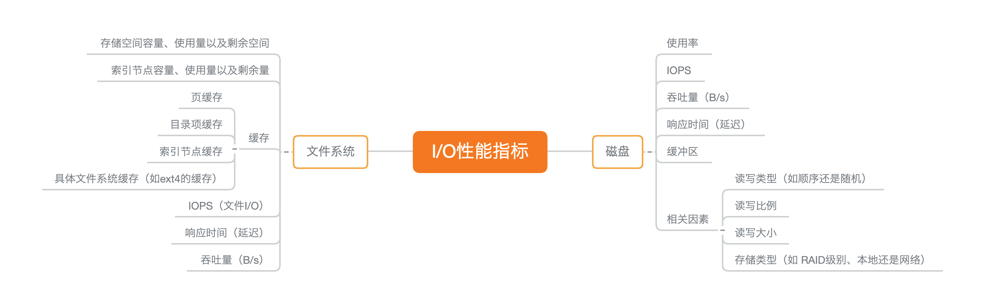
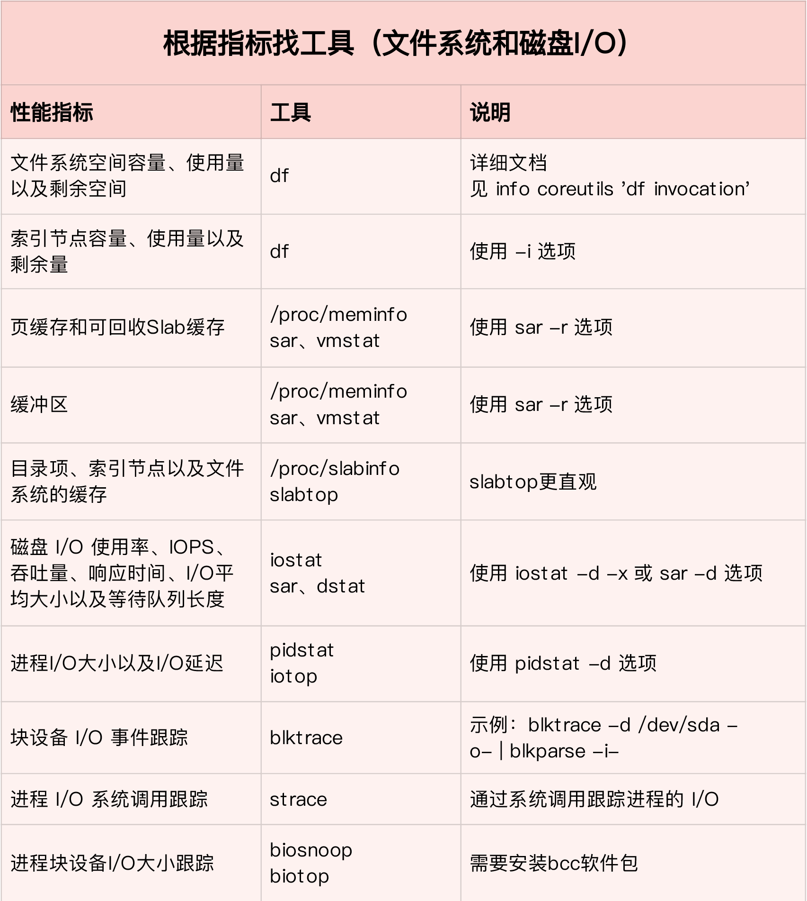
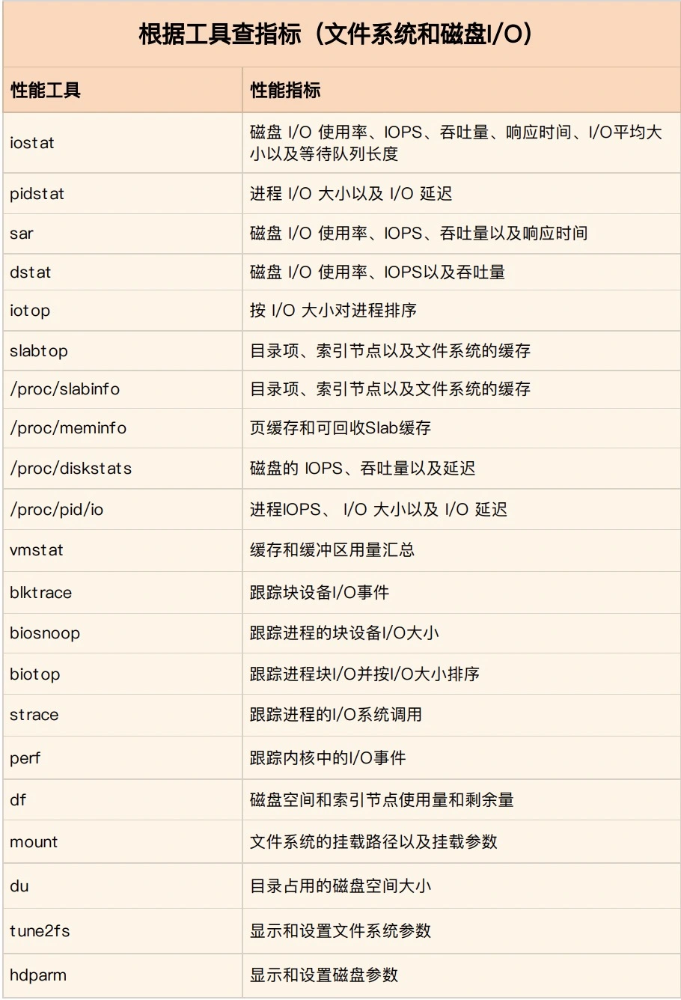
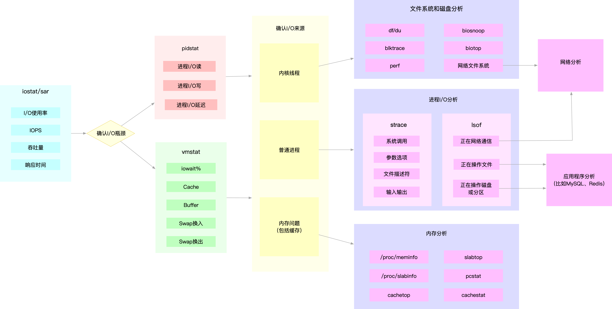

- 30 | 套路篇：如何迅速分析出系统I/O的瓶颈在哪里？ [src](https://portal.learn.woa.com/training/mooc/taskDetail?mooc_course_id=A9BWP7o7&task_id=81458) #《Linux性能优化实战》
	- 
	- io性能工具 #常用工具
		- 第一，在文件系统的原理中，我介绍了查看文件系统容量的工具 df。它既可以查看文件系统数据的空间容量，也可以查看索引节点的容量。至于文件系统缓存，我们通过 /proc/meminfo、/proc/slabinfo 以及 slabtop 等各种来源，观察页缓存、目录项缓存、索引节点缓存以及具体文件系统的缓存情况。
		- 第二，在磁盘 I/O 的原理中，我们分别用 iostat 和 pidstat 观察了磁盘和进程的 I/O 情况。它们都是最常用的 I/O 性能分析工具。通过 [[iostat ]]，我们可以得到磁盘的 I/O 使用率、吞吐量、响应时间以及 IOPS 等性能指标；而通过 [[pidstat]]，则可以观察到进程的 I/O 吞吐量以及块设备 I/O 的延迟等。
		- 第三，在狂打日志的案例中，我们先用 top 查看系统的 CPU 使用情况，发现 iowait 比较高；然后，又用 [[iostat ]]发现了磁盘的 I/O 使用率瓶颈，并用 [[pidstat]] 找出了大量 I/O 的进程；最后，通过 strace 和 lsof，我们找出了问题进程正在读写的文件，并最终锁定性能问题的来源——原来是进程在狂打日志。
		- 第四，在磁盘 I/O 延迟的单词热度案例中，我们同样先用 top、iostat ，发现磁盘有 I/O 瓶颈，并用 pidstat 找出了大量 I/O 的进程。可接下来，想要照搬上次操作的我们失败了。在随后的 strace 命令中，我们居然没看到 write 系统调用。于是，我们换了一个思路，用新工具 [[filetop ]]和 [[opensnoop]]，从内核中跟踪系统调用，最终找出瓶颈的来源。
		- 最后，在 MySQL 和 Redis 的案例中，同样的思路，我们先用 top、iostat 以及 pidstat ，确定并找出 I/O 性能问题的瓶颈来源，它们正是 mysqld 和 redis-server。随后，我们又用 strace+[[lsof]]找出了它们正在读写的文件。
		- **从文件系统和磁盘 I/O 的性能指标出发** #常用工具
		  
		- **从工具出发** #常用工具
		  
	- I/O 性能瓶颈定位流程 #iostat、#vmstat、#pidstat 常用工具
		- 
- 31 | 套路篇：磁盘 I/O 性能优化的几个思路 [src](https://portal.learn.woa.com/training/mooc/taskDetail?mooc_course_id=A9BWP7o7&task_id=81459) #《Linux性能优化实战》
	- I/O 基准测试
		- [fio](https://github.com/axboe/fio)（Flexible I/O Tester）正是最常用的文件系统和磁盘 I/O 性能基准测试工具
			- 它提供了大量的可定制化选项，可以用来测试，裸盘或者文件系统在各种场景下的 I/O 性能，包括了不同块大小、不同 I/O 引擎以及是否使用缓存等场景。
			- ```
			  # 随机读
			  fio -name=randread -direct=1 -iodepth=64 -rw=randread -ioengine=libaio -bs=4k -size=1G -numjobs=1 -runtime=1000 -group_reporting -filename=/dev/sdb
			  
			  # 随机写
			  fio -name=randwrite -direct=1 -iodepth=64 -rw=randwrite -ioengine=libaio -bs=4k -size=1G -numjobs=1 -runtime=1000 -group_reporting -filename=/dev/sdb
			  
			  # 顺序读
			  fio -name=read -direct=1 -iodepth=64 -rw=read -ioengine=libaio -bs=4k -size=1G -numjobs=1 -runtime=1000 -group_reporting -filename=/dev/sdb
			  
			  # 顺序写
			  fio -name=write -direct=1 -iodepth=64 -rw=write -ioengine=libaio -bs=4k -size=1G -numjobs=1 -runtime=1000 -group_reporting -filename=/dev/sdb
			  ```
				- direct，表示是否跳过系统缓存。上面示例中，我设置的 1 ，就表示跳过系统缓存。
				- iodepth，表示使用异步 I/O（asynchronous I/O，简称 AIO）时，同时发出的 I/O 请求上限。在上面的示例中，我设置的是 64。
				- rw，表示 I/O 模式。我的示例中， read/write 分别表示顺序读 / 写，而 randread/randwrite 则分别表示随机读 / 写。
				- ioengine，表示 I/O 引擎，它支持同步（sync）、异步（libaio）、内存映射（mmap）、网络（net）等各种 I/O 引擎。上面示例中，我设置的 libaio 表示使用异步 I/O。
				- bs，表示 I/O 的大小。示例中，我设置成了 4K（这也是默认值）。
				- filename，表示文件路径，当然，它可以是磁盘路径（测试磁盘性能），也可以是文件路径（测试文件系统性能）。示例中，我把它设置成了磁盘 /dev/sdb。不过注意，用磁盘路径测试写，会破坏这个磁盘中的文件系统，所以在使用前，你一定要事先做好数据备份。
			- fio 测试顺序读的一个报告示例
				- ```
				  read: (g=0): rw=read, bs=(R) 4096B-4096B, (W) 4096B-4096B, (T) 4096B-4096B, ioengine=libaio, iodepth=64
				  fio-3.1
				  Starting 1 process
				  Jobs: 1 (f=1): [R(1)][100.0%][r=16.7MiB/s,w=0KiB/s][r=4280,w=0 IOPS][eta 00m:00s]
				  read: (groupid=0, jobs=1): err= 0: pid=17966: Sun Dec 30 08:31:48 2018
				   read: IOPS=4257, BW=16.6MiB/s (17.4MB/s)(1024MiB/61568msec)
				    slat (usec): min=2, max=2566, avg= 4.29, stdev=21.76
				    clat (usec): min=228, max=407360, avg=15024.30, stdev=20524.39
				     lat (usec): min=243, max=407363, avg=15029.12, stdev=20524.26
				    clat percentiles (usec):
				     |  1.00th=[   498],  5.00th=[  1020], 10.00th=[  1319], 20.00th=[  1713],
				     | 30.00th=[  1991], 40.00th=[  2212], 50.00th=[  2540], 60.00th=[  2933],
				     | 70.00th=[  5407], 80.00th=[ 44303], 90.00th=[ 45351], 95.00th=[ 45876],
				     | 99.00th=[ 46924], 99.50th=[ 46924], 99.90th=[ 48497], 99.95th=[ 49021],
				     | 99.99th=[404751]
				   bw (  KiB/s): min= 8208, max=18832, per=99.85%, avg=17005.35, stdev=998.94, samples=123
				   iops        : min= 2052, max= 4708, avg=4251.30, stdev=249.74, samples=123
				  lat (usec)   : 250=0.01%, 500=1.03%, 750=1.69%, 1000=2.07%
				  lat (msec)   : 2=25.64%, 4=37.58%, 10=2.08%, 20=0.02%, 50=29.86%
				  lat (msec)   : 100=0.01%, 500=0.02%
				  cpu          : usr=1.02%, sys=2.97%, ctx=33312, majf=0, minf=75
				  IO depths    : 1=0.1%, 2=0.1%, 4=0.1%, 8=0.1%, 16=0.1%, 32=0.1%, >=64=100.0%
				     submit    : 0=0.0%, 4=100.0%, 8=0.0%, 16=0.0%, 32=0.0%, 64=0.0%, >=64=0.0%
				     complete  : 0=0.0%, 4=100.0%, 8=0.0%, 16=0.0%, 32=0.0%, 64=0.1%, >=64=0.0%
				     issued rwt: total=262144,0,0, short=0,0,0, dropped=0,0,0
				     latency   : target=0, window=0, percentile=100.00%, depth=64
				  - Run status group 0 (all jobs):
				   READ: bw=16.6MiB/s (17.4MB/s), 16.6MiB/s-16.6MiB/s (17.4MB/s-17.4MB/s), io=1024MiB (1074MB), run=61568-61568msec
				  - Disk stats (read/write):
				  sdb: ios=261897/0, merge=0/0, ticks=3912108/0, in_queue=3474336, util=90.09%
				  ```
				- slat、clat、lat 都是指 I/O 延迟（latency）。不同之处在于：
					- slat ，是指从 I/O 提交到实际执行 I/O 的时长（Submission latency）；
					- clat ，是指从 I/O 提交到 I/O 完成的时长（Completion latency）；
					- 而 lat ，指的是从 fio 创建 I/O 到 I/O 完成的总时长。
					- 对同步 I/O 来说，由于 I/O 提交和 I/O 完成是一个动作，所以 slat 实际上就是 I/O 完成的时间，而 clat 是 0。而从示例可以看到，使用异步 I/O（libaio）时，lat 近似等于 slat + clat 之和。
				- bw ，它代表吞吐量。在我上面的示例中，你可以看到，平均吞吐量大约是 16 MB（17005 KiB/1024）。
				- iops ，其实就是每秒 I/O 的次数，上面示例中的平均 IOPS 为 4250
			- [[fio]] 支持 I/O 的重放。借助前面提到过的 [[blktrace]]，再配合上 fio，就可以实现对应用程序 I/O 模式的基准测试。你需要先用 blktrace ，记录磁盘设备的 I/O 访问情况；然后使用 fio ，重放 blktrace 的记录。
				- ```
				  # 使用blktrace跟踪磁盘I/O，注意指定应用程序正在操作的磁盘
				  $ blktrace /dev/sdb
				  
				  # 查看blktrace记录的结果
				  # ls
				  sdb.blktrace.0  sdb.blktrace.1
				  
				  # 将结果转化为二进制文件
				  $ blkparse sdb -d sdb.bin
				  
				  # 使用fio重放日志
				  $ fio --name=replay --filename=/dev/sdb --direct=1 --read_iolog=sdb.bin
				  ```
		- 应用程序io性能优化 #card
		  id:: 65e576cd-c277-4cc1-a983-b44ca50a4b97
			- 第一，可以用追加写代替随机写，减少寻址开销，加快 I/O 写的速度。
			- 第二，可以借助缓存 I/O ，充分利用系统缓存，降低实际 I/O 的次数。
			- 第三，可以在应用程序内部构建自己的缓存，或者用 Redis 这类外部缓存系统
			- 第四，在需要频繁读写同一块磁盘空间时，可以用 mmap 代替 read/write，减少内存的拷贝次数。
			- 第五，在需要同步写的场景中，尽量将写请求合并，而不是让每个请求都同步写入磁盘，即可以用 fsync() 取代 O_SYNC。
			- 第六，在多个应用程序共享相同磁盘时，为了保证 I/O 不被某个应用完全占用，推荐你使用 cgroups 的 I/O 子系统，来限制进程 / 进程组的 IOPS 以及吞吐量。
			- 最后，在使用 CFQ 调度器时，可以用 ionice 来调整进程的 I/O 调度优先级，特别是提高核心应用的 I/O 优先级。ionice 支持三个优先级类：Idle、Best-effort 和 Realtime。其中， Best-effort 和 Realtime 还分别支持 0-7 的级别，数值越小，则表示优先级别越高。
		- 文件系统io性能优化 #card
		  id:: 65e576cd-8c04-47d7-9659-9bce94b7dec3
			- 第一，你可以根据实际负载场景的不同，选择最适合的文件系统。
				- 比如 Ubuntu 默认使用 ext4 文件系统，而 CentOS 7 默认使用 xfs 文件系统。相比于 ext4 ，xfs 支持更大的磁盘分区和更大的文件数量，如 xfs 支持大于 16TB 的磁盘。但是 xfs 文件系统的缺点在于无法收缩，而 ext4 则可以。
			- 第二，在选好文件系统后，还可以进一步优化文件系统的配置选项，包括文件系统的特性（如 ext_attr、dir_index）、日志模式（如 journal、ordered、writeback）、挂载选项（如 noatime）等等。
				- 比如，  使用 [[tune2fs]]这个工具，可以调整文件系统的特性（tune2fs 也常用来查看文件系统超级块的内容）。 而通过 /etc/fstab ，或者 mount 命令行参数，我们可以调整文件系统的日志模式和挂载选项等。
			- 第三，可以优化文件系统的缓存。
				- 比如，你可以优化 pdflush 脏页的刷新频率（比如设置 dirty_expire_centisecs 和 dirty_writeback_centisecs）以及脏页的限额（比如调整 dirty_background_ratio 和 dirty_ratio 等）。
				- 再如，你还可以优化内核回收目录项缓存和索引节点缓存的倾向，即调整 vfs_cache_pressure（/proc/sys/vm/vfs_cache_pressure，默认值 100），数值越大，就表示越容易回收。
			- 最后，在不需要持久化时，你还可以用内存文件系统  tmpfs，以获得更好的 I/O 性能 。tmpfs 把数据直接保存在内存中，而不是磁盘中。比如 /dev/shm/ ，就是大多数 Linux 默认配置的一个内存文件系统，它的大小默认为总内存的一半。
		- 磁盘io性能优化 #card
		  id:: 65e576cd-345a-4b2b-bd45-a6099969d3c7
			- 第一，最简单有效的优化方法，就是换用性能更好的磁盘，比如用 SSD 替代 HDD。
			- 第二，我们可以使用 RAID ，把多块磁盘组合成一个逻辑磁盘，构成冗余独立磁盘阵列。这样做既可以提高数据的可靠性，又可以提升数据的访问性能。
			- 第三，针对磁盘和应用程序 I/O 模式的特征，我们可以选择最适合的 I/O 调度算法。比方说，SSD 和虚拟机中的磁盘，通常用的是 noop 调度算法。而数据库应用，我更推荐使用 deadline 算法。
			- 第四，我们可以对应用程序的数据，进行磁盘级别的隔离。比如，我们可以为日志、数据库等 I/O 压力比较重的应用，配置单独的磁盘。
			- 第五，在顺序读比较多的场景中，我们可以增大磁盘的预读数据，比如，你可以通过下面两种方法，调整 /dev/sdb 的预读大小。
				- 调整内核选项 /sys/block/sdb/queue/read_ahead_kb，默认大小是 128 KB，单位为 KB。
				- 使用 blockdev 工具设置，比如 blockdev --setra 8192 /dev/sdb，注意这里的单位是 512B（0.5KB），所以它的数值总是 read_ahead_kb 的两倍。
			- 第六，我们可以优化内核块设备 I/O 的选项。比如，可以调整磁盘队列的长度 /sys/block/sdb/queue/nr_requests，适当增大队列长度，可以提升磁盘的吞吐量（当然也会导致 I/O 延迟增大）。
			- 最后，要注意，磁盘本身出现硬件错误，也会导致 I/O 性能急剧下降，所以发现磁盘性能急剧下降时，你还需要确认，磁盘本身是不是出现了硬件错误。
				- 比如，你可以查看 dmesg 中是否有硬件 I/O 故障的日志。
				  还可以使用 [[badblocks]]、[[smartctl]]等工具，检测磁盘的硬件问题，或用 [[e2fsck]]等来检测文件系统的错误。如果发现问题，你可以使用 [[fsck]]等工具来修复。
- linux下blktrace+fio实现块设备访问模式的回放 [src](https://deeper-think.github.io/2014/01/24/io-replay.html)
	- [[blktrace]]依赖于kernel的[[tracepoint]]，因此使用blktrace之前需要挂载[[debugfs]]文件系统:
	  ```
	  mount –t debugfs debugfs /sys/kernel/debug
	  ```
- 32 | 答疑（四）：阻塞、非阻塞 I/O 与同步、异步 I/O 的区别和联系 [src](https://portal.learn.woa.com/training/mooc/taskDetail?mooc_course_id=A9BWP7o7&task_id=81460) #《Linux性能优化实战》
	- 执行 find 命令时，会不会导致系统的缓存升高呢？
		- 文件名以及文件之间的目录关系，都放在目录项缓存中。而这是一个基于内存的数据结构，会根据需要动态构建。所以，查找文件时，Linux 就会动态构建不在缓存中的目录项结构，导致 [[dentry]]缓存升高。
		- 事实上，除了目录项缓存增加，Buffer 的使用也会增加。因为，构建目录项缓存所需的元数据（比如文件名称、索引节点等），需要从文件系统中读取。
	-