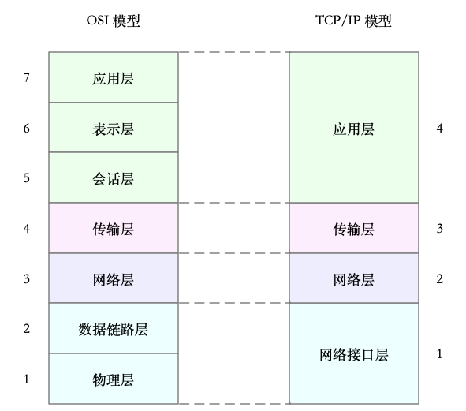
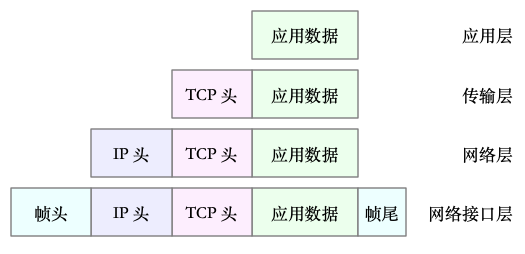
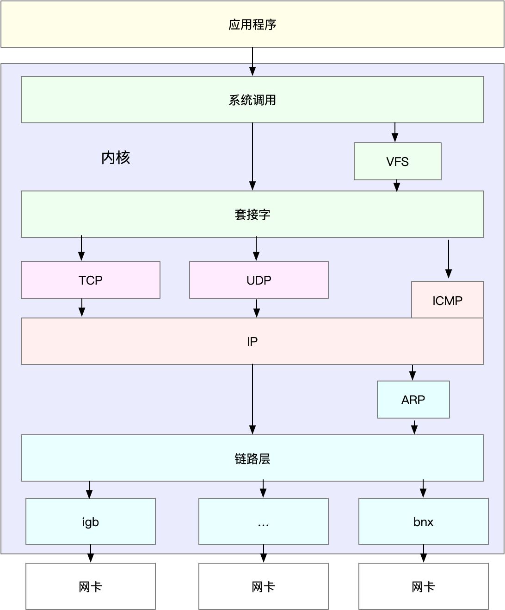
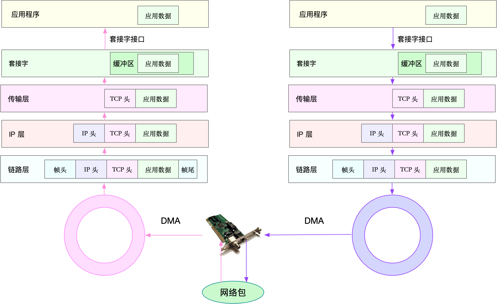

- 33 | 关于 Linux 网络，你必须知道这些（上） [src](https://portal.learn.woa.com/training/mooc/taskDetail?mooc_course_id=A9BWP7o7&task_id=81462) #《Linux性能优化实战》
	- TCP/IP 模型，把网络互联的框架分为四层
	  collapsed:: true
		- 应用层，负责向用户提供一组应用程序，比如 HTTP、FTP、DNS 等。
		- 传输层，负责端到端的通信，比如 TCP、UDP 等。
		- 网络层，负责网络包的封装、寻址和路由，比如 IP、[[ICMP]] 等。
		- 网络接口层，负责网络包在物理网络中的传输，比如 MAC 寻址、错误侦测以及通过网卡传输网络帧等。
		- 
		-
	- TCP 协议通信的网络包 #card
	  id:: 65efcb91-9ca0-4162-af46-7271ae1508dd
	  collapsed:: true
		- 
	- Linux 通用 IP 网络栈 #card
	  id:: 65efcb91-cd05-4860-8493-7584f3a874e7
	  collapsed:: true
		- 
	- Linux 网络收发流程 #card
	  id:: 65efcb91-54f9-4b81-b5ae-1eb25639919e
	  collapsed:: true
		- 接收
		  collapsed:: true
			- 当一个网络帧到达网卡后，网卡会通过 DMA 方式，把这个网络包放到收包队列中；然后通过硬中断，告诉中断处理程序已经收到了网络包。
			- 接着，网卡中断处理程序会为网络帧分配内核数据结构（sk_buff），并将其拷贝到 sk_buff 缓冲区中；然后再通过软中断，通知内核收到了新的网络帧。
			- 接下来，内核协议栈从缓冲区中取出网络帧，并通过网络协议栈，从下到上逐层处理这个网络帧。
			  collapsed:: true
				- 在链路层检查报文的合法性，找出上层协议的类型（比如 IPv4 还是 IPv6），再去掉帧头、帧尾，然后交给网络层。
				- 网络层取出 IP 头，判断网络包下一步的走向，比如是交给上层处理还是转发。当网络层确认这个包是要发送到本机后，就会取出上层协议的类型（比如 TCP 还是 UDP），去掉 IP 头，再交给传输层处理。
				- 传输层取出 TCP 头或者 UDP 头后，根据 < 源 IP、源端口、目的 IP、目的端口 > 四元组作为标识，找出对应的 Socket，并把数据拷贝到 Socket 的接收缓存中。
		- 发送
		  collapsed:: true
			- 首先，应用程序调用 Socket API（比如 sendmsg）发送网络包。
			- 由于这是一个系统调用，所以会陷入到内核态的套接字层中。套接字层会把数据包放到 Socket 发送缓冲区中。
			- 接下来，网络协议栈从 Socket 发送缓冲区中，取出数据包；再按照 TCP/IP 栈，从上到下逐层处理。比如，传输层和网络层，分别为其增加 TCP 头和 IP 头，执行路由查找确认下一跳的 IP，并按照 [[MTU]] 大小进行分片。
			- 分片后的网络包，再送到网络接口层，进行物理地址寻址，以找到下一跳的 MAC 地址。然后添加帧头和帧尾，放到发包队列中。这一切完成后，会有软中断通知驱动程序：发包队列中有新的网络帧需要发送。
			- 最后，驱动程序通过 DMA ，从发包队列中读出网络帧，并通过物理网卡把它发送出去。
		- 
- 34 | 关于 Linux 网络，你必须知道这些（下）[src](https://portal.learn.woa.com/training/mooc/taskDetail?mooc_course_id=A9BWP7o7&task_id=81463) #《Linux性能优化实战》
	- 网络性能指标
		- **带宽**，表示链路的最大传输速率，单位通常为 b/s （比特 / 秒）。
		- **吞吐量**，表示单位时间内成功传输的数据量，单位通常为 b/s（比特 / 秒）或者 B/s（字节 / 秒）。吞吐量受带宽限制，而吞吐量 / 带宽，也就是该网络的使用率。
		- **延时**，表示从网络请求发出后，一直到收到远端响应，所需要的时间延迟。在不同场景中，这一指标可能会有不同含义。比如，它可以表示，建立连接需要的时间（比如 TCP 握手延时），或一个数据包往返所需的时间（比如 RTT）。
		- **[[PPS]]**，是 Packet Per Second（包 / 秒）的缩写，表示以网络包为单位的传输速率。**PPS 通常用来评估网络的转发能力，比如硬件交换机**，通常可以达到线性转发（即 PPS 可以达到或者接近理论最大值）。而基于 Linux 服务器的转发，则容易受网络包大小的影响。
		- 除了这些指标，**网络的可用性**（网络能否正常通信）、**并发连接数**（TCP 连接数量）、**丢包率**（丢包百分比）、**重传率**（重新传输的网络包比例）等也是常用的性能指标。
	- ifconfig 和 ip 分别属于软件包 net-tools 和 iproute2，iproute2 是 net-tools 的下一代。通常情况下它们会在发行版中默认安装。但如果你找不到 ifconfig 或者 ip 命令，可以安装这两个软件包。 #常用工具
		- ```
		  $ ifconfig eth0
		  eth0: flags=4163<UP,BROADCAST,RUNNING,MULTICAST> mtu 1500
		        inet 10.240.0.30 netmask 255.240.0.0 broadcast 10.255.255.255
		        inet6 fe80::20d:3aff:fe07:cf2a prefixlen 64 scopeid 0x20<link>
		        ether 78:0d:3a:07:cf:3a txqueuelen 1000 (Ethernet)
		        RX packets 40809142 bytes 9542369803 (9.5 GB)
		        RX errors 0 dropped 0 overruns 0 frame 0
		        TX packets 32637401 bytes 4815573306 (4.8 GB)
		        TX errors 0 dropped 0 overruns 0 carrier 0 collisions 0
		  ​
		  $ ip -s addr show dev eth0
		  2: eth0: <BROADCAST,MULTICAST,UP,LOWER_UP> mtu 1500 qdisc mq state UP group default qlen 1000
		    link/ether 78:0d:3a:07:cf:3a brd ff:ff:ff:ff:ff:ff
		    inet 10.240.0.30/12 brd 10.255.255.255 scope global eth0
		        valid_lft forever preferred_lft forever
		    inet6 fe80::20d:3aff:fe07:cf2a/64 scope link
		        valid_lft forever preferred_lft forever
		    RX: bytes packets errors dropped overrun mcast
		     9542432350 40809397 0       0       0       193
		    TX: bytes packets errors dropped carrier collsns
		     4815625265 32637658 0       0       0       0
		  ```
		- [[MTU]]默认大小是 1500，根据网络架构的不同（比如是否使用了 VXLAN 等叠加网络），你可能需要调大或者调小 MTU 的数值。
		- 网络收发的字节数、包数、错误数以及丢包情况，特别是 TX 和 RX 部分的 errors、dropped、overruns、carrier 以及 collisions 等指标不为 0 时，通常表示出现了网络 I/O 问题。其中：
			- errors 表示发生错误的数据包数，比如校验错误、帧同步错误等；
			- dropped 表示 丢弃 的数据包数，即数据包已经收到了 Ring Buffer，但因为内存不足等原因丢包；
			- overruns 表示超限数据包数，即网络 I/O 速度过快，导致 [[Ring Buffer]] 中的数据包来不及处理（队列满）而导致的[[丢包]]；
			- carrier 表示发生 carrirer 错误的数据包数，比如双工模式不匹配、物理电缆出现问题等；
			- collisions 表示碰撞数据包数。
		- ifconfig 和 ip 只显示了网络接口收发数据包的统计信息
	- 用 [[netstat]] 或者 [[ss]] ，来查看套接字、网络栈、网络接口以及路由表的信息。更推荐使用 ss 来查询网络的连接信息，因为它比 netstat 提供了更好的性能（速度更快）。 #常用工具
		- ```
		  # head -n 3 表示只显示前面3行
		  # -l 表示只显示监听套接字
		  # -n 表示显示数字地址和端口(而不是名字)
		  # -p 表示显示进程信息
		  $ netstat -nlp | head -n 3
		  Active Internet connections (only servers)
		  Proto Recv-Q Send-Q Local Address           Foreign Address         State       PID/Program name
		  tcp        0      0 127.0.0.53:53           0.0.0.0:*               LISTEN      840/systemd-resolve
		  
		  # -l 表示只显示监听套接字
		  # -t 表示只显示 TCP 套接字
		  # -n 表示显示数字地址和端口(而不是名字)
		  # -p 表示显示进程信息
		  $ ss -ltnp | head -n 3
		  State    Recv-Q    Send-Q        Local Address:Port        Peer Address:Port
		  LISTEN   0         128           127.0.0.53%lo:53               0.0.0.0:*        users:(("systemd-resolve",pid=840,fd=13))
		  LISTEN   0         128                 0.0.0.0:22               0.0.0.0:*        users:(("sshd",pid=1459,fd=3))
		  ```
		- 接收队列（[[Recv-Q]]）和发送队列（[[Send-Q]]）需要你特别关注，它们通常应该是 0。当你发现它们不是 0 时，说明有网络包的堆积发生。当然还要注意，在不同套接字状态下，它们的含义不同。 #card
		  id:: 65efcb91-ed90-40c4-9b17-32cd62c84d88
			- 当套接字处于连接状态（Established）时，
				- Recv-Q 表示套接字缓冲还没有被应用程序取走的字节数（即接收队列长度）。
				- 而 Send-Q 表示还没有被远端主机确认的字节数（即发送队列长度）。
			- 当套接字处于监听状态（Listening）时，
				- Recv-Q 表示全连接队列的长度。
				- 而 Send-Q 表示全连接队列的最大长度。
			- 所谓全连接，是指服务器收到了客户端的 ACK，完成了 TCP 三次握手，然后就会把这个连接挪到全连接队列中。这些全连接中的套接字，还需要被 accept() 系统调用取走，服务器才可以开始真正处理客户端的请求。
			- 与全连接队列相对应的，还有一个半连接队列。所谓半连接是指还没有完成 TCP 三次握手的连接，连接只进行了一半。服务器收到了客户端的 SYN 包后，就会把这个连接放到半连接队列中，然后再向客户端发送 SYN+ACK 包。
		- 协议栈统计信息
			- ```
			  $ netstat -s
			  ...
			  Tcp:
			      3244906 active connection openings
			      23143 passive connection openings
			      115732 failed connection attempts
			      2964 connection resets received
			      1 connections established
			      13025010 segments received
			      17606946 segments sent out
			      44438 segments retransmitted
			      42 bad segments received
			      5315 resets sent
			      InCsumErrors: 42
			  ...
			  
			  $ ss -s
			  Total: 186 (kernel 1446)
			  TCP:   4 (estab 1, closed 0, orphaned 0, synrecv 0, timewait 0/0), ports 0
			  
			  Transport Total     IP        IPv6
			  *    1446      -         -
			  RAW    2         1         1
			  UDP    2         2         0
			  TCP    4         3         1
			  ...
			  ```
			- ss 只显示已经连接、关闭、孤儿套接字等简要统计，而 netstat 则提供的是更详细的网络协议栈信息。
	- [[sar]]网络吞吐和 PPS：给 sar 增加 -n 参数就可以查看网络的统计信息，比如网络接口（DEV）、网络接口错误（EDEV）、TCP、UDP、ICMP 等等。执行下面的命令，你就可以得到网络接口统计信息： #常用工具
		- ```
		  # 数字1表示每隔1秒输出一组数据
		  $ sar -n DEV 1
		  Linux 4.15.0-1035 (ubuntu)   01/06/19   _x86_64_  (2 CPU)
		  
		  13:21:40        IFACE   rxpck/s   txpck/s    rxkB/s    txkB/s   rxcmp/s   txcmp/s  rxmcst/s   %ifutil
		  13:21:41         eth0     18.00     20.00      5.79      4.25      0.00      0.00      0.00      0.00
		  13:21:41      docker0      0.00      0.00      0.00      0.00      0.00      0.00      0.00      0.00
		  13:21:41           lo      0.00      0.00      0.00      0.00      0.00      0.00      0.00      0.00
		  ```
		- rxpck/s 和 txpck/s 分别是接收和发送的 PPS，单位为包 / 秒。
		- rxkB/s 和 txkB/s 分别是接收和发送的吞吐量，单位是 KB/ 秒。
		- rxcmp/s 和 txcmp/s 分别是接收和发送的压缩数据包数，单位是包 / 秒。
		- %ifutil 是网络接口的使用率，即半双工模式下为 (rxkB/s+txkB/s)/Bandwidth，而全双工模式下为 max(rxkB/s, txkB/s)/Bandwidth。
		- 其中，Bandwidth 可以用 [[ethtool]] 来查询，它的单位通常是 Gb/s 或者 Mb/s，不过注意这里小写字母 b ，表示比特而不是字节。我们通常提到的千兆网卡、万兆网卡等，单位也都是比特。如下你可以看到，我的 eth0 网卡就是一个千兆网卡：
		  ```
		  $ ethtool eth0 | grep Speed
		    Speed: 1000Mb/s
		  ```
	- 通常使用 [[ping]] ，来测试远程主机的连通性和延时，而这基于 [[ICMP]] 协议
		-