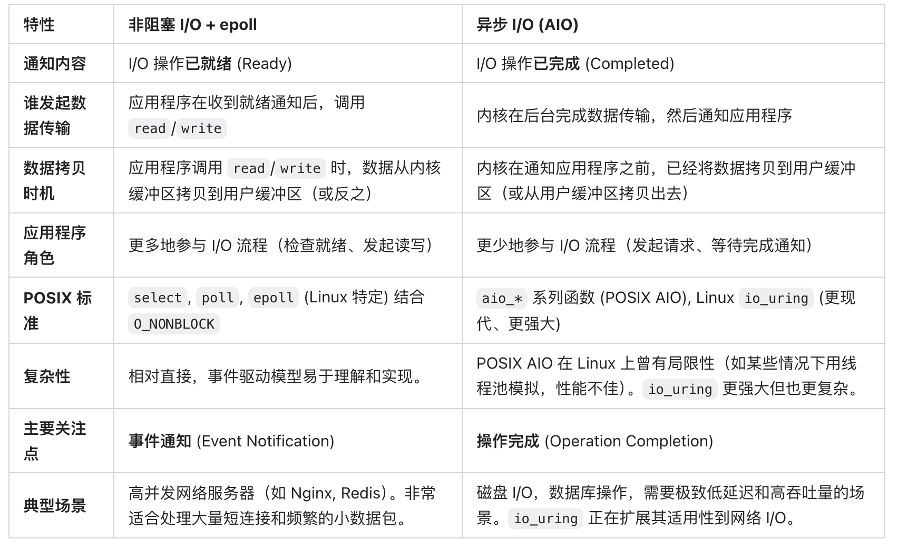
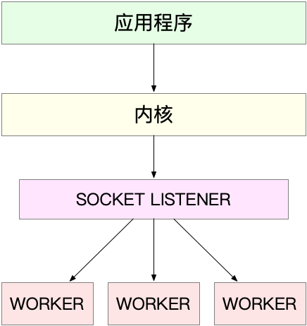
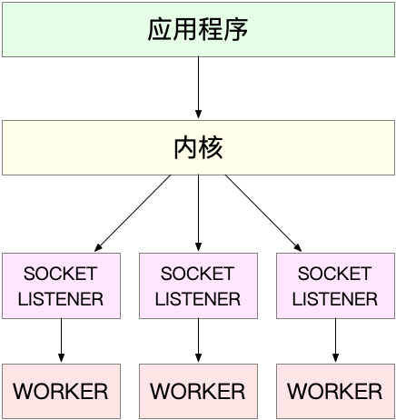
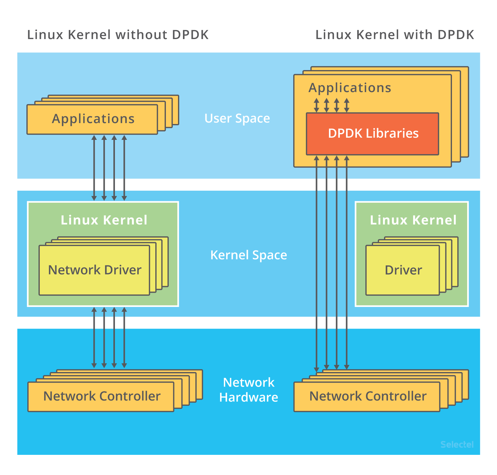
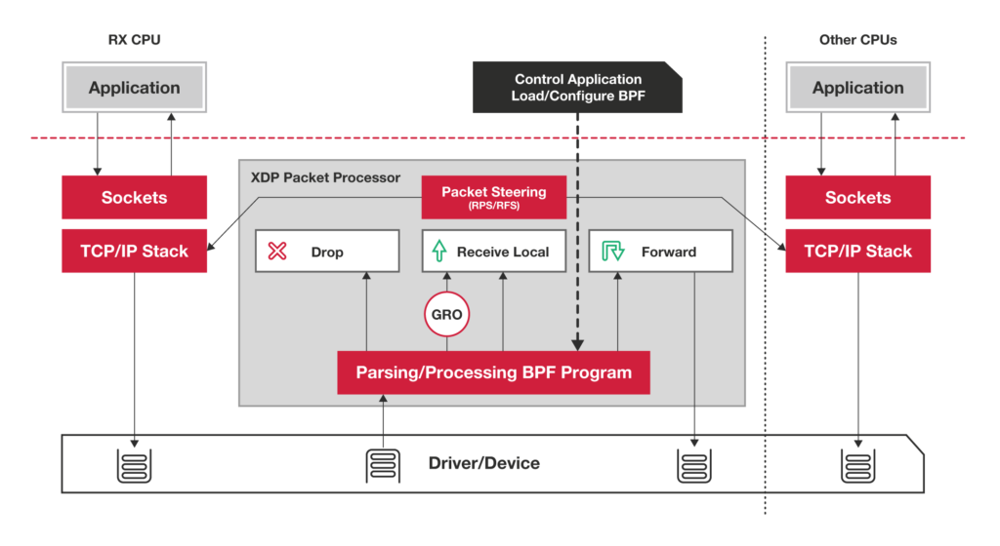
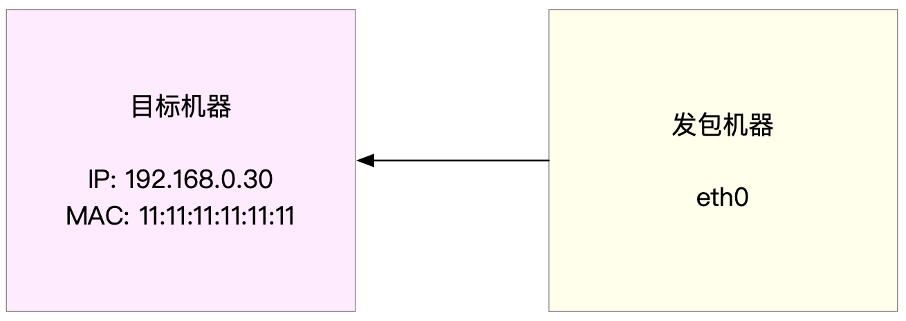

- 35 | 基础篇：C10K 和 C1000K 回顾 [src](https://portal.learn.woa.com/training/mooc/taskDetail?mooc_course_id=A9BWP7o7&task_id=81464) #《Linux性能优化实战》
  id:: 65e53422-94c9-4652-8179-d7df05c526ae
	- C10K 和 C1000K 的首字母 C 是 Client 的缩写。C10K 就是单机同时处理 1 万个请求（并发连接 1 万）的问题，而 C1000K 也就是单机支持处理 100 万个请求（并发连接 100 万）的问题。
	- C10K 问题的根源，一方面在于系统有限的资源；另一方面，也是更重要的因素，是同步阻塞的 I/O 模型以及轮询的套接字接口，限制了网络事件的处理效率。Linux 2.6 中引入的 epoll ，完美解决了 C10K 的问题，现在的高性能网络方案都基于 epoll。
		- 说到 I/O 的模型，我在文件系统的原理中，曾经介绍过文件 I/O，其实网络 I/O 模型也类似。在 C10K 以前，Linux 中网络处理都用同步阻塞的方式，也就是每个请求都分配一个进程或者线程。请求数只有 100 个时，这种方式自然没问题，但增加到 10000 个请求时，10000 个进程或线程的调度、上下文切换乃至它们占用的内存，都会成为瓶颈。
		- ### I/O 模型优化 #card
		  id:: 65efcb92-0824-4a6d-93ce-b4973370030a
			- **第一种，使用非阻塞 I/O 和水平触发通知，比如使用 select 或者 poll。**
				- select 使用固定长度的位相量，表示文件描述符的集合，因此会有最大描述符数量的限制。比如，在 32 位系统中，默认限制是 1024。并且，在 select 内部，检查套接字状态是用轮询的方法，处理耗时跟描述符数量是 O(N) 的关系。
				- 而 poll 改进了 select 的表示方法，换成了一个没有固定长度的数组，这样就没有了最大描述符数量的限制（当然还会受到系统文件描述符限制）。但应用程序在使用 poll 时，同样需要对文件描述符列表进行轮询，这样，处理耗时跟描述符数量就是 O(N) 的关系。
				- 除此之外，应用程序每次调用 select 和 poll 时，还需要把文件描述符的集合，从用户空间传入内核空间，由内核修改后，再传出到用户空间中。这一来一回的内核空间与用户空间切换，也增加了处理成本。
			- **第二种，使用非阻塞 I/O 和边缘触发通知，比如 epoll**。
				- epoll 使用红黑树，在内核中管理文件描述符的集合，这样，就不需要应用程序在每次操作时都传入、传出这个集合。
				- epoll 使用事件驱动的机制，只关注有 I/O 事件发生的文件描述符，不需要轮询扫描整个集合。
				- epoll 是在 Linux 2.6 中才新增的功能（2.4 虽然也有，但功能不完善）。由于边缘触发只在文件描述符可读或可写事件发生时才通知，那么应用程序就需要尽可能多地执行 I/O，并要处理更多的异常事件。
			- **第三种，使用异步 I/O（Asynchronous I/O，简称为 AIO）**
				- 异步 I/O 允许应用程序同时发起很多 I/O 操作，而不用等待这些操作完成。而在 I/O 完成后，系统会用事件通知（比如信号或者回调函数）的方式，告诉应用程序。这时，应用程序才会去查询 I/O 操作的结果。
				- 异步 I/O 也是到了 Linux 2.6 才支持的功能，并且在很长时间里都处于不完善的状态，比如 glibc 提供的异步 I/O 库，就一直被社区诟病。同时，由于异步 I/O 跟我们的直观逻辑不太一样，想要使用的话，一定要小心设计，其使用难度比较高。
			- from [monica](https://monica.im/share/chat?shareId=bd2qrOLpjEj2gVLh)
				- 
				- 在过去，Linux 上的 POSIX AIO 对网络套接字的支持并不完善，很多时候其异步性是通过在用户空间创建线程池来模拟的，这可能不如 `epoll` 高效。然而，**`io_uring` 的出现彻底改变了 Linux 上异步 I/O 的格局**。它提供了真正的、高性能的内核级异步接口，不仅适用于磁盘 I/O，也越来越多地被用于网络 I/O，并被认为是下一代 Linux I/O 的方向。
				- 如果你的主要需求是传统的网络服务器，处理大量并发连接，`epoll` 仍然是一个非常好的选择。如果你追求极致的性能，特别是对于存储 I/O，或者希望利用更现代、功能更丰富的异步接口，那么 `io_uring` 是值得深入研究和采用的。对于新的高性能项目，`io_uring` 正在成为越来越有吸引力的选择。
		- ### 工作模型优化
			- **第一种，主进程 + 多个 worker 子进程，这也是最常用的一种模型**。
				- 这种方法的一个通用工作模式就是： 
				- 主进程执行 bind() + listen() 后，创建多个子进程；
				- 然后，在每个子进程中，都通过 accept() 或 epoll_wait() ，来处理相同的套接字。
				- 这里要注意，accept() 和 epoll_wait() 调用，还存在一个惊群的问题。换句话说，当网络 I/O 事件发生时，多个进程被同时唤醒，但实际上只有一个进程来响应这个事件，其他被唤醒的进程都会重新休眠。
					- 其中，accept() 的惊群问题，已经在 Linux 2.6 中解决了；
					- 而 epoll 的问题，到了 Linux 4.5 ，才通过 EPOLLEXCLUSIVE 解决。
					- 为了避免惊群问题， Nginx 在每个 worker 进程中，都增加一个了全局锁（accept_mutex）。这些 worker 进程需要首先竞争到锁，只有竞争到锁的进程，才会加入到 epoll 中，这样就确保只有一个 worker 子进程被唤醒。
					- 那为什么使用多进程模式的 Nginx ，却具有非常好的性能呢？
						- 最主要的一个原因就是，这些 worker 进程，实际上并不需要经常创建和销毁，而是在没任务时休眠，有任务时唤醒。只有在 worker 由于某些异常退出时，主进程才需要创建新的进程来代替它。
						- 当然，你也可以用线程代替进程：主线程负责套接字初始化和子线程状态的管理，而子线程则负责实际的请求处理。由于线程的调度和切换成本比较低，实际上你可以进一步把 epoll_wait() 都放到主线程中，保证每次事件都只唤醒主线程，而子线程只需要负责后续的请求处理。
				- **第二种，监听到相同端口的多进程模型**。
					- 在这种方式下，所有的进程都监听相同的接口，并且开启 SO_REUSEPORT 选项，由内核负责将请求负载均衡到这些监听进程中去。
					- 
					- 不过要注意，想要使用 SO_REUSEPORT 选项，需要用 Linux 3.9 以上的版本才可以。Nginx 在 1.9.1 中就已经支持了这种模式。
	- 从 C10K 到 C100K ，可能只需要增加系统的物理资源就可以满足；但从 C100K 到 C1000K ，就不仅仅是增加物理资源就能解决的问题了。这时，就需要多方面的优化工作了，从硬件的中断处理和网络功能卸载、到网络协议栈的文件描述符数量、连接状态跟踪、缓存队列等内核的优化，再到应用程序的工作模型优化，都是考虑的重点。
		- 很快，原来的 C10K 已经不能满足需求，所以又有了 C100K 和 C1000K，也就是并发从原来的 1 万增加到 10 万、乃至 100 万。从 1 万到 10 万，其实还是基于 C10K 的这些理论，epoll 配合线程池，再加上 CPU、内存和网络接口的性能和容量提升。
		- C1000K
			- 首先从物理资源使用上来说，100 万个请求需要大量的系统资源。比如，
				- 假设每个请求需要 16KB 内存的话，那么总共就需要大约 15 GB 内存。
				- 而从带宽上来说，假设只有 20% 活跃连接，即使每个连接只需要 1KB/s 的吞吐量，总共也需要 1.6 Gb/s 的吞吐量。千兆网卡显然满足不了这么大的吞吐量，所以还需要配置万兆网卡，或者基于多网卡 Bonding 承载更大的吞吐量。
			- 从软件资源上来说，大量的连接也会占用大量的软件资源，比如文件描述符的数量、连接状态的跟踪（CONNTRACK）、网络协议栈的缓存大小（比如套接字读写缓存、TCP 读写缓存）等等。
			- 最后，大量请求带来的中断处理，也会带来非常高的处理成本。这样，就需要多队列网卡、中断负载均衡、CPU 绑定、RPS/RFS（软中断负载均衡到多个 CPU 核上），以及将网络包的处理卸载（Offload）到网络设备（如 TSO/GSO、LRO/GRO、VXLAN OFFLOAD）等各种硬件和软件的优化。
			- C1000K 的解决方法，本质上还是构建在 epoll 的非阻塞 I/O 模型上。只不过，除了 I/O 模型之外，还需要从应用程序到 Linux 内核、再到 CPU、内存和网络等各个层次的深度优化，特别是需要借助硬件，来卸载那些原来通过软件处理的大量功能。
	- 再进一步，要实现 C10M ，就不只是增加物理资源，或者优化内核和应用程序可以解决的问题了。这时候，就需要用 XDP 的方式，在内核协议栈之前处理网络包；或者用 DPDK 直接跳过网络协议栈，在用户空间通过轮询的方式直接处理网络包。
		- [[DPDK]]，是用户态网络的标准。它跳过内核协议栈，直接由用户态进程通过轮询的方式，来处理网络接收。 
		  id:: 65e5a791-f23f-4c33-b05f-e3394a7fbe8d
			- 说起轮询，你肯定会下意识认为它是低效的象征，但是进一步反问下自己，它的低效主要体现在哪里呢？是查询时间明显多于实际工作时间的情况下吧！那么，换个角度来想，如果每时每刻都有新的网络包需要处理，轮询的优势就很明显了。比如：
				- 在 PPS 非常高的场景中，查询时间比实际工作时间少了很多，绝大部分时间都在处理网络包；
				- 而跳过内核协议栈后，就省去了繁杂的硬中断、软中断再到 Linux 网络协议栈逐层处理的过程，应用程序可以针对应用的实际场景，有针对性地优化网络包的处理逻辑，而不需要关注所有的细节。
			- 此外，DPDK 还通过大页、CPU绑定、内存对齐、流水线并发等多种机制，优化网络包的处理效率。
		- [[XDP]]（eXpress Data Path），则是 Linux 内核提供的一种高性能网络数据路径。它允许网络包，在进入内核协议栈之前，就进行处理，也可以带来更高的性能。XDP 底层跟我们之前用到的 bcc-tools 一样，都是基于 Linux 内核的 eBPF 机制实现的。
			- 
			- 你可以看到，XDP 对内核的要求比较高，需要的是 Linux [4.8 以上版本](https://github.com/iovisor/bcc/blob/master/docs/kernel-versions.md#xdp)，并且它也不提供缓存队列。基于 XDP 的应用程序通常是专用的网络应用，常见的有 IDS（入侵检测系统）、DDoS 防御、 [[cilium]] 容器网络插件等。
- 36 | 套路篇：怎么评估系统的网络性能？ [src](https://portal.learn.woa.com/training/mooc/taskDetail?mooc_course_id=A9BWP7o7&task_id=81465) #《Linux性能优化实战》
	- 要实现 C10M，就不是增加物理资源、调优内核和应用程序可以解决的问题了。这时内核中冗长的网络协议栈就成了最大的负担。
		- 需要用 XDP 方式，在内核协议栈之前，先处理网络包。
		- 或基于 DPDK ，直接跳过网络协议栈，在用户空间通过轮询的方式处理。
	- 各协议层的性能测试
		- 转发性能
			- Linux 内核自带的高性能网络测试工具 [pktgen](https://wiki.linuxfoundation.org/networking/pktgen)。[[pktgen]]支持丰富的自定义选项，方便你根据实际需要构造所需网络包，从而更准确地测试出目标服务器的性能。
				- 因为 pktgen 作为一个内核线程来运行，需要你加载 pktgen 内核模块后，再通过 /proc 文件系统来交互。
				- 下面就是 pktgen 启动的两个内核线程和 /proc 文件系统的交互文件：
				  ```
				  $ modprobe pktgen
				  $ ps -ef | grep pktgen | grep -v grep
				  root     26384     2  0 06:17 ?        00:00:00 [kpktgend_0]
				  root     26385     2  0 06:17 ?        00:00:00 [kpktgend_1]
				  $ ls /proc/net/pktgen/
				  kpktgend_0  kpktgend_1  pgctrl
				  ```
				- pktgen 在每个 CPU 上启动一个内核线程，并可以通过 /proc/net/pktgen 下面的同名文件，跟这些线程交互；而 pgctrl 则主要用来控制这次测试的开启和停止。
				- 如果 modprobe 命令执行失败，说明你的内核没有配置 CONFIG_NET_PKTGEN 选项。这就需要你配置 pktgen 内核模块（即 CONFIG_NET_PKTGEN=m）后，重新编译内核，才可以使用。
				- 在使用 pktgen 测试网络性能时，需要先给每个内核线程 kpktgend_X 以及测试网卡，配置 pktgen 选项，然后再通过 pgctrl 启动测试。
				- 以发包测试为例，假设发包机器使用的网卡是 eth0，而目标机器的 IP 地址为 192.168.0.30，MAC 地址为 11:11:11:11:11:11。 
				- 发包测试的示例
				  ```
				  # 定义一个工具函数，方便后面配置各种测试选项
				  function pgset() {
				      local result
				      echo $1 > $PGDEV
				  
				      result=`cat $PGDEV | fgrep "Result: OK:"`
				      if [ "$result" = "" ]; then
				           cat $PGDEV | fgrep Result:
				      fi
				  }
				  
				  # 为0号线程绑定eth0网卡
				  PGDEV=/proc/net/pktgen/kpktgend_0
				  pgset "rem_device_all"   # 清空网卡绑定
				  pgset "add_device eth0"  # 添加eth0网卡
				  
				  # 配置eth0网卡的测试选项
				  PGDEV=/proc/net/pktgen/eth0
				  pgset "count 1000000"    # 总发包数量
				  pgset "delay 5000"       # 不同包之间的发送延迟(单位纳秒)
				  pgset "clone_skb 0"      # SKB包复制
				  pgset "pkt_size 64"      # 网络包大小
				  pgset "dst 192.168.0.30" # 目的IP
				  pgset "dst_mac 11:11:11:11:11:11"  # 目的MAC
				  
				  # 启动测试
				  PGDEV=/proc/net/pktgen/pgctrl
				  pgset "start"
				  ```
					- 测试完成后，结果可以从 /proc 文件系统中获取
					  ```
					  $ cat /proc/net/pktgen/eth0
					  Params: count 1000000  min_pkt_size: 64  max_pkt_size: 64
					       frags: 0  delay: 0  clone_skb: 0  ifname: eth0
					       flows: 0 flowlen: 0
					  ...
					  Current:
					       pkts-sofar: 1000000  errors: 0
					       started: 1534853256071us  stopped: 1534861576098us idle: 70673us
					  ...
					  Result: OK: 8320027(c8249354+d70673) usec, 1000000 (64byte,0frags)
					    120191pps 61Mb/sec (61537792bps) errors: 0
					  ```
						- 第一部分的 Params 是测试选项；
						- 第二部分的 Current 是测试进度，其中， packts so far（pkts-sofar）表示已经发送了 100 万个包，也就表明测试已完成。
						- 第三部分的 Result 是测试结果，包含测试所用时间、网络包数量和分片、PPS、吞吐量以及错误数。
						- 根据上面的结果，我们发现，PPS 为 12 万，吞吐量为 61 Mb/s，没有发生错误。那么，12 万的 PPS 好不好呢？
						  
						  作为对比，你可以计算一下千兆交换机的 PPS。交换机可以达到线速（满负载时，无差错转发），它的 PPS 就是 1000Mbit 除以以太网帧的大小，即 1000Mbps/((64+20)*8bit) = 1.5 Mpps（其中，20B 为以太网帧前导和帧间距的大小）。
						  
						  你看，即使是千兆交换机的 PPS，也可以达到 150 万 PPS，比我们测试得到的 12 万大多了。所以，看到这个数值你并不用担心，现在的多核服务器和万兆网卡已经很普遍了，稍做优化就可以达到数百万的 PPS。而且，如果你用了上节课讲到的 DPDK 或 XDP ，还能达到千万数量级。
		- TCP/UDP 性能
			- 说到 TCP 和 UDP 的测试，我想你已经很熟悉了，甚至可能一下子就能想到相应的测试工具，比如 iperf 或者 netperf。特别是现在的云计算时代，在你刚拿到一批虚拟机时，首先要做的，应该就是用 iperf ，测试一下网络性能是否符合预期。
			- [[iperf]]
				- 服务端
					- ```
					  # -s表示启动服务端，-i表示汇报间隔，-p表示监听端口
					  $ iperf3 -s -i 1 -p 10000
					  ```
				- 客户端
					- ```
					  # -c表示启动客户端，192.168.0.30为目标服务器的IP
					  # -b表示目标带宽(单位是bits/s)
					  # -t表示测试时间
					  # -P表示并发数，-p表示目标服务器监听端口
					  $ iperf3 -c 192.168.0.30 -b 1G -t 15 -P 2 -p 10000
					  ```
				- 稍等一会儿（15 秒）测试结束后，回到目标服务器，查看 iperf 的报告：
				  ```
				  [ ID] Interval           Transfer     Bandwidth
				  ...
				  [SUM]   0.00-15.04  sec  0.00 Bytes  0.00 bits/sec                  sender
				  [SUM]   0.00-15.04  sec  1.51 GBytes   860 Mbits/sec                  receiver
				  ```
		- HTTP 性能
			- 要测试 HTTP 的性能，也有大量的工具可以使用，比如 ab、webbench 等，都是常用的 HTTP 压力测试工具。
			- [[ab]] 是 Apache 自带的 HTTP 压测工具，主要测试 HTTP 服务的每秒请求数、请求延迟、吞吐量以及请求延迟的分布情况等。
				- 客户端可以使用 Docker 启动一个 Nginx 服务，然后用 ab 来测试它的性能
				  ```
				  $ docker run -p 80:80 -itd nginx
				  ```
				- 在另一台机器上，运行 ab 命令，测试 Nginx 的性能
				  ```
				  # -c表示并发请求数为1000，-n表示总的请求数为10000
				  $ ab -c 1000 -n 10000 http://192.168.0.30/
				  ...
				  Server Software:        nginx/1.15.8
				  Server Hostname:        192.168.0.30
				  Server Port:            80
				  
				  ...
				  
				  Requests per second:    1078.54 [#/sec] (mean)
				  Time per request:       927.183 [ms] (mean)
				  Time per request:       0.927 [ms] (mean, across all concurrent requests)
				  Transfer rate:          890.00 [Kbytes/sec] received
				  
				  Connection Times (ms)
				                min  mean[+/-sd] median   max
				  Connect:        0   27 152.1      1    1038
				  Processing:     9  207 843.0     22    9242
				  Waiting:        8  207 843.0     22    9242
				  Total:         15  233 857.7     23    9268
				  
				  Percentage of the requests served within a certain time (ms)
				    50%     23
				    66%     24
				    75%     24
				    80%     26
				    90%    274
				    95%   1195
				    98%   2335
				    99%   4663
				   100%   9268 (longest request)
				  ```
		- 应用负载性能
			- 为了得到应用程序的实际性能，就要求性能工具本身可以模拟用户的请求负载，而 iperf、ab 这类工具就无能为力了。幸运的是，我们还可以用 wrk、TCPCopy、Jmeter 或者 LoadRunner 等实现这个目标。
			- [][wrk]]是一个 HTTP 性能测试工具，内置了 LuaJIT，方便你根据实际需求，生成所需的请求负载，或者自定义响应的处理方法。
				- ```
				  # -c表示并发连接数1000，-t表示线程数为2
				  $ wrk -c 1000 -t 2 http://192.168.0.30/
				  Running 10s test @ http://192.168.0.30/
				    2 threads and 1000 connections
				    Thread Stats   Avg      Stdev     Max   +/- Stdev
				      Latency    65.83ms  174.06ms   1.99s    95.85%
				      Req/Sec     4.87k   628.73     6.78k    69.00%
				    96954 requests in 10.06s, 78.59MB read
				    Socket errors: connect 0, read 0, write 0, timeout 179
				  Requests/sec:   9641.31
				  Transfer/sec:      7.82MB
				  ```