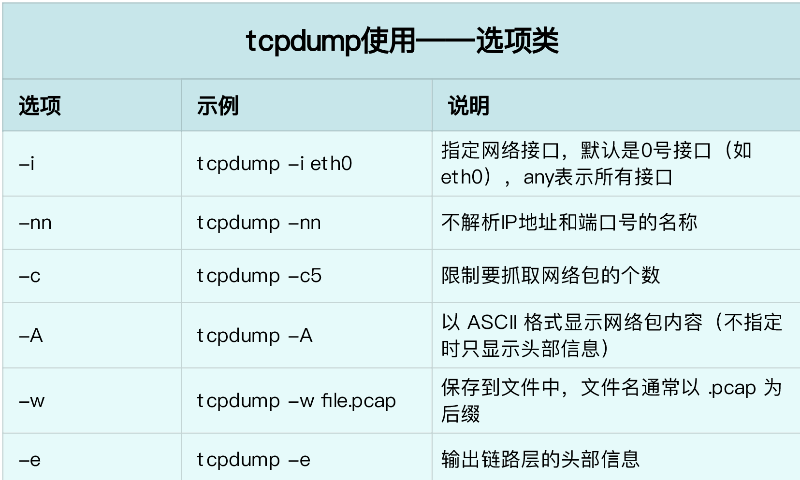
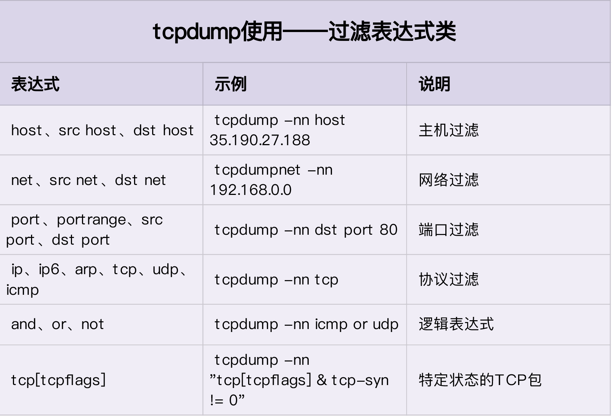
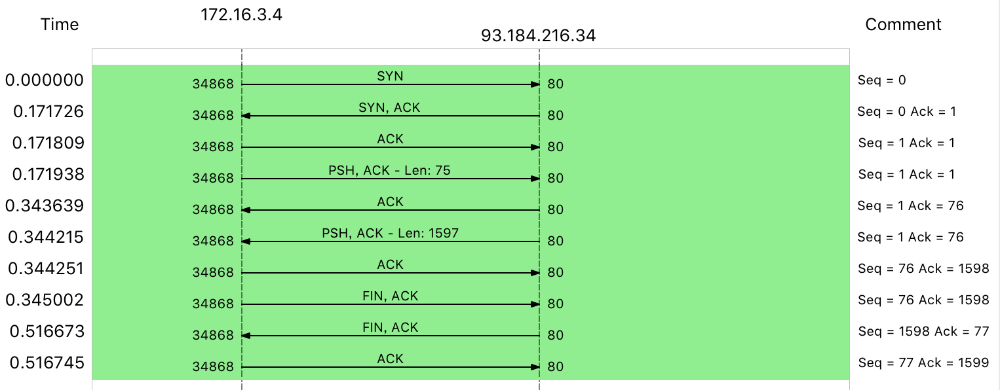
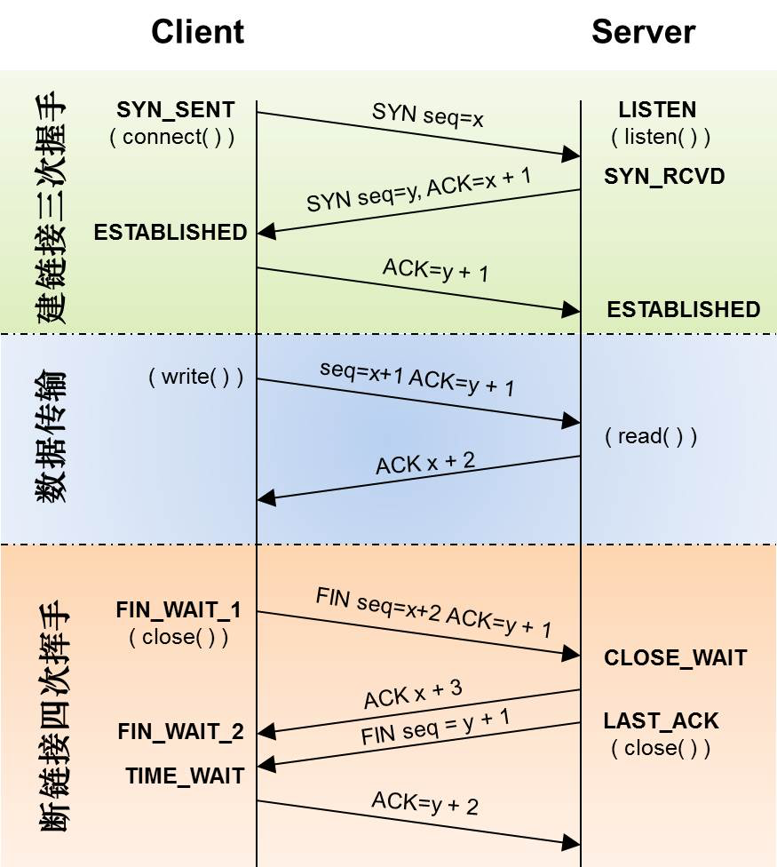
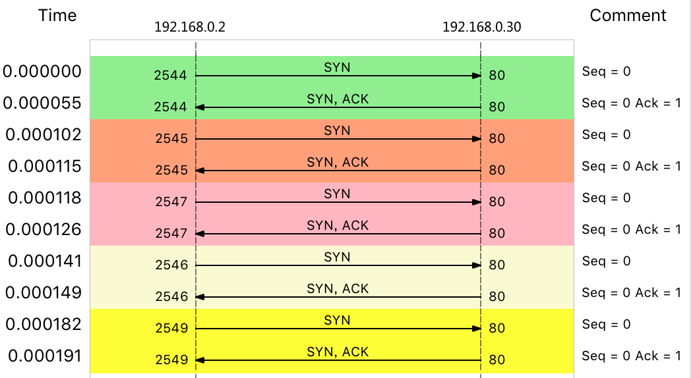
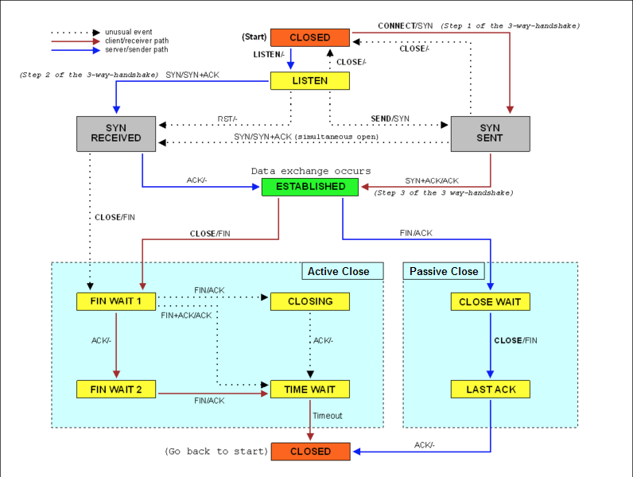

- 38 | 案例篇：怎么使用 tcpdump 和 Wireshark 分析网络流量？ [src](https://portal.learn.woa.com/training/mooc/taskDetail?mooc_course_id=A9BWP7o7&task_id=81467) #《Linux性能优化实战》
	- [[tcpdump]] 和 [[Wireshark]] 就是最常用的网络抓包和分析工具，更是分析网络性能必不可少的利器。
		- tcpdump 仅支持命令行格式使用，常用在服务器中抓取和分析网络包。
		- Wireshark 除了可以抓包外，还提供了强大的图形界面和汇总分析工具，在分析复杂的网络情景时，尤为简单和实用。
	- [[tcpdump]]抓取ping包
		- ```
		  $ tcpdump -nn udp port 53 or host 35.190.27.188
		  ```
			- -nn ，表示不解析抓包中的域名（即不反向解析）、协议以及端口号。
			- udp port 53 ，表示只显示 UDP 协议的端口号（包括源端口和目的端口）为 53 的包。
			- host 35.190.27.188 ，表示只显示 IP 地址（包括源地址和目的地址）为 35.190.27.188 的包。
			- 这两个过滤条件中间的“ or ”，表示或的关系，也就是说，只要满足上面两个条件中的任一个，就可以展示出来。
		- ```
		  tcpdump: verbose output suppressed, use -v or -vv for full protocol decode
		  listening on eth0, link-type EN10MB (Ethernet), capture size 262144 bytes
		  14:02:31.100564 IP 172.16.3.4.56669 > 114.114.114.114.53: 36909+ A? geektime.org. (30)
		  14:02:31.507699 IP 114.114.114.114.53 > 172.16.3.4.56669: 36909 1/0/0 A 35.190.27.188 (46)
		  14:02:31.508164 IP 172.16.3.4 > 35.190.27.188: ICMP echo request, id 4356, seq 1, length 64
		  14:02:31.539667 IP 35.190.27.188 > 172.16.3.4: ICMP echo reply, id 4356, seq 1, length 64
		  14:02:31.539995 IP 172.16.3.4.60254 > 114.114.114.114.53: 49932+ PTR? 188.27.190.35.in-addr.arpa. (44)
		  14:02:36.545104 IP 172.16.3.4.60254 > 114.114.114.114.53: 49932+ PTR? 188.27.190.35.in-addr.arpa. (44)
		  14:02:41.551284 IP 172.16.3.4 > 35.190.27.188: ICMP echo request, id 4356, seq 2, length 64
		  14:02:41.582363 IP 35.190.27.188 > 172.16.3.4: ICMP echo reply, id 4356, seq 2, length 64
		  14:02:42.552506 IP 172.16.3.4 > 35.190.27.188: ICMP echo request, id 4356, seq 3, length 64
		  14:02:42.583646 IP 35.190.27.188 > 172.16.3.4: ICMP echo reply, id 4356, seq 3, length 64
		  ```
			- 前两行，表示 tcpdump 的选项以及接口的基本信息；从第三行开始，就是抓取到的网络包的输出。这些输出的格式，都是 `时间戳 协议 源地址.源端口 > 目的地址.目的端口 网络包详细信息`（这是最基本的格式，可以通过选项增加其他字段）。
	- [[tcpdump]]是最常用的一个网络分析工具。它基于 [libpcap](https://www.tcpdump.org/)  ，利用内核中的 AF_PACKET 套接字，抓取网络接口中传输的网络包；并提供了强大的过滤规则，帮你从大量的网络包中，挑出最想关注的信息。 #常用工具
		- 
		- 
	- [[Wireshark]]也是最流行的一个网络分析工具，它最大的好处就是提供了跨平台的图形界面。跟 tcpdump 类似，Wireshark 也提供了强大的过滤规则表达式，同时，还内置了一系列的汇总分析工具。
		- 以`$ tcpdump -nn host 93.184.216.34 -w web.pcap`抓取`$ curl http://example.com` 数据导入 [[Wireshark]] 。由于 HTTP 基于 TCP ，所以你最先看到的三个包，分别是 TCP 三次握手的包。接下来，中间的才是 HTTP 请求和响应包，而最后的三个包，则是 TCP 连接断开时的三次挥手包。从菜单栏中，点击 Statistics -> Flow Graph，然后，在弹出的界面中的 Flow type 选择 TCP Flows，你可以更清晰的看到，整个过程中 TCP 流的执行过程： 
		- TCP 三次握手和四次挥手很类似，作为对比， 你通常看到的 TCP [[三次握手]]和[[四次挥手]]的流程，基本是这样的： 
		- 不过，对比这两张图，你会发现，这里抓到的包跟上面的四次挥手，并不完全一样，实际挥手过程只有三个包，而不是四个。
		- 其实，之所以有三个包，是因为服务器端收到客户端的 FIN 后，服务器端同时也要关闭连接，这样就可以把 ACK 和 FIN 合并到一起发送，节省了一个包，变成了“三次挥手”。
		- 而通常情况下，服务器端收到客户端的 FIN 后，很可能还没发送完数据，所以就会先回复客户端一个 ACK 包。稍等一会儿，完成所有数据包的发送后，才会发送 FIN 包。这也就是四次挥手了。
- 39 | 案例篇：怎么缓解 DDoS 攻击带来的性能下降问题？ [src](https://portal.learn.woa.com/training/mooc/taskDetail?mooc_course_id=A9BWP7o7&task_id=81468) #《Linux性能优化实战》
	- [[DDoS]]的前身是 DoS（Denail of Service），即拒绝服务攻击，指利用大量的合理请求，来占用过多的目标资源，从而使目标服务无法响应正常请求。
	  id:: 65eb020d-d366-4b13-b2cf-a89c6c3738e0
	  DDoS（Distributed Denial of Service） 则是在 DoS 的基础上，采用了分布式架构，利用多台主机同时攻击目标主机。这样，即使目标服务部署了网络防御设备，面对大量网络请求时，还是无力应对。
	- [[curl]]命令纸打印状态码和总时间 #常用工具
		- ```
		  # -w表示只输出HTTP状态码及总时间，-o表示将响应重定向到/dev/null
		  $ curl -s -w 'Http code: %{http_code}\nTotal time:%{time_total}s\n' -o /dev/null http://192.168.0.30/
		  ...
		  Http code: 200
		  Total time:0.002s
		  ```
	- 运行 [[hping3]] 命令，来模拟 DoS 攻击 #DDos #[[SYN Flood]]
		- ```
		  # -S参数表示设置TCP协议的SYN（同步序列号），-p表示目的端口为80
		  # -i u10表示每隔10微秒发送一个网络帧
		  $ hping3 -S -p 80 -i u10 192.168.0.30
		  ```
	- [[sar]]，它既可以观察 PPS（每秒收发的报文数），还可以观察 BPS（每秒收发的字节数）
		- ```
		  $ sar -n DEV 1
		  08:55:49        IFACE   rxpck/s   txpck/s    rxkB/s    txkB/s   rxcmp/s   txcmp/s  rxmcst/s   %ifutil
		  08:55:50      docker0      0.00      0.00      0.00      0.00      0.00      0.00      0.00      0.00
		  08:55:50         eth0  22274.00    629.00   1174.64     37.78      0.00      0.00      0.00      0.02
		  08:55:50           lo      0.00      0.00      0.00      0.00      0.00      0.00      0.00      0.00
		  ```
		- 从这次 sar 的输出中，你可以看到，网络接收的 PPS 已经达到了 20000 多，但是 BPS 却只有 1174 kB，这样每个包的大小就只有 54B（1174*1024/22274=54）。这明显就是个小包了，不过具体是个什么样的包呢？那我们就用 tcpdump 抓包看看吧。
	- 执行下面的[[ tcpdump]] 命令：
	  ```
	  # -i eth0 只抓取eth0网卡，-n不解析协议名和主机名
	  # tcp port 80表示只抓取tcp协议并且端口号为80的网络帧
	  $ tcpdump -i eth0 -n tcp port 80
	  09:15:48.287047 IP 192.168.0.2.27095 > 192.168.0.30: Flags [S], seq 1288268370, win 512, length 0
	  09:15:48.287050 IP 192.168.0.2.27131 > 192.168.0.30: Flags [S], seq 2084255254, win 512, length 0
	  09:15:48.287052 IP 192.168.0.2.27116 > 192.168.0.30: Flags [S], seq 677393791, win 512, length 0
	  09:15:48.287055 IP 192.168.0.2.27141 > 192.168.0.30: Flags [S], seq 1276451587, win 512, length 0
	  09:15:48.287068 IP 192.168.0.2.27154 > 192.168.0.30: Flags [S], seq 1851495339, win 512, length 0
	  ...
	  ```
		- 这个输出中，Flags [S] 表示这是一个 SYN 包。大量的 SYN 包表明，这是一个 SYN Flood 攻击。如果你用上一节讲过的 Wireshark 来观察，则可以更直观地看到 SYN Flood 的过程： 
		- 即客户端构造大量的 SYN 包，请求建立 TCP 连接；
		- 而服务器收到包后，会向源 IP 发送 SYN+ACK 报文，并等待三次握手的最后一次 ACK 报文，直到超时。
		- 这种等待状态的 TCP 连接，通常也称为半开连接。由于连接表的大小有限，大量的半开连接就会导致连接表迅速占满，从而无法建立新的 TCP 连接。
		- 参考下面这张 TCP 状态图，你能看到，此时，服务器端的 TCP 连接，会处于 [[SYN_RECEIVED]] 状态： 
	- 解决 [[DDos]]/ [[SYN FLOOD]]问题
		- 查看 TCP 半开连接的方法，关键在于 SYN_RECEIVED 状态的连接。我们可以使用 [[netstat]]，来查看所有连接的状态，不过要注意，[[SYN_RECEIVED]] 的状态，通常被缩写为 [[SYN_RECV]]。
			- ```
			  # -n表示不解析名字，-p表示显示连接所属进程
			  $ netstat -n -p | grep SYN_REC
			  tcp        0      0 192.168.0.30:80          192.168.0.2:12503      SYN_RECV    -
			  tcp        0      0 192.168.0.30:80          192.168.0.2:13502      SYN_RECV    -
			  tcp        0      0 192.168.0.30:80          192.168.0.2:15256      SYN_RECV    -
			  tcp        0      0 192.168.0.30:80          192.168.0.2:18117      SYN_RECV    -
			  ...
			  ```
		- 找出源 IP 后，要解决 [[SYN Flood]]攻击的问题，只要丢掉相关的包就可以。这时，[[iptables]] 可以帮你完成这个任务。你可以在终端一中，执行下面的 iptables 命令：
			- ```
			  $ iptables -I INPUT -s 192.168.0.2 -p tcp -j REJECT
			  ```
			- [[SYN Flood]] 攻击中的源 IP 并不是固定的。比如，你可以在[[hping3]] 命令中，加入 --rand-source 选项，来随机化源 IP。不过，这时，刚才的方法就不适用了。可以用以下两种方法，来限制 syn 包的速率：
			  ```
			  # 限制syn并发数为每秒1次
			  $ iptables -A INPUT -p tcp --syn -m limit --limit 1/s -j ACCEPT
			  
			  # 限制单个IP在60秒新建立的连接数为10
			  $ iptables -I INPUT -p tcp --dport 80 --syn -m recent --name SYN_FLOOD --update --seconds 60 --hitcount 10 -j REJECT
			  ```
		- SYN Flood 会导致 SYN_RECV 状态的连接急剧增大。在上面的 netstat 命令中，你也可以看到 190 多个处于半开状态的连接。不过，半开状态的连接数是有限制的，执行下面的命令，你就可以看到，默认的半连接容量只有 256：
		  ```
		  $ sysctl net.ipv4.tcp_max_syn_backlog
		  net.ipv4.tcp_max_syn_backlog = 256
		  ```
		  换句话说， SYN 包数再稍微增大一些，就不能 SSH 登录机器了。 所以，你还应该增大半连接的容量，比如，你可以用下面的命令，将其增大为 1024：
		  ```
		  $ sysctl -w net.ipv4.tcp_max_syn_backlog=1024
		  net.ipv4.tcp_max_syn_backlog = 1024
		  ```
		  另外，连接每个 SYN_RECV 时，如果失败的话，内核还会自动重试，并且默认的重试次数是 5 次。你可以执行下面的命令，将其减小为 1 次：
		  ```
		  $ sysctl -w net.ipv4.tcp_synack_retries=1
		  net.ipv4.tcp_synack_retries = 1
		  ```
		- 除此之外，TCP [[SYN Cookies]] 也是一种专门防御 [[SYN Flood]] 攻击的方法。
			- SYN Cookies 基于连接信息（包括源地址、源端口、目的地址、目的端口等）以及一个加密种子（如系统启动时间），计算出一个哈希值（SHA1），这个哈希值称为 cookie。
			- 然后，这个 cookie 就被用作序列号，来应答 SYN+ACK 包，并释放连接状态。当客户端发送完三次握手的最后一次 ACK 后，服务器就会再次计算这个哈希值，确认是上次返回的 SYN+ACK 的返回包，才会进入 TCP 的连接状态。因而，开启 SYN Cookies 后，就不需要维护半开连接状态了，进而也就没有了半连接数的限制。
			- 注意，开启 TCP syncookies 后，内核选项 net.ipv4.tcp_max_syn_backlog 也就无效了。
			- 可以通过下面的命令，开启 TCP SYN Cookies：
			  ```
			  $ sysctl -w net.ipv4.tcp_syncookies=1
			  net.ipv4.tcp_syncookies = 1
			  ```
			- 上述 sysctl 命令修改的配置都是临时的，重启后这些配置就会丢失。所以，为了保证配置持久化，你还应该把这些配置，写入 /etc/sysctl.conf 文件中。比如：
			  ```
			  $ cat /etc/sysctl.conf
			  net.ipv4.tcp_syncookies = 1
			  net.ipv4.tcp_synack_retries = 1
			  net.ipv4.tcp_max_syn_backlog = 1024
			  ```
			  不过要记得，写入 /etc/sysctl.conf 的配置，需要执行 [[sysctl]] -p 命令后，才会动态生效。
- 40 | 案例篇：网络请求延迟变大了，我该怎么办？ [src](https://portal.learn.woa.com/training/mooc/taskDetail?mooc_course_id=A9BWP7o7&task_id=81469) #《Linux性能优化实战》
	- 很多网络服务会把 ICMP 禁止掉，这也就导致我们无法用 ping ，来测试网络服务的可用性和往返延时。这时，你可以用 traceroute 或 hping3 的 TCP 和 UDP 模式，来获取网络延迟。 #常用工具
		- 可以执行下面的 [[hping3]] 命令，测试你的机器到百度搜索服务器的网络延迟：
		- ```
		  # -c表示发送3次请求，-S表示设置TCP SYN，-p表示端口号为80
		  $ hping3 -c 3 -S -p 80 baidu.com
		  HPING baidu.com (eth0 123.125.115.110): S set, 40 headers + 0 data bytes
		  len=46 ip=123.125.115.110 ttl=51 id=47908 sport=80 flags=SA seq=0 win=8192 rtt=20.9 ms
		  len=46 ip=123.125.115.110 ttl=51 id=6788  sport=80 flags=SA seq=1 win=8192 rtt=20.9 ms
		  len=46 ip=123.125.115.110 ttl=51 id=37699 sport=80 flags=SA seq=2 win=8192 rtt=20.9 ms
		  
		  --- baidu.com hping statistic ---
		  3 packets transmitted, 3 packets received, 0% packet loss
		  round-trip min/avg/max = 20.9/20.9/20.9 ms
		  ```
		- [[traceroute ]]，也可以得到类似结果
		  ```
		  # --tcp表示使用TCP协议，-p表示端口号，-n表示不对结果中的IP地址执行反向域名解析
		  $ traceroute --tcp -p 80 -n baidu.com
		  traceroute to baidu.com (123.125.115.110), 30 hops max, 60 byte packets
		   1  * * *
		   2  * * *
		   3  * * *
		   4  * * *
		   5  * * *
		   6  * * *
		   7  * * *
		   8  * * *
		   9  * * *
		  10  * * *
		  11  * * *
		  12  * * *
		  13  * * *
		  14  123.125.115.110  20.684 ms *  20.798 ms
		  ```
			- traceroute 会在路由的每一跳发送三个包，并在收到响应后，输出往返延时。如果无响应或者响应超时（默认 5s），就会输出一个星号。
-