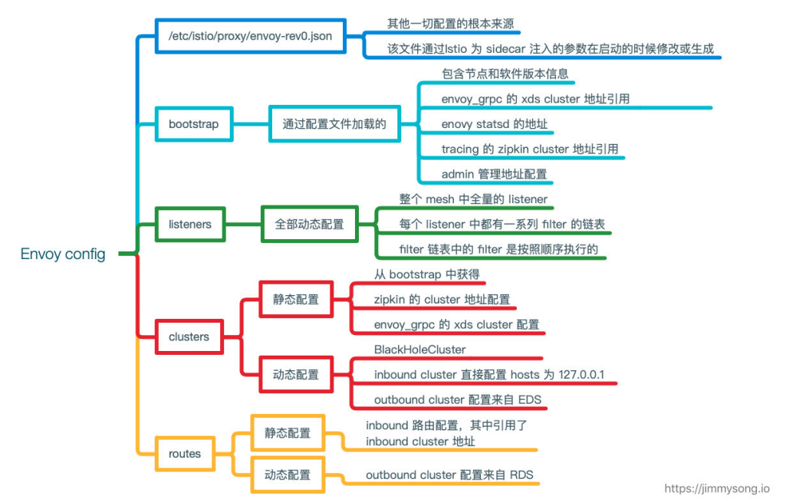
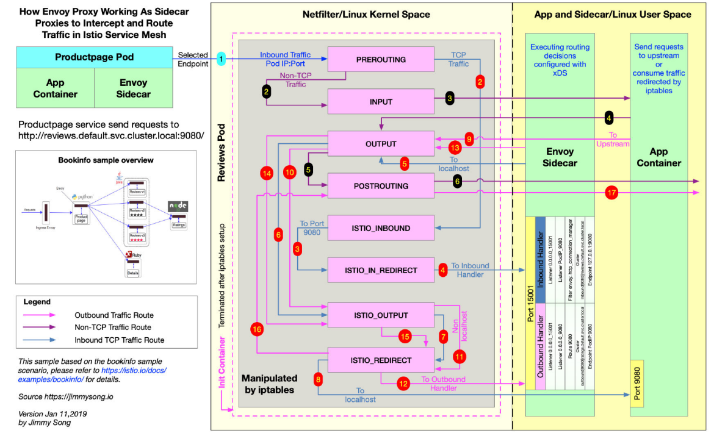

- istio网络剖析—kevinlin [src](https://iwiki.woa.com/p/370601494) #card
	- 服务⽹格的建⽴（sidecar-envoy） 
	- istio中流量流转 
	- IPTABLE VS IPVS VS Cilium
		- ipvs 为⼤型集群提供了更好的可扩展性和性能
		- ipvs ⽀持⽐ iptables 更复杂的复制均衡算法（最⼩负载、最少连接、加权等等）
		- ipvs ⽀持服务器健康检查和连接重试等功能
		- 💡kiwi.ai的回答：istio使用IPTABLE、IPVS、Cilium这三种模式的优劣对比？
			- Istio 是一个开源的服务网格框架，它提供了一种统一的方式来连接、保护、控制和观察微服务。Istio 支持多种数据平面的实现，其中包括使用 IPtables、IPVS 和 Cilium 作为其流量管理的后端。每种技术都有其特定的优势和劣势，适用于不同的使用场景。下面是这三种模式的优劣对比
			- 1. **IPtables**
				- **优点**:
					- **广泛支持**: IPtables 是 Linux 系统上非常成熟和广泛使用的网络包过滤框架。
					- **简单性**: 配置相对简单，有大量的文档和社区支持。
					- **无需额外的内核模块**: IPtables 是 Linux 内核的一部分，不需要额外的内核模块或代理。
				- **劣势**:
					- **性能开销**: 由于每个包都需要进行用户空间和内核空间的切换，可能会引入较大的性能开销。
					- **复杂性**: 在大规模部署中，规则集可能会变得非常复杂和难以管理。
					- **资源限制**: IPtables 有规则数量的限制，可能限制大规模部署的能力。
			- 2. **IPVS**:
				- **优点**:
					- **高性能**: IPVS 提供了比 IPtables 更好的性能，因为它工作在内核空间，减少了上下文切换。
					- **负载均衡**: 支持更先进的负载均衡算法，如最少连接、加权最小连接等。
					- **扩展性**: 适合大规模部署，因为它可以处理更多的并发连接。
				- **劣势**:
					- **复杂性**: 配置和管理相对于 IPtables 更加复杂。
					- **内核依赖**: 需要特定的内核支持（如 Netfilter 钩子）。
					- **文档和社区支持**: 相对于 IPtables，文档和社区支持可能不那么丰富。
			- 3. **Cilium**:
				- **优点**:
					- **eBPF 支持**: Cilium 使用 eBPF 技术，提供了高度的可观测性和安全性，同时保持了高性能。
					- **细粒度策略**: 支持基于 K8s CRD 的细粒度网络策略。
					- **无需代理**: 作为数据平面，Cilium 不需要额外的代理或服务注入，简化了部署和运维。
					- **多集群支持**: 支持跨多个 Kubernetes 集群的流量管理。
				- **劣势**:
					- **复杂性**: 由于 eBPF 的复杂性，配置和管理可能比其他选项更复杂。
					- **内核依赖**: 需要较新版本的 Linux 内核支持 eBPF。
					- **资源消耗**: 虽然性能高，但在某些情况下，eBPF 程序可能会消耗较多的内核资源。
					  
					  在选择 Istio 数据平面的实现时，需要考虑应用的性能需求、规模、复杂性以及对特定技术的依赖。例如，对于小型或中等规模的部署，IPtables 可能是一个简单且足够的选择。对于需要高性能和先进负载均衡特性的大型部署，IPVS 可能更合适。而对于需要高度可观测性和安全性的复杂环境，Cilium 可能是最佳选择。