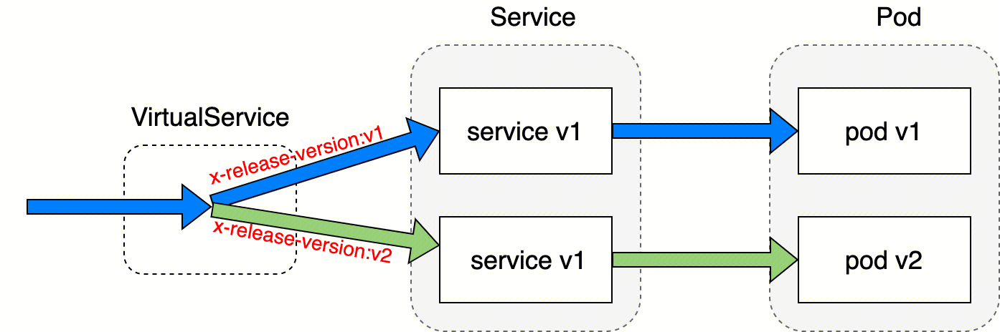
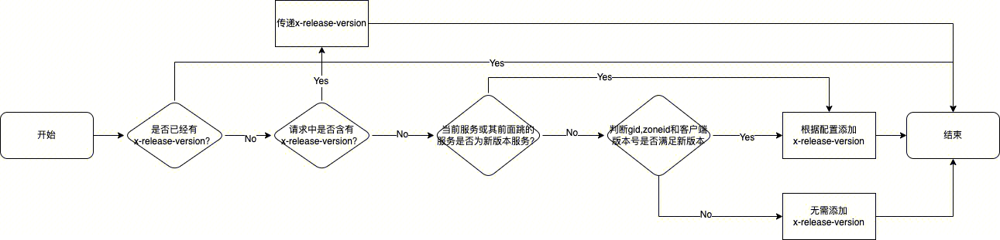

- gRPC流量调度实现 [src](https://iwiki.woa.com/p/1928460263) #RED #card
  id:: 67d7a08e-7e2f-4edc-9be8-ae51def01a2d
	- 玩家流量灰度路由配置，使用CRD [[RED/GenericConfig]]，[[ms-go]]中做了统一封装([[ms-go/traffic]])，[[ms-go/traffic]]会自动检测文件的变化，并且自动加载最新版本的配置
		- ms-go的traffic包对外提供了一个提取x-release-version的接口，目前主要供ssproxy使用
	- 基于istio的服务流量调度
		- session型(有状态)服务已经切换到全新的[[ssproxy]]负载均衡方案，因此istio当前承接的一般是无状态服务
		- 基于istio的负载均衡能力，我们使用不同的service来部署不同流量的endpoint，然后利用VirtualService匹配header的能力，给流量打标（header中加入x-release-version），不同x-release-version的流量路由到不同的service，来完成我们流量调度的目的。
			- 
			- ```yaml
			  apiVersion: networking.istio.io/v1alpha3
			  kind: VirtualService
			  metadata:
			    name: infosvr-mesh
			  spec:
			    hosts:
			      - infosvr-mesh
			    http:
			      - match:
			          - port: 18080 # gm
			          - port: 5000 # grpc
			            headers:
			              "x-release-version":
			                exact: ${{x_release_version}}
			        route:
			          - destination:
			              host: infosvr-v1
			      - name: main
			        route:
			          - destination:
			              host: infosvr
			  ```
		- 如何给 [[RED]] 的[[流量打标]]（给header上打x-release-version信息）
			- 打标的目的是让灰度玩家请求流向对应灰度版本的服务
			- 哪些情况需要打标
				- **客户端**发来的请求
					- 新版客户端发来的请求
					- 请求的玩家在灰度名单中（灰度的大区或玩家）
				- **后台**主动发起的异步请求
					- 请求的玩家在灰度名单中（灰度的大区或玩家）
					- 当前玩家使用的是新版客户端
					- 当前服务是灰度服务
				- 传递x-release-version
					- 流量维度：如果请求本身带有x-release-version，那么该请求关联的下一跳请求应该保留并传递下去
					- 服务维度：如果当前服务或者当前请求链路前面的N跳中包含有灰度的服务，那么接下来的请求也应该含有x-release-version
			- 具体实施
				- 客户端流量打标：gatesvr [文档里](https://iwiki.woa.com/p/1928460263#gatesvr)的说明已经outdated，需要更新一下 #TODO
					- 读取 [[RED/GenericConfig]]文件：获取灰度用户列表、zone列表、最小客户端版本和最小资源版本
					- 将用户流量与以上条件比较，返回对应的[[RED/Release]]版本
				- 内部服务流量打标：使用[[ms-go/msapp]]中统一的gRPC拦截器，实现了3种功能
					- 
						- “是否已经有x-release-version”是指什么，看一下 [[ms-go/msapp]]的源码 #TODO
					- x-release-version的传递
					- 根据服务本身是否为新版本添加x-release-version
					- 同时为了防止“漏球”现象出现，gRPC拦截器里也顺带做了gatesvr上的那部分逻辑，即在经过前面处理依然没有x-release-version的情况下，会根据客户端版本号以及玩家的zoneid和gid再判断一遍是否需要添加x-release-version
						- 什么场景会发生“漏球”现象，问一下jasen #TODO
				- 异步gRPC请求：服务间有些ss请求，是服务主动异步发起的
					- 什么是ss请求，ssproxy？#TODO
					- 文章没有写具体实现，问一下jasen #TODO
	- session型服务流量调度
		- session型(有状态)服务主要包括[[roomsvr]]、[[scenesvr]]、[[fightsvr]]、[[obsvr]]的create类请求，使用ssproxy负载均衡方案
			- ssproxy是什么？session-proxy？补全 [[ssproxy]]页信息 #TODO
		- 具体实现上，session型服务的部署与使用istio流量调度的无状态服务类似，也是使用不同的service来部署不同流量的endpoint，不同的是，session型服务的create类型的流量是直接路由到ssproxy的，因此不能像无状态服务那样，通过配置virtual service来达到流量调度的目的。这里的流量调度就需要由我们的负载均衡服务ssproxy来完成。
			- ```yaml
			  apiVersion: networking.istio.io/v1alpha3
			  kind: VirtualService
			  metadata:
			    name: roomsvr-mesh
			  spec:
			    hosts:
			      - roomsvr-mesh
			    http:
			      # 灰度
			      - match:
			          - port: 18080 # gm
			          - port: 5000 # 创建房间接口
			            uri:
			              prefix: /roompb.CSService/CreateRoomV2
			            headers:
			              "x-release-version":
			                exact: ${{x_release_version}}
			          - port: 5000 # 创建房间接口
			            uri:
			              prefix: /roompb.SSRoomService/NewRoom
			            headers:
			              "x-release-version":
			                exact: ${{x_release_version}}
			          - port: 5000 # 反射信息接口
			            uri:
			              prefix: "/grpc.reflection.v1alpha"
			            headers:
			              "x-release-version":
			                exact: ${{x_release_version}}
			        route:
			          - destination:
			              host: session-proxy
			            headers:
			              request:
			                set:
			                  x-proxy-dest-server: "roomsvr-v1"
			      # 对一些接口使用随机 LB
			      - match:
			          - port: 18080 # gm
			          - port: 5000 # 创建房间接口
			            uri:
			              prefix: /roompb.CSService/CreateRoomV2
			          - port: 5000 # 创建房间接口
			            uri:
			              prefix: /roompb.SSRoomService/NewRoom
			          - port: 5000 # 反射信息接口
			            uri:
			              prefix: "/grpc.reflection.v1alpha"
			        route:
			          - destination:
			              host: session-proxy
			            headers:
			              request:
			                set:
			                  x-proxy-dest-server: "roomsvr"
			  ```