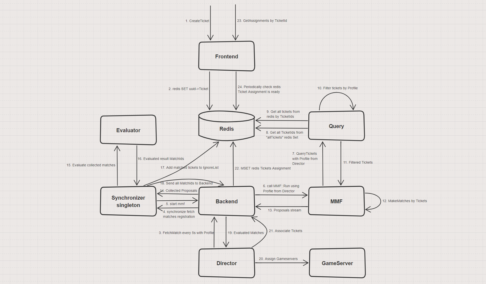
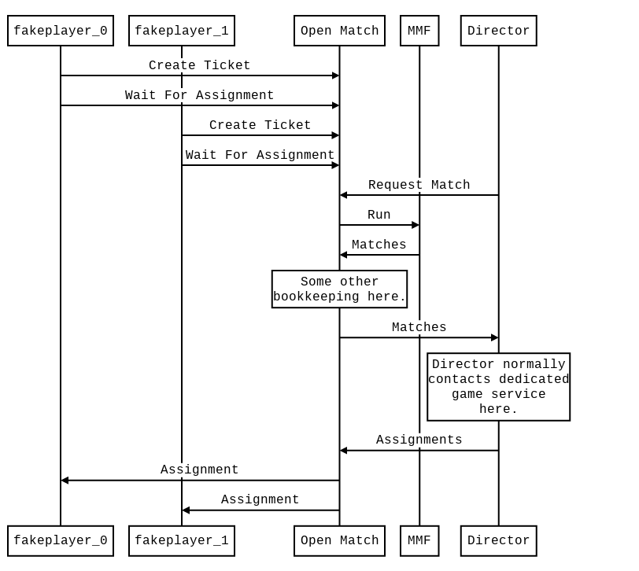

- 把legit和cynic组合一下，制作成mr快捷工具 #TODO
	- cynic：[src](https://git.woa.com/curryxie/cynic) 快速创建mr，不需要手动输入tapd和`/ar`，但是需要修改配置文件
	- [[legit]]利用了git subcommand特性来实现`git leflow`命令，实际调用的是`git-leflow`
		- git子命令开发教程：[src](https://opensource.com/article/22/4/customize-git-subcommands)
	- 为什么legit不需要assignee_id和PRIVATE-TOKEN，因为legit访问的是自己的服务器，用的也是leflow的工蜂账号，所以不需要用户自己配这些
		- legit是如何获取用户名的：git config user.name 这样会不会出现冒名顶替的风险❓
	- 实现tapd单支持tab键模糊查询 #TODO
		- [面向对象TAPD Python SDK，简单且强大 - KM平台 (woa.com)](https://km.woa.com/articles/show/564827)
	- [[rust]]实现[[cui]]的例子
		- ```rust
		  use dialoguer::{theme::ColorfulTheme, Select};
		  
		  fn main() {
		      // 定义选项列表
		      let options = &["选项1", "选项2", "选项3"];
		  
		      // 创建一个Select实例
		      let selection = Select::with_theme(&ColorfulTheme::default())
		          .with_prompt("请选择一个选项")
		          .default(0)
		          .items(&options[..])
		          .interact()
		          .unwrap();
		  
		      // 输出用户选择的选项
		      println!("您选择了: {}", options[selection]);
		  }
		  ```
- 活动服务 - 通用能力手册 [src](https://iwiki.woa.com/p/4009990070) #RED/活动
	- red活动开发时可以先咨询[[haiilan]]
- [[RED]]各模块负责人 [src](https://iwiki.woa.com/p/404529784)
- [[OpenMatch]]匹配方案 #RED/matchsvr [src](https://git.woa.com/red/matchsvr/issues/2)
	- [[jiffychen]]
		- 
		- Front service
		  id:: 661916f4-bd70-4582-abcd-da018a63e27f
			- CreateTicket 创建uuid->Ticket并加入索引 直接写redis，IndexedTickets是redis的一个Set，Ticket数据是以KV存在redis中
			- DeleteTicket 删除ticket并从索引中移除 直接写redis
			- GetAssignment 获取匹配结果，定时读redis，直到ticket里Assignment被设置上，通过grpc stream回给client
			  id:: 661916f4-3a67-42c8-972a-87c99d24936a
		- Backend service
			- FetchMatches： 请求Synchronize service创建一个grpc stream，从syncrhonize接受信号，包括a)startmmf, b)cancelmmf, c)MatchIds
			  id:: 661916f4-4ac7-40bc-ac11-ac95bed1e589
				- Synchronizer返回的MatchIds是经过Evaluator确认过的匹配，Backend会从本地的缓存中找到这些MatchId对应的Match，通过stream回给client(Director)
				- a) Synchronizer会协调所有的Backend，决定哪些backend什么时候开始start mmf, Backend收到StartMMF消息后，调用MatchFunctionClient::Run调用带上FetchMatchesRequest里传过来的Profile，Run返回一个proposal stream，Backend会收到很多proposals（就是还没有经过Evaluator评估确认的pb.Match），这些proposals会保存在Backend本地sync.Map中，Backend再通过上面的syncStream的把proposal发给Synchronizer去协调Evalutor调用。
				- b) Synchronizer上有一些控制机制，包括对于收集proposal有一些时间控制，超时之后会通知Backend cancelMMF并且拒绝掉这些Backend过来的Proposal
			- AssignTickets，将Evalutor确认过的Match，分配好GameServer地址后，创建的Assignment对象写入Redis中，这里就是把Assignment更新到redis的每个Ticket中，同时将TicketId从IgnoreList(也就是名为proposed_ticket_ids的zset）中移除, 将ticket从索引表中移除（名为allTickets的redis Set）
			  id:: 661916f4-9bb6-483b-9407-180ec2748542
		- Query service
			- 处理QueryTicketsRequest请求，从本地的ticketcache里，过滤掉符合pool的条件的tickets，然后通过stream回给client(MMF)
			- 这里回调用update()从redis里同步所有的tickets，主要逻辑是从redis里取出所有的tickets，剔除掉proposed_ticket_ids（IgnroeList）里一个ttl时间内的，同步到本地的ticketcache中
			- 这里对于redis的消耗比较大，所有open-match的做法是会聚合当前所有的QueryTicketsRequest，从redis同步一次，然后通过本地ticketcache来处理这些Bached QueryTicketsRequests.
		- Synchronizer service
			- 1. Syncrhnize()会先注册到registration中，由synchronizer来协调，synchronizer是单实例，协调和同步MMF以及Evaluator的调用，避免在并发情况下单Ticket被撮合到多个Match中去
			  2. Synchronizer通过SynchronizeResponse{StartMmfs: true}消息让Backend开始工作，开始执行MMF
			  3. Synchronizer收集从BackendService过来的proposals（有配置的最大时间限制），然后去Evaluator去评估和选择Match
			  4. Evaluator评估确认过的Match同步给Backend
			  5. [https://github.com/googleforgames/open-match-docs/pull/114/files/44ebda0ab71e89818ee9ceff82e4656b9b569ed0](https://github.com/googleforgames/open-match-docs/pull/114/files/44ebda0ab71e89818ee9ceff82e4656b9b569ed0) 有一些关于synchronizer的说明
		- MMF：
			- 根据本地ticketcache，以及请求里的pool过滤条件，来撮合成proposal
		- Evaluator：
			- 评估当前周期内从所有Backend收集到的Proposals，根据匹配质量和Ticket唯一性来评估和过滤出最终的匹配结果
		- Director:
			- Director每5s执行一次，根据设置的Profile来请求Backend::FetchMatches，收集所有评估确认后的Match，给他们分配GameServer，并通过BackendService::AssignTickets更新到redis中
	- [[johnfu]]
	  id:: 68425a0d-4dba-4bf6-ac2a-2266272c5790
		- 此前也关注过openmatch
		  就运营经验（kr应该也一样？）来说，这里变化比较剧烈，各种奇葩的需求
		  可能要避免模块分布式（存储等不包含在内），完成匹配的多模块尽可能的还是在一个单体内，软件架构设计在单体内避免异步时序、数据一致性等等问题，会给业务持续演化避免很多困扰
		- 一点个人看法，可以持续观察和交流
	- 💡补充一下官网时序图 [Getting Started Guide | Open Match (open-match.dev)](https://open-match.dev/site/docs/getting-started/)
		- 
		  id:: 661916f4-e2c9-4578-8d47-46c5491010ba
- [[RED/matchsvr]]的多人匹配战斗需求 [src](https://git.woa.com/red/matchsvr/issues/1)
	- 实现多人PVE匹配逻辑
		- 点击开始匹配，进入匹配流程，这里去掉30s一定进入战斗的选项了，会一直等待，进入战斗只有两种情况： a) 匹配队列人满了 b) 有人点击了立即进入
		- get_status返回信息里增加当前队伍中的匹配人数，以及模式需要的最大人数，只有多人PVE模型下才显示出来，立即进入也返回和get_status同样的回包结构和回包内容，客户端在点击立即进入并收到回包之后，先同步把回包里的队伍人数更新到UI上，然后，再拉起战斗
		- 多人PVE模式下在开始匹配后显示取消匹配，同时5s后显示立即进入的按钮，这里如果取消匹配的时候，但是别人在这个瞬间如果点了立即进入（或者瞬间有人加入导致队伍满了创建对局了），这个时候cancel_match的返回是一个错误码，可以提示“取消匹配失败，已经匹配成功，准备进入战斗”，后续的get_status会返回匹配成功的队伍信息。
		- 增加两条协议start_game和cancel_match
		- 多人同时点击立即进入，最先的一个人会创建对局，其他人的请求会直接返回匹配队伍结果信息。
		- get_status承担匹配状态的心跳功能，如果一段时间没有收到get_status请求（暂定10s），后台需要把这个玩家从匹配队列中移除（如果还在匹配中的话），如果网络恢复之后，因为已经被移除除队列了，那么所有的get_status/start_game这些操作都会返回失败“已掉线离开匹配”,cancel_match可以返回成功，客户端自己会离开匹配界面。
		- 多人PVE的最大人数可以配置，同时随机的角色也可以配置，可能出现最大人数>角色数量的情况，这里要比较均匀的把多个玩家随机分配到一个角色上。
	- 需求tapd地址：
	  [http://tapd.oa.com/OP_RD/prong/stories/view/1020374082857595977](http://tapd.oa.com/OP_RD/prong/stories/view/1020374082857595977)