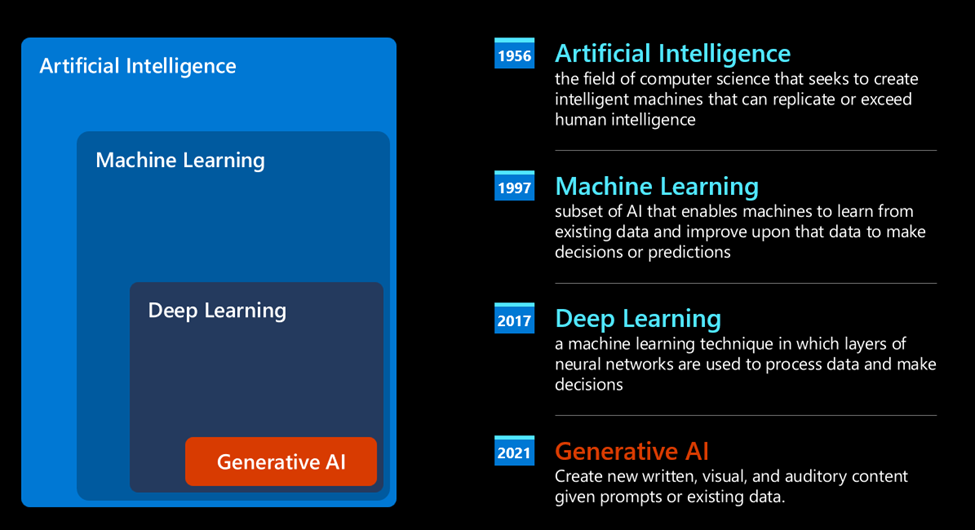

- [[Cilium]]实现网络连接的详细过程 #ChatGPT #K8s #eBPF
	- 网络模型：Cilium采用基于标识（Identity）的网络模型，而不是传统的基于IP的网络模型。这意味着Cilium可以根据容器的标识（例如，Kubernetes的标签或安全组）进行通信控制，而不仅仅是基于IP地址。这使得网络策略更加灵活和可靠。
		- 💡主要是用来代替 iptables/ipvs (基于ip) 这些在overlay网络(VXLAN或Geneve)之上实现的k8s cni（容器网络接口）插件
	- 虚拟网络设备：Cilium为每个容器创建一个虚拟网络设备（例如，veth pair），用于连接容器和主机网络。这些虚拟设备可以在内核中进行数据包处理，而无需将数据包传递到用户空间，从而提高通信性能。
	- eBPF程序：Cilium通过编写eBPF程序来实现网络连接的各个功能，例如路由、负载均衡、安全策略等。这些eBPF程序在内核中运行，可以直接处理数据包，提供高性能的网络处理能力。
	- 数据包转发：当一个容器向另一个容器发送数据包时，Cilium会在发送方容器的虚拟网络设备上运行eBPF程序，对数据包进行处理。这可能包括查找目标容器的地址、应用安全策略等。然后，Cilium会将处理后的数据包转发到目标容器的虚拟网络设备，完成通信过程。
	- 容器间通信：Cilium支持在同一主机上的容器之间进行直接通信，也支持跨主机的容器通信。在跨主机通信时，Cilium会将数据包封装在[[VXLAN]]或Geneve隧道中，以实现跨网络的传输。
- AI->ML->DL-GAI [src](https://github.com/microsoft/generative-ai-for-beginners/blob/main/01-introduction-to-genai/README.md?WT.mc_id=academic-105485-koreyst) #LLM #microsoft
	- 
	- After decades of research in the AI field, a new model architecture – called *Transformer* – overcame the limits of RNNs, **being able to get much longer sequences of text as input**. Transformers are based on the attention mechanism, enabling the model to give different weights to the inputs it receives, ‘paying more attention’ where the most relevant information is concentrated, regardless of their order in the text sequence.
-