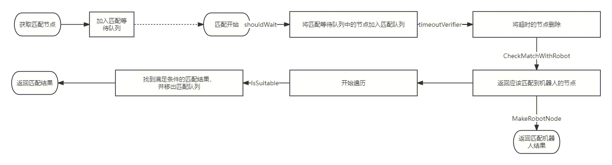

- **娱乐赛(pvp casual**)和**段位赛(pvp ladder)** #RED [src](https://iwiki.woa.com/p/4007415823)
- 匹配服务设计2023.09.11 [src](https://iwiki.woa.com/p/4008787952) #RED/matchsvr #silgryndeng
	- 如果是想把不同的匹配场景交给不同的匹配服去做，那让一个统一的前置模块（grpcserver）写数据，是否仍然会由于逻辑单点的问题，导致整个服务挂掉。
	- matchsvr在接收到用户的匹配请求后，经过预处理写入entity（entity用户维度sharding），然后由多个并行的queue抢锁去处理entity
		- 这里面entity shard保证用户维度数据的爆炸半径
		- 多queue实例，保证匹配计算的高可用，但是有类似**raft选主后的单实例计算瓶颈问题**
			- 需要考虑如何进一步利用上其他实例的计算能力，或者在保证冗余（单个节点故障不会卡住流程）的情况下提高一些计算的并发度
			- 💡首先想到的就是【每个数据shard内由多个replica通过raft选主处理数据】，但这样负载不均衡，主长时间忙碌，那就让每组shard都维护自己一套raft，但是如果shard组很多，会带来额外的rpc选举负担。
			- 💡或者考虑paxos的各自提案方法？可能在业务中不太适用，具体业务实现的时候心智负担太重，往来rpc导致计算时延太长。
			  不过现在每次tick抢锁的实现，已经类似paxos每次发起提案，而且基于每个shard锁数量的策略还能尽量保证各shard负载均衡。没有一个靠谱的一致性存储的时候，才需要考虑paxos/raft，依赖一下外部存储能大幅降低实现复杂性。
			- 💡那就还有mq方式，由grpc server负责查询分发queue，由shard抢占。但是这里如果mq乱序怎么办？如果防乱序还需要依赖额外存储的话，是不是还不如直接在存储上加锁？需要再论证一下
	- 多实例抢锁，是否可能出现锁被重复持有的场景，如果被重复持有导致对局被重复计算，是否有办法挡掉
	- 目前设定了每个pod持有锁的上限，并且10分钟内CPU最大值高于80%时，是否会在高峰期消费能力陡降？类似雪崩
	- 基于租约的锁，相关时钟是本地时钟吗，如何保证始终对齐？会不会导致多个分组同时持有锁
	- > 但是可能存在多个节点接管同一个队列的情况，为了避免数据竞争，每次操作锁的时候都会锁住整个Collection，避免产生竞争
		- 锁粒度过大导致，并发度又进一步降低
	- entity的锁是一个什么实现？
		- 一张entity表对应一个entity_lock记录
	- queue与shard的比例关系是什么？
		- shard里包含抢占到的businessType-businessID维度的entity表，一个businessType-businessID对应一个queue
- IDC时代 匹配服务重构计划 [src](https://iwiki.woa.com/p/4007929865) #RED/matchsvr #silgryndeng
	- > 代码主要的问题：
		- resultHandler一个线程要分发所有匹配结果，存在瓶颈，且耦合了玩法逻辑
		- role数据未实际落地，也不没有提供加载机制，只是做了内存存储和上报数据
		- 每个玩法需要继承和实现的接口过多，存在大量冗余代码，新增玩法也需要进行大量拷贝
		- 匹配规则本身缺乏抽象，每个玩法都需要根据自身实际业务场景单独实现匹配规则
	- > 架构主要的问题：
		- 缺乏灰度能力，服务发布就会导致不可用且已匹配的所有数据都会丢失
			- 💡目前靠mongodb持久化数据来解决
		- 数据未落地，且缺乏健壮性，系统故障会导致所有匹配数据丢失，并且无法实现迁移
			- 💡目前靠mongodb持久化数据来解决
		- 玩法之间缺少隔离，匹配服务本身单点特性决定
			- 💡
	- > 重构目标：
		- 本次重构指向于面向上线的重构方案，所以主要旨在于解决稳定性和扩展能力的问题。主要包括：
		- 容灾能力和健壮性
		- 抽象匹配规则，数据管理和算法优化
		- 数据持久化和迁移恢复
		- 拆分匹配、结果处理、结果分发（低优先级）
- 新架构下匹配玩法的实现 [src](https://iwiki.woa.com/p/4008846518) #RED/matchsvr #silgryndeng
	- 以SoloMatchQueue为例，现在的匹配流程固定为
		- 
	- 相对于之前的流程，除了进行抽象以外，还要做了如下的优化；
		- 新增加了一个匹配等待队列，匹配等待队列中的节点不会被遍历
		- 遍历逻辑做了一定的抽象和更改。之前的遍历逻辑：取出队头的节点，尝试将其与队列中的节点按顺序进行撮合，如果成功撮合，则会移出队列并重复此步骤，如果不成功则会将节点放到队尾并立刻终止此次遍历。现在的遍历逻辑：按index累加取出两个节点，并尝试撮合。跟之前的逻辑区别主要在于：
		      1.不会因为队头的节点无法匹配到数据就终止遍历，仍然会尝试对其他节点进行匹配
		      2.不会将队头的数据移到队尾，这样子当新的节点加入时，队头也就是匹配时间最久的节点仍然会优先匹配到。
			- 看一下matchsvr代码，这一部分具体实现？
			  其实就是将匹配节点调整新的时序id放到队首，然后将旧的删掉
		- 待考虑的优化：
			- 除了顺序的匹配队列外，另外维护一个加权值的匹配队列，每个用户按照分数大小维护在队列中，这样无需遍历，只需要获取节点前后的节点尝试撮合。
				- ❓能不能用优先队列，数值相近的就地匹配
-
-