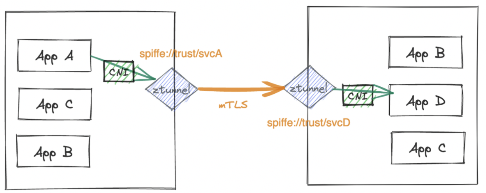

- A mutex is a **mutual exclusion lock** 互斥锁 #card
  id:: 661f7d3c-c106-40cb-bd71-e1f826747e9e
- outbound 向外的，inbound 向内的 #card #istio
  id:: 661f7d3c-b265-4cea-825f-6f24fc18f915
  
  左边ztunnel监听的是向外的流量，右边的ztunnel监听的是向内的流量
- [pprof (woa.com)](https://qqops.woa.com/pprof/) 可以直接抓取ppof数据 #golang #性能优化 #常用工具 #pprof
- gomega.Eventually的特性，判定的是函数返回内容时
	- 如果函数快速返回失败时，回重复执行函数，直到返回成功吗
	  logseq.order-list-type:: number
		- 是的。[官方解释](https://onsi.github.io/gomega/#eventually)：
		  `Eventually` checks that an assertion *eventually* passes. `Eventually` blocks when **called** and attempts an assertion **periodically** until it **passes** or a **timeout** occurs.
	- 如果函数长期不返回，会直接判定超时
	  logseq.order-list-type:: number
- ginkgo.BeforeEach其实在ginkgo.It前会执行完成，所以里面的defer conn.close()在执行ginkgo.It前就被执行了。但是ginkgo.BeforeEach里的ginkgo.DeferCleanup会在ginkgo.It之后执行。 #RED/matchsvr #ginkgo